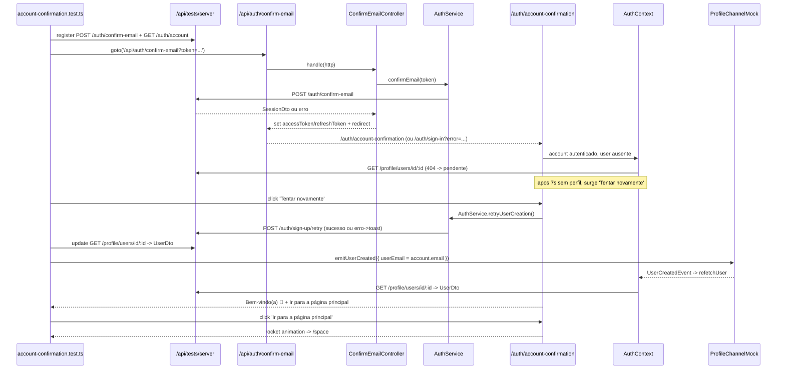

# 1. Objetivo

Criar a cobertura Playwright da jornada publicada de confirmacao de conta no `web` e migrar o retry de criacao de perfil para uma rota REST no `apps/server`. No `web`, a suite cobre a confirmacao do e-mail em `/api/auth/confirm-email?token=...`, a criacao dos cookies de sessao, o redirecionamento para `/auth/account-confirmation`, o estado de espera enquanto o perfil do usuario ainda nao existe, a chegada do evento realtime de criacao de perfil, a exibicao da mensagem de sucesso com avanco para `/space`, o retry manual apos o atraso configurado e a protecao de rota que redireciona contas autenticadas sem perfil para a tela de confirmacao. No `server`, e criada a rota `POST /auth/sign-up/retry` (autenticada) que republica `AccountSignedUpEvent` para o Inngest, removendo a interacao do `web` com o Inngest: o `web` passa a disparar o retry via `AuthService.retryUserCreation()`. A suite reutiliza a infraestrutura test-only de `/api/tests/server` e o mock de canal realtime ja exposto em modo de teste, e nao depende do backend real, do provedor de autenticacao nem do Inngest.

---

# 2. Escopo

## 2.1 In-scope

- Criar a suite Playwright `apps/web/src/app/tests/auth/account-confirmation.test.ts`.
- Validar `/api/auth/confirm-email?token=<token>` com sucesso: request fake para `POST /auth/confirm-email` com `{ token }`, criacao dos cookies `accessToken` e `refreshToken` e redirecionamento para `/auth/account-confirmation`.
- Validar falha da confirmacao de e-mail: redirecionamento para `/auth/sign-in?error=<slug>` sem cookies de sessao.
- Validar `/auth/account-confirmation` com conta autenticada e perfil ainda inexistente, exibindo `Loading` e a mensagem rotativa de espera (ex.: `Aquecendo os motores 🚀`).
- Validar que o botao `Tentar novamente` aparece somente apos o atraso de 7 segundos sem perfil.
- Validar que o evento realtime de criacao de perfil com o e-mail correto provoca o refetch do usuario, encerrando a espera e exibindo `Bem-vindo(a) 👋`, `Seu perfil foi criado com sucesso!` e o CTA `Ir para a página principal`.
- Validar que um evento realtime com e-mail divergente e ignorado, mantendo o estado de espera.
- Validar que o CTA `Ir para a página principal` dispara a animacao de foguete e, ao final, navega para `/space`.
- Validar o retry manual: clique em `Tentar novamente` chama `AuthService.retryUserCreation()` (`POST /auth/sign-up/retry`, mockavel via `ServerMock`), exibe estado de loading e, em caso de falha, exibe toast de erro.
- Validar a protecao de rota: conta autenticada sem perfil que acessa uma rota privada e redirecionada para `/auth/account-confirmation`.
- Criar a rota `POST /auth/sign-up/retry` no `apps/server` (`RetryUserCreationController` + registro no `AuthRouter`) e o refactor de transporte do retry (web -> server), na mesma entrega (PR unico).
- Criar o teste unitario do `RetryUserCreationController` e a cobertura de integracao da rota no `AuthRouter.test.ts` do server.

## 2.2 Out-of-scope

- Alterar endpoints auth do server alem da nova rota de retry.
- Alterar contratos de `ConfirmEmailController`, `NextApiRestClient`, `ProfileChannelMock` ou `ServerMock`.
- Criar migrations, tabelas, policies, grants ou seeds.
- Testar envio real de e-mail ou token real do provedor de autenticacao.
- Testar a criacao do perfil em si: a funcao/job do Inngest que cria o perfil e emite o realtime pertence ao `apps/server` e nao e exercitada por estes testes; a suite Playwright do `web` valida a chamada `AuthService.retryUserCreation()` + feedback de UI, e os testes do server validam ate a publicacao do `AccountSignedUpEvent`.
- Cobrir o fluxo `/auth/social-account-confirmation` (ja possui cobertura unitaria em `useSocialAccountConfirmationPage.test.ts`).
- Validar acesso direto a `/auth/account-confirmation` sem conta autenticada (comportamento marcado como em construcao no PRD, REQ-06).
- Criar testes unitarios adicionais para widgets/controllers que ja possuem cobertura equivalente, salvo lacuna necessaria descoberta durante a implementacao.

---

# 3. Requisitos

## 3.1 Funcionais

- A rota `/api/auth/confirm-email` deve ler `token` da query string e chamar `POST /auth/confirm-email` com `{ token }`.
- Sucesso na confirmacao deve criar `accessToken` e `refreshToken` e redirecionar para `/auth/account-confirmation`.
- Falha na confirmacao deve redirecionar para `/auth/sign-in?error=<slug>`.
- Com conta autenticada e sem perfil, `/auth/account-confirmation` deve exibir o `Loading` e a mensagem de criacao pendente.
- O botao `Tentar novamente` deve surgir apenas apos 7 segundos sem perfil criado.
- Um evento `UserCreatedEvent` cujo `userEmail` seja igual ao e-mail da conta deve disparar `refetchUser`; eventos com e-mail diferente devem ser ignorados.
- Com o perfil disponivel, a tela deve exibir `Bem-vindo(a) 👋`, `Seu perfil foi criado com sucesso!` e o botao `Ir para a página principal`.
- O clique em `Ir para a página principal` deve exibir a animacao de foguete e, ao final do atraso, navegar para `/space`.
- O clique em `Tentar novamente` deve chamar `AuthService.retryUserCreation()` (`POST /auth/sign-up/retry`), exibir estado de loading e, em caso de falha, exibir toast de erro.
- A rota `POST /auth/sign-up/retry` deve ser autenticada e, com conta valida, publicar `AccountSignedUpEvent` (com fallback de nome quando vazio); sem sessao deve responder nao autorizado.
- Conta autenticada sem perfil que acessa uma rota privada (nao publica e diferente de `/auth/account-confirmation`) deve ser redirecionada para `/auth/account-confirmation`.

## 3.2 Nao funcionais

- Isolamento: a suite deve usar `NEXT_PUBLIC_STARDUST_SERVER_URL=http://127.0.0.1:3100/api/tests/server`, sem trafegar para o backend real, provedor de auth ou Inngest.
- Confiabilidade: cada teste deve registrar suas rotas fake antes de navegar para a rota sob teste e deve limpar `ServerMock(page)` e `window.__STARDUST_PROFILE_CHANNEL_MOCK__` no `afterEach`.
- Confiabilidade: cookies HTTP-only devem ser preparados e verificados por `page.context().addCookies(...)` e `page.context().cookies(...)`, nao por `page.evaluate(...)`.
- Estabilidade: o evento realtime deve ser emitido apenas apos `getListenersCount() > 0`, seguindo o padrao de `sign-up.test.ts`; sincronizar requests/redirects relevantes com `page.waitForRequest(...)`/`page.waitForResponse(...)`/`page.waitForURL(...)`, evitando `waitForTimeout` exceto onde o atraso de 7s e a animacao de foguete exigem espera real (`test.setTimeout`).
- Observabilidade: assertions devem usar `getByRole`, `getByText`, textos publicos ou `getByTestId` apenas quando o componente ja expuser seletor estavel ou quando uma modificacao minima for documentada nesta spec.
- Seguranca: a infraestrutura `/api/tests/server` deve continuar protegida por `MODE=testing`.

---

# 4. O que ja existe?

## App Web (Testes de Rotas)

- **SignUpIntegrationSuite** (`apps/web/src/app/tests/auth/sign-up.test.ts`) - referencia direta do padrao realtime: helper `emitUserCreated(page, payload)` que aguarda `getListenersCount() > 0` antes de `emitUserCreated(...)`, reset do mock no `afterEach`, `ServerMock(page).registerSuccessDefaults(...)` e sincronizacao por request/response.
- **SignInIntegrationSuite** (`apps/web/src/app/tests/auth/sign-in.test.ts`) - referencia de conta autenticada: `createAccountDto`, `createUserDto`, registro de `GET /auth/account`, `GET /profile/users/id/:id`, `POST /auth/refresh-session` e reset do canal realtime no `afterEach`.
- **ResetPasswordIntegrationSuite** (`apps/web/src/app/tests/auth/reset-password.test.ts`) - referencia de rota API com `NextHttp`/`NextApiRestClient`, cookies HTTP-only via `BrowserContext` e validacao de redirects observaveis.
- **ServerMock** (`apps/web/src/app/tests/shared/mocks/ServerMock.ts`) - helper test-only para registrar e limpar rotas fake em `/api/tests/server`.
- **ServerMockRegistry** (`apps/web/src/app/tests/shared/mocks/ServerMockRegistry.ts`) - registry temporario em `/tmp/stardust/stardust-web-server-mock-routes.json`.
- **ServerMockRoute** (`apps/web/src/app/tests/shared/types/ServerMockRoute.ts`) - contrato serializavel `{ method, path, query, status, delayInMs, body, headers }`.
- **ProfileChannelMock** (`apps/web/src/app/tests/shared/mocks/ProfileChannelMock.ts`) - mock do `ProfileChannel` com `onCreateUser`, `emitUserCreated`, `reset`, `getListenersCount` e `getSubscriptionsCount`.
- **exposeProfileChannelMock** (`apps/web/src/app/tests/shared/utils/exposeProfileChannelMock.ts`) - expoe `window.__STARDUST_PROFILE_CHANNEL_MOCK__` no browser em modo de teste.
- **Window.d.ts** (`apps/web/src/app/tests/shared/types/Window.d.ts`) - tipagem global de `__STARDUST_PROFILE_CHANNEL_MOCK__`.
- **TestServerRegistryRoute** (`apps/web/src/app/api/tests/server/route.ts`) - route handler test-only para healthcheck, registro e limpeza das rotas fake.
- **TestServerCatchAllRoute** (`apps/web/src/app/api/tests/server/[...path]/route.ts`) - route handler test-only que responde requests fake por metodo, path e query.
- **PlaywrightConfig** (`apps/web/playwright.config.ts`) - configura `baseURL` em `http://127.0.0.1:3100`, `MODE=testing`, `NEXT_PUBLIC_STARDUST_SERVER_URL` para `/api/tests/server`, `testDir: './src/app/tests'` e `workers: 1`.

## Next.js App

- **AccountConfirmationRoute** (`apps/web/src/app/auth/account-confirmation/page.tsx`) - entrada App Router (`robots: noindex`) que renderiza `AccountConfirmationPage`.
- **ConfirmEmailRoute** (`apps/web/src/app/api/auth/confirm-email/route.ts`) - rota API `GET` que valida `queryParams.token`, instancia `NextHttp`, `NextApiRestClient`, `AuthService` e `ConfirmEmailController`.
- **ServerProviders** (`apps/web/src/ui/global/widgets/layouts/Root/ServerProviders/index.tsx`) - composition root server-side que chama `AuthService.fetchAccount()` e injeta `accountDto`/`accessToken` no `AuthContextProvider`; exige `GET /auth/account` registrado no mock server.
- **ClientProviders** (`apps/web/src/ui/global/widgets/layouts/Root/ClientProviders/index.tsx`) - em modo de teste injeta `profileChannelMock` no `RealtimeContextProvider` (`testingProfileChannel = isTestingMode ? profileChannelMock : undefined`).
- **ROUTES** (`apps/web/src/constants/routes.ts`) - contem `space` (`/space`), `auth.signIn`, `auth.accountConfirmation` e `auth.api.confirmEmail` (`/api/auth/confirm-email`).
- **COOKIES** (`apps/web/src/constants/cookies.ts`) - define `@stardust:access-token` (1 hora) e `@stardust:refresh-token` (1 dia).
- **PUBLIC_ROUTES / PUBLIC_ROUTE_GROUPS** (`apps/web/src/constants/public-routes.ts`) - lista usada pela protecao de rota; inclui rotas auth publicas e `ROUTES.api.auth`.

## UI

- **AccountConfirmationPage** (`apps/web/src/ui/auth/widgets/pages/AccountConfirmation/index.tsx`) - entry point cliente que consome `useAuthContext` (`account`, `user`, `refetchUser`, `handleRetryUserCreation`) e `useRealtimeContext` (`profileChannel`).
- **useAccountConfirmationPage** (`apps/web/src/ui/auth/widgets/pages/AccountConfirmation/useAccountConfirmationPage.ts`) - controla `isRocketVisible`, `isRetryVisible` (atraso de `RETRY_VISIBILITY_DELAY_IN_MS = 7000`), `isRetryingUserCreation`, escuta `profileChannel.onCreateUser` filtrando por e-mail e dispara `onRefetchUser`.
- **AccountConfirmationPageView** (`apps/web/src/ui/auth/widgets/pages/AccountConfirmation/AccountConfirmationPageView.tsx`) - alterna entre estado de sucesso (`AppMessage` + `Button` `Ir para a página principal`) e estado pendente (`Loading` + `UserCreationPendingMessage` + `Button` `Tentar novamente`), com `RocketAnimation`.
- **UserCreationPendingMessage** (`apps/web/src/ui/auth/widgets/pages/SocialAccountConfirmation/UserCreationPendingMessage/index.tsx`) - mensagens rotativas de espera (`Aquecendo os motores 🚀`, entre outras).
- **AppMessage** (`apps/web/src/ui/auth/widgets/components/AppMessage`) - bloco de titulo/subtitulo/footer usado no estado de sucesso.
- **Button** (`apps/web/src/ui/global/widgets/components/Button/index.tsx`) - botao com estado `isLoading` e suporte opcional a `testId`.
- **Toast** (`apps/web/src/ui/global/contexts/ToastContext/Toast/ToastView.tsx`) - feedback visual de erro usado no retry.

## REST / RPC / Contexts

- **AuthService** (`apps/web/src/rest/services/AuthService.ts`) - service web com `confirmEmail`, `fetchAccount` e `signOut`.
- **ConfirmEmailController** (`apps/web/src/rest/controllers/auth/ConfirmEmailController.ts`) - confirma token, grava cookies de sessao e redireciona para `/auth/account-confirmation` ou `/auth/sign-in?error=<slug>`.
- **ConfirmEmailControllerTest** (`apps/web/src/rest/controllers/auth/tests/ConfirmaEmailController.test.ts`) - cobertura unitaria existente para token, cookies e redirects do controller.
- **NextApiRestClient** (`apps/web/src/rest/next/NextApiRestClient.ts`) - adapter REST server-side de API route.
- **NextHttp** (`apps/web/src/rest/next/NextHttp.ts`) - adapter HTTP que aplica cookies acumulados em responses de redirect.
- **useRetryUserCreationAction** (`apps/web/src/ui/auth/contexts/AuthContext/hooks/useRetryUserCreationAction.ts`) - hook que hoje executa o server action `authActions.retryUserCreation`; sera reescrito para chamar `AuthService.retryUserCreation()` (ver Precondicoes).
- **RetryUserCreationAction** (`apps/web/src/rpc/actions/auth/RetryUserCreationAction.ts`) - RPC action atual que publica `AccountSignedUpEvent` via `broker.publish` (`InngestBroker` do `web`). **Sera removida** e substituida por uma rota REST no `apps/server`; o `web` passa a interagir somente via `AuthService` (ver secoes 6 e 7).
- **WebInngest** (`apps/web/src/queue/inngest/InngestBroker.ts`, `apps/web/src/queue/inngest/inngest.ts`) - integracao Inngest no `web` que **deve ser removida**: a interacao com o Inngest e responsabilidade do `apps/server`.
- **useAuthContextProvider** (`apps/web/src/ui/auth/contexts/AuthContext/hooks/useAuthContextProvider.ts`) - busca o usuario via `profileService.fetchUserById`, expoe `handleRetryUserCreation` (toast em falha) e contem a protecao de rota que redireciona conta autenticada sem perfil para `/auth/account-confirmation`.

## App Server (referencia para a rota de retry)

- **AuthRouter** (`apps/server/src/app/hono/routers/auth/AuthRouter.ts`) - registra as rotas `/auth/*` no Hono; cada rota instancia `HonoHttp`, `SupabaseAuthService` (via `http.getSupabase()`), `InngestBroker` quando publica eventos, e o controller; rotas autenticadas usam `this.authMiddleware.verifyAuthentication`. `registerRoutes()` lista os `register*Route()`.
- **SignUpController** (`apps/server/src/rest/controllers/auth/SignUpController.ts`) - referencia direta: recebe `(authService, broker)`, e ao ter sucesso publica `AccountSignedUpEvent({ accountId, accountEmail, accountName })` via `broker.publish`.
- **AuthMiddleware** (`apps/server/src/app/hono/middlewares/AuthMiddleware.ts`) - `verifyAuthentication` valida a sessao via `VerifyAuthenticationController` (que faz `fetchAccount()` e `http.pass()`); nao seta `account` no contexto, logo o controller de retry deve chamar `fetchAccount()`.
- **SupabaseAuthService** (`apps/server/src/rest/services/SupabaseAuthService.ts`) - implementacao server do core `AuthService`; ja faz stub de metodos nao suportados com `MethodNotImplementedError` (ex.: `signInGodAccount`, `requestSignUp`, api keys).
- **InngestBrokerServer** (`apps/server/src/queue/inngest/InngestBroker.ts`) - `Broker` do server que publica via `inngest.send`; e o ponto canonico de interacao com o Inngest.
- **HonoHttp** (`apps/server/src/app/hono/HonoHttp.ts`) - expoe `getAccount()`/`getAccountId()` e `sendResponse(response)`.
- **AccountSignedUpEvent** (`packages/core/src/auth/domain/events`) - evento `{ accountId, accountName, accountEmail }` consumido pelas Inngest functions do server (ex.: `SpaceFunctions`) para criar o perfil.

## Validation / Core

- **SessionDto** (`packages/core/src/auth/domain/structures/dtos/SessionDto.ts`) - contrato `{ account, accessToken, refreshToken, durationInSeconds }` retornado por `confirmEmail`.
- **SessionFaker** (`packages/core/src/auth/domain/structures/fakers/SessionFaker.ts`) - faker de `SessionDto`.
- **AccountsFaker** (`packages/core/src/auth/domain/entities/fakers/AccountsFaker.ts`) - faker de `AccountDto` (suporta `isAuthenticated`).
- **UsersFaker** (`packages/core/src/profile/domain/entities/fakers`) - faker de `UserDto` usado no estado de perfil criado.
- **UserCreatedEvent** (`packages/core/src/profile/domain/events`) - evento com payload `{ userId, userName, userEmail, userSlug }`.
- **IdFaker** (`packages/core/src/global/domain/structures/fakers`) - faker de ids usado nas suites auth existentes.

---

# 5. O que deve ser criado?

## App Web (Testes de Rotas Playwright)

- **Localizacao:** `apps/web/src/app/tests/auth/account-confirmation.test.ts` **(novo arquivo)**
- **Runner:** `@playwright/test`
- **Dependencias:** `test`, `expect`, `type BrowserContext`, `type Page`; `AccountsFaker`, `UsersFaker`, `IdFaker` (imports relativos a `packages/core/src/...`, como nas suites existentes); `ServerMock`; `type ServerMockRoute`; tipo local `UserCreatedPayload` (igual ao de `sign-up.test.ts`).
- **Request/Response:** a suite registra rotas fake para `GET /auth/account`, `POST /auth/confirm-email`, `GET /profile/users/id/:id`, `POST /auth/refresh-session`, a rota REST de retry (`POST /auth/sign-up/retry`) e demais defaults minimos exigidos pela navegacao autenticada.
- **Constantes locais:** nomes de cookies derivados dos contratos atuais (`@stardust:access-token`, `@stardust:refresh-token`) ou import direto de `@/constants/cookies`; evitar import do barrel `@/constants` em Playwright.
- **Helpers locais:**
  - `createDeterministicId(): string` - gera ids estaveis para conta/usuario.
  - `createAuthenticatedAccountDto(overrides?): AccountDto` - cria `AccountDto` autenticado deterministico.
  - `createUserDto(account: AccountDto): UserDto` - cria o `UserDto` correspondente ao perfil criado.
  - `createConfirmEmailSession(account: AccountDto): SessionDto` - monta o `SessionDto` retornado por `POST /auth/confirm-email`.
  - `createUserCreatedPayload(email: string, name: string): UserCreatedPayload` - monta o payload do evento realtime.
  - `setSessionCookies(context: BrowserContext, session: SessionDto): Promise<void>` - cria `accessToken` e `refreshToken` para `127.0.0.1`.
  - `registerAccountConfirmationDefaults(page, params): Promise<...>` - limpa e registra defaults: `GET /auth/account` autenticado, `GET /profile/users/id/:id` (404/erro para manter pendente ou `UserDto` para sucesso), `POST /auth/refresh-session` e rotas extras.
  - `gotoConfirmEmail(page, token, routes?): Promise<void>` - registra `POST /auth/confirm-email` e navega para `/api/auth/confirm-email?token=<token>`.
  - `gotoAccountConfirmationPage(page, params): Promise<...>` - prepara cookies de sessao e defaults autenticados e navega para `/auth/account-confirmation`.
  - `registerRetryUserCreationRoute(page, status, body?): Promise<void>` - registra a rota fake de retry (`POST /auth/sign-up/retry`) com sucesso ou falha, para os cenarios de retry.
  - `emitUserCreated(page, payload): Promise<void>` - aguarda `getListenersCount() > 0` e chama `window.__STARDUST_PROFILE_CHANNEL_MOCK__.emitUserCreated(payload)` (mesmo padrao de `sign-up.test.ts`).
  - `expectSessionCookies(context, session): Promise<void>` - valida `accessToken`/`refreshToken` apos a confirmacao.
- **Cenarios da suite:**
  - `test('confirms email, stores session cookies and redirects to account confirmation', ...)`
  - `test('redirects to sign in with error when email confirmation fails', ...)`
  - `test('renders pending state while profile does not exist', ...)`
  - `test('reveals retry button only after the configured delay', ...)`
  - `test('refetches user and shows success when matching profile creation event arrives', ...)`
  - `test('ignores profile creation events from another email', ...)`
  - `test('navigates to space from the main action after success', ...)`
  - `test('requests retry user creation and shows loading while pending', ...)` - clica em `Tentar novamente`, valida `POST /auth/sign-up/retry` e o estado de loading do botao.
  - `test('shows error toast when retry user creation fails', ...)` - registra a rota de retry com falha e valida o toast de erro.
  - `test('redirects authenticated account without profile to account confirmation on private route', ...)`

## App Web (Playwright Session Cookie Helpers)

- **Localizacao:** mesmo arquivo `apps/web/src/app/tests/auth/account-confirmation.test.ts` **(novo arquivo)**
- **Responsabilidade:** isolar a montagem dos cookies HTTP-only de sessao usados pelos cenarios autenticados.
- **Metodos:**
  - `setCookie(context: BrowserContext, cookie: { name: string; value: string; maxAge?: number }): Promise<void>` - adiciona cookie em `http://127.0.0.1:3100`.
  - `expectSessionCookies(context: BrowserContext, session: SessionDto): Promise<void>` - valida `accessToken=session.accessToken` e `refreshToken=session.refreshToken`.

## REST (Controllers) — apps/server

- **RetryUserCreationController** (`apps/server/src/rest/controllers/auth/RetryUserCreationController.ts`) **(novo arquivo)**
- **Localizacao:** `apps/server/src/rest/controllers/auth/RetryUserCreationController.ts`
- **Dependencias:** `authService: AuthService` (`SupabaseAuthService`) e `broker: Broker` (`InngestBroker` do server), injetados no handler da rota — mesmo padrao de `SignUpController`.
- **Request/Response:** entrada sem corpo (a conta vem da sessao autenticada); resposta `RestResponse` de sucesso ou o erro propagado de `fetchAccount()`.
- **Metodos:**
  - `handle(http: Http): Promise<RestResponse>` - chama `authService.fetchAccount()`; se falhar, `response.throwError()`; valida `account.id`; monta `AccountSignedUpEvent({ accountId, accountName (com fallback do local-part do e-mail quando vazio), accountEmail })`; publica via `broker.publish` e retorna sucesso. Replica a logica da antiga `RetryUserCreationAction` do `web`.
- **Reflexos:** exportar em `apps/server/src/rest/controllers/auth/index.ts`.

## Testes do Server (retry) — apps/server

- **RetryUserCreationControllerTest** (`apps/server/src/rest/controllers/auth/tests/RetryUserCreationController.test.ts`) **(novo arquivo)** — teste unitario com `ts-jest-mocker` (mock de `AuthService` + `Broker`), espelhando `ConfirmEmailController.test.ts`/`SignUpController`. Casos: (1) ao ter conta autenticada, publica `AccountSignedUpEvent` com `accountId`/`accountEmail`/`accountName` (e fallback de nome quando vazio); (2) propaga erro quando `fetchAccount()` falha (`throwError`), sem publicar; (3) lanca quando `account.id` ausente.
- **AuthRouter (integration) - cenario de retry** (`apps/server/src/app/hono/routers/auth/tests/AuthRouter.test.ts`) — adicionar cobertura de integracao da rota `POST /auth/sign-up/retry` ao suite existente: rota autenticada (401 sem sessao) e publicacao do evento com sessao valida (broker mockado/observado conforme o padrao do arquivo).

## Hono App (Routes) — apps/server

- **Localizacao:** `apps/server/src/app/hono/routers/auth/AuthRouter.ts`
- **Middlewares:** `this.authMiddleware.verifyAuthentication` (rota autenticada; o controller re-obtem a conta via `fetchAccount()`).
- **Caminho da rota:** `POST /auth/sign-up/retry` (relativo a raiz da API; agrupa o retry como sub-recurso de sign-up, ja que reprocessa o `AccountSignedUpEvent`).
- **Dados de schema:** sem corpo; sem `ValidationMiddleware`. Handler instancia `HonoHttp`, `SupabaseAuthService(http.getSupabase())`, `new InngestBroker()` e `RetryUserCreationController`, retornando `http.sendResponse(response)`.
- **Reflexos:** adicionar `registerRetryUserCreationRoute()` e inclui-lo em `registerRoutes()`.

---

# 6. O que deve ser modificado?

- **Arquivo:** `apps/web/src/ui/auth/widgets/pages/AccountConfirmation/AccountConfirmationPageView.tsx`
  - **Mudanca:** adicionar `testId` opcionais apenas onde locators por texto/role ficarem ambiguos durante a implementacao: estado pendente (`account-confirmation-pending`), CTA `Tentar novamente` (`retry-user-creation-button`), estado de sucesso (`account-confirmation-success`) e CTA `Ir para a página principal` (`go-to-space-button`).
  - **Justificativa:** `Button` ja suporta `testId` e o padrao existe em `SignInForm`/`SignUpPageView`; estabiliza a distincao entre os estados e a sincronizacao do retry/animacao.

Se a implementacao conseguir cobrir todos os cenarios com `getByRole`, `getByText` e textos publicos sem ambiguidade, esta modificacao deve ser omitida.

## Refactor do retry (transporte web -> server)

Estas mudancas habilitam o cenario de retry e a rota especificada na secao 5. Devem entrar antes ou junto da suite.

- **Arquivo:** `packages/core/src/auth/interfaces/AuthService.ts`
  - **Mudanca:** adicionar `retryUserCreation(): Promise<RestResponse>` a interface.
  - **Justificativa:** o `web` passa a chamar o retry via `AuthService`, seguindo o padrao dos demais metodos (`resendSignUpEmail`, `requestPasswordReset`).

- **Arquivo:** `apps/web/src/rest/services/AuthService.ts`
  - **Mudanca:** implementar `retryUserCreation()` como `restClient.post('/auth/sign-up/retry')` (mesmo path da rota do server), `POST` sem corpo.
  - **Justificativa:** substitui a publicacao direta no Inngest por uma chamada REST ao server.

- **Arquivo:** `apps/server/src/rest/services/SupabaseAuthService.ts`
  - **Mudanca:** implementar `retryUserCreation()` como stub `throw new MethodNotImplementedError('retryUserCreation')`.
  - **Justificativa:** no server, o retry e tratado pelo `RetryUserCreationController` (fetchAccount + broker), nao por um metodo de servico Supabase; o stub satisfaz a interface, como ja ocorre com `requestSignUp`/api keys.

- **Arquivo:** `apps/web/src/ui/auth/contexts/AuthContext/hooks/useRetryUserCreationAction.ts` (ou `useAuthContextProvider.ts`)
  - **Mudanca:** repointar `handleRetryUserCreation` para `AuthService.retryUserCreation()` em vez de `authActions.retryUserCreation`; preservar o contrato `() => Promise<boolean>` consumido por `useAccountConfirmationPage`.
  - **Justificativa:** mantem a UI inalterada enquanto troca o transporte.

- **Arquivo:** `apps/server/src/rest/controllers/auth/index.ts`
  - **Mudanca:** exportar `RetryUserCreationController` (novo controller da secao 5).
  - **Justificativa:** seguir o barrel de controllers auth do server.

---

# 7. O que deve ser removido?

- **Arquivo:** `apps/web/src/rpc/actions/auth/RetryUserCreationAction.ts`
  - **Motivo:** o retry deixa de ser um RPC action que publica no Inngest; passa a ser uma chamada `AuthService` a uma rota do server.
  - **Impacto:** remover o export em `apps/web/src/rpc/actions/auth/index.ts` e o registro em `apps/web/src/rpc/next-safe-action/authActions.ts` (`retryUserCreation`).

- **Arquivo:** `apps/web/src/queue/inngest/InngestBroker.ts` e `apps/web/src/queue/inngest/inngest.ts`
  - **Motivo:** a interacao com o Inngest e responsabilidade do `apps/server`; sem o RPC action, o `web` deixa de ter consumidores do broker.
  - **Impacto:** verificar outros usos do `InngestBroker`/`inngest` no `web` antes de remover (grep aponta apenas o retry e `server-env`); ajustar `SERVER_ENV` se as chaves do Inngest ficarem orfas.

---

# 8. Decisoes Tecnicas

- **Decisao:** criar uma unica suite Playwright em `apps/web/src/app/tests/auth/account-confirmation.test.ts`.
  - **Alternativas:** distribuir a cobertura em testes unitarios de `useAccountConfirmationPage`/controller.
  - **Motivo:** o issue pede a jornada publicada (rota API que grava cookies, SSR de `fetchAccount`, hidratacao do `AuthContext`, canal realtime e redirects reais).
  - **Trade-offs:** suite mais longa e dependente de atrasos reais (7s do retry e delay da animacao), compensados com `test.setTimeout`.

- **Decisao:** usar `ServerMock(page)` + `/api/tests/server` e o `__STARDUST_PROFILE_CHANNEL_MOCK__` ja exposto, em vez de `page.route(...)`.
  - **Alternativas:** interceptar requests no browser e simular realtime por conta propria.
  - **Motivo:** a codebase ja possui boundary test-only canonico e o mock de canal injetado pelo `ClientProviders` em `MODE=testing` (`SocialAccountConfirmation`/`sign-up.test.ts` ja dependem disso).
  - **Trade-offs:** exige registrar `GET /auth/account` e `GET /profile/users/id/:id` para o `ServerProviders`/`AuthContext`.

- **Decisao:** controlar o estado pendente x sucesso pela resposta de `GET /profile/users/id/:id`.
  - **Alternativas:** manipular cache do `useCache` diretamente.
  - **Motivo:** `useAuthContextProvider` deriva `user` de `profileService.fetchUserById`; retornar erro/404 mantem o estado pendente e retornar `UserDto` (apos o evento realtime + refetch) produz o estado de sucesso.
  - **Trade-offs:** o teste precisa atualizar a rota fake do usuario antes de emitir o evento realtime que dispara `refetchUser`.

- **Decisao:** validar cookies de sessao pelo `BrowserContext`.
  - **Alternativas:** expor cookies por JS no browser.
  - **Motivo:** `ConfirmEmailController` grava cookies HTTP-only via `NextHttp`; JS client-side nao deve le-los. Playwright prepara e inspeciona cookies no contexto.
  - **Trade-offs:** helpers de cookie precisam conhecer `baseURL` e dominio local.

- **Decisao:** testar o retry via `AuthService.retryUserCreation()` (`POST /auth/sign-up/retry`), mockavel por `ServerMock`.
  - **Alternativas:** manter o RPC action atual com publicacao direta no Inngest.
  - **Motivo:** a arquitetura alvo move a interacao com o Inngest para o `apps/server`; o `web` chama uma rota REST, que entra no boundary test-only `/api/tests/server` e torna request/sucesso/falha do retry observaveis e estaveis. A criacao do perfil em si permanece escopo do server, fora desta suite.
  - **Trade-offs:** depende do refactor de precondicao (secoes 6 e 7); o caminho de sucesso ate o perfil criado continua chegando pela continuacao realtime (o `ProfileChannelMock` simula o evento que o `server` emitiria).

- **Decisao:** implementar a rota de retry no server como controller-only (`RetryUserCreationController`), sem use case novo no core, e fazer stub do metodo em `SupabaseAuthService`.
  - **Alternativas:** criar um `RetryUserCreationUseCase` no core; ou implementar o retry como metodo real de `SupabaseAuthService`.
  - **Motivo:** o `SignUpController` ja publica `AccountSignedUpEvent` direto no controller com `(authService, broker)`, sem use case; replicar esse padrao mantem consistencia. No server, retry nao e uma operacao Supabase, entao o metodo da interface vira stub (`MethodNotImplementedError`), como ja ocorre com `requestSignUp`/api keys.
  - **Trade-offs:** a logica de montar o `AccountSignedUpEvent` (com fallback de nome) fica no controller do server, duplicando a antiga do `web`; aceitavel por seguir o padrao vigente e por o action do `web` ser removido.

- **Decisao:** rota de retry autenticada por `authMiddleware.verifyAuthentication`, com o controller re-obtendo a conta via `fetchAccount()`.
  - **Alternativas:** ler a conta de `context.get('account')`.
  - **Motivo:** `verifyAuthentication` valida a sessao mas nao seta `account` no contexto (apenas o middleware de API key seta); logo o controller resolve a conta via `fetchAccount()`, como faz a antiga action.
  - **Trade-offs:** uma chamada extra a `fetchAccount` no server, ja paga pelo middleware; sem impacto relevante.

- **Decisao:** nao cobrir acesso direto sem conta autenticada (REQ-06).
  - **Alternativas:** assumir um comportamento e testa-lo.
  - **Motivo:** o PRD marca o caso como em construcao, sem comportamento confirmado.
  - **Trade-offs:** lacuna registrada em Pendencias.

- **Decisao:** nao criar migration nem contratos novos em `core`, `validation`, `rpc` ou `server`.
  - **Alternativas:** adicionar DTOs/helpers compartilhados para os testes.
  - **Motivo:** `SessionDto`, `UserDto`, `UserCreatedEvent`, `AuthService`, `ProfileChannelMock` e `ServerMockRoute` ja fornecem os contratos necessarios; a feature nao altera schema.
  - **Trade-offs:** a suite mantem helpers locais, como as suites auth existentes.

---

# 9. Diagramas e Referencias

- **Fluxo de dados:**



- **Fluxo cross-app:** o `web` expoe o retry como `AuthService.retryUserCreation()` e consome a rota REST `POST /auth/sign-up/retry` do `apps/server`; o `server` recebe, re-obtem a conta da sessao e publica `AccountSignedUpEvent` para o Inngest (do server), cujo job cria o perfil e emite o realtime que o `web` escuta. Formato: REST (web -> server) + evento (server -> Inngest -> realtime). Na suite Playwright, a rota do server e substituida pelo `ServerMock` em `/api/tests/server` e o realtime pelo `ProfileChannelMock`; a criacao real do perfil (Inngest/job) fica fora do escopo do teste.

- **Layout:**

```text
/auth/account-confirmation (perfil pendente)
`- AccountConfirmationPage
   |- Loading
   |- UserCreationPendingMessage (texto rotativo, ex.: Aquecendo os motores 🚀)
   `- button: Tentar novamente (apos 7s)

/auth/account-confirmation (perfil criado)
`- AccountConfirmationPage
   `- AppMessage
      |- title: Bem-vindo(a) 👋
      |- subtitle: Seu perfil foi criado com sucesso!
      `- button: Ir para a página principal
         `- RocketAnimation -> /space
```

- **Referencias:**
  - `apps/web/src/app/tests/auth/sign-up.test.ts`
  - `apps/web/src/app/tests/auth/sign-in.test.ts`
  - `apps/web/src/app/tests/auth/reset-password.test.ts`
  - `apps/web/src/app/tests/shared/mocks/ServerMock.ts`
  - `apps/web/src/app/tests/shared/mocks/ProfileChannelMock.ts`
  - `apps/web/src/app/tests/shared/utils/exposeProfileChannelMock.ts`
  - `apps/web/src/app/tests/shared/types/ServerMockRoute.ts`
  - `apps/web/src/app/tests/shared/types/Window.d.ts`
  - `apps/web/src/app/api/tests/server/route.ts`
  - `apps/web/src/app/api/tests/server/[...path]/route.ts`
  - `apps/web/playwright.config.ts`
  - `apps/web/src/app/auth/account-confirmation/page.tsx`
  - `apps/web/src/app/api/auth/confirm-email/route.ts`
  - `apps/web/src/ui/auth/widgets/pages/AccountConfirmation/index.tsx`
  - `apps/web/src/ui/auth/widgets/pages/AccountConfirmation/useAccountConfirmationPage.ts`
  - `apps/web/src/ui/auth/widgets/pages/AccountConfirmation/AccountConfirmationPageView.tsx`
  - `apps/web/src/ui/auth/contexts/AuthContext/hooks/useAuthContextProvider.ts`
  - `apps/web/src/ui/auth/contexts/AuthContext/hooks/useRetryUserCreationAction.ts`
  - `apps/web/src/rpc/actions/auth/RetryUserCreationAction.ts`
  - `apps/web/src/ui/global/widgets/layouts/Root/ClientProviders/index.tsx`
  - `apps/web/src/ui/global/widgets/layouts/Root/ServerProviders/index.tsx`
  - `apps/web/src/rest/controllers/auth/ConfirmEmailController.ts`
  - `apps/web/src/rest/controllers/auth/tests/ConfirmaEmailController.test.ts`
  - `apps/web/src/rest/services/AuthService.ts`
  - `apps/web/src/constants/cookies.ts`
  - `apps/web/src/constants/routes.ts`
  - `apps/web/src/constants/public-routes.ts`
  - `packages/core/src/auth/domain/structures/dtos/SessionDto.ts`
  - `packages/core/src/auth/domain/structures/fakers/SessionFaker.ts`
  - `apps/server/src/app/hono/routers/auth/AuthRouter.ts`
  - `apps/server/src/rest/controllers/auth/SignUpController.ts`
  - `apps/server/src/rest/controllers/auth/index.ts`
  - `apps/server/src/app/hono/middlewares/AuthMiddleware.ts`
  - `apps/server/src/rest/services/SupabaseAuthService.ts`
  - `apps/server/src/queue/inngest/InngestBroker.ts`
  - `packages/core/src/auth/interfaces/AuthService.ts`

---

# 10. Pendencias / Duvidas

Decisoes ja confirmadas com o autor (nao sao mais duvidas):

- **Path da rota de retry:** `POST /auth/sign-up/retry` (sub-recurso de sign-up). Web service, rota do server e mocks do teste usam esse path.
- **Payload:** `POST` sem corpo; a conta e resolvida server-side via `fetchAccount` no controller. Assinatura na interface core: `retryUserCreation(): Promise<RestResponse>`.
- **Sequencia da entrega:** rota no server + refactor de transporte + remocao de `RetryUserCreationAction`/Inngest do `web` + suite Playwright em um unico PR.
- **Testes do server:** alem do unitario do `RetryUserCreationController`, adicionar cobertura de integracao da rota em `AuthRouter.test.ts`.

Duvidas em aberto:

- **Acesso direto sem conta (REQ-06):** o PRD marca como em construcao. **Impacto:** sem comportamento confirmado para usuario nao autenticado em `/auth/account-confirmation`. **Acao sugerida:** manter fora de escopo ate definicao do produto.
- **Protecao de rota privada (REQ-05):** o redirecionamento ocorre no `useAuthContextProvider` apos `fetchUser` resolver sem perfil; a rota privada escolhida para o teste pode exigir defaults adicionais de dados. **Impacto:** o cenario pode precisar registrar rotas extras para nao falhar antes do redirect. **Acao sugerida:** escolher a rota privada com menor dependencia de dados durante a implementacao e registrar os mocks minimos necessarios.
