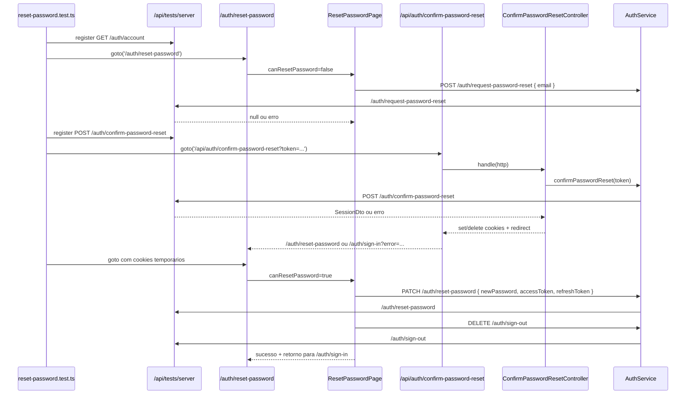

# 1. Objetivo

Criar a cobertura Playwright da jornada publicada de redefinicao de senha no `web`, cobrindo a solicitacao do e-mail em `/auth/reset-password`, o retorno do link em `/api/auth/confirm-password-reset?token=...`, o acesso condicionado por cookies temporarios, a definicao da nova senha, o encerramento da sessao temporaria e o retorno final para `/auth/sign-in`. A implementacao deve reutilizar a infraestrutura test-only existente de `/api/tests/server`, preservar os contratos REST atuais e nao depender do backend real.

---

# 2. Escopo

## 2.1 In-scope

- Criar a suite Playwright `apps/web/src/app/tests/auth/reset-password.test.ts`.
- Validar `/auth/reset-password` sem `COOKIES.shouldResetPassword.key`, renderizando o formulario inicial de solicitacao.
- Validar label `E-mail`, placeholder `seu@email.com`, CTA `Enviar e-mail` e link `Já tem uma conta? Faça login` apontando para `/auth/sign-in`.
- Validar erro de e-mail invalido antes de qualquer request para `/api/tests/server/auth/request-password-reset`.
- Registrar `POST /auth/request-password-reset` via `ServerMock(page)` e validar o payload `{ email }`.
- Validar toast de sucesso generico e toast/feedback de erro para falha de solicitacao.
- Validar `/api/auth/confirm-password-reset?token=<token>` com sucesso, incluindo request fake para `POST /auth/confirm-password-reset`, redirecionamento para `/auth/reset-password` e criacao dos cookies `shouldResetPassword`, `accessToken` e `refreshToken`.
- Validar falha da confirmacao, removendo `shouldResetPassword` e redirecionando para `/auth/sign-in?error=<slug>`.
- Validar `/auth/reset-password` com permissao temporaria ativa, exibindo o estado autorizado e abrindo o dialog de nova senha.
- Validar obrigatoriedade, politica global de senha e confirmacao divergente no dialog.
- Validar `PATCH /auth/reset-password` com `{ newPassword, accessToken, refreshToken }` obtidos dos cookies temporarios.
- Validar que o sucesso em `PATCH /auth/reset-password` chama `DELETE /auth/sign-out`, exibe a mensagem de sucesso e permite retornar para `/auth/sign-in` pelo botao `Fazer login`, por `Escape` ou por clique fora do dialog.
- Validar que falha em `PATCH /auth/reset-password` mantem o usuario no fluxo autorizado e exibe `Erro de redefinição, escolha outra senha`.

## 2.2 Out-of-scope

- Criar ou alterar endpoints reais no `apps/server`.
- Alterar contratos de `AuthService`, `ConfirmPasswordResetController`, `NextApiRestClient` ou `ServerMock`.
- Criar migrations, tabelas, policies, grants ou seeds.
- Testar envio real de e-mail.
- Testar token real do provedor de autenticacao.
- Cobrir login automatico apos redefinicao.
- Exibir detalhes da politica de senha alem das mensagens ja fornecidas pelos schemas compartilhados.
- Criar testes unitarios adicionais para widgets ou controllers que ja possuem cobertura equivalente, salvo lacuna necessaria descoberta durante a implementacao.

---

# 3. Requisitos

## 3.1 Funcionais

- A rota `/auth/reset-password` deve exibir o formulario de e-mail quando nao houver permissao temporaria de redefinicao.
- O formulario deve rejeitar e-mail invalido sem request para o backend fake.
- Um e-mail valido deve chamar `POST /auth/request-password-reset` com `{ email }`.
- Sucesso na solicitacao deve exibir a mensagem generica `Enviamos um e-mail para você redefinir sua senha (se seu e-mail estiver cadastrado, claro)`.
- Falha na solicitacao deve exibir `Erro ao enviar e-mail de redefinição de senha`.
- A rota `/api/auth/confirm-password-reset` deve ler `token` da query string e chamar `POST /auth/confirm-password-reset` com `{ token }`.
- Sucesso na confirmacao deve criar `shouldResetPassword`, `accessToken` e `refreshToken`, redirecionando para `/auth/reset-password`.
- Falha na confirmacao deve remover `shouldResetPassword` e redirecionar para `/auth/sign-in?error=<slug>`.
- Com permissao temporaria ativa, `/auth/reset-password` deve exibir `Você já pode redefinir sua senha 🚀!`.
- O CTA `Redefinir senha` deve abrir o dialog `Insira sua nova senha`.
- O dialog deve validar `Nova senha`, `Confirme sua nova senha`, senha minima global e igualdade entre senha e confirmacao.
- Redefinicao bem-sucedida deve chamar `PATCH /auth/reset-password` com a nova senha e os tokens temporarios, chamar `DELETE /auth/sign-out`, exibir `Você redefiniu sua senha com sucesso!` e redirecionar para `/auth/sign-in` ao clicar em `Fazer login`, pressionar `Escape` ou clicar fora do dialog.
- Falha na redefinicao deve manter o usuario no estado autorizado e exibir `Erro de redefinição, escolha outra senha`.

## 3.2 Nao funcionais

- Isolamento: a suite deve usar `NEXT_PUBLIC_STARDUST_SERVER_URL=http://127.0.0.1:3100/api/tests/server`, sem trafegar para o backend real.
- Confiabilidade: cada teste deve registrar suas rotas fake antes de navegar para a rota sob teste e deve limpar `ServerMock(page)` no `afterEach`.
- Confiabilidade: cookies HTTP-only devem ser preparados e verificados por `page.context().addCookies(...)` e `page.context().cookies(...)`, nao por `page.evaluate(...)`.
- Estabilidade: sincronizar requests relevantes com `page.waitForRequest(...)` e `page.waitForResponse(...)`, evitando `waitForTimeout`.
- Observabilidade: assertions devem usar `getByRole`, `getByLabel`, `getByPlaceholder`, textos publicos ou `getByTestId` apenas quando os componentes ja expuserem seletor estavel ou quando uma modificacao minima for documentada nesta spec.
- Seguranca: a infraestrutura `/api/tests/server` deve continuar protegida por `MODE=testing`.

---

# 4. O que ja existe?

## App Web (Testes de Rotas)

- **SignInIntegrationSuite** (`apps/web/src/app/tests/auth/sign-in.test.ts`) - suite Playwright existente com helpers locais, `ServerMock(page)`, fakers do core, `afterEach` de limpeza e sincronizacao por request/response.
- **SignUpIntegrationSuite** (`apps/web/src/app/tests/auth/sign-up.test.ts`) - referencia de fluxo auth com `ServerMock(page).registerSuccessDefaults(...)`, locators Playwright e reset de mocks ao final de cada cenario.
- **ServerMock** (`apps/web/src/app/tests/shared/mocks/ServerMock.ts`) - helper test-only para registrar e limpar rotas fake em `/api/tests/server`.
- **ServerMockRegistry** (`apps/web/src/app/tests/shared/mocks/ServerMockRegistry.ts`) - registry temporario em `/tmp/stardust/stardust-web-server-mock-routes.json`.
- **ServerMockRoute** (`apps/web/src/app/tests/shared/types/ServerMockRoute.ts`) - contrato serializavel `{ method, path, query, status, delayInMs, body, headers }`.
- **TestServerRegistryRoute** (`apps/web/src/app/api/tests/server/route.ts`) - route handler test-only para healthcheck, registro e limpeza das rotas fake.
- **TestServerCatchAllRoute** (`apps/web/src/app/api/tests/server/[...path]/route.ts`) - route handler test-only que responde requests fake por metodo, path e query.
- **PlaywrightConfig** (`apps/web/playwright.config.ts`) - configura `baseURL` em `http://127.0.0.1:3100`, `MODE=testing`, `NEXT_PUBLIC_STARDUST_SERVER_URL` para `/api/tests/server`, `testDir: './src/app/tests'` e `workers: 1`.

## Next.js App

- **ResetPasswordRoute** (`apps/web/src/app/auth/reset-password/page.tsx`) - entrada App Router que le `COOKIES.shouldResetPassword.key` via `cookieActions.getCookie(...)` e renderiza `ResetPasswordPage`.
- **ConfirmPasswordResetRoute** (`apps/web/src/app/api/auth/confirm-password-reset/route.ts`) - rota API que valida `queryParams.token`, instancia `NextApiRestClient`, `AuthService` e `ConfirmPasswordResetController`.
- **ServerProviders** (`apps/web/src/ui/global/widgets/layouts/Root/ServerProviders/index.tsx`) - composition root server-side que chama `AuthService.fetchAccount()` antes de renderizar a pagina, exigindo `GET /auth/account` registrado no mock server.
- **ROUTES** (`apps/web/src/constants/routes.ts`) - contem `/auth/reset-password`, `/auth/sign-in` e `/api/auth/confirm-password-reset`.
- **COOKIES** (`apps/web/src/constants/cookies.ts`) - define `@stardust:should-reset-password`, `@stardust:access-token`, `@stardust:refresh-token` e a duracao de 15 minutos da permissao temporaria.

## UI

- **ResetPasswordPage** (`apps/web/src/ui/auth/widgets/pages/ResetPassword/index.tsx`) - entry point cliente que injeta `authService`, `profileService`, `getCookie`, `deleteCookie` e delega para `useResetPassword`.
- **useResetPassword** (`apps/web/src/ui/auth/widgets/pages/ResetPassword/useResetPassword.ts`) - controla e-mail, loading, erro de solicitacao, leitura dos tokens temporarios e limpeza final dos cookies antes de navegar para `/auth/sign-in`.
- **ResetPasswordPageView** (`apps/web/src/ui/auth/widgets/pages/ResetPassword/ResetPasswordPageView.tsx`) - alterna entre formulario inicial e estado autorizado conforme `canResetPassword`.
- **ResetPasswordFormDialog** (`apps/web/src/ui/auth/widgets/pages/ResetPassword/ResetPasswordFormDialog/index.tsx`) - renderiza dialog de nova senha e alert dialog de sucesso com acao `Fazer login`.
- **useResetPasswordFormDialog** (`apps/web/src/ui/auth/widgets/pages/ResetPassword/ResetPasswordFormDialog/useResetPasswordFormDialog.ts`) - usa `react-hook-form`, `zodResolver`, `passwordSchema`, `stringSchema`, comparacao de senhas, `authService.resetPassword(...)`, `authService.signOut()` e redirecionamento ao fechar o dialog de sucesso.
- **Input** (`apps/web/src/ui/global/widgets/components/Input/index.tsx`) - componente com `aria-label` derivado de `label`, `placeholder`, `errorMessage` e suporte opcional a `testId`.
- **Button** (`apps/web/src/ui/global/widgets/components/Button/index.tsx`) - componente de botao com estado `isLoading` e suporte opcional a `testId`.
- **AuthLink** (`apps/web/src/ui/auth/widgets/components/Link/LinkView.tsx`) - link auth com suporte opcional a `testId`.
- **Toast** (`apps/web/src/ui/global/contexts/ToastContext/Toast/ToastView.tsx`) - feedback visual de sucesso/erro usado pelas mensagens de solicitacao e redefinicao.

## REST / Controllers

- **AuthService** (`apps/web/src/rest/services/AuthService.ts`) - service web com `requestPasswordReset`, `confirmPasswordReset`, `resetPassword` e `signOut`.
- **ConfirmPasswordResetController** (`apps/web/src/rest/controllers/auth/ConfirmPasswordResetController.ts`) - confirma token, grava cookies temporarios e redireciona para reset password ou login com erro.
- **ConfirmPasswordResetControllerTest** (`apps/web/src/rest/controllers/auth/tests/ConfirmPasswordResetController.test.ts`) - cobertura unitária existente para chamada do token, cookies e redirects do controller.
- **NextApiRestClient** (`apps/web/src/rest/next/NextApiRestClient.ts`) - adapter REST server-side de API route, usando `CLIENT_ENV.stardustServerUrl` e authorization por header ou cookie.
- **NextRestClient** (`apps/web/src/rest/next/NextRestClient.ts`) - adapter REST usado pelo client e pelo server, incluindo `patch`, `post`, `delete` e refresh de sessao em erros.
- **NextHttp** (`apps/web/src/rest/next/NextHttp.ts`) - adapter HTTP que aplica cookies acumulados em responses de redirect.

## Validation / Core

- **emailSchema** (`packages/validation/src/modules/global/schemas/emailSchema.ts`) - mensagem `Informe um e-mail válido`.
- **passwordSchema** (`packages/validation/src/modules/global/schemas/passwordSchema.ts`) - senha minima de 6 caracteres com mensagem `Sua senha deve conter pelo menos 6 caracteres`.
- **SessionDto** (`packages/core/src/auth/domain/structures/dtos/SessionDto.ts`) - contrato `{ account, accessToken, refreshToken, durationInSeconds }` retornado por confirmacao de reset.
- **SessionFaker** (`packages/core/src/auth/domain/structures/fakers/SessionFaker.ts`) - faker de `SessionDto` para montar responses compativeis.
- **AccountsFaker** (`packages/core/src/auth/domain/entities/fakers/AccountsFaker.ts`) - faker de `AccountDto` usado por `SessionFaker` e suites auth existentes.
- **IdFaker** (`packages/core/src/global/domain/structures/fakers`) - faker de ids usado nas suites auth existentes.

---

# 5. O que deve ser criado?

## App Web (Testes de Rotas Playwright)

- **Localizacao:** `apps/web/src/app/tests/auth/reset-password.test.ts` **(novo arquivo)**
- **Runner:** `@playwright/test`
- **Dependencias:** `test`, `expect`, `type BrowserContext`, `type Page`; `SessionFaker` ou fixture local aderente a `SessionDto`; `IdFaker`; `ServerMock`; `type ServerMockRoute`.
- **Request/Response:** a suite registra rotas fake para `GET /auth/account`, `POST /auth/request-password-reset`, `POST /auth/confirm-password-reset`, `PATCH /auth/reset-password` e `DELETE /auth/sign-out`.
- **Constantes locais:** nomes de cookies derivados dos contratos atuais (`@stardust:should-reset-password`, `@stardust:access-token`, `@stardust:refresh-token`) ou import direto de `@/constants/cookies`; evitar import do barrel `@/constants` em Playwright.
- **Helpers locais:**
  - `createSessionDto(): SessionDto` - cria uma sessao temporaria deterministica para o fluxo de confirmacao.
  - `createAuthAccountFallbackRoute(): ServerMockRoute` - registra `GET /auth/account` como usuario anonimo ou erro controlado, suficiente para `ServerProviders`.
  - `registerResetPasswordDefaults(page: Page, routes?: ServerMockRoute[]): Promise<void>` - limpa e registra defaults minimos para a rota atual.
  - `setTemporaryResetCookies(context: BrowserContext, session: SessionDto): Promise<void>` - cria `shouldResetPassword`, `accessToken` e `refreshToken` para `127.0.0.1`.
  - `getTemporaryResetCookies(context: BrowserContext): Promise<Record<string, string | undefined>>` - le cookies relevantes do contexto Playwright.
  - `gotoResetPasswordPage(page: Page, routes?: ServerMockRoute[]): Promise<void>` - registra mocks e navega para `/auth/reset-password`.
  - `gotoAuthorizedResetPasswordPage(page: Page, session: SessionDto, routes?: ServerMockRoute[]): Promise<void>` - prepara cookies temporarios e navega para `/auth/reset-password`.
  - `fillResetRequestEmail(page: Page, email: string): Promise<void>` - preenche o campo `E-mail`.
  - `openNewPasswordDialog(page: Page): Promise<void>` - clica no CTA `Redefinir senha` e aguarda o dialog `Insira sua nova senha`.
  - `fillNewPasswordForm(page: Page, fields: { newPassword: string; confirmation: string }): Promise<void>` - preenche `Nova senha` e `Confirme sua nova senha`.
  - `submitNewPasswordForm(page: Page): Promise<void>` - clica no botao `Redefinir senha` do dialog.
- **Cenarios da suite:**
  - `test('renders reset request form without temporary permission', ...)`
  - `test('validates email before requesting password reset', ...)`
  - `test('posts email and shows generic success message', ...)`
  - `test('shows request error when password reset request fails', ...)`
  - `test('confirms reset token, stores temporary cookies and redirects to reset page', ...)`
  - `test('removes temporary permission and redirects to sign in when token confirmation fails', ...)`
  - `test('renders authorized reset state and opens new password dialog', ...)`
  - `test('validates new password policy and matching confirmation', ...)`
  - `test('patches new password with temporary tokens, signs out and returns to sign in from success action', ...)`
  - `test('returns to sign in when success dialog is closed with Escape', ...)`
  - `test('returns to sign in when success dialog is closed by clicking outside', ...)`
  - `test('keeps authorized flow and shows error when password reset fails', ...)`

## App Web (Playwright Cookie Helpers)

- **Localizacao:** mesmo arquivo `apps/web/src/app/tests/auth/reset-password.test.ts` **(novo arquivo)**
- **Responsabilidade:** isolar a montagem dos cookies HTTP-only usados pelos cenarios autorizados.
- **Metodos:**
  - `setCookie(context: BrowserContext, cookie: { name: string; value: string; maxAge?: number }): Promise<void>` - adiciona cookie em `http://127.0.0.1:3100`.
  - `expectTemporaryCookies(context: BrowserContext, session: SessionDto): Promise<void>` - valida `shouldResetPassword=true`, `accessToken=session.accessToken` e `refreshToken=session.refreshToken`.
  - `expectTemporaryCookiesCleared(context: BrowserContext): Promise<void>` - valida ausencia ou expiracao dos cookies temporarios apos falha/finalizacao.

---

# 6. O que deve ser modificado?

- **Arquivo:** `apps/web/src/ui/auth/widgets/pages/ResetPassword/ResetPasswordPageView.tsx`
  - **Mudanca:** adicionar `testId` nos pontos onde locators por role/label nao forem suficientes: formulario inicial (`reset-password-request-form`), input de e-mail (`email-input`), CTA de envio (`submit-button`) e link de login (`sign-in-link`).
  - **Justificativa:** `Input`, `Button` e `Link` ja suportam `testId`; o padrao existe em `SignInForm` e `SignUpPageView`, e reduz ambiguidade entre o CTA inicial e o CTA homonimo dentro do dialog.

- **Arquivo:** `apps/web/src/ui/auth/widgets/pages/ResetPassword/ResetPasswordFormDialog/index.tsx`
  - **Mudanca:** adicionar `testId` opcionais aos campos de nova senha (`new-password-input`, `new-password-confirmation-input`) e ao botao de submit do dialog (`reset-password-submit-button`) caso os locators por label/role fiquem ambiguos durante a implementacao.
  - **Justificativa:** os componentes globais ja aceitam `testId`, e a suite precisa diferenciar o botao `Redefinir senha` que abre o dialog do botao que submete a nova senha.

Se a implementacao conseguir cobrir todos os cenarios com `getByRole`, `getByLabel`, `getByPlaceholder` e textos publicos sem ambiguidade, estas modificacoes devem ser omitidas.

---

# 7. O que deve ser removido?

Nao aplicavel.

---

# 8. Decisoes Tecnicas

- **Decisao:** criar uma unica suite Playwright em `apps/web/src/app/tests/auth/reset-password.test.ts`.
  - **Alternativas:** distribuir parte da cobertura em testes unitarios de widget/controller.
  - **Motivo:** o issue pede a jornada publicada ao usuario, envolvendo SSR, API route, cookies HTTP-only, hidratacao, REST client-side e redirects reais.
  - **Trade-offs:** a suite fica mais longa, mas valida o contrato de ponta a ponta dentro da borda `web`.

- **Decisao:** usar `ServerMock(page)` e `/api/tests/server` em vez de `page.route(...)`.
  - **Alternativas:** interceptar requests no browser com Playwright.
  - **Motivo:** a codebase ja tem boundary test-only canonico que atende requests server-side e client-side, inclusive a chamada de `NextApiRestClient` em `/api/auth/confirm-password-reset`.
  - **Trade-offs:** exige registrar `GET /auth/account` para o `ServerProviders`, mas evita backend real.

- **Decisao:** validar cookies temporarios pelo `BrowserContext`.
  - **Alternativas:** expor cookies por JS no browser.
  - **Motivo:** `NextCall` e `NextHttp` gravam cookies HTTP-only; JS client-side nao deve le-los diretamente. Playwright consegue preparar e inspecionar cookies no contexto do navegador.
  - **Trade-offs:** helpers de cookie precisam conhecer `baseURL` e dominio local.

- **Decisao:** preferir locators acessiveis e textos publicos, adicionando `testId` apenas em pontos ambiguos.
  - **Alternativas:** adicionar `testId` em todos os elementos da pagina.
  - **Motivo:** a pagina ja expoe labels, placeholders e textos de produto suficientes para a maior parte das assertions; os `testId` devem seguir o padrao existente apenas para estabilizar interacoes repetidas.
  - **Trade-offs:** alguns testes ficam mais proximos do texto de UI, mas isso e aceitavel porque o issue exige validar a jornada publicada.

- **Decisao:** manter `ConfirmPasswordResetController.test.ts` sem alteracoes obrigatorias.
  - **Alternativas:** duplicar as assertions de cookies no teste unitario.
  - **Motivo:** o controller ja cobre token, cookies e redirects; o novo valor esta em validar a rota API real com `NextHttp`, `NextApiRestClient`, `ServerMock` e redirects observaveis.
  - **Trade-offs:** se a rota API tiver comportamento diferente do controller, a suite Playwright deve revelar sem exigir novo teste unitario.

- **Decisao:** nao criar migration.
  - **Alternativas:** nao aplicavel.
  - **Motivo:** a feature nao altera schema, tabela, indice, view, constraint, grant ou RLS.
  - **Trade-offs:** nenhum.

- **Decisao:** nao criar contratos novos em `core`, `validation` ou `server`.
  - **Alternativas:** adicionar DTOs/helpers compartilhados para os testes.
  - **Motivo:** `SessionDto`, `AuthService`, `emailSchema`, `passwordSchema` e `ServerMockRoute` ja fornecem os contratos necessarios.
  - **Trade-offs:** a suite Playwright mantem alguns helpers locais, como as suites auth existentes.

---

# 9. Diagramas e Referencias

- **Fluxo de dados:**



- **Fluxo cross-app:** nao aplicavel. A cobertura executa somente `apps/web`; o backend e substituido por route handlers test-only da propria app em `/api/tests/server`.

- **Layout:**

```text
/auth/reset-password sem permissao
`- ResetPasswordPage
   |- h1: Redefina sua senha
   |- input: E-mail / seu@email.com
   |- button: Enviar e-mail
   `- link: Já tem uma conta? Faça login -> /auth/sign-in

/auth/reset-password com permissao
`- ResetPasswordPage
   |- AppMessage: Você já pode redefinir sua senha
   `- button: Redefinir senha
      `- Dialog: Insira sua nova senha
         |- input: Nova senha
         |- input: Confirme sua nova senha
         `- button: Redefinir senha
            `- AlertDialog: Voce redefiniu sua senha com sucesso!
               `- button: Fazer login
```

- **Referencias:**
  - `apps/web/src/app/tests/auth/sign-in.test.ts`
  - `apps/web/src/app/tests/auth/sign-up.test.ts`
  - `apps/web/src/app/tests/shared/mocks/ServerMock.ts`
  - `apps/web/src/app/tests/shared/mocks/ServerMockRegistry.ts`
  - `apps/web/src/app/tests/shared/types/ServerMockRoute.ts`
  - `apps/web/src/app/api/tests/server/route.ts`
  - `apps/web/src/app/api/tests/server/[...path]/route.ts`
  - `apps/web/playwright.config.ts`
  - `apps/web/src/app/auth/reset-password/page.tsx`
  - `apps/web/src/app/api/auth/confirm-password-reset/route.ts`
  - `apps/web/src/ui/auth/widgets/pages/ResetPassword/index.tsx`
  - `apps/web/src/ui/auth/widgets/pages/ResetPassword/useResetPassword.ts`
  - `apps/web/src/ui/auth/widgets/pages/ResetPassword/ResetPasswordPageView.tsx`
  - `apps/web/src/ui/auth/widgets/pages/ResetPassword/ResetPasswordFormDialog/index.tsx`
  - `apps/web/src/ui/auth/widgets/pages/ResetPassword/ResetPasswordFormDialog/useResetPasswordFormDialog.ts`
  - `apps/web/src/rest/controllers/auth/ConfirmPasswordResetController.ts`
  - `apps/web/src/rest/controllers/auth/tests/ConfirmPasswordResetController.test.ts`
  - `apps/web/src/rest/services/AuthService.ts`
  - `apps/web/src/constants/cookies.ts`
  - `apps/web/src/constants/routes.ts`
  - `packages/validation/src/modules/global/schemas/emailSchema.ts`
  - `packages/validation/src/modules/global/schemas/passwordSchema.ts`
  - `packages/core/src/auth/domain/structures/dtos/SessionDto.ts`
  - `packages/core/src/auth/domain/structures/fakers/SessionFaker.ts`

---

# 10. Pendencias / Duvidas

Sem pendencias.
