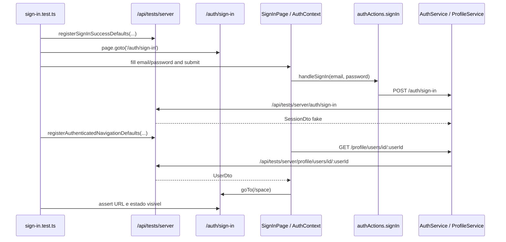

# 1. Objetivo

Criar a cobertura da rota publicada `/auth/sign-in` no `web`, validando a jornada real de navegador para login com e-mail e senha, erro de autenticacao, redirecionamento padrao para `/space`, contratos publicos dos links sociais e links auxiliares para cadastro e recuperacao de senha. O comportamento de redirecionamento autenticado via `nextRoute` deve ser coberto de forma deterministica no controller de auth do `web`. A implementacao deve usar a infraestrutura test-only existente em `apps/web/src/app/tests/**`, sem depender do backend real e sem alterar contratos de produto.

---

# 2. Escopo

## 2.1 In-scope

- Criar a suite Playwright `apps/web/src/app/tests/auth/sign-in.test.ts`.
- Reutilizar a infraestrutura de `/api/tests/server` para registrar respostas fake de `/auth/account`, `/auth/sign-in` e `/profile/users/id/:userId`.
- Validar renderizacao inicial da pagina de login e seus elementos publicos observaveis.
- Validar erros de formulario antes de qualquer request de login.
- Validar envio de `POST /auth/sign-in` com `{ email, password }`.
- Validar redirecionamento para `/space` quando o login for bem-sucedido sem `nextRoute`.
- Validar falha de `POST /auth/sign-in`, mantendo o usuario em `/auth/sign-in` e exibindo feedback de erro.
- Validar `href` publico dos links sociais Google e GitHub com `returnUrl` para `/auth/social-account-confirmation`.
- Validar `href` dos links auxiliares para `/auth/reset-password` e `/auth/sign-up`.
- Validar no `VerifyAuthRoutesController` que um usuario autenticado em `/auth/sign-in?nextRoute=...` e redirecionado para `nextRoute`.

## 2.2 Out-of-scope

- Testar o fluxo real dos provedores Google ou GitHub.
- Testar o retorno em `/auth/social-account-confirmation`.
- Testar `/auth/sign-up`, `/auth/reset-password` ou `/auth/account-confirmation` como features independentes.
- Criar ou alterar backend real no `apps/server`.
- Criar migrations, tabelas, policies, grants ou seed de banco.
- Refatorar widgets, actions, services ou schemas existentes, salvo incompatibilidade real descoberta durante a escrita dos testes.

---

# 3. Requisitos

## 3.1 Funcionais

- A rota `/auth/sign-in` deve renderizar campos de e-mail e senha, botao de envio, links sociais e links auxiliares.
- O formulario deve bloquear envio quando e-mail ou senha forem invalidos.
- Em credenciais validas com perfil interno existente, o sistema deve autenticar e redirecionar para `/space`.
- Em falha de autenticacao, o sistema deve permanecer no fluxo de entrada e exibir feedback de erro.
- A pagina deve disponibilizar acoes de login social para Google e GitHub apontando ao servidor configurado com `returnUrl` de confirmacao social.
- A pagina deve disponibilizar navegacao auxiliar para criacao de conta e redefinicao de senha.
- Quando um usuario autenticado acessar `/auth/sign-in?nextRoute=...`, o middleware/controller de auth deve redirecionar para `nextRoute`.

## 3.2 Nao funcionais

- Isolamento: a suite deve usar `/api/tests/server`, sem trafegar para o backend real.
- Confiabilidade: os cenarios devem registrar suas rotas fake antes de navegar para `/auth/sign-in`.
- Confiabilidade: a suite Playwright deve executar com `workers: 1` para evitar interferencia no registry global de `/api/tests/server`.
- Observabilidade de contrato: requests relevantes devem ser validadas por request/response observaveis no browser ou por teste unitario no controller, sem depender de seletores CSS estruturais.

---

# 4. O que ja existe?

## App Web (Testes de Rotas)

- **SignUpIntegrationSuite** (`apps/web/src/app/tests/auth/sign-up.test.ts`) - suite Playwright usada como referencia de estrutura, helpers locais, assertions com `getByTestId`/`getByRole` e fluxo via `/api/tests/server`.
- **ServerMock** (`apps/web/src/app/tests/shared/mocks/ServerMock.ts`) - helper test-only que registra rotas fake em `/api/tests/server`.
- **ServerMockRegistry** (`apps/web/src/app/tests/shared/mocks/ServerMockRegistry.ts`) - armazenamento temporario das rotas fake em `/tmp/stardust/stardust-web-server-mock-routes.json`.
- **TestServerCatchAllRoute** (`apps/web/src/app/api/tests/server/[...path]/route.ts`) - route handler test-only que responde conforme rotas registradas quando `MODE=testing`.
- **TestServerRegistryRoute** (`apps/web/src/app/api/tests/server/route.ts`) - route handler test-only que registra, limpa e verifica disponibilidade do mock server.
- **PlaywrightConfig** (`apps/web/playwright.config.ts`) - configura `baseURL` em `http://127.0.0.1:3100`, `MODE=testing`, `NEXT_PUBLIC_STARDUST_SERVER_URL` apontando para `/api/tests/server` e `workers: 1` para evitar concorrencia entre suites que compartilham o mock server.

## Next.js App

- **SignInRoute** (`apps/web/src/app/auth/sign-in/page.tsx`) - entrada App Router que renderiza `SignInPage`.
- **SpaceRoute** (`apps/web/src/app/(home)/space/page.tsx`) - destino padrao esperado apos login bem-sucedido sem `nextRoute`.
- **ResetPasswordRoute** (`apps/web/src/app/auth/reset-password/page.tsx`) - destino do link auxiliar de recuperacao de acesso.
- **SignUpRoute** (`apps/web/src/app/auth/sign-up/page.tsx`) - destino do link auxiliar de criacao de conta.

## UI

- **SignInPage** (`apps/web/src/ui/auth/widgets/pages/SignIn/index.tsx`) - entry point cliente que le `nextRoute` e `error` via `useSearchParams`, consome `handleSignIn` do `AuthContext` e delega para `useSignInPage`.
- **useSignInPage** (`apps/web/src/ui/auth/widgets/pages/SignIn/useSignInPage.ts`) - hook que chama `handleSignIn(email, password)`, executa animacao e redireciona para `nextRoute` ou `ROUTES.space`.
- **SignInPageView** (`apps/web/src/ui/auth/widgets/pages/SignIn/SignInPageView.tsx`) - view com `SocialLinks`, `SignInForm`, `reset-password-link` e `create-account-link`.
- **SignInForm** (`apps/web/src/ui/auth/widgets/pages/SignIn/SignInForm/index.tsx`) - formulario com `email-input`, `password-input` e `submit-button`.
- **useSignInForm** (`apps/web/src/ui/auth/widgets/pages/SignIn/SignInForm/useSignInForm.ts`) - hook que aplica `zodResolver` com `emailSchema` e `passwordSchema` antes de chamar `onSubmit`.
- **SocialLinksView** (`apps/web/src/ui/auth/widgets/pages/SignIn/SocialLinks/SocialLinksView.tsx`) - view que monta links para Google e GitHub usando `ROUTES.server.auth.signInWithGoogle`, `ROUTES.server.auth.signInWithGithub` e `ROUTES.auth.socialAccountConfirmation`.
- **useAuthContextProvider** (`apps/web/src/ui/auth/contexts/AuthContext/hooks/useAuthContextProvider.ts`) - provider que executa `signIn`, atualiza `account`, busca `user` via `ProfileService.fetchUserById` e expoe `handleSignIn`.
- **useSignInAction** (`apps/web/src/ui/auth/contexts/AuthContext/hooks/useSignInAction.ts`) - hook que executa `authActions.signIn` via next-safe-action e normaliza para `ActionResponse<AccountDto>`.

## RPC / REST

- **SignInAction** (`apps/web/src/rpc/actions/auth/SignInAction.ts`) - action que valida `email` e `password`, chama `authService.signIn(...)`, grava cookies e retorna `AccountDto`.
- **authActions.signIn** (`apps/web/src/rpc/next-safe-action/authActions.ts`) - server action com schema `{ email, password }`, `NextRestClient` e base URL `CLIENT_ENV.stardustServerUrl`.
- **AuthService.signIn** (`apps/web/src/rest/services/AuthService.ts`) - service que faz `POST /auth/sign-in` com `{ email, password }`.
- **ProfileService.fetchUserById** (`apps/web/src/rest/services/ProfileService.ts`) - service que faz `GET /profile/users/id/:userId`, necessario para simular perfil interno existente apos autenticar.
- **VerifyAuthRoutesController** (`apps/web/src/rest/controllers/auth/VerifyAuthRoutesController.ts`) - controller do fluxo de auth que honra `nextRoute` quando um usuario autenticado acessa `/auth/sign-in`.
- **NextHttp** (`apps/web/src/rest/next/NextHttp.ts`) - adaptador HTTP do App Router que agora consegue expor query params crus mesmo sem schema tipado.

## Validation / Core

- **emailSchema** (`packages/validation/src/modules/global/schemas/emailSchema.ts`) - schema que valida formato de e-mail do formulario.
- **passwordSchema** (`packages/validation/src/modules/global/schemas/passwordSchema.ts`) - schema que valida tamanho minimo da senha do formulario.
- **AccountDto** (`packages/core/src/auth/domain/entities/dtos/AccountDto.ts`) - contrato retornado por `POST /auth/sign-in`.
- **UserDto** (`packages/core/src/profile/domain/entities/dtos/UserDto.ts`) - contrato de perfil interno retornado por `GET /profile/users/id/:userId`.
- **AccountsFaker / UsersFaker / IdFaker** (`packages/core/src/**/fakers`) - fixtures usadas na suite Playwright para manter ids e DTOs compativeis com runtime JS compilado.

---

# 5. O que deve ser criado?

## App Web (Testes de Rotas Playwright)

- **Localizacao:** `apps/web/src/app/tests/auth/sign-in.test.ts`
- **Runner:** `@playwright/test`
- **Dependencias:** `test`, `expect`, `type Page`; `AccountsFaker`, `UsersFaker`, `IdFaker`; `SERVER_MOCK_ROUTE`; `type ServerMockRoute`.
- **Request/Response:** a suite registra rotas fake para `POST /auth/sign-in`, `GET /auth/account`, `POST /auth/refresh-session` e `GET /profile/users/id/:userId`.
- **Helpers locais:**
  - `createDeterministicId(): string`
  - `createAccountDto(overrides?: Partial<AccountDto>): AccountDto`
  - `createUserDto(account: AccountDto): UserDto`
  - `createSignInSuccessRoutes(account: AccountDto, session: unknown): ServerMockRoute[]`
  - `registerSignInSuccessDefaults(page: Page, routes?: ServerMockRoute[])`
  - `registerAuthenticatedNavigationDefaults(page: Page, account: AccountDto, session: unknown, routes?: ServerMockRoute[])`
  - `gotoSignInPage(page: Page, params?: { nextRoute?: string; routes?: ServerMockRoute[] })`
  - `fillValidSignInForm(page: Page, fields: { email: string; password: string })`
  - `submitSignInForm(page: Page)`
  - `waitForSignInPageAction(page: Page)`

## Cenarios da Suite

- `test('posts credentials and redirects to space after successful sign-in', ...)`
- `test('renders sign-in form, social links and auxiliary links', ...)`
- `test('validates form fields before requesting sign-in', ...)`
- `test('keeps user on sign-in page and shows error when sign-in fails', ...)`
- `test('keeps social links pointing to configured server providers', ...)`
- `test('keeps auxiliary links pointing to reset password and sign-up pages', ...)`

## Controller de Auth

- **Localizacao:** `apps/web/src/rest/controllers/auth/tests/VerifyAuthRoutesController.test.ts`
- **Cenario adicionado:**
  - `it('should redirect authenticated user from sign in route to next route when provided', ...)`

---

# 6. O que deve ser modificado?

- `apps/web/src/ui/auth/widgets/pages/SignIn/index.tsx` - leitura de `nextRoute` e `error` atualizada para `useSearchParams`.
- `apps/web/src/rest/next/NextHttp.ts` - `getQueryParams()` passa a retornar query params crus quando ha `request` mesmo sem schema tipado.
- `apps/web/src/rest/controllers/auth/VerifyAuthRoutesController.ts` - redirecionamento do usuario autenticado em `/auth/sign-in` passa a honrar `nextRoute`.
- `apps/web/src/rest/controllers/auth/tests/VerifyAuthRoutesController.test.ts` - cobertura da regra de `nextRoute` adicionada.
- `apps/web/playwright.config.ts` - `workers` fixado em `1`.
- `packages/core/package.json` - exports de subpaths de fakers ajustados para runtime em JS compilado.

---

# 7. O que deve ser removido?

- `scripts/patch-playwright-loader.js` - removido apos confirmar que a suite roda sem patch do loader do Playwright.
- prefixo de patch nos scripts `test:integration`, `test:integration:ui` e `test:integration:debug` em `apps/web/package.json`.

---

# 8. Decisoes Tecnicas

- **Decisao:** criar a suite `apps/web/src/app/tests/auth/sign-in.test.ts` dentro de `apps/web/src/app/tests/auth/`.
- **Motivo:** os requisitos dependem da rota publicada, hidratacao, server action, middleware e requests HTTP test-only.

- **Decisao:** usar `/api/tests/server` em vez de `page.route(...)`.
- **Motivo:** a codebase ja possui o boundary test-only canonico para o `web`.

- **Decisao:** simular perfil interno existente por `GET /profile/users/id/:userId` nos cenarios de sucesso.
- **Motivo:** `useAuthContextProvider` busca `user` apos autenticar.

- **Decisao:** validar links sociais pelo `href`, sem executar OAuth real.
- **Motivo:** a cobertura desejada e do contrato publico da pagina.

- **Decisao:** manter o redirecionamento via `nextRoute` coberto no controller `VerifyAuthRoutesController`, nao na suite Playwright da pagina de sign-in.
- **Alternativas:** manter um cenario Playwright para `nextRoute`.
- **Motivo:** o fluxo completo ficou intermitente no ambiente de dev do Next por depender da combinacao entre server action, middleware e troca de mocks no mesmo request. A regra de negocio critica esta no controller de auth e pode ser validada de forma deterministica em teste unitario.
- **Trade-offs:** a suite Playwright deixa de cobrir o caminho completo de navegador para `nextRoute`, mas a regra de redirect autenticado continua coberta sem flakes.

- **Decisao:** executar Playwright com `workers: 1`.
- **Motivo:** o registry de `/api/tests/server` e compartilhado pelo processo do `next dev`, o que gerava interferencia entre arquivos quando executados em paralelo.

- **Decisao:** registrar o estado autenticado apenas apos a resposta do POST da page `/auth/sign-in` no cenario de sucesso.
- **Motivo:** o submit real passa por server action e middleware do Next, entao sincronizar pela resposta da propria page `/auth/sign-in` evita corrida entre cookies/sessao e troca dos mocks de navegacao.

- **Decisao:** importar `SERVER_MOCK_ROUTE` por `@/constants/server-mock-route`, nao pelo barrel `@/constants`.
- **Motivo:** o barrel import carrega `fonts.ts`, que executa `next/font/google` e quebra o Playwright fora do runtime do Next.

- **Decisao:** usar `IdFaker` em vez de `crypto.randomUUID()` nos testes de auth quando possivel.
- **Motivo:** padroniza fixtures com o restante da infraestrutura de fakers do core.

---

# 9. Diagramas e Referencias

- **Fluxo de dados:**



- **Fluxo cross-app:** nao aplicavel. A suite executa apenas `apps/web` e usa route handlers test-only da propria app.

- **Layout:**

```text
/auth/sign-in
|- SocialLinks
|  |- Link: Entrar com Google
|  `- Link: Entrar com GitHub
|- SignInForm
|  |- Input: email-input
|  |- Input: password-input
|  `- Button: submit-button
`- AuxiliaryLinks
   |- reset-password-link -> /auth/reset-password
   `- create-account-link -> /auth/sign-up
```

- **Referencias:**
  - `apps/web/src/app/tests/auth/sign-in.test.ts`
  - `apps/web/src/app/tests/auth/sign-up.test.ts`
  - `apps/web/src/app/tests/shared/mocks/ServerMock.ts`
  - `apps/web/src/app/api/tests/server/[...path]/route.ts`
  - `apps/web/src/app/api/tests/server/route.ts`
  - `apps/web/playwright.config.ts`
  - `apps/web/src/ui/auth/widgets/pages/SignIn/index.tsx`
  - `apps/web/src/ui/auth/widgets/pages/SignIn/useSignInPage.ts`
  - `apps/web/src/rest/controllers/auth/VerifyAuthRoutesController.ts`
  - `apps/web/src/rest/controllers/auth/tests/VerifyAuthRoutesController.test.ts`
  - `apps/web/src/rest/next/NextHttp.ts`
  - `packages/core/package.json`

---

# 10. Pendencias / Duvidas

Sem pendencias. A cobertura final ficou dividida entre:
- Playwright para os 6 cenarios publicos da rota `/auth/sign-in`.
- teste unitario do `VerifyAuthRoutesController` para o redirect autenticado com `nextRoute`.
