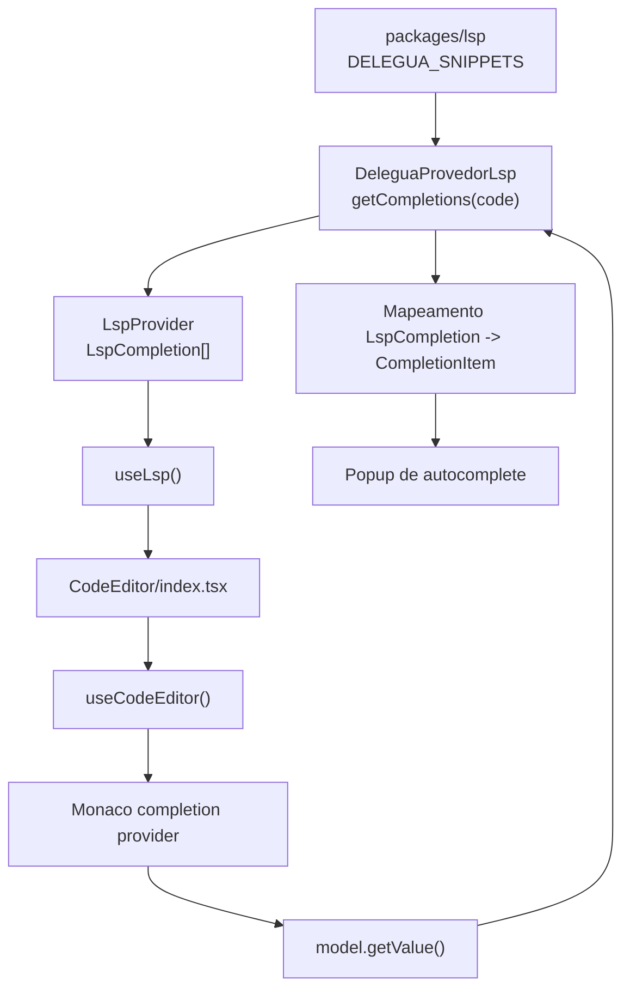

# 1. Objetivo

Corrigir o autocomplete do `CodeEditor` usado no `web` para que o Monaco receba sugestoes uteis da linguagem Delegua ao digitar ou acionar `Ctrl + Espaco`. A entrega amplia o catalogo estatico do pacote `@stardust/lsp` com palavras-chave e estruturas sintaticas, preserva as sugestoes atuais de metodos/funcoes, adiciona sugestoes dinamicas para simbolos declarados no modelo aberto via `DeleguaProvedorLsp`, evita acumulacao residual de providers em remounts do editor e configura o Monaco para envolver selecoes com pares de delimitadores de texto.

---

# 2. Escopo

## 2.1 In-scope

- Adicionar snippets estruturais curados para palavras-chave e blocos comuns de Delegua.
- Manter os snippets existentes de metodos de listas, textos, dicionarios e funcoes globais.
- Fazer o provider de completion do `CodeEditor` solicitar sugestoes ao `LspProvider`, passando o codigo atual de `model.getValue()`.
- Abstrair sugestoes de autocomplete em contrato do `core`, sem expor tipos do Monaco fora da camada UI.
- Sugerir variaveis, parametros e funcoes declaradas no codigo atual conforme o usuario continua digitando.
- Substituir numeros magicos de completion por constantes do Monaco.
- Evitar registro acumulado de hover/completion providers em remontagens client-side do `CodeEditor`.
- Preservar hover, syntax highlighting, placeholders de snippets e o range de substituicao do prefixo atual.
- Envolver o trecho selecionado automaticamente ao digitar aspas duplas, aspas simples ou crase no Monaco.
- Manter `autoClosingPairs` e `surroundingPairs` declarados na configuracao de linguagem Delegua.

## 2.2 Out-of-scope

- Alterar o contrato publico obrigatorio de `LspSnippet`.
- Converter automaticamente todos os tokens de `DELEGUA_TOKENS` em sugestoes.
- Implementar um LSP completo com analise semantica incremental.
- Modificar a UI visual do popup nativo do Monaco.
- Alterar rotas Next.js, RPC, REST, server, banco de dados ou migrations.
- Corrigir o `CodeEditor` equivalente de `apps/studio`; ele se beneficia apenas do catalogo compartilhado quando consumir `DELEGUA_SNIPPETS`.

---

# 3. Requisitos

## 3.1 Funcionais

- Prefixos como `ret`, `fun`, `var`, `se`, `senao`, `enquanto`, `para`, `verd`, `fal`, `enca`, `map`, `tam` e `esc` devem encontrar sugestoes quando houver item conhecido no catalogo.
- `DELEGUA_SNIPPETS` deve incluir estruturas da linguagem como retorno, declaracao de variavel, funcao, condicional e lacos.
- Sugestoes existentes como `escreva`, `leia`, `encaixar`, `mapear`, `filtrarPor`, `tamanho`, `adicionar`, `contem` e `contém` devem permanecer disponiveis.
- Snippets com placeholders devem continuar usando o mecanismo nativo de snippet do Monaco.
- O provider deve sugerir identificadores declarados no codigo atual por declaracoes de variavel, parametros e funcoes.
- O provider deve retornar `suggestions` compativeis com o range do prefixo atual para substituir somente a palavra em edicao.
- O editor de desafios e o playground devem herdar a correcao por continuarem usando o widget global `CodeEditor`.
- Editores `readOnly` devem manter a configuracao atual de exibicao de codigo sem exigir novo contrato de props.
- Ao selecionar um trecho de codigo e digitar `"`, `'` ou `` ` ``, o Monaco deve envolver a selecao com o mesmo delimitador.

## 3.2 Nao funcionais

- O catalogo estrutural deve ser curado manualmente para evitar ruido e duplicatas desnecessarias.
- A extracao dinamica deve rodar localmente no `DeleguaProvedorLsp` sobre o texto recebido da UI, sem chamadas HTTP/RPC e sem dependencia de server.
- O registro de providers deve descartar `IDisposable`s antigos antes de registrar novos providers para a mesma montagem.
- A correcao deve preservar as props publicas atuais de `CodeEditor` e `CodeEditorView`.
- O contrato do `core` nao deve importar `monaco-editor`, React ou tipos de framework.
- Pares de delimitadores de edicao devem permanecer no pacote `@stardust/lsp`, em `DeleguaConfiguracaoParaEditorMonaco`, sem logica manual de teclado no widget React.
- Nao deve haver migration de banco de dados.

---

# 4. O que ja existe?

## Camada UI (Widgets)

- **`CodeEditor`** (`apps/web/src/ui/global/widgets/components/CodeEditor/index.tsx`) - entry point global que resolve `useLsp()`, injeta `snippets` e `documentations` em `useCodeEditor` e monta a view.
- **`useCodeEditor`** (`apps/web/src/ui/global/widgets/components/CodeEditor/useCodeEditor.ts`) - hook que registra linguagem, hover provider, completion provider, tema e analise sintatica do Monaco.
- **`CodeEditorView`** (`apps/web/src/ui/global/widgets/components/CodeEditor/CodeEditorView.tsx`) - view que monta `MonacoEditor` com `language={LANGUAGE}` e preserva o autocomplete nativo.
- **`LANGUAGE`** (`apps/web/src/ui/global/widgets/components/CodeEditor/language.ts`) - identificador `delegua` usado no editor e nos providers.
- **`ChallengeCodeEditorSlotView`** (`apps/web/src/ui/challenging/widgets/slots/ChallengeCodeEditor/ChallengeCodeEditorSlotView.tsx`) - uso real do `CodeEditor` na tela de desafio.
- **`PlaygroundCodeEditor`** (`apps/web/src/ui/global/widgets/components/PlaygroundCodeEditor/index.tsx`) - wrapper reutilizado pelo playground e snippets que tambem monta o `CodeEditor`.
- **`SnippetPageView`** (`apps/web/src/ui/playground/widgets/pages/Snippet/SnippetPageView.tsx`) - pagina de snippet que usa `PlaygroundCodeEditor` e herda o autocomplete global.

## Camada UI (Hooks)

- **`useLsp`** (`apps/web/src/ui/global/hooks/useLsp.ts`) - instancia `DeleguaProvedorLsp` e expoe `documentations`, `snippets` e `exampleSnippets` vindos de `@stardust/lsp`.

## Pacote Core

- **`LspSnippet`** (`packages/core/src/global/domain/types/LspSnippet.ts`) - contrato compartilhado atual `{ label: string; code: string }` usado por catalogos de snippets e consumidores UI.
- **`LspProvider`** (`packages/core/src/global/interfaces/provision/LspProvider.ts`) - interface atual de provider de linguagem, com execucao, traducao, analise sintatica/semantica e utilitarios de funcao/input.

## Camada LSP

- **`DELEGUA_SNIPPETS`** (`packages/lsp/src/constants/delegua-snippets.ts`) - catalogo publico agregado consumido por `useLsp`.
- **`DELEGUA_SNIPPETS_METODOS_GLOBAIS`** (`packages/lsp/src/constants/delegua-snippets-metodos-globais.ts`) - snippets de funcoes globais como `escreva`, `leia`, `mapear`, `tamanho` e conversores.
- **`DELEGUA_SNIPPETS_METODOS_LISTA`** (`packages/lsp/src/constants/delegua-snippets-metodos-lista.ts`) - snippets de lista como `adicionar`, `encaixar`, `mapear` e `removerUltimo`.
- **`DELEGUA_SNIPPETS_METODOS_TEXTO`** (`packages/lsp/src/constants/delegua-snippets-metodos-texto.ts`) - snippets de texto como `dividir`, `maiusculo`, `minusculo`, `substituir` e `subtexto`.
- **`DELEGUA_SNIPPETS_METODOS_DICIONARIOS`** (`packages/lsp/src/constants/delegua-snippets-metodos-dicionarios.ts`) - snippets de dicionario como `chaves`, `contem`, `contém` e `valores`.
- **`DELEGUA_TOKENS`** (`packages/lsp/src/constants/delegua-tokens.ts`) - lista de tokens ja usada como referencia de sintaxe, incluindo `funcao`, `função`, `retorna`, `senao`, `senão`, `variavel`, `verdadeiro` e `falso`.
- **`DeleguaConfiguracaoParaEditorMonaco`** (`packages/lsp/src/DeleguaConfiguracaoParaEditorMonaco.ts`) - configuracao Monarch e language configuration de Delegua para o Monaco.
- **`delegua-completions`** (`packages/lsp/src/constants/delegua-completions.ts`) - constantes de identificadores e classificacao de labels usadas para tipar sugestoes e remover duplicatas no `DeleguaProvedorLsp`.

---

# 5. O que deve ser criado?

## Camada LSP

### LSP (Constants)

- **Localizacao:** `packages/lsp/src/constants/delegua-snippets-estruturas.ts` **(novo arquivo)**
- **Dependencias:** `LspSnippet` de `@stardust/core/global/types`
- **Responsabilidade:** exportar `DELEGUA_SNIPPETS_ESTRUTURAS` com snippets estruturais curados para Delegua.
- **Cobertura minima do catalogo:**
  - `var` -> `var ${1:nome} = ${2:valor}`
  - `const` -> `const ${1:nome} = ${2:valor}`
  - `funcao` e `função` -> estrutura de funcao com nome, parametros e corpo.
  - `retorna` -> `retorna ${1:valor}`
  - `se` -> bloco condicional simples.
  - `senao` e `senão` -> bloco alternativo.
  - `senao se` e `senão se` -> bloco condicional encadeado.
  - `se ternário` -> expressão `${1:condicao} ? ${2:valorSeVerdadeiro} : ${3:valorSeFalso}`.
  - `escolha` -> estrutura com `caso` e `padrao`.
  - `enquanto` -> laço com condição.
  - `fazer ... enquanto` -> laço pós-condicional.
  - `para` -> laço com inicialização, condição e incremento.
  - `para cada` -> iteração sobre lista usando a forma `de`.
  - `sustar` e `continua` -> controle de fluxo em laços.
  - `verdadeiro`, `falso` e `nulo` -> literais.
  - `tente ... pegue` -> bloco de exceção.
  - `falhar` -> lançamento de erro com mensagem.
  - `classe` -> esqueleto mínimo com `construtor`.
- **Itens deliberadamente fora do catalogo estrutural:**
  - `variavel`/`variável`, `constante` e `fixo`: sinonimos de `var`/`const` que aumentam ruido no autocomplete. O provider ainda deve reconhecer `variavel`/`variável` na extracao dinamica de simbolos declarados pelo usuario.
  - `para cada ... em ...`: sinonimo de `para cada ... de ...`; manter apenas a forma `de` no snippet estrutural.
  - `pausa`: nao incluir por representar sintaxe removida da linguagem.
  - Recursos OO/FFI avancados como `isto`, `super`, `herda`, `mescla`, `implementa`, `abstrata`, `protegido`, `privado`, `publico`/`público`, `estrangeira` e `@definicao`: fora do catalogo inicial por serem ruidosos para estudantes iniciantes.
  - Anotacoes/tipos como `tipo de`, `qualquer`, `inteiro`, `decimal`, `longo` e `dupla`: devem permanecer fora deste catalogo estrutural.
  - Compreensao de listas e importacao/modulos: nao incluir ate haver decisao especifica e sintaxe confirmada.
  - Metodos nativos como `mapear`, `tamanho` e `encaixar`: ja cobertos nos catalogos existentes de `DELEGUA_SNIPPETS`.

- **Localizacao:** `packages/lsp/src/constants/delegua-completions.ts` **(novo arquivo)**
- **Responsabilidade:** centralizar constantes de autocomplete que nao sao snippets.
- **Conteudo minimo:**
  - `DELEGUA_IDENTIFICADOR = '[A-Za-zÀ-ÿ*][A-Za-zÀ-ÿ0-9*]*'`
  - `LABELS_DE_PALAVRAS_CHAVE = new Set(['var', 'const'])`
  - `LABELS_DE_LITERAIS = new Set(['verdadeiro', 'falso', 'nulo'])`
  - `LABELS_DE_CONTROLE_DE_FLUXO = new Set(['retorna', 'sustar', 'continua', 'falhar'])`
  - `LABELS_DE_SNIPPETS_ESTRUTURAIS` com labels de estruturas como `funcao`, `função`, condicionais, lacos, tratamento de erro e `classe`.
- **Justificativa:** evitar classificacao duplicada ou dispersa dentro de `DeleguaProvedorLsp`, mantendo as regras de completion coesas no pacote LSP.

### LSP (Tests)

- **Localizacao:** `packages/lsp/src/tests/DeleguaConfiguracaoParaEditorMonaco.test.ts` **(novo arquivo)**
- **Responsabilidade:** garantir que `surroundingPairs` da configuracao Monaco de Delegua inclua chaves, colchetes, parenteses, aspas simples, aspas duplas e crase.

## Pacote Core

- **Localizacao:** `packages/core/src/global/domain/types/LspCompletion.ts` **(novo arquivo)**
- **Props:** `label: string`, `code: string`, `kind: 'keyword' | 'snippet' | 'function' | 'variable' | 'parameter' | 'literal' | 'control-flow'`
- **Responsabilidade:** representar uma sugestao de autocomplete agnostica de editor, sem depender de tipos do Monaco.

---

# 6. O que deve ser modificado?

## Pacote Core

- **Arquivo:** `packages/core/src/global/interfaces/provision/LspProvider.ts`
- **Mudanca:** adicionar `getCompletions(code: string): LspCompletion[]` ao contrato do provider de linguagem.
- **Justificativa:** A UI deve depender de uma abstracao de LSP para obter sugestoes, mantendo a logica de linguagem fora do widget e sem acoplar o `core` a tipos do Monaco.

- **Arquivo:** `packages/core/src/global/domain/types/index.ts`
- **Mudanca:** exportar o novo tipo `LspCompletion`.
- **Justificativa:** O contrato precisa ficar disponivel para `packages/lsp` implementar e para `apps/web` consumir via `LspProvider`.

## Camada LSP

- **Arquivo:** `packages/lsp/src/constants/delegua-snippets.ts`
- **Mudanca:** importar `DELEGUA_SNIPPETS_ESTRUTURAS` e agregá-lo em `DELEGUA_SNIPPETS` junto dos catalogos atuais.
- **Justificativa:** `useLsp()` consome `DELEGUA_SNIPPETS`; ampliar esse agregado corrige todos os consumidores do `CodeEditor` sem criar uma segunda fonte de catalogo.

- **Arquivo:** `packages/lsp/src/constants/index.ts`
- **Mudanca:** exportar constantes de `delegua-completions.ts`.
- **Justificativa:** `DeleguaProvedorLsp` deve consumir constantes de completion pelo barrel da camada LSP, mantendo imports previsiveis.

- **Arquivo:** `packages/lsp/src/DeleguaProvedorLsp.ts`
- **Mudanca:** implementar `getCompletions(code: string): LspCompletion[]`, combinando sugestoes estaticas de `DELEGUA_SNIPPETS` com simbolos dinamicos extraidos do codigo recebido.
- **Justificativa:** O provider de linguagem ja concentra execucao, traducao e analise de Delegua; autocomplete tambem e uma capacidade da linguagem e deve ser exposto pela interface `LspProvider`.

- **Arquivo:** `packages/lsp/src/DeleguaProvedorLsp.ts`
- **Mudanca:** adicionar helpers privados no proprio provider para extrair simbolos dinamicos, classificar snippets estaticos e remover duplicatas.
- **Regras de extracao dinamica:**
  - Variaveis: reconhecer declaracoes `variavel <nome>`, `variável <nome>` e `var <nome>`.
  - Constantes: reconhecer declaracoes `const <nome>`, `constante <nome>` e `fixo <nome>`.
  - Funcoes: reconhecer declaracoes `funcao <nome>(...)` e `função <nome>(...)`.
  - Parametros: reconhecer identificadores dentro da lista de parametros da funcao declarada.
  - Duplicatas: ignorar simbolos repetidos e labels ja presentes nas sugestoes estaticas.
- **Justificativa:** Essas regras dependem da sintaxe Delegua e nao devem ficar no widget React.

- **Arquivo:** `packages/lsp/src/DeleguaConfiguracaoParaEditorMonaco.ts`
- **Mudanca:** adicionar aspas simples, aspas duplas e crase em `surroundingPairs`; adicionar crase em `autoClosingPairs`.
- **Justificativa:** O Monaco usa `surroundingPairs` para envolver selecoes com delimitadores. Essa configuracao pertence a language configuration de Delegua, nao ao widget React.

## Camada UI

- **Arquivo:** `apps/web/src/ui/global/widgets/components/CodeEditor/useCodeEditor.ts`
- **Mudanca:** substituir a montagem inline baseada em `lspSnippets` por chamada a `lspProvider.getCompletions(model.getValue())`.
- **Justificativa:** O provider atual ignora o conteudo do modelo; a correcao precisa solicitar sugestoes ao LSP e manter o widget apenas como adaptador do Monaco.

- **Arquivo:** `apps/web/src/ui/global/widgets/components/CodeEditor/useCodeEditor.ts`
- **Mudanca:** mapear `LspCompletion.kind` para `monaco.languages.CompletionItemKind.*` e usar `monaco.languages.CompletionItemInsertTextRule.InsertAsSnippet` em vez de numeros magicos quando `LspCompletion.kind` indicar `snippet`.
- **Justificativa:** O PRD exige constantes/tipos do Monaco e a troca reduz risco de classificacao incorreta em manutencoes futuras.

- **Arquivo:** `apps/web/src/ui/global/widgets/components/CodeEditor/useCodeEditor.ts`
- **Mudanca:** armazenar os `IDisposable`s retornados por `registerHoverProvider` e `registerCompletionItemProvider` em uma ref, descartando-os antes de novo registro e no cleanup do hook.
- **Justificativa:** Navegacoes client-side podem remontar o editor; sem descarte, providers duplicados podem acumular sugestoes e custo de execucao.

- **Arquivo:** `apps/web/src/ui/global/widgets/components/CodeEditor/useCodeEditor.ts`
- **Mudanca:** registrar a linguagem `delegua` somente se ela ainda nao estiver presente em `monaco.languages.getLanguages()`, mantendo `setMonarchTokensProvider` e `setLanguageConfiguration` atualizados na montagem.
- **Justificativa:** O registro de linguagem e global no Monaco; evitar registros redundantes reduz efeitos colaterais sem remover a configuracao necessaria do editor.

## Database (Migrations)

**Nao aplicavel.** Nao ha mudanca estrutural de banco de dados, tabela, coluna, indice, view, constraint, grants ou RLS.

---

# 7. O que deve ser removido?

**Nao aplicavel**.

---

# 8. Decisoes Tecnicas

- **Decisao:** Manter `LspSnippet` com o shape atual `{ label, code }`.
- **Alternativas consideradas:** Adicionar `kind`, aliases ou metadados de completion diretamente em `LspSnippet`.
- **Motivo:** `LspSnippet` continua representando catalogos estaticos. O novo contrato `LspCompletion` representa sugestoes prontas para consumo por editores sem forcar mudanca nos snippets existentes.
- **Trade-offs:** Ha um tipo novo no `core`, mas ele permanece agnostico de Monaco e evita sobrecarregar `LspSnippet`.

- **Decisao:** Criar `DELEGUA_SNIPPETS_ESTRUTURAS` como catalogo curado, nao derivado automaticamente de `DELEGUA_TOKENS`.
- **Alternativas consideradas:** Mapear todos os tokens para suggestions; duplicar tokens diretamente dentro de `useCodeEditor`.
- **Motivo:** Tokens de sintaxe e snippets de autocomplete tem finalidades diferentes. Um catalogo curado evita ruido e permite placeholders uteis.
- **Trade-offs:** Novas estruturas da linguagem exigirao manutencao manual do catalogo.

- **Decisao:** Extrair simbolos dinamicos no `DeleguaProvedorLsp`, a partir do codigo enviado por `useCodeEditor`.
- **Alternativas consideradas:** Manter helpers no widget `CodeEditor`; implementar analise semantica incremental completa; ignorar simbolos dinamicos nesta correcao.
- **Motivo:** Autocomplete e uma capacidade da linguagem. O widget deve adaptar para Monaco, mas a regra de reconhecer `variavel`, `funcao` e parametros pertence ao provider Delegua.
- **Trade-offs:** A interface `LspProvider` ganha um novo metodo, mas consumidores deixam de duplicar regra de linguagem na UI.

- **Decisao:** Manter a conversao final para `monaco.languages.CompletionItem` dentro de `useCodeEditor`.
- **Alternativas consideradas:** Retornar tipos do Monaco pelo `LspProvider`; importar `monaco-editor` no `core`; criar adapter Monaco no pacote LSP.
- **Motivo:** `core` deve permanecer agnostico de framework/editor. O provider retorna `LspCompletion`, e a UI faz apenas a adaptacao para o Monaco com `range` e constantes visuais.
- **Trade-offs:** Ainda existe um pequeno mapeamento na UI, mas sem regra de linguagem ou parsing de codigo no widget.

- **Decisao:** Tratar disposables de providers dentro de `useCodeEditor`.
- **Alternativas consideradas:** Registrar providers uma unica vez globalmente fora do hook; ignorar remounts.
- **Motivo:** O hook e o ponto atual de registro e possui acesso aos closures de documentacoes/snippets. Descartar providers ali preserva o comportamento atual com menos mudanca estrutural.
- **Trade-offs:** Cada instancia continua registrando providers ao montar, mas sem acumulacao residual apos remount/unmount.

- **Decisao:** Usar `surroundingPairs` do Monaco para envolver selecoes com aspas, em vez de interceptar eventos de teclado no `CodeEditor`.
- **Alternativas consideradas:** Criar handler manual no widget React; tratar aspas via command customizado do Monaco; limitar a funcionalidade a aspas duplas.
- **Motivo:** `surroundingPairs` e o mecanismo nativo de language configuration do Monaco para essa interacao. A configuracao fica declarativa no pacote LSP e vale para todos os consumidores da linguagem `delegua`.
- **Trade-offs:** O comportamento segue as regras nativas do Monaco; customizacoes futuras de teclado exigirao nova decisao tecnica.

---

# 9. Diagramas e Referencias

## Fluxo de dados



## Fluxo cross-app

Nao aplicavel. A correcao e implementada no `web` e no pacote compartilhado `@stardust/lsp`. Nao ha transporte entre apps, REST, RPC ou evento.

## Layout

```ascii
ChallengeCodeEditorSlot / PlaygroundCodeEditor
  CodeEditor
    CodeEditorView
      MonacoEditor (language: delegua)
        Completion Provider
          - envia model.getValue() para lspProvider.getCompletions()
          - mapeia LspCompletion para CompletionItem do Monaco
        Language Configuration
          - surroundingPairs envolve selecoes com " ' e `
          - autoClosingPairs fecha delimitadores automaticamente
        Hover Provider
          - documentacoes do @stardust/lsp
```

## Referencias

- `documentation/features/challenging/challenge-code-editor/reports/code-suggestions-bug-report.md`
- `apps/web/src/ui/global/widgets/components/CodeEditor/useCodeEditor.ts`
- `apps/web/src/ui/global/widgets/components/CodeEditor/index.tsx`
- `apps/web/src/ui/global/widgets/components/CodeEditor/CodeEditorView.tsx`
- `apps/web/src/ui/global/hooks/useLsp.ts`
- `apps/web/src/ui/challenging/widgets/slots/ChallengeCodeEditor/ChallengeCodeEditorSlotView.tsx`
- `apps/web/src/ui/global/widgets/components/PlaygroundCodeEditor/index.tsx`
- `apps/web/src/ui/playground/widgets/pages/Snippet/SnippetPageView.tsx`
- `packages/core/src/global/domain/types/LspSnippet.ts`
- `packages/core/src/global/interfaces/provision/LspProvider.ts`
- `packages/core/src/global/domain/types/index.ts`
- `packages/lsp/src/constants/delegua-snippets.ts`
- `packages/lsp/src/constants/delegua-snippets-metodos-globais.ts`
- `packages/lsp/src/constants/delegua-snippets-metodos-lista.ts`
- `packages/lsp/src/constants/delegua-snippets-metodos-texto.ts`
- `packages/lsp/src/constants/delegua-snippets-metodos-dicionarios.ts`
- `packages/lsp/src/constants/delegua-completions.ts`
- `packages/lsp/src/constants/delegua-tokens.ts`
- `packages/lsp/src/DeleguaProvedorLsp.ts`
- `packages/lsp/src/DeleguaConfiguracaoParaEditorMonaco.ts`
- `packages/lsp/src/tests/DeleguaConfiguracaoParaEditorMonaco.test.ts`

---

# 10. Pendencias / Duvidas

Sem pendencias.

---

# 11. Execucao Recomendada

Use **`implement-spec`**. O escopo e diretamente implementavel em poucos arquivos, sem mudanca de schema, sem novo transporte entre apps e sem necessidade de decomposicao em fases independentes.
