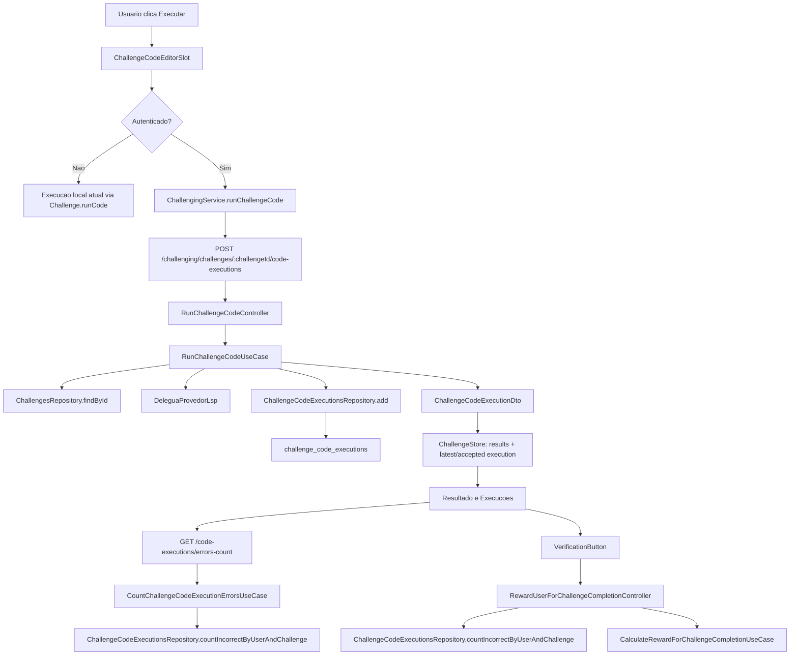

# 1. Objetivo

Implementar a aba `Execucoes` na pagina de desafio para usuarios autenticados, registrando cada tentativa de execucao de codigo como historico imutavel no server, exibindo status, data/hora, resumo de testes, codigo enviado e detalhes de erro quando houver. A entrega tambem ajusta o fluxo de `Executar` e `Verificar` para evitar execucoes concorrentes, ignorar respostas obsoletas, bloquear conclusao sem execucao aceita para o codigo atual e calcular acuracia/recompensa no server a partir das execucoes persistidas.

# 2. Escopo

## 2.1 In-scope

- Criar modelo de dominio para execucao de codigo em desafio.
- Criar tabela Supabase para persistir execucoes por `user_id` e `challenge_id`.
- Criar repository, mapper, types e rotas REST autenticadas para executar e listar execucoes.
- Executar codigo de usuarios autenticados no server com `@stardust/lsp` e registrar a tentativa.
- Manter o fluxo local atual de execucao para usuarios nao autenticados, sem historico persistido.
- Adicionar a aba `Execucoes` na navegacao do desafio para usuarios autenticados.
- Exibir historico paginado por desafio, ordenado do mais recente para o mais antigo.
- Exibir dialogs para codigo enviado e erro da tentativa.
- Adicionar loading e bloqueio no botao `Executar`.
- Bloquear `VerificationButton` no desafio quando nao houver execucao aceita valida, houver execucao pendente, testes falharem ou o codigo tiver sido alterado apos a execucao aceita.
- Remover `incorrectAnswersCount` e `maximumIncorrectAnswersCount` do payload confiado pela web nos fluxos de recompensa de desafio.
- Calcular acuracia da recompensa no server a partir das execucoes registradas, ignorando falhas internas de plataforma.

## 2.2 Out-of-scope

- Historico global fora da pagina de desafio.
- Historico persistido para usuarios anonimos.
- Comparacao visual entre duas tentativas.
- Exclusao manual de tentativas pelo estudante.
- Compartilhamento publico de tentativas.
- Ranking por performance ou tempo de execucao.
- Suporte a multiplas linguagens.
- Debugger visual ou execucao passo a passo.
- Refatoracao ampla do editor Monaco, do interpretador Delegua ou do pacote `@stardust/lsp`.

# 3. Requisitos

## 3.1 Funcionais

- Cada clique autenticado em `Executar` deve criar uma execucao persistida para o usuario e desafio atuais.
- Cada execucao deve conter codigo submetido, status, resultados por caso de teste, saidas do usuario, erro opcional e `createdAt`.
- A lista da aba `Execucoes` deve carregar execucoes do usuario autenticado para o desafio atual.
- A lista deve ser paginada com `page` e `itemsPerPage`; a UI deve usar `itemsPerPage = 20` por padrao.
- A ordenacao padrao deve ser `created_at desc`.
- Cada item deve exibir status, data/hora e resumo `X/Y testes passaram` quando houver resultados.
- Execucoes sem erro nao devem exibir acao de visualizar erro.
- O codigo de uma execucao deve abrir em dialog usando `CodeSnippet` em modo somente leitura.
- O dialog de codigo de uma execucao deve permitir substituir o codigo atual do editor pelo codigo usado naquela execucao.
- O erro de uma execucao deve abrir em dialog com mensagem e linha quando disponivel.
- O botao `Executar` deve mostrar loading e impedir execucoes concorrentes.
- Respostas de execucao que retornarem depois de alteracao do codigo devem atualizar historico, mas nao habilitar `Verificar` para o codigo atual.
- Alterar o codigo depois de uma tentativa aceita deve invalidar a execucao aceita no estado da UI.
- `Challenge` deve possuir a propriedade `isEvaluatedByFunction`, criada como `true` por padrao.
- Quando `challenge.isEvaluatedByFunction` for `true`, a comparacao dos casos de teste deve usar `LspResponse.result`.
- Quando `challenge.isEvaluatedByFunction` for `false`, a comparacao dos casos de teste deve usar o output aplicavel de `LspResponse.outputs`.
- Quando `isEvaluatedByFunction` for `false`, o desafio pode ser criado sem metadados de `function`, desde que `initialCode` e casos de teste sejam suficientes para execucao por inputs/output.
- Quando `challenge.isEvaluatedByFunction` for `true`, o console no editor de codigo do desafio nao deve ser exibido nem aberto pelo toolbar.
- `VerificationButton` deve aceitar estado bloqueado sem quebrar o uso atual em lessons.
- A conclusao de desafio comum e star challenge deve depender de uma execucao aceita registrada para o usuario e desafio.
- A recompensa deve usar contagem confiavel de execucoes incorretas atribuiveis ao usuario.
- A aba `Resultado` deve exibir um contador de erros do desafio; para usuarios autenticados, o valor deve vir do server usando a mesma regra de penalidade da recompensa, e para anonimos deve usar o contador local atual do desafio.

## 3.2 Não funcionais

- Seguranca
  - Rotas de execucao e listagem devem exigir autenticacao.
  - `userId`, `status`, `createdAt`, `testResults`, `outputs` e `error` nao entram nos schemas de entrada da web; sao definidos no server.
  - A listagem deve sempre filtrar por usuario autenticado e desafio atual.
- Compatibilidade
  - Usuarios anonimos devem continuar conseguindo executar codigo localmente como hoje, sem historico persistido.
  - Challenges existentes sem `isEvaluatedByFunction` devem ser tratados como `true` por default no core, nos mappers e na migration.
  - `VerificationButton` deve manter comportamento padrao em lessons quando `isBlocked` nao for informado.
- Performance
  - A aba deve buscar historico sob demanda e sempre paginar.
  - A tabela deve ter indice por `(user_id, challenge_id, created_at desc)`.
- Consistencia
  - `internal_error` nao deve penalizar acuracia.
  - A acuracia exibida na recompensa deve ser derivada dos mesmos registros mostrados na aba `Execucoes`.
  - O contador de erros exibido na aba `Resultado` deve usar a mesma regra de contagem de `countIncorrectByUserAndChallenge`, mas continuar sendo apenas informativo na web.

# 4. O que já existe?

## Core

- **`Challenge`** (`packages/core/src/challenging/domain/entities/Challenge.ts`) - entidade atual que executa codigo via `runCode`, preenche `results` e `userOutputs` em memoria e incrementa `incorrectAnswersCount`; hoje usa `initialCode.hasFunction` como criterio implicito para decidir entre `LspResponse.result` e `LspResponse.outputs`.
- **`ChallengeFactory`** (`packages/core/src/challenging/domain/factories/ChallengeFactory.ts`) - inicializa `results`, `userOutputs`, `incorrectAnswersCount` e deve passar a inicializar `isEvaluatedByFunction` como `true` quando ausente.
- **`TestCase`** (`packages/core/src/challenging/domain/structures/TestCase.ts`) - estrutura usada para inputs, output esperado, posicao e bloqueio do caso de teste.
- **`ChallengesRepository`** (`packages/core/src/challenging/interfaces/ChallengesRepository.ts`) - contrato atual de persistencia de desafios.
- **`ChallengingService`** (`packages/core/src/challenging/interfaces/ChallengingService.ts`) - contrato REST consumido pela web.
- **`CalculateRewardForChallengeCompletionUseCase`** (`packages/core/src/profile/use-cases/CalculateRewardForChallengeCompletionUseCase.ts`) - calcula moedas, XP e acuracia a partir de `incorrectAnswersCount` e `maximumIncorrectAnswersCount`.
- **`LspProvider`** (`packages/core/src/global/interfaces/provision/LspProvider.ts`) - contrato usado por `Code` para executar, traduzir e analisar codigo.
- **`Code`** (`packages/core/src/global/domain/structures/Code.ts`) - structure que encapsula codigo e provider LSP.

## Server / REST

- **`ChallengesRouter`** (`apps/server/src/app/hono/routers/challenging/ChallengesRouter.ts`) - router do recurso `challenges`, com rotas autenticadas e validacao Zod.
- **`UsersRouter`** (`apps/server/src/app/hono/routers/profile/UsersRouter.ts`) - expõe rotas de recompensa de desafio comum e star challenge.
- **`RewardUserForChallengeCompletionController`** (`apps/server/src/rest/controllers/profile/users/RewardUserForChallengeCompletionController.ts`) - recompensa desafio comum confiando hoje em `incorrectAnswersCount` vindo do body.
- **`RewardUserForStarChallengeCompletionController`** (`apps/server/src/rest/controllers/profile/users/RewardUserForStarChallengeCompletionController.ts`) - recompensa star challenge confiando hoje em `incorrectAnswersCount` vindo do body.
- **`AppendChallengeRewardToBodyController`** (`apps/server/src/rest/controllers/challenging/challenges/AppendChallengeRewardToBody.ts`) - injeta XP/moedas do desafio no body estendido da rota de recompensa.

## Server / Database

- **`SupabaseChallengesRepository`** (`apps/server/src/database/supabase/repositories/challenging/SupabaseChallengesRepository.ts`) - repository de desafios com padrao de query, range e mapper.
- **`SupabaseChallengeMapper`** (`apps/server/src/database/supabase/mappers/challenging/SupabaseChallengeMapper.ts`) - mapper de `challenges_view` para `Challenge`.
- **`Database`** (`apps/server/src/database/supabase/types/Database.ts`) - types gerados do Supabase.
- **Migrations canonicas** (`apps/server/supabase/migrations`) - pasta correta para novas migrations SQL.

## Web / UI

- **`ChallengeCodeEditorSlot`** (`apps/web/src/ui/challenging/widgets/slots/ChallengeCodeEditor/index.tsx`) - entry point do editor de codigo.
- **`useChallengeCodeEditorSlot`** (`apps/web/src/ui/challenging/widgets/slots/ChallengeCodeEditor/useChallengeCodeEditorSlot.ts`) - executa codigo localmente via `challenge.runCode(...)`, atualiza resultados e navega para `Resultado`.
- **`ChallengeCodeEditorSlotView`** (`apps/web/src/ui/challenging/widgets/slots/ChallengeCodeEditor/ChallengeCodeEditorSlotView.tsx`) - integra `CodeEditorToolbar`, `CodeEditor` e `Console`.
- **`ChallengeResultSlot`** (`apps/web/src/ui/challenging/widgets/slots/ChallengeResult/index.tsx`) - entry point da aba de resultado.
- **`useChallengeResultSlot`** (`apps/web/src/ui/challenging/widgets/slots/ChallengeResult/useChallengeResultSlot.ts`) - verifica resposta e grava payload de recompensa em cookie.
- **`ChallengeResultSlotView`** (`apps/web/src/ui/challenging/widgets/slots/ChallengeResult/ChallengeResultSlotView.tsx`) - renderiza resultados e `VerificationButton`.
- **`ChallengeTabsView`** (`apps/web/src/ui/challenging/widgets/layouts/Challenge/ChallengeTabs/ChallengeTabsView.tsx`) - renderiza abas `Descricao`, `Resultado`, `Comentarios` e `Solucoes`.
- **`ChallengeSliderView`** (`apps/web/src/ui/challenging/widgets/layouts/Challenge/ChallengeSlider/ChallengeSliderView.tsx`) - composicao mobile com tabs/conteudo, codigo, resultado e assistente.
- **`ChallengeStore`** (`apps/web/src/ui/challenging/stores/ChallengeStore/index.ts`) - facade Zustand com `challenge`, `results`, `activeContent` e demais slices.
- **`CodeEditorToolbar`** (`apps/web/src/ui/global/widgets/components/CodeEditorToolbar/index.tsx`) - entry point da toolbar do editor.
- **`CodeEditorToolbarView`** (`apps/web/src/ui/global/widgets/components/CodeEditorToolbar/CodeEditorToolbarView.tsx`) - renderiza botao `Executar`.
- **`VerificationButton`** (`apps/web/src/ui/global/widgets/components/VerificationButton/index.tsx`) - botao compartilhado por lesson/challenge.
- **`CodeSnippet`** (`apps/web/src/ui/global/widgets/components/CodeSnippet/index.tsx`) - componente de codigo; por padrao `isRunnable = false`.
- **`Dialog`** (`apps/web/src/ui/global/widgets/components/Dialog/index.tsx`) - base visual para dialogs.
- **`ROUTES`** (`apps/web/src/constants/routes.ts`) - constantes de rotas da web.

## Web / REST e RPC

- **`ChallengingService`** (`apps/web/src/rest/services/ChallengingService.ts`) - adapter REST da web para o modulo challenging.
- **`challengingActions`** (`apps/web/src/rpc/next-safe-action/challengingActions.ts`) - actions server-side de acesso a pagina/slots.
- **`rewardingActions`** (`apps/web/src/rpc/next-safe-action/rewardingActions.ts`) - schemas atuais de recompensa ainda aceitam `incorrectAnswersCount` e `maximumIncorrectAnswersCount`.
- **`AccessChallengeRewardingPageAction`** (`apps/web/src/rpc/actions/rewarding/AccessChallengeRewardingPageAction.ts`) - le cookie de recompensa e chama `ProfileService`.

## Validation

- **`idSchema`** (`packages/validation/src/modules/global/schemas/idSchema.ts`) - UUID.
- **`integerSchema`** (`packages/validation/src/modules/global/schemas/integerSchema.ts`) - inteiro.
- **`pageSchema`** (`packages/validation/src/modules/global/schemas/pageSchema.ts`) - pagina.
- **`itemsPerPageSchema`** (`packages/validation/src/modules/global/schemas/itemsPerPageSchema.ts`) - limite de itens.
- **`stringSchema`** (`packages/validation/src/modules/global/schemas/stringSchema.ts`) - string base.
- **`challengeSchema`** (`packages/validation/src/modules/challenging/schemas/challengeSchema.ts`) - schema completo de desafio.

# 5. O que deve ser criado?

## Core (Structures)

- **Localização:** `packages/core/src/challenging/domain/structures/ChallengeCodeExecution.ts` (**novo arquivo**)
- **Referência de implementação:** seguir o mesmo padrão estrutural de `ChallengeCodeExecutionStatus`, com construtor privado, factory `create(...)`, propriedades `readonly` e serialização via `dto`.
- **Dependências:** `Text`, `Integer`, `List`, `Datetime`, `ChallengeCodeExecutionStatus`, `ChallengeCodeExecutionError`.
- **Request/Response:** criada por DTO e exporta DTO.
- **Métodos:**
  - `static create(dto: ChallengeCodeExecutionDto): ChallengeCodeExecution` - cria structure imutavel.
  - `get passedTestsCount(): Integer` - conta resultados corretos.
  - `get failedTestsCount(): Integer` - conta resultados incorretos.
  - `get isAccepted(): boolean` - delega para status.
  - `get isUserMistake(): boolean` - true para `wrong_answer`, `syntax_error` e `runtime_error`.
  - `get dto(): ChallengeCodeExecutionDto` - serializa para transporte.

## Core (Structures DTOs)

- **Localização:** `packages/core/src/challenging/domain/structures/dtos/ChallengeCodeExecutionDto.ts` (**novo arquivo**)
- **Props:**
  - `code: string`
  - `status: ChallengeCodeExecutionStatusValue`
  - `testResults: ChallengeCodeExecutionTestResultDto[]`
  - `outputs: string[]` - linhas brutas retornadas por `LspResponse.outputs`, preservadas em ordem para alimentar o console/historico da execucao.
  - `error: ChallengeCodeExecutionErrorDto | null`
  - `createdAt?: Date`

- **Localização:** `packages/core/src/challenging/domain/structures/dtos/ChallengeCodeExecutionTestResultDto.ts` (**novo arquivo**)
- **Props:**
  - `position: number`
  - `isCorrect: boolean`
  - `userOutput: unknown` - valor efetivamente comparado com `expectedOutput`; quando `challenge.isEvaluatedByFunction` for `true`, vem de `LspResponse.result`; quando for `false`, vem do output aplicavel de `LspResponse.outputs`.
  - `expectedOutput: unknown`

- **Localização:** `packages/core/src/challenging/domain/structures/dtos/ChallengeCodeExecutionErrorDto.ts` (**novo arquivo**)
- **Props:**
  - `message: string`
  - `line: number | null`
  - `isInternal: boolean`

## Core (Status e Erro)

- **Localização:** `packages/core/src/challenging/domain/structures/ChallengeCodeExecutionStatus.ts` (**novo arquivo**)
- **Referência de implementação:** seguir o mesmo padrão de `packages/core/src/lesson/domain/structures/TextBlockAudioStatus.ts`.
- **Dependências:** `ValidationError`, `StringValidation`.
- **Props:** `readonly value: ChallengeCodeExecutionStatusValue`.
- **Type local exportado no mesmo arquivo:**
  - `export type ChallengeCodeExecutionStatusValue = 'accepted' | 'wrong_answer' | 'syntax_error' | 'runtime_error' | 'internal_error'`
- **Métodos:**
  - `static create(value?: string): ChallengeCodeExecutionStatus` - retorna `createAsInternalError()` quando `value` estiver ausente; quando houver valor, valida com `isChallengeCodeExecutionStatusValue(...)` e lança `ValidationError` se inválido.
  - `static createAsAccepted(): ChallengeCodeExecutionStatus`
  - `static createAsWrongAnswer(): ChallengeCodeExecutionStatus`
  - `static createAsSyntaxError(): ChallengeCodeExecutionStatus`
  - `static createAsRuntimeError(): ChallengeCodeExecutionStatus`
  - `static createAsInternalError(): ChallengeCodeExecutionStatus`
  - `get isAccepted(): boolean`
  - `get isWrongAnswer(): boolean`
  - `get isSyntaxError(): boolean`
  - `get isRuntimeError(): boolean`
  - `get isInternalError(): boolean`
  - `get isUserMistake(): boolean`
  - `private static isChallengeCodeExecutionStatusValue(value: string): value is ChallengeCodeExecutionStatusValue` - valida com `StringValidation(value, 'Challenge code execution status value').oneOf([...]).validate()` e retorna `true`.

- **Localização:** `packages/core/src/challenging/domain/structures/ChallengeCodeExecutionError.ts` (**novo arquivo**)
- **Props:** `message: Text`, `line: Integer | null`, `isInternal: Logical`.
- **Métodos:**
  - `static create(dto: ChallengeCodeExecutionErrorDto): ChallengeCodeExecutionError`
  - `get dto(): ChallengeCodeExecutionErrorDto`

## Core (Types)

- **Localização:** `packages/core/src/challenging/domain/types/ChallengeCodeExecutionsListParams.ts` (**novo arquivo**)
- **Props:**
  - `userId: Id`
  - `challengeId: Id`
  - `page: OrdinalNumber`
  - `itemsPerPage: OrdinalNumber`

## Core (Interfaces)

- **Localização:** `packages/core/src/challenging/interfaces/ChallengeCodeExecutionsRepository.ts` (**novo arquivo**)
- **Métodos:**
  - `add(userId: Id, challengeId: Id, execution: ChallengeCodeExecution): Promise<void>` - persiste uma tentativa usando os IDs como contexto de ownership, sem adiciona-los a structure.
  - `findManyByUserAndChallenge(params: ChallengeCodeExecutionsListParams): Promise<ManyItems<ChallengeCodeExecution>>` - lista historico paginado.
  - `findLatestByUserAndChallenge(userId: Id, challengeId: Id): Promise<ChallengeCodeExecution | null>` - retorna ultima execucao.
  - `countIncorrectByUserAndChallenge(userId: Id, challengeId: Id): Promise<Integer>` - conta penalidades de execucoes atribuiveis ao usuario.

## Core (Use Cases)

- **Localização:** `packages/core/src/challenging/use-cases/RunChallengeCodeUseCase.ts` (**novo arquivo**)
- **Dependências:** `ChallengesRepository`, `ChallengeCodeExecutionsRepository`, `LspProvider`.
- **Request/Response:**
  - Request: `{ userId: string; challengeId: string; code: string }`
  - Response: `Promise<ChallengeCodeExecutionDto>`
- **Métodos:**
  - `execute(request): Promise<ChallengeCodeExecutionDto>` - busca desafio, executa codigo, classifica status, persiste execucao e retorna DTO.
- **Regras internas:**
  - Executar `lspProvider.performSyntaxAnalysis(code)` antes de rodar casos de teste; falha nessa etapa gera `syntax_error`.
  - `LspError` durante execucao gera `runtime_error`.
  - `InsufficientInputsError` gera `runtime_error` atribuivel ao usuario.
  - Erros inesperados geram `internal_error` e nao penalizam acuracia.
  - Todos os testes corretos geram `accepted`; qualquer teste falso gera `wrong_answer`.
  - Preservar `LspResponse.outputs` em `ChallengeCodeExecutionDto.outputs` como log de console bruto da tentativa, mantendo ordem e repeticoes.
  - Preencher `testResults[].userOutput` com o valor usado na comparacao do teste, nao com o array bruto de `LspResponse.outputs`.
  - Manter `initialCode.hasFunction` apenas como criterio de preparacao da execucao: quando houver funcao, adicionar chamada de funcao com inputs do test case; quando nao houver, injetar inputs diretamente.
  - Usar `challenge.isEvaluatedByFunction` como criterio de avaliacao: quando `true`, usar `LspResponse.result` como `testResults[].userOutput`; quando `false`, derivar `testResults[].userOutput` do output aplicavel de `LspResponse.outputs`.
  - Mesmo quando `isEvaluatedByFunction` for `true`, acumular os itens de `LspResponse.outputs` em `outputs` para auditoria/historico, mas nao usa-los para comparar casos de teste.

- **Localização:** `packages/core/src/challenging/use-cases/ListChallengeCodeExecutionsUseCase.ts` (**novo arquivo**)
- **Dependências:** `ChallengeCodeExecutionsRepository`.
- **Request/Response:**
  - Request: `{ userId: string; challengeId: string; page: number; itemsPerPage: number }`
  - Response: `Promise<PaginationResponse<ChallengeCodeExecutionDto>>`
- **Métodos:**
  - `execute(request): Promise<PaginationResponse<ChallengeCodeExecutionDto>>` - lista historico paginado.

- **Localização:** `packages/core/src/challenging/use-cases/GetLatestChallengeCodeExecutionUseCase.ts` (**novo arquivo**)
- **Dependências:** `ChallengeCodeExecutionsRepository`.
- **Request/Response:**
  - Request: `{ userId: string; challengeId: string }`
  - Response: `Promise<ChallengeCodeExecutionDto | null>`
- **Métodos:**
  - `execute(request): Promise<ChallengeCodeExecutionDto | null>` - retorna ultima execucao para validacao de recompensa.

- **Localização:** `packages/core/src/challenging/use-cases/CountChallengeCodeExecutionErrorsUseCase.ts` (**novo arquivo**)
- **Dependências:** `ChallengeCodeExecutionsRepository`.
- **Request/Response:**
  - Request: `{ userId: string; challengeId: string }`
  - Response: `Promise<number>`
- **Métodos:**
  - `execute(request): Promise<number>` - retorna a quantidade de erros penalizaveis para o usuario e desafio, usando `countIncorrectByUserAndChallenge`.
- **Uso:** alimentar o contador informativo da aba `Resultado`; nao deve ser enviado pela web para calcular recompensa.

## Database (Migrations)

- **Localização:** `apps/server/supabase/migrations/<timestamp>_add_challenge_is_evaluated_by_function.sql` (**novo arquivo**)
- **Objetivo:** permitir que cada desafio declare se seus casos de teste devem ser comparados pelo retorno da funcao ou pelo output do console.
- **Escopo SQL:**
  - Adicionar coluna `is_evaluated_by_function boolean not null default true` na tabela `public.challenges`.
  - Atualizar `challenges_view` para expor `is_evaluated_by_function`.
  - Garantir que desafios existentes recebam `true` automaticamente pelo default.

- **Localização:** `apps/server/supabase/migrations/<timestamp>_create_challenge_code_executions.sql` (**novo arquivo**)
- **Objetivo:** criar historico persistido de execucoes de codigo por usuario e desafio.
- **Escopo SQL:**
  - Criar tabela `public.challenge_code_executions`.
  - Colunas: `id uuid primary key default gen_random_uuid()`, `user_id uuid not null`, `challenge_id uuid not null`, `code text not null`, `status text not null`, `test_results jsonb not null default '[]'::jsonb`, `outputs jsonb not null default '[]'::jsonb`, `error jsonb`, `created_at timestamptz not null default now()`.
  - O `id` deve ser gerado automaticamente pelo Supabase/Postgres via `default gen_random_uuid()`; nenhum DTO, mapper ou repository deve enviar `id` no insert.
  - `id`, `user_id` e `challenge_id` sao colunas de persistencia/ownership e nao devem compor `ChallengeCodeExecution` nem `ChallengeCodeExecutionDto`.
  - A coluna `outputs` deve persistir o array bruto de `LspResponse.outputs`, nao os valores normalizados de `testResults[].userOutput`.
  - Criar check constraint para `status in ('accepted', 'wrong_answer', 'syntax_error', 'runtime_error', 'internal_error')`.
  - Criar FKs para `users(id)` e `challenges(id)` com `on delete cascade`.
  - Criar indice `challenge_code_executions_user_challenge_created_at_idx` em `(user_id, challenge_id, created_at desc)`.
  - Criar indice `challenge_code_executions_user_challenge_status_idx` em `(user_id, challenge_id, status)`.
- **Segurança:** habilitar RLS; policy de `select` e `insert` para `authenticated` somente quando `auth.uid() = user_id`; `service_role` com grants completos. Se o server estiver usando chave service role, a policy continua documentando ownership para acessos diretos.
- **Reflexos em código:** atualizar `apps/server/src/database/supabase/types/Database.ts`, criar type `SupabaseChallengeCodeExecution`, mapper e repository.

## Database (Types)

- **Localização:** `apps/server/src/database/supabase/types/SupabaseChallengeCodeExecution.ts` (**novo arquivo**)
- **Props:** alias tipado para `Database['public']['Tables']['challenge_code_executions']['Row']`.

## Database (Mappers)

- **Localização:** `apps/server/src/database/supabase/mappers/challenging/SupabaseChallengeCodeExecutionMapper.ts` (**novo arquivo**)
- **Métodos:**
  - `toStructure(row: SupabaseChallengeCodeExecution): ChallengeCodeExecution` - converte row em structure ignorando `id`, `user_id` e `challenge_id`.
  - `toSupabase(userId: Id, challengeId: Id, execution: ChallengeCodeExecution): Database['public']['Tables']['challenge_code_executions']['Insert']` - converte structure para insert, injeta somente `user_id` e `challenge_id` no adapter de persistencia e omite `id` para que o banco gere automaticamente.

## Database (Repositories)

- **Localização:** `apps/server/src/database/supabase/repositories/challenging/SupabaseChallengeCodeExecutionsRepository.ts` (**novo arquivo**)
- **Dependências:** `SupabaseRepository`, `SupabaseChallengeCodeExecutionMapper`.
- **Métodos:**
  - `add(userId: Id, challengeId: Id, execution: ChallengeCodeExecution): Promise<void>` - insere execucao vinculada ao usuario e desafio sem colocar IDs na structure.
  - `findManyByUserAndChallenge(params: ChallengeCodeExecutionsListParams): Promise<ManyItems<ChallengeCodeExecution>>` - filtra por usuario/desafio, ordena desc e pagina.
  - `findLatestByUserAndChallenge(userId: Id, challengeId: Id): Promise<ChallengeCodeExecution | null>` - busca ultima tentativa.
  - `countIncorrectByUserAndChallenge(userId: Id, challengeId: Id): Promise<Integer>` - soma penalidades de `wrong_answer`, `syntax_error` e `runtime_error`; `wrong_answer` deve somar quantidade de testes falhos da tentativa e erros de codigo devem somar `1`.

## Provision (Providers)

- **Localização:** nenhum arquivo novo.
- **Dependências:** adicionar `@stardust/lsp` em `apps/server/package.json`.
- **Biblioteca:** `@stardust/lsp`.
- **Métodos:** o server deve instanciar `new DeleguaProvedorLsp()` na composition root da rota/controller e injetar como `LspProvider` no `RunChallengeCodeUseCase`.

## Validation (Schemas)

- **Localização:** `packages/validation/src/modules/challenging/schemas/challengeCodeExecutionSchema.ts` (**novo arquivo**)
- **Atributos:** `code: stringSchema`.

- **Localização:** `packages/validation/src/modules/challenging/schemas/challengeCodeExecutionsListQuerySchema.ts` (**novo arquivo**)
- **Atributos:** `page: pageSchema`, `itemsPerPage: itemsPerPageSchema`.

## REST (Controllers)

- **Localização:** `apps/server/src/rest/controllers/challenging/challenges/RunChallengeCodeController.ts` (**novo arquivo**)
- **Dependências:** `ChallengesRepository`, `ChallengeCodeExecutionsRepository`, `LspProvider`.
- **Request/Response:** `routeParams.challengeId`, `body.code`, account autenticado; retorna `ChallengeCodeExecutionDto`.
- **Métodos:**
  - `handle(http: Http<Schema>): Promise<RestResponse>` - monta `userId` via `http.getAccountId()`, chama use case e retorna `http.statusCreated().send(dto)`.

- **Localização:** `apps/server/src/rest/controllers/challenging/challenges/ListChallengeCodeExecutionsController.ts` (**novo arquivo**)
- **Dependências:** `ChallengeCodeExecutionsRepository`.
- **Request/Response:** `routeParams.challengeId`, `query page/itemsPerPage`, account autenticado; retorna paginado.
- **Métodos:**
  - `handle(http: Http<Schema>): Promise<RestResponse>` - chama use case e usa `http.sendPagination(response)`.

- **Localização:** `apps/server/src/rest/controllers/challenging/challenges/CountChallengeCodeExecutionErrorsController.ts` (**novo arquivo**)
- **Dependências:** `ChallengeCodeExecutionsRepository`.
- **Request/Response:** `routeParams.challengeId`, account autenticado; retorna `{ errorsCount: number }`.
- **Métodos:**
  - `handle(http: Http<Schema>): Promise<RestResponse>` - monta `userId` via `http.getAccountId()`, chama use case e retorna o contador.

## Hono App (Routes)

- **Localização:** `apps/server/src/app/hono/routers/challenging/ChallengesRouter.ts`
- **Middlewares:** `AuthMiddleware.verifyAuthentication`, `ValidationMiddleware.validate`.
- **Caminho da rota:**
  - `POST /challenging/challenges/:challengeId/code-executions`
  - `GET /challenging/challenges/:challengeId/code-executions`
  - `GET /challenging/challenges/:challengeId/code-executions/errors-count`
- **Dados de schema:**
  - Param: `{ challengeId: idSchema }`
  - POST body: `challengeCodeExecutionSchema`
  - GET query: `challengeCodeExecutionsListQuerySchema`

## UI (Widgets)

- **Localização:** `apps/web/src/ui/challenging/widgets/slots/ChallengeCodeExecutions/index.tsx` (**novo arquivo**)
- **Props:** nenhuma; usa `challenge` do `ChallengeStore`.
- **Estados:** Blocked, Loading, Error, Empty, Content.
- **View:** `apps/web/src/ui/challenging/widgets/slots/ChallengeCodeExecutions/ChallengeCodeExecutionsSlotView.tsx` (**novo arquivo**)
- **Hook:** `apps/web/src/ui/challenging/widgets/slots/ChallengeCodeExecutions/useChallengeCodeExecutionsSlot.ts` (**novo arquivo**)
- **Index:** resolve `challengingService` via `useRestContext`, autenticacao via `useAuthContext` e `challengeId` via store.
- **Widgets internos:**
  - `ChallengeCodeExecutionItem`
  - `ChallengeCodeExecutionCodeDialog`
  - `ChallengeCodeExecutionErrorDialog`
- **Estrutura de pastas:**

```text
apps/web/src/ui/challenging/widgets/slots/ChallengeCodeExecutions/
  index.tsx
  useChallengeCodeExecutionsSlot.ts
  ChallengeCodeExecutionsSlotView.tsx
  ChallengeCodeExecutionItem/
    index.tsx
    ChallengeCodeExecutionItemView.tsx
  ChallengeCodeExecutionCodeDialog/
    index.tsx
    ChallengeCodeExecutionCodeDialogView.tsx
  ChallengeCodeExecutionErrorDialog/
    index.tsx
    ChallengeCodeExecutionErrorDialogView.tsx
```

- **Métodos do hook:**
  - `fetchExecutions(): Promise<void>` - busca pagina atual.
  - `handleNextPage(): void` - avanca pagina.
  - `handlePreviousPage(): void` - volta pagina.
  - `handleOpenCodeDialog(execution: ChallengeCodeExecutionDto): void` - seleciona execucao.
  - `handleUseExecutionCode(execution: ChallengeCodeExecutionDto): void` - substitui o codigo atual do editor pelo codigo da execucao selecionada, fecha o dialog e sincroniza estado de resultado/verificacao.
  - `handleOpenErrorDialog(execution: ChallengeCodeExecutionDto): void` - seleciona erro.

- **Localização:** `apps/web/src/ui/challenging/widgets/slots/ChallengeCodeExecutions/ChallengeCodeExecutionCodeDialog/index.tsx` (**novo arquivo**)
- **Props:** `execution: ChallengeCodeExecutionDto | null`, `isOpen`, `onClose`, `onUseCode`.
- **Estados:** Content.
- **View:** `ChallengeCodeExecutionCodeDialogView.tsx`
- **Responsabilidade:** renderizar `CodeSnippet code={execution.code} isRunnable={false}` dentro de `Dialog` e exibir acao para usar esse codigo no editor atual.

- **Localização:** `apps/web/src/ui/challenging/widgets/slots/ChallengeCodeExecutions/ChallengeCodeExecutionErrorDialog/index.tsx` (**novo arquivo**)
- **Props:** `execution: ChallengeCodeExecutionDto | null`, `isOpen`, `onClose`.
- **Estados:** Content.
- **View:** `ChallengeCodeExecutionErrorDialogView.tsx`
- **Responsabilidade:** renderizar mensagem e linha quando disponivel em `Dialog`.

## UI (Stores)

- **Localização:** `apps/web/src/ui/challenging/stores/ChallengeStore/types/ChallengeStoreState.ts`
- **Props novas:**
  - `isCodeRunning: boolean`
  - `latestCodeExecution: ChallengeCodeExecutionDto | null`
  - `acceptedCodeExecution: ChallengeCodeExecutionDto | null`
  - `codeExecutionErrorsCount: number`
  - `currentCode: string`
  - `pendingExecutionCode: string | null`

- **Localização:** `apps/web/src/ui/challenging/stores/ChallengeStore/types/ChallengeStoreActions.ts`
- **Actions novas:**
  - `setCurrentCode(code: string): void`
  - `setCodeExecutionErrorsCount(count: number): void`
  - `replaceCurrentCodeWithExecution(execution: ChallengeCodeExecutionDto): void`
  - `startCodeExecution(code: string): void`
  - `finishCodeExecution(execution: ChallengeCodeExecutionDto, currentCode: string): void`
  - `failCodeExecution(): void`
  - `invalidateAcceptedCodeExecution(): void`
- **Regra de `replaceCurrentCodeWithExecution`:**
  - Atualiza `currentCode` para `execution.code`.
  - Atualiza `latestCodeExecution` para a execucao selecionada.
  - Atualiza `results` e `userOutputs` a partir de `execution.testResults`.
  - Define `acceptedCodeExecution = execution` somente quando `execution.status === 'accepted'`; caso contrario, invalida a execucao aceita.
  - Nao cria nova execucao e nao altera `codeExecutionErrorsCount`.

## REST (Services)

- **Localização:** `apps/web/src/rest/services/ChallengingService.ts`
- **Dependências:** `RestClient`.
- **Métodos:**
  - `runChallengeCode(challengeId: Id, code: Text): Promise<RestResponse<ChallengeCodeExecutionDto>>` - POST autenticado em `/challenging/challenges/:challengeId/code-executions`.
  - `fetchChallengeCodeExecutions(params: { challengeId: Id; page: OrdinalNumber; itemsPerPage: OrdinalNumber }): Promise<RestResponse<PaginationResponse<ChallengeCodeExecutionDto>>>` - GET paginado.
  - `fetchChallengeCodeExecutionErrorsCount(challengeId: Id): Promise<RestResponse<{ errorsCount: number }>>` - GET autenticado em `/challenging/challenges/:challengeId/code-executions/errors-count`.

# 6. O que deve ser modificado?

- **Arquivo:** `packages/core/src/challenging/domain/entities/dtos/ChallengeDto.ts`
- **Mudança:** adicionar `isEvaluatedByFunction?: boolean`.
- **Justificativa:** transportar o criterio de avaliacao do desafio entre server, web, studio e core, preservando default retrocompativel.

- **Arquivo:** `packages/core/src/challenging/domain/entities/Challenge.ts`
- **Mudança:** adicionar prop/getter `isEvaluatedByFunction: Logical`, serializar no `dto` e alterar `runCode(...)` para escolher a origem da comparacao por essa prop, nao por `initialCode.hasFunction`.
- **Justificativa:** `hasFunction` indica forma de preparar a execucao; `isEvaluatedByFunction` indica se o teste compara `LspResponse.result` ou `LspResponse.outputs`.

- **Arquivo:** `packages/core/src/challenging/domain/factories/ChallengeFactory.ts`
- **Mudança:** inicializar `isEvaluatedByFunction` com `Logical.create(dto.isEvaluatedByFunction ?? true, 'O desafio é avaliado pelo retorno da função?')`.
- **Justificativa:** desafios antigos e novas criações sem campo explicito devem continuar avaliados por retorno de funcao.

- **Arquivo:** `packages/core/src/challenging/domain/entities/fakers/ChallengesFaker.ts`
- **Mudança:** incluir `isEvaluatedByFunction` no DTO falso, com default `true`.
- **Justificativa:** testes existentes devem preservar o comportamento atual e novos testes podem cobrir avaliacao por output.

- **Arquivo:** `packages/core/src/challenging/domain/entities/tests/Challenge.test.ts`
- **Mudança:** cobrir dois fluxos: `isEvaluatedByFunction = true` compara `LspResponse.result`; `isEvaluatedByFunction = false` compara output aplicavel de `LspResponse.outputs`, inclusive quando o codigo inicial possuir funcao.
- **Justificativa:** garantir que a nova regra nao volte a depender implicitamente de `hasFunction`.

- **Arquivo:** `packages/core/src/challenging/domain/structures/dtos/index.ts`
- **Mudança:** exportar `ChallengeCodeExecutionDto`, `ChallengeCodeExecutionTestResultDto` e `ChallengeCodeExecutionErrorDto`.
- **Justificativa:** disponibilizar DTOs das structures para adapters, use cases e responses.

- **Arquivo:** `packages/core/src/challenging/domain/structures/index.ts`
- **Mudança:** exportar `ChallengeCodeExecution`, `ChallengeCodeExecutionStatus`, `ChallengeCodeExecutionStatusValue` e `ChallengeCodeExecutionError`.
- **Justificativa:** disponibilizar structures do novo dominio.

- **Arquivo:** `packages/core/src/challenging/domain/types/index.ts`
- **Mudança:** exportar `ChallengeCodeExecutionsListParams`.
- **Justificativa:** disponibilizar parametros de listagem; `ChallengeCodeExecutionStatusValue` deve ser exportado pelo barrel de structures por ficar co-localizado em `ChallengeCodeExecutionStatus.ts`.

- **Arquivo:** `packages/core/src/challenging/interfaces/index.ts`
- **Mudança:** exportar `ChallengeCodeExecutionsRepository`.
- **Justificativa:** permitir implementacao concreta no server.

- **Arquivo:** `packages/core/src/challenging/interfaces/ChallengingService.ts`
- **Mudança:** adicionar `runChallengeCode(...)`, `fetchChallengeCodeExecutions(...)` e `fetchChallengeCodeExecutionErrorsCount(...)`.
- **Justificativa:** a web consome execucao/listagem pela borda REST existente.

- **Arquivo:** `packages/core/src/challenging/use-cases/index.ts`
- **Mudança:** exportar novos use cases de execucao, listagem, ultima execucao e contagem de erros.
- **Justificativa:** composition roots do server importam use cases pelo barrel.

- **Arquivo:** `packages/core/src/profile/domain/types/ChallengeRewardingPayload.ts`
- **Mudança:** remover `incorrectAnswersCount` e `maximumIncorrectAnswersCount`; manter `secondsCount` e `challengeId`.
- **Justificativa:** esses campos deixam de ser fonte confiavel vinda do browser.

- **Arquivo:** `packages/core/src/profile/domain/types/StarChallengeRewardingPayload.ts`
- **Mudança:** remover `incorrectAnswersCount` e `maximumIncorrectAnswersCount`; manter `secondsCount`, `challengeId`, `starId` e `nextStarId` quando aplicavel.
- **Justificativa:** mesma regra de confiabilidade para star challenge.

- **Arquivo:** `apps/server/package.json`
- **Mudança:** adicionar dependencia workspace `@stardust/lsp`.
- **Justificativa:** o server passa a executar codigo com o mesmo provider usado na web, injetado como `LspProvider`.

- **Arquivo:** `apps/server/src/database/supabase/types/Database.ts`
- **Mudança:** regenerar types para incluir `challenge_code_executions` e `challenges.is_evaluated_by_function`.
- **Justificativa:** manter camada database tipada e expor o novo criterio de avaliacao.

- **Arquivo:** `apps/server/src/database/supabase/mappers/challenging/SupabaseChallengeMapper.ts`
- **Mudança:** mapear `is_evaluated_by_function` para `ChallengeDto.isEvaluatedByFunction` em `toDto(...)` e enviar `is_evaluated_by_function` em `toSupabase(...)`.
- **Justificativa:** manter consistencia entre persistencia, entidade `Challenge` e UI.

- **Arquivo:** `apps/server/src/database/supabase/repositories/challenging/SupabaseChallengesRepository.ts`
- **Mudança:** incluir `is_evaluated_by_function` nos payloads diretos de insert/update de desafio quando o repository nao passar pelo mapper.
- **Justificativa:** evitar que criacao/edicao de desafio perca o criterio de avaliacao.

- **Arquivo:** `apps/server/src/database/supabase/types/index.ts`
- **Mudança:** exportar `SupabaseChallengeCodeExecution`.
- **Justificativa:** disponibilizar type para mapper/repository.

- **Arquivo:** `apps/server/src/database/supabase/mappers/challenging/index.ts`
- **Mudança:** exportar `SupabaseChallengeCodeExecutionMapper`.
- **Justificativa:** padrao de barrel da camada database.

- **Arquivo:** `apps/server/src/database/supabase/repositories/challenging/index.ts`
- **Mudança:** exportar `SupabaseChallengeCodeExecutionsRepository`.
- **Justificativa:** permitir composicao nos routers/controllers.

- **Arquivo:** `apps/server/src/rest/controllers/challenging/challenges/index.ts`
- **Mudança:** exportar controllers de execucao, listagem e contagem de erros.
- **Justificativa:** padrao do modulo challenging.

- **Arquivo:** `apps/server/src/app/hono/routers/challenging/ChallengesRouter.ts`
- **Mudança:** registrar rotas `POST`, `GET` e `GET /errors-count` de `code-executions` antes de rotas parametrizadas conflitantes.
- **Justificativa:** expor API autenticada de execucoes.

- **Arquivo:** `apps/server/src/rest/controllers/profile/users/RewardUserForChallengeCompletionController.ts`
- **Mudança:** receber `ChallengesRepository` e `ChallengeCodeExecutionsRepository`; validar ultima execucao aceita; calcular `maximumIncorrectAnswersCount` pelo desafio; calcular `incorrectAnswersCount` pelo repository; chamar `CalculateRewardForChallengeCompletionUseCase`.
- **Justificativa:** recompensa passa a usar fonte confiavel no server sem acoplar `profile` ao modulo `challenging` dentro do core.

- **Arquivo:** `apps/server/src/rest/controllers/profile/users/RewardUserForStarChallengeCompletionController.ts`
- **Mudança:** mesma alteracao do controller de desafio comum.
- **Justificativa:** manter acuracia coerente para star challenges.

- **Arquivo:** `apps/server/src/app/hono/routers/profile/UsersRouter.ts`
- **Mudança:** remover `incorrectAnswersCount` e `maximumIncorrectAnswersCount` dos schemas de recompensa de challenge/star challenge; instanciar repositories de desafio e execucao para os controllers.
- **Justificativa:** campos controlados pelo servidor nao devem ser validados como input da web.

- **Arquivo:** `apps/server/src/ai/challenging/tools/PostChallengeTool.ts`
- **Mudança:** aceitar `isEvaluatedByFunction?: boolean` e enviar `true` por default ao criar `ChallengeDto`.
- **Justificativa:** desafios criados por IA devem seguir o mesmo contrato de avaliacao.

- **Arquivo:** `apps/server/src/ai/challenging/tools/UpdateChallengeTool.ts`
- **Mudança:** aceitar `isEvaluatedByFunction?: boolean` e preservar o valor atual quando ausente.
- **Justificativa:** edicoes por IA nao devem resetar o criterio de avaliacao.

- **Arquivo:** `apps/server/src/ai/challenging/constants/agents-instructions.ts`
- **Mudança:** documentar `isEvaluatedByFunction` como campo opcional default `true`; usar `false` quando a resposta esperada deve ser comparada pela saida impressa no console; permitir `initialCode` sem assinatura de funcao nesse modo.
- **Justificativa:** agentes que criam desafios precisam escolher corretamente entre avaliacao por retorno e por output.

- **Arquivo:** `packages/validation/src/modules/challenging/schemas/index.ts`
- **Mudança:** exportar schemas de execucao.
- **Justificativa:** disponibilizar validacao para o server.

- **Arquivo:** `packages/validation/src/modules/challenging/schemas/challengeSchema.ts`
- **Mudança:** adicionar `isEvaluatedByFunction: z.boolean().optional().default(true)`.
- **Justificativa:** criacao/edicao de desafios deve aceitar o novo criterio sem quebrar payloads antigos.

- **Arquivo:** `packages/validation/src/modules/challenging/schemas/challengeFormSchema.ts`
- **Mudança:** manter `isEvaluatedByFunction` herdado de `challengeSchema`, garantir default `true` no output do form e tornar `function` obrigatoria apenas quando `isEvaluatedByFunction` for `true`.
- **Justificativa:** o editor de desafios deve conseguir configurar avaliacao por funcao ou por output sem exigir assinatura de funcao para desafios avaliados por console.

- **Arquivo:** `packages/validation/src/modules/challenging/schemas/challengeDraftSchema.ts`
- **Mudança:** adicionar `isEvaluatedByFunction: z.boolean().optional().default(true)`.
- **Justificativa:** rascunhos/importacoes de desafio devem preservar o novo criterio.

- **Arquivo:** `apps/web/src/constants/routes.ts`
- **Mudança:** adicionar `challengeExecutions(challengeSlug: string)`.
- **Justificativa:** rota nomeada para a nova aba.

- **Arquivo:** `apps/web/src/app/challenging/challenges/[challengeSlug]/challenge/@tabContent/executions/page.tsx` (**novo arquivo**)
- **Mudança:** renderizar `ChallengeCodeExecutionsSlot`.
- **Justificativa:** adicionar slot paralelo da aba `Execucoes`.

- **Arquivo:** `apps/web/src/app/challenging/challenges/[challengeSlug]/challenge/@tabContent/executions/default.tsx` (**novo arquivo**)
- **Mudança:** renderizar `ChallengeCodeExecutionsSlot`.
- **Justificativa:** manter comportamento de parallel routes.

- **Arquivo:** `apps/web/src/ui/challenging/widgets/pages/Challenge/useChallengePage.ts`
- **Mudança:** incluir `isEvaluatedByFunction` ao hidratar `ChallengeDto` recebido da action/service.
- **Justificativa:** a pagina do desafio precisa criar `Challenge` com o criterio correto para execucao local e UI do editor.

- **Arquivo:** `apps/web/src/ui/challenging/widgets/pages/ChallengeEditor/useChallengeEditorPage.ts`
- **Mudança:** inicializar e submeter `isEvaluatedByFunction`, com default `true` quando ausente; montar payload sem `function` quando a avaliacao for por output.
- **Justificativa:** autores devem conseguir manter o default por funcao ou configurar desafio avaliado por output.

- **Arquivo:** `apps/web/src/ui/challenging/widgets/pages/ChallengeEditor/ChallengeEditorPageView.tsx`
- **Mudança:** adicionar controle booleano para `isEvaluatedByFunction` e condicionar a exibicao/configuracao de `ChallengeFunctionField`.
- **Justificativa:** o autor precisa escolher explicitamente se o desafio sera avaliado por retorno de funcao ou por output.

- **Arquivo:** `apps/web/src/ui/challenging/widgets/pages/ChallengeEditor/ChallengeFunctionField/index.tsx`
- **Mudança:** renderizar o campo apenas quando `isEvaluatedByFunction` for `true`, ou receber prop de desabilitacao/ocultacao equivalente.
- **Justificativa:** desafios avaliados por output nao devem exigir assinatura de funcao.

- **Arquivo:** `apps/web/src/ui/challenging/stores/ChallengeStore/types/ChallengeContent.ts`
- **Mudança:** adicionar union `'executions'`.
- **Justificativa:** store precisa reconhecer a nova aba.

- **Arquivo:** `apps/web/src/ui/challenging/stores/ChallengeStore/constants/initial-challenge-store-state.ts`
- **Mudança:** inicializar novos campos de execucao, incluindo `codeExecutionErrorsCount = 0`.
- **Justificativa:** manter reset previsivel.

- **Arquivo:** `apps/web/src/ui/challenging/stores/ChallengeStore/index.ts`
- **Mudança:** adicionar slice de execucao de codigo, expondo `codeExecutionErrorsCount` e action para substituir o codigo atual por uma execucao do historico.
- **Justificativa:** compartilhar estado entre editor, resultado e aba de execucoes.

- **Arquivo:** `apps/web/src/ui/challenging/stores/zustand/useZustandChallengeStore.ts`
- **Mudança:** implementar actions novas, incluindo `setCodeExecutionErrorsCount` e `replaceCurrentCodeWithExecution`.
- **Justificativa:** controlar loading, invalidacao, execucao aceita, contador informativo de erros e restauracao de codigo a partir do historico.

- **Arquivo:** `apps/web/src/ui/challenging/widgets/slots/ChallengeCodeEditor/useChallengeCodeEditorSlot.ts`
- **Mudança:** para autenticados, chamar `challengingService.runChallengeCode`; para anonimos, preservar execucao local atual respeitando `challenge.isEvaluatedByFunction`; capturar codigo submetido, bloquear concorrencia, ignorar resposta obsoleta para habilitacao do verify, atualizar `results/userOutputs` a partir do DTO e reagir a `currentCode` restaurado pelo historico atualizando editor/local storage.
- **Justificativa:** formalizar execucao persistida sem quebrar compatibilidade anonima nem a nova regra de avaliacao por output; restauracao do historico precisa refletir imediatamente no editor.

- **Arquivo:** `apps/web/src/ui/challenging/widgets/slots/ChallengeCodeEditor/index.tsx`
- **Mudança:** injetar service/contexto necessario, passar `isCodeRunning` para view e calcular `shouldShowConsole` como `challenge.isEvaluatedByFunction.isFalse`.
- **Justificativa:** composition root resolve dependencias e impede console em desafios avaliados por retorno de funcao.

- **Arquivo:** `apps/web/src/ui/challenging/widgets/slots/ChallengeCodeEditor/ChallengeCodeEditorSlotView.tsx`
- **Mudança:** passar loading e permissao de console para `CodeEditorToolbar`; renderizar `Console` somente quando `shouldShowConsole` for `true`.
- **Justificativa:** feedback visual durante execucao e respeito a regra de ocultar console em desafios avaliados por funcao.

- **Arquivo:** `apps/web/src/ui/challenging/widgets/slots/ChallengeCodeExecutions/useChallengeCodeExecutionsSlot.ts`
- **Mudança:** adicionar `handleUseExecutionCode(execution)` chamando `replaceCurrentCodeWithExecution(execution)`, fechando o modal e mantendo a lista no estado atual.
- **Justificativa:** a aba de execucoes deve conseguir reaproveitar uma tentativa anterior sem nova chamada ao server.

- **Arquivo:** `apps/web/src/ui/challenging/widgets/slots/ChallengeCodeExecutions/ChallengeCodeExecutionCodeDialog/index.tsx`
- **Mudança:** receber `onUseCode` e repassar para a View.
- **Justificativa:** entry point do dialog conecta a acao de UI ao hook/store.

- **Arquivo:** `apps/web/src/ui/challenging/widgets/slots/ChallengeCodeExecutions/ChallengeCodeExecutionCodeDialog/ChallengeCodeExecutionCodeDialogView.tsx`
- **Mudança:** adicionar botao/acao para substituir o codigo atual do editor pelo codigo exibido no modal.
- **Justificativa:** usuario deve conseguir recuperar uma tentativa antiga diretamente pelo historico.

- **Arquivo:** `apps/web/src/ui/global/widgets/components/CodeEditorToolbar/index.tsx`
- **Mudança:** aceitar `isRunCodeLoading?: boolean` e `canOpenConsole?: boolean`.
- **Justificativa:** toolbar precisa bloquear botao `Executar` e esconder/desabilitar abertura de console quando o desafio for avaliado por funcao.

- **Arquivo:** `apps/web/src/ui/global/widgets/components/CodeEditorToolbar/CodeEditorToolbarView.tsx`
- **Mudança:** desabilitar botao `Executar`, mostrar loading/texto de carregamento, impedir clique durante execucao e ocultar/desabilitar acao de console quando `canOpenConsole` for `false`.
- **Justificativa:** evitar execucoes duplicadas e impedir console em desafios avaliados por funcao.

- **Arquivo:** `apps/web/src/ui/challenging/widgets/slots/ChallengeResult/useChallengeResultSlot.ts`
- **Mudança:** calcular `isVerificationBlocked` a partir de `isCodeRunning`, `acceptedCodeExecution`, codigo atual e resultados; buscar `errorsCount` autenticado via `ChallengingService`; para anonimos, usar `challenge.incorrectAnswersCount.value`; gravar cookie de recompensa sem contadores de erro.
- **Justificativa:** bloqueio deve refletir execucao aceita valida; contador de erros deve ser exibido na aba `Resultado`, mas o payload nao deve conter campos controlados pelo server.

- **Arquivo:** `apps/web/src/ui/challenging/widgets/slots/ChallengeResult/ChallengeResultSlotView.tsx`
- **Mudança:** renderizar contador de erros da tentativa/desafio e passar `isBlocked` e motivo para `VerificationButton`.
- **Justificativa:** mostrar ao usuario o total de erros que impacta a acuracia, sem permitir que a web controle o calculo da recompensa.

- **Arquivo:** `apps/web/src/ui/global/widgets/components/VerificationButton/index.tsx`
- **Mudança:** aceitar `isBlocked?: boolean` e `blockedReason?: string`.
- **Justificativa:** novo estado bloqueado sem afetar chamadas existentes.

- **Arquivo:** `apps/web/src/ui/global/widgets/components/VerificationButton/useVerificationButton.ts`
- **Mudança:** impedir clique e atalho quando bloqueado.
- **Justificativa:** bloqueio precisa valer para mouse, teclado e chamada de conclusao.

- **Arquivo:** `apps/web/src/ui/global/widgets/components/VerificationButton/VerificationButtonView.tsx`
- **Mudança:** desabilitar botao quando `isBlocked || !isAnswered`, ajustar estado visual e exibir motivo curto.
- **Justificativa:** comunicar bloqueio de forma clara.

- **Arquivo:** `apps/web/src/ui/challenging/widgets/layouts/Challenge/ChallengeTabs/ChallengeTabsView.tsx`
- **Mudança:** adicionar aba `Execucoes`; para usuario nao autenticado, exibir trigger bloqueado com `AccountRequirementAlertDialog`.
- **Justificativa:** historico persistido e listagem exigem usuario autenticado.

- **Arquivo:** `apps/web/src/ui/challenging/widgets/layouts/Challenge/ChallengeSlider/ChallengeSliderView.tsx`
- **Mudança:** incluir label `Execucoes` quando `activeContent === 'executions'` e permitir conteudo da nova aba no primeiro slide.
- **Justificativa:** manter navegacao mobile consistente.

- **Arquivo:** `apps/web/src/rest/services/ChallengingService.ts`
- **Mudança:** implementar chamadas REST de execucao, listagem e contagem de erros.
- **Justificativa:** UI deve consumir a API via service existente.

- **Arquivo:** `apps/web/src/rpc/next-safe-action/rewardingActions.ts`
- **Mudança:** remover contadores de erro dos schemas de challenge/star challenge.
- **Justificativa:** a web nao controla esses valores.

- **Arquivo:** `apps/web/src/rpc/actions/rewarding/AccessChallengeRewardingPageAction.ts`
- **Mudança:** repassar payload sem contadores para `ProfileService.rewardUserForChallengeCompletion`.
- **Justificativa:** profile server calcula acuracia.

- **Arquivo:** `apps/web/src/rpc/actions/rewarding/AccessStarChallengeRewardingPageAction.ts`
- **Mudança:** mesma alteracao do fluxo de challenge comum.
- **Justificativa:** consistencia do fluxo de recompensa.

# 7. O que deve ser removido?

- **Arquivo:** `apps/web/src/ui/challenging/widgets/slots/ChallengeResult/useChallengeResultSlot.ts`
- **Motivo:** remover uso de `challenge.incorrectAnswersCount.value` no payload de recompensa.
- **Impacto:** recompensa deixa de confiar no estado mutavel em memoria do browser.

- **Arquivo:** `apps/web/src/rpc/next-safe-action/rewardingActions.ts`
- **Motivo:** remover validacao de `incorrectAnswersCount` e `maximumIncorrectAnswersCount` para recompensas de desafio.
- **Impacto:** clients nao conseguem mais enviar esses campos como fonte de verdade.

- **Arquivo:** `apps/server/src/app/hono/routers/profile/UsersRouter.ts`
- **Motivo:** remover `incorrectAnswersCount` e `maximumIncorrectAnswersCount` dos schemas das rotas de recompensa de desafio.
- **Impacto:** controllers precisam calcular ambos no server.

- **Arquivo:** `packages/core/src/challenging/domain/entities/Challenge.ts`
- **Motivo:** remover o uso de `initialCode.hasFunction` como criterio de escolha entre `LspResponse.result` e `LspResponse.outputs`.
- **Impacto:** `hasFunction` continua apenas na preparacao da execucao; a comparacao passa a usar `isEvaluatedByFunction`.

# 8. Decisões Técnicas

- **Decisão:** execucoes autenticadas passam a rodar no server e serem persistidas.
  - **Alternativas:** manter execucao apenas client-side e registrar resultado enviado pelo browser; bloquear execucao para anonimos.
  - **Motivo:** o PRD exige historico confiavel e recompensa coerente; registrar resultado vindo do browser manteria a acuracia vulneravel.
  - **Trade-offs:** adiciona dependencia `@stardust/lsp` ao server e aumenta latencia de `Executar`, mas centraliza a fonte de verdade.

- **Decisão:** usuarios anonimos mantem execucao local sem historico.
  - **Alternativas:** exigir login para executar; criar execucoes anonimas.
  - **Motivo:** preserva compatibilidade do desafio publico atual e evita armazenar historico sem ownership.
  - **Trade-offs:** anonimos nao veem aba historica real; a aba deve pedir autenticacao.

- **Decisão:** historico usa paginacao `page/itemsPerPage` com default de UI `20`.
  - **Alternativas:** limitar fixo sem paginacao; infinite scroll.
  - **Motivo:** o core/server ja usam `PaginationResponse`, `ManyItems` e range por pagina.
  - **Trade-offs:** exige controles de pagina, mas evita crescimento indefinido da UI.

- **Decisão:** `wrong_answer` penaliza pela quantidade de testes falhos; `syntax_error` e `runtime_error` penalizam `1`; `internal_error` penaliza `0`.
  - **Alternativas:** contar toda tentativa incorreta como `1`; contar erro de codigo como todos os testes falhos.
  - **Motivo:** preserva a semantica atual de penalizar por teste falho e diferencia erro atribuivel ao usuario de falha da plataforma.
  - **Trade-offs:** uma execucao com muitos testes falhos pesa mais que erro de sintaxe; isso deve ser refletido no resumo da execucao.

- **Decisão:** contador de erros na aba `Resultado` e informativo e deve vir da fonte confiavel.
  - **Alternativas:** reutilizar `challenge.incorrectAnswersCount` para todos os usuarios; enviar contador da web junto ao payload de recompensa.
  - **Motivo:** usuarios autenticados precisam ver o mesmo total que sera usado pelo server na recompensa, enquanto anonimos continuam no fluxo local sem historico persistido.
  - **Trade-offs:** adiciona uma leitura REST pequena ao abrir a aba `Resultado`, mas evita divergencia entre UI e recompensa.

- **Decisão:** `Challenge.isEvaluatedByFunction` define a origem da comparacao dos casos de teste.
  - **Alternativas:** continuar usando `initialCode.hasFunction` para escolher entre `LspResponse.result` e `LspResponse.outputs`.
  - **Motivo:** a existencia de uma funcao no codigo inicial nao e suficiente para expressar a regra de avaliacao; alguns desafios podem executar uma funcao e ainda assim validar a saida impressa.
  - **Trade-offs:** adiciona uma propriedade persistida e exige atualizacao dos mappers/forms, mas torna o comportamento explicito e retrocompativel com default `true`.

- **Decisão:** console do editor de desafio deve ser ocultado quando `isEvaluatedByFunction` for `true`.
  - **Alternativas:** sempre mostrar console; mostrar console vazio em desafios avaliados por funcao.
  - **Motivo:** nesses desafios, a resposta do estudante e o retorno da funcao, nao a saida impressa; mostrar console induz uso de `escreva` como feedback principal.
  - **Trade-offs:** `LspResponse.outputs` ainda pode ser persistido no historico para auditoria, mas a experiencia principal do editor fica focada no resultado dos testes.

- **Decisão:** usar codigo de uma execucao anterior e uma restauracao local do editor.
  - **Alternativas:** criar nova execucao automaticamente ao clicar no modal; apenas copiar para clipboard.
  - **Motivo:** o usuario quer reaproveitar exatamente o codigo historico sem disparar execucao implicita; uma nova execucao deve continuar dependente do botao `Executar`.
  - **Trade-offs:** se a execucao restaurada nao for aceita, `Verificar` permanece bloqueado ate nova execucao aceita; se for aceita, a propria execucao historica passa a validar o codigo atual.

- **Decisão:** `ChallengeCodeExecution` deve ser uma structure, nao uma entity.
  - **Alternativas:** modelar como `Entity` em `domain/entities` por possuir `id` persistido.
  - **Motivo:** a execucao e um registro imutavel de tentativa, transportado e reconstruido por DTO, sem ciclo de vida comportamental proprio; como toda structure, nao deve possuir `id` proprio nem carregar `userId`/`challengeId` como identidade.
  - **Trade-offs:** `userId` e `challengeId` continuam existindo no request, no repository e no banco como contexto de ownership/listagem, mas nao entram em `ChallengeCodeExecution` nem em `ChallengeCodeExecutionDto`; o `id` existe apenas como chave tecnica gerada automaticamente pelo banco.

- **Decisão:** `ChallengeCodeExecutionStatus` deve seguir o padrão estrutural de `TextBlockAudioStatus`.
  - **Alternativas:** criar `ChallengeCodeExecutionStatusValue` em `domain/types` e usar factories como `accepted()` / `wrongAnswer()`.
  - **Motivo:** o core ja possui referencia local para statuses com type co-localizado, constructor privado, `createAs...`, getters booleanos e validacao via `StringValidation.oneOf(...)`.
  - **Trade-offs:** o type do status passa a ser exportado pelo barrel de `structures`, nao pelo barrel de `types`.

- **Decisão:** o controller de recompensa coordena repositories de `profile`, `challenging` e `challenge_code_executions`, sem adicionar dependencia cross-domain no core.
  - **Alternativas:** fazer `CalculateRewardForChallengeCompletionUseCase` depender diretamente de `ChallengeCodeExecutionsRepository`.
  - **Motivo:** rules do core pedem isolamento entre modulos e composicao na borda quando a coordenacao cruza dominios.
  - **Trade-offs:** controllers de recompensa ficam com mais dependencias, mas o core permanece desacoplado.

- **Decisão:** `VerificationButton` recebe `isBlocked` opcional.
  - **Alternativas:** criar botao exclusivo para desafios; reutilizar `isAnswered=false`.
  - **Motivo:** o componente ja e compartilhado e precisa preservar lessons; `isBlocked` separa falta de resposta de bloqueio por execucao invalida.
  - **Trade-offs:** componente global ganha uma prop nova, mas com default retrocompativel.

- **Decisão:** respostas obsoletas sao detectadas na web comparando o codigo submetido com o codigo atual no momento do retorno.
  - **Alternativas:** abortar request com `AbortController`; usar hash compartilhado server/web.
  - **Motivo:** comparacao local resolve o requisito de nao habilitar `Verificar` para codigo alterado, mesmo quando o server ja registrou a tentativa.
  - **Trade-offs:** a tentativa obsoleta ainda aparece no historico, o que e correto por ter sido de fato executada.

# 9. Diagramas e Referências

## Fluxo de dados



## Fluxo cross-app

- `web` consome `server` via REST:
  - `POST /challenging/challenges/:challengeId/code-executions`
  - `GET /challenging/challenges/:challengeId/code-executions?page=1&itemsPerPage=20`
  - `GET /challenging/challenges/:challengeId/code-executions/errors-count`
- Formato de comunicacao: `RestResponse<ChallengeCodeExecutionDto>`, `PaginationResponse<ChallengeCodeExecutionDto>` e `RestResponse<{ errorsCount: number }>`.
- Recompensa continua no fluxo atual `web -> profile REST`, mas sem contadores de erro vindos da web.

## Layout

```text
ChallengeTabs
  Descricao | Resultado | Execucoes | Comentarios | Solucoes

Execucoes
  [Loading skeleton | Error + retry | Empty state | List]
  ExecutionItem
    Status badge
    Data/hora
    Resumo X/Y testes
    Button: Ver codigo
    Button: Ver erro (condicional)
  Pagination
  ChallengeCodeExecutionCodeDialog
    CodeSnippet readonly
    Button: Usar este codigo no editor
  ChallengeCodeExecutionErrorDialog
    Mensagem
    Linha
```

## Referências

- `packages/core/src/challenging/domain/entities/Challenge.ts`
- `packages/core/src/challenging/interfaces/ChallengesRepository.ts`
- `packages/core/src/challenging/use-cases/ListSolutionsUseCase.ts`
- `apps/server/src/app/hono/routers/challenging/ChallengesRouter.ts`
- `apps/server/src/database/supabase/repositories/challenging/SupabaseChallengesRepository.ts`
- `apps/server/src/database/supabase/mappers/challenging/SupabaseChallengeMapper.ts`
- `apps/server/src/rest/controllers/profile/users/RewardUserForChallengeCompletionController.ts`
- `apps/web/src/ui/challenging/widgets/slots/ChallengeCodeEditor/useChallengeCodeEditorSlot.ts`
- `apps/web/src/ui/challenging/widgets/slots/ChallengeResult/useChallengeResultSlot.ts`
- `apps/web/src/ui/challenging/widgets/layouts/Challenge/ChallengeTabs/ChallengeTabsView.tsx`
- `apps/web/src/ui/global/widgets/components/VerificationButton/index.tsx`
- `apps/web/src/ui/global/widgets/components/CodeSnippet/index.tsx`
- `packages/lsp/src/DeleguaProvedorLsp.ts`

# 10. Pendências / Dúvidas

Sem pendências.

# 11. Execução Recomendada

Use **`implement-plan`**. O escopo envolve `core`, `server`, `web`, migration Supabase, novos contratos REST, ajuste de recompensa e estados compartilhados de UI; quebrar por fases reduz risco de regressao no fluxo atual de desafios e recompensas.
