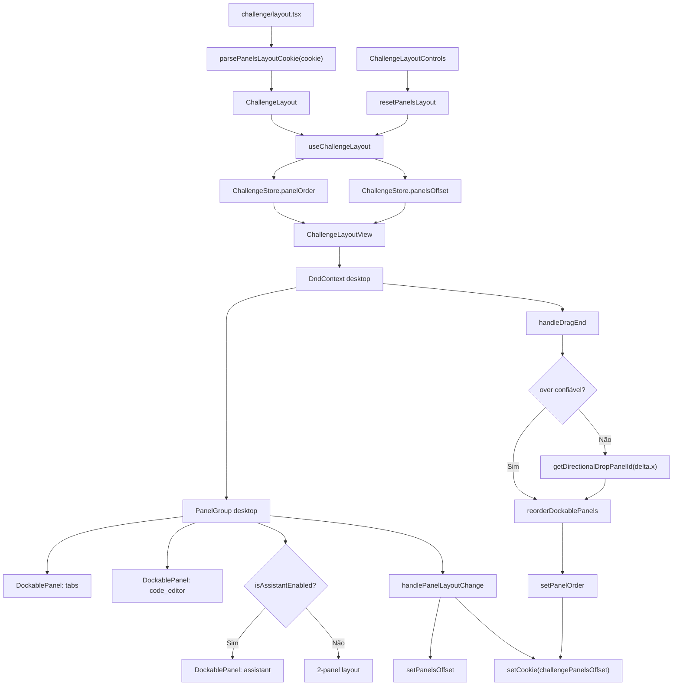

# 1. Objetivo

Evoluir o layout desktop da pagina de desafio da `web` para tratar conteúdo, editor de codigo e assistente de IA como painéis acopláveis e persistentes, mantendo o modelo mobile atual baseado em slider. Tecnicamente, a entrega deve combinar `react-resizable-panels` para redimensionamento com `@dnd-kit/core` para arrastar painéis pelo mouse, usando `ChallengeStore`, o cookie `challengePanelsOffset` e os slots paralelos ja existentes para reordenar painéis por drag-and-drop, redimensionar áreas, restaurar o layout padrão pelo header e renderizar o assistente como painel lateral quando estiver habilitado.

---

# 2. Escopo

## 2.1 In-scope

- Manter dois modos exclusivos: painéis horizontais no desktop (`md` em diante) e `ChallengeSlider` no mobile.
- Renderizar no desktop dois painéis obrigatórios: conteúdo (`ChallengeTabs`) e editor (`codeEditor` slot).
- Renderizar o assistente (`AssistantChatbot`) como terceiro painel à direita quando `isAssistantEnabled = true`.
- Permitir arrastar painéis com mouse pelas barras reais dos painéis desktop: navegação de conteúdo/tabs, `CodeEditorToolbar` e cabeçalho do assistente.
- Permitir soltar um painel sobre outro painel para reordenar a disposição horizontal.
- Persistir tamanhos e posição dos painéis no cookie atual `COOKIES.keys.challengePanelsOffset`.
- Persistir tamanhos por ID de painel, não por índice/posição visual.
- Tolerar cookie ausente, legado, inválido ou incompleto usando fallback seguro.
- Adicionar controle no header para restaurar o layout padrão sem trocar de rota.
- Preservar regras de tabs, navegação, console, seleção para assistente e fechamento do assistente.

## 2.2 Out-of-scope

- Drag-and-drop para criar splits verticais, painéis flutuantes ou grids arbitrários.
- Criar novo contrato REST/RPC, banco, migration, server action ou use case de domínio.
- Persistir layout por usuário no banco de dados.
- Alterar o comportamento mobile de Comentários/Soluções, já registrado como lacuna do PRD.
- Criar modo fullscreen que remove completamente o painel de conteúdo.
- Incluir testes automatizados nesta spec, conforme regra da skill `create-spec`.

---

# 3. Requisitos

## 3.1 Funcionais

- No desktop, a tela deve abrir com conteúdo à esquerda e editor à direita quando não houver layout salvo.
- O usuário deve poder arrastar o painel de conteúdo, editor ou assistente com mouse por um drag handle visual.
- No painel de conteúdo, a área de drag deve ser a barra de navegação/tabs existente.
- No painel de editor, a área de drag deve ser a própria `CodeEditorToolbar`.
- No painel do assistente, a área de drag deve ser o cabeçalho já existente do chatbot.
- Ao soltar um painel sobre outro, o layout deve reordenar os painéis horizontalmente.
- Quando o alvo de drop do `@dnd-kit` estiver instável ou apontar para o próprio painel ativo, a reordenação deve usar a direção horizontal do movimento (`delta.x`) para trocar com o vizinho correspondente.
- A ordem de painéis deve ser persistida e restaurada em visitas futuras.
- O usuário deve poder redimensionar os painéis por handles e ter os tamanhos restaurados em visitas futuras.
- Quando o assistente estiver habilitado pela primeira vez e não houver ordem persistida para ele, ele deve aparecer como painel lateral direito com tamanho mínimo seguro.
- Quando o assistente for fechado, ele deve sair apenas da ordem visível; sua posição deve permanecer preservada em `panelOrder`.
- Quando o assistente for reaberto, ele deve voltar para a posição salva em `panelOrder` quando existir.
- Fechar o assistente pelo botão atual deve continuar apenas desabilitando `isAssistantEnabled` no desktop.
- O reset de layout deve restaurar posição e tamanhos padrão imediatamente, preservando o estado atual de abertura do assistente.
- O cookie salvo deve manter compatibilidade com o formato legado `{ tabsPanelSize, codeEditorPanelSize }`.
- O modo mobile deve continuar renderizando exatamente o `ChallengeSlider`, sem controles dockable.
- O título do desafio no header deve truncar com ellipsis no mobile, preservando os controles à direita.

## 3.2 Nao funcionais

- A implementação deve ficar restrita ao app `web`.
- Painéis obrigatórios não podem ficar com tamanho mínimo que os torne invisíveis ou inutilizáveis; use mínimos seguros próximos de `tabs: 20`, `codeEditor: 30` e `assistant: 24`.
- Áreas de drag devem possuir cursor visual, `aria-label` e não conflitar com campos interativos internos dos painéis.
- A interação de drag não deve capturar cliques da toolbar do editor, tabs, botões do assistente, console ou handles de resize.
- O drag deve usar `activationConstraint` para evitar reordenação acidental em cliques normais.
- O preview de drag não deve ser restrito ao eixo horizontal; o cursor e o overlay devem se mover nos eixos X e Y, embora a reordenação continue horizontal.
- O `DragOverlay` deve renderizar apenas um preview leve do painel, como título/ícone, sem montar novamente Monaco, tabs, console ou chatbot.
- A persistência em cookie durante resize deve ser debounced/throttled para evitar chamadas excessivas à server action.
- O resize não deve atualizar `panelsOffset` nem persistir cookie quando os tamanhos recebidos forem equivalentes aos já armazenados, evitando ciclos de `setLayout -> onLayout -> setPanelsOffset`.
- A persistência deve continuar usando cookie porque o layout server-side já lê `challengePanelsOffset`.
- Cookie inválido não pode quebrar a montagem da rota.
- A UI não deve sobrepor header, barra de tabs, toolbar do editor, handles e cabeçalho do assistente.
- `DndContext` não deve ser montado no mobile; o `ChallengeSlider` deve permanecer isolado.

---

# 4. O que ja existe?

## Next.js App

- **ChallengeLayoutRoute** (`apps/web/src/app/challenging/challenges/[challengeSlug]/challenge/layout.tsx`) - lê `challengePanelsOffset`, aplica fallback 50/50 e injeta `header`, `tabContent`, `codeEditor` e `panelsOffset` em `ChallengeLayout`.
- **ChallengePageContent** (`apps/web/src/app/challenging/challenges/[challengeSlug]/challenge/ChallengePageContent.tsx`) - carrega o desafio e renderiza `ChallengePage`.
- **ChallengeCodeEditorSlotRoute** (`apps/web/src/app/challenging/challenges/[challengeSlug]/challenge/@codeEditor/page.tsx`) - fornece o slot paralelo do editor.
- **ChallengeTabContentRoutes** (`apps/web/src/app/challenging/challenges/[challengeSlug]/challenge/@tabContent/**`) - fornecem os slots de descrição, resultado, comentários e soluções.

## UI (Widgets)

- **ChallengeLayout** (`apps/web/src/ui/challenging/widgets/layouts/Challenge/index.tsx`) - entry point client-side do layout; cria refs de `Panel`, lê `isAssistantEnabled` no store e delega renderização para `ChallengeLayoutView`.
- **useChallengeLayout** (`apps/web/src/ui/challenging/widgets/layouts/Challenge/useChallengeLayout.ts`) - controla animação inicial, contador de tempo e persistência atual de tamanhos por cookie.
- **ChallengeLayoutView** (`apps/web/src/ui/challenging/widgets/layouts/Challenge/ChallengeLayoutView.tsx`) - renderiza `ChallengeSlider` no mobile e `PanelGroup` horizontal no desktop.
- **PanelHandle** (`apps/web/src/ui/challenging/widgets/layouts/Challenge/PanelHandle/index.tsx`) - wrapper atual do handle de `react-resizable-panels`.
- **PanelHandleView** (`apps/web/src/ui/challenging/widgets/layouts/Challenge/PanelHandle/PanelHandleView.tsx`) - aparência visual do divisor vertical.
- **ChallengeTabs** (`apps/web/src/ui/challenging/widgets/layouts/Challenge/ChallengeTabs/index.tsx`) - painel de conteúdo desktop com tabs e regras de bloqueio de comentários/soluções.
- **ChallengeSlider** (`apps/web/src/ui/challenging/widgets/layouts/Challenge/ChallengeSlider/index.tsx`) - experiência mobile com 4 slides e `TabHandler`.
- **AssistantChatbot** (`apps/web/src/ui/challenging/widgets/layouts/Challenge/AssistantChatbot/index.tsx`) - chatbot que fecha no desktop com `setIsAssistantEnabled(false)` e no mobile volta para o slide de código.
- **ChallengePage** (`apps/web/src/ui/challenging/widgets/pages/Challenge/index.tsx`) - compõe o header, navegação, notas e slots de diálogo.
- **ChallengePageView** (`apps/web/src/ui/challenging/widgets/pages/Challenge/ChallengePageView.tsx`) - header visual; recebe `panelsLayout` e `handlePanelsLayoutButtonClick`, mas ainda não renderiza controles de layout.
- **useChallengePage** (`apps/web/src/ui/challenging/widgets/pages/Challenge/useChallengePage.ts`) - hidrata o desafio no store, sincroniza `activeContent` pela rota e já expõe `handlePanelsLayoutButtonClick`.
- **ChallengeCodeEditorSlot** (`apps/web/src/ui/challenging/widgets/slots/ChallengeCodeEditor/index.tsx`) - consome `panelsLayout` indiretamente para recalcular a altura do editor.

## UI (Stores)

- **ChallengeStore** (`apps/web/src/ui/challenging/stores/ChallengeStore/index.ts`) - expõe slices de `challenge`, `activeContent`, `panelsLayout`, `results`, `tabHandler`, assistente e seleções.
- **useZustandChallengeStore** (`apps/web/src/ui/challenging/stores/zustand/useZustandChallengeStore.ts`) - implementa `setPanelsLayout`.
- **PanelsLayout** (`apps/web/src/ui/challenging/stores/ChallengeStore/types/PanelsLayout.ts`) - define `tabs-right;code_editor-left`, `tabs-left;code_editor-right` e o valor legado `code_editor-full`.
- **INITIAL_CHALLENGE_STORE_STATE** (`apps/web/src/ui/challenging/stores/ChallengeStore/constants/initial-challenge-store-state.ts`) - inicia `panelsLayout` como `tabs-left;code_editor-right`.

## UI (Globais)

- **Icon** (`apps/web/src/ui/global/widgets/components/Icon/index.tsx`) - possui ícones `layout`, `reload`, `simple-arrow-left`, `simple-arrow-right` e `code`.
- **Tooltip** (`apps/web/src/ui/global/widgets/components/Tooltip/index.tsx`) - base existente para botões de ícone acessíveis por hover.
- **Toolbar.Button** (`apps/web/src/ui/global/widgets/components/Toolbar/Button.tsx`) - referência de botão com ícone e tooltip.
- **useCookieActions** (`apps/web/src/ui/global/hooks/useCookieActions.ts`) - hook client-side para gravar cookies via `next-safe-action`.

## Bibliotecas

- **react-resizable-panels** (`apps/web/package.json`) - já instalado; `PanelGroup` expõe `onLayout(layout: number[])`, `ImperativePanelGroupHandle.setLayout(layout)` e `ImperativePanelHandle.resize(size)`.
- **@dnd-kit/core** (`apps/web/package.json`) - já instalado; deve ser usado para `DndContext`, sensores de mouse/pointer, `useDraggable`, `useDroppable` e `DragOverlay`.
- **@dnd-kit/modifiers** (`apps/web/package.json`) - já instalado; pode restringir o drag ao eixo horizontal no desktop.

---

# 5. O que deve ser criado?

## UI (Widgets)

- **Localização:** `apps/web/src/ui/challenging/widgets/pages/Challenge/ChallengeLayoutControls/index.tsx` **(novo arquivo)**
- **Props:**
  - `panelOrder: DockablePanelId[]`
  - `onResetLayout: () => void`
- **Estados:** Content.
- **View:** `apps/web/src/ui/challenging/widgets/pages/Challenge/ChallengeLayoutControls/ChallengeLayoutControlsView.tsx` **(novo arquivo)**
- **Index:** recebe estado/handler de `ChallengePage` e delega renderização para a View.
- **Widgets internos:** Não aplicável.
- **Estrutura de pastas:**

```text
apps/web/src/ui/challenging/widgets/pages/Challenge/ChallengeLayoutControls/
  index.tsx
  ChallengeLayoutControlsView.tsx
```

- **Localização:** `apps/web/src/ui/challenging/widgets/layouts/Challenge/DockablePanel/index.tsx` **(novo arquivo)**
- **Props:**
  - `id: DockablePanelId`
  - `title: string`
  - `children: ReactNode`
  - `panelRef?: RefObject<ImperativePanelHandle | null>`
  - `defaultSize: number`
  - `minSize: number`
  - `order: number`
- **Estados:** Content, Dragging, DropTarget.
- **View:** `apps/web/src/ui/challenging/widgets/layouts/Challenge/DockablePanel/DockablePanelView.tsx` **(novo arquivo)**
- **Hook:** `apps/web/src/ui/challenging/widgets/layouts/Challenge/DockablePanel/useDockablePanel.ts` **(novo arquivo)**
- **Index:** conecta `useDraggable`/`useDroppable` do `@dnd-kit/core`, injeta props de drag/drop na View e renderiza o `Panel` de `react-resizable-panels`.
- **Widgets internos:** Não aplicável.
- **Estrutura de pastas:**

```text
apps/web/src/ui/challenging/widgets/layouts/Challenge/DockablePanel/
  index.tsx
  useDockablePanel.ts
  DockablePanelView.tsx
  DockablePanelDragHandleContext.tsx
```

## UI (Types e Utils)

- **Localização:** `apps/web/src/ui/challenging/stores/ChallengeStore/types/PanelsOffset.ts` **(novo arquivo)**
- **Props:**
  - `tabsPanelSize: number`
  - `codeEditorPanelSize: number`
  - `assistantPanelSize: number`

- **Localização:** `apps/web/src/ui/challenging/stores/ChallengeStore/types/DockablePanelId.ts` **(novo arquivo)**
- **Props:** tipo união `'tabs' | 'code_editor' | 'assistant'`.

- **Localização:** `apps/web/src/ui/challenging/widgets/layouts/Challenge/types/PersistedPanelsLayout.ts` **(novo arquivo)**
- **Props:**
  - `panelOrder?: DockablePanelId[]`
  - `tabsPanelSize?: number`
  - `codeEditorPanelSize?: number`
  - `assistantPanelSize?: number`

- **Localização:** `apps/web/src/ui/challenging/widgets/layouts/Challenge/constants/panel-layout.ts` **(novo arquivo)**
- **Exports:**
  - `DEFAULT_PANEL_ORDER: DockablePanelId[]` - valor `['tabs', 'code_editor', 'assistant']`.
  - `DEFAULT_PANELS_OFFSET: PanelsOffset` - tamanhos padrão para conteúdo/editor/assistente.
  - `MIN_PANEL_SIZES: { tabs: number; codeEditor: number; assistant: number }` - mínimos seguros para desktop, sugeridos como `tabs: 20`, `codeEditor: 30`, `assistant: 24`.

- **Localização:** `apps/web/src/ui/challenging/widgets/layouts/Challenge/utils/parsePanelsLayoutCookie.ts` **(novo arquivo)**
- **Métodos:**
  - `parsePanelsLayoutCookie(value: string | null | undefined): { panelOrder: DockablePanelId[]; panelsOffset: PanelsOffset }` - faz parse seguro do cookie, aceita o formato legado baseado em `panelsLayout`/offsets e aplica fallback quando o payload for inválido.

- **Localização:** `apps/web/src/ui/challenging/widgets/layouts/Challenge/utils/reorderDockablePanels.ts` **(novo arquivo)**
- **Métodos:**
  - `reorderDockablePanels(panelOrder: DockablePanelId[], activePanelId: DockablePanelId, overPanelId: DockablePanelId): DockablePanelId[]` - move o painel arrastado para a posição do painel alvo, preservando apenas IDs conhecidos e sem duplicatas.

- **Localização:** `apps/web/src/ui/challenging/widgets/layouts/Challenge/utils/getDirectionalDropPanelId.ts` **(novo arquivo)**
- **Métodos:**
  - `getDirectionalDropPanelId(visiblePanelOrder: DockablePanelId[], activePanelId: DockablePanelId, deltaX: number): DockablePanelId | null` - infere o painel vizinho quando o drop não retorna um alvo confiável, usando a direção horizontal do movimento.

- **Localização:** `apps/web/src/ui/challenging/widgets/layouts/Challenge/utils/getVisiblePanelOrder.ts` **(novo arquivo)**
- **Métodos:**
  - `getVisiblePanelOrder(panelOrder: DockablePanelId[], isAssistantEnabled: boolean): DockablePanelId[]` - retorna a ordem renderizada no desktop, removendo `assistant` quando fechado e adicionando-o à direita quando estiver aberto mas ausente no estado persistido.

---

# 6. O que deve ser modificado?

## Next.js App

- **Arquivo:** `apps/web/src/app/challenging/challenges/[challengeSlug]/challenge/layout.tsx`
- **Mudança:** Substituir o `JSON.parse` direto por `parsePanelsLayoutCookie(...)`, renomear semanticamente o payload inicial para `{ panelOrder, panelsOffset }` e repassar ambos para `ChallengeLayout`.
- **Justificativa:** A rota não pode quebrar com cookie inválido e precisa restaurar também a posição dos painéis, não apenas os tamanhos.

## UI (Stores)

- **Arquivo:** `apps/web/src/ui/challenging/stores/ChallengeStore/types/PanelsLayout.ts`
- **Mudança:** Remover o contrato ativo `PanelsLayout` ou mantê-lo apenas como compatibilidade interna de parse legado, substituindo o estado principal por `DockablePanelId[]`.
- **Justificativa:** Drag-and-drop por mouse exige ordem extensível de painéis, não apenas duas strings fixas de posição.

- **Arquivo:** `apps/web/src/ui/challenging/stores/ChallengeStore/types/index.ts`
- **Mudança:** Exportar `PanelsOffset` e `DockablePanelId`.
- **Justificativa:** Offset e IDs de painéis passam a fazer parte do estado de UI do layout de desafio.

- **Arquivo:** `apps/web/src/ui/challenging/stores/ChallengeStore/types/ChallengeStoreState.ts`
- **Mudança:** Adicionar `panelsOffset: PanelsOffset` e `panelOrder: DockablePanelId[]`.
- **Justificativa:** O reset precisa atualizar a UI imediatamente, mesmo quando a posição atual já é a padrão e apenas os tamanhos mudaram.

- **Arquivo:** `apps/web/src/ui/challenging/stores/ChallengeStore/types/ChallengeStoreActions.ts`
- **Mudança:** Adicionar `setPanelOrder(panelOrder: DockablePanelId[]): void`, `setPanelsOffset(panelsOffset: PanelsOffset): void` e `resetPanelsLayout(): void`.
- **Justificativa:** O layout precisa persistir redimensionamentos e o header precisa restaurar estado padrão sem conhecer refs internos de `Panel`.

- **Arquivo:** `apps/web/src/ui/challenging/stores/ChallengeStore/constants/initial-challenge-store-state.ts`
- **Mudança:** Inicializar `panelsOffset` com `DEFAULT_PANELS_OFFSET` e `panelOrder` com `DEFAULT_PANEL_ORDER`.
- **Justificativa:** Evita duplicação de valores mágicos e mantém reset/store/layout alinhados.

- **Arquivo:** `apps/web/src/ui/challenging/stores/zustand/useZustandChallengeStore.ts`
- **Mudança:** Implementar `setPanelOrder`, `setPanelsOffset` e `resetPanelsLayout`.
- **Justificativa:** Centralizar mutações de layout no mesmo store já usado pela página de desafio.

- **Arquivo:** `apps/web/src/ui/challenging/stores/ChallengeStore/index.ts`
- **Mudança:** Expor `getPanelOrderSlice()`, `getPanelsOffsetSlice()` e incluir `resetPanelsLayout` no retorno público de `useChallengeStore()`.
- **Justificativa:** `ChallengeLayout`, `ChallengePage` e `ChallengeCodeEditorSlot` precisam reagir a mudanças de layout por slices explícitos.

## UI (Widgets)

- **Arquivo:** `apps/web/src/ui/challenging/widgets/layouts/Challenge/types/PanelsOffset.ts`
- **Mudança:** Reexportar `PanelsOffset` a partir de `ChallengeStore/types` ou atualizar imports para consumir o novo tipo diretamente do store.
- **Justificativa:** Preservar compatibilidade dos imports atuais enquanto o tipo passa a pertencer ao estado de UI.

- **Arquivo:** `apps/web/src/ui/challenging/widgets/layouts/Challenge/index.tsx`
- **Mudança:** Receber `panelOrder` e `panelsOffset` iniciais da rota, criar ref para `PanelGroup` e ref opcional para o painel do assistente, hidratar os slices de layout no store e passar estado/refs/handlers para `ChallengeLayoutView`.
- **Justificativa:** O entry point do layout é a fronteira entre props server-side, store client-side e refs imperativas dos painéis.

- **Arquivo:** `apps/web/src/ui/challenging/widgets/layouts/Challenge/useChallengeLayout.ts`
- **Mudança:** Aceitar refs de `PanelGroup`, tabs, editor e assistente; ler/escrever `panelOrder` e `panelsOffset`; derivar `visiblePanelOrder` com `getVisiblePanelOrder(...)`; persistir `{ panelOrder, ...panelsOffset }` no cookie; expor `handlePanelLayoutChange(layout: number[]): void` e `handleDragEnd(event: DragEndEvent): void`; em `handlePanelLayoutChange`, mapear cada tamanho retornado por índice para o ID correspondente em `visiblePanelOrder`, ignorando layouts equivalentes ao estado atual; em `handleDragEnd`, usar `reorderDockablePanels(...)` e `getDirectionalDropPanelId(...)` quando o alvo estiver instável, atualizar `panelOrder` e persistir; ao resetar offset no store, chamar `panelGroupRef.current?.setLayout(...)` ou `resize(...)` nos painéis visíveis.
- **Justificativa:** A persistência e a sincronização imperativa dos painéis pertencem ao hook de layout, não ao header.

- **Arquivo:** `apps/web/src/ui/challenging/widgets/layouts/Challenge/ChallengeLayoutView.tsx`
- **Mudança:** Envolver apenas a área desktop em `DndContext` com sensor de mouse/pointer e `activationConstraint`; renderizar os painéis desktop a partir de `visiblePanelOrder`; renderizar cada painel via `DockablePanel`; adicionar `PanelGroup` com `ref`, `onLayout` e `data-testid`/`aria-label` por painel; aplicar `defaultSize` e `minSize` a partir de `panelsOffset` e `MIN_PANEL_SIZES`; renderizar `DragOverlay` leve durante o arraste, sem duplicar os widgets pesados; manter `ChallengeSlider` inalterado no mobile.
- **Justificativa:** A View deve refletir o estado de docking e continuar separando desktop/mobile por breakpoint.

- **Arquivo:** `apps/web/src/ui/challenging/widgets/layouts/Challenge/PanelHandle/PanelHandleView.tsx`
- **Mudança:** Receber e repassar `aria-label` quando fornecido, mantendo a aparência atual.
- **Justificativa:** Handles entre painéis precisam ser identificáveis e acessíveis.

- **Arquivo:** `apps/web/src/ui/challenging/widgets/pages/Challenge/index.tsx`
- **Mudança:** Compor `ChallengeLayoutControls` no header, passando `panelOrder` e `handleResetLayoutButtonClick`.
- **Justificativa:** O header já é o ponto de composição dos controles utilitários do desafio.

- **Arquivo:** `apps/web/src/ui/challenging/widgets/pages/Challenge/ChallengePageView.tsx`
- **Mudança:** Renderizar `layoutControlsSlot` junto de `notesSlot` e `challengeNavigationSlot`, mantendo o botão de notas e navegação sem alteração; aplicar truncamento com ellipsis ao título do desafio no mobile sem comprimir os controles à direita.
- **Justificativa:** A View não deve conhecer detalhes dos botões, apenas posicionar o slot utilitário.

- **Arquivo:** `apps/web/src/ui/challenging/widgets/pages/Challenge/useChallengePage.ts`
- **Mudança:** Remover `handlePanelsLayoutButtonClick`, adicionar `handleResetLayoutButtonClick(): void` chamando `resetPanelsLayout()`, retornar `panelOrder` para o header e manter a hidratação do desafio sem alterar regras de navegação.
- **Justificativa:** A reordenação passa a acontecer por drag no layout; o header fica responsável apenas pelo reset.

- **Arquivo:** `apps/web/src/ui/challenging/widgets/slots/ChallengeCodeEditor/useChallengeCodeEditorSlot.ts`
- **Mudança:** Reagir também a mudanças de `panelsOffset` e `panelOrder`, para recalcular a altura do editor após resize/reset/reordenação.
- **Justificativa:** O editor precisa recalcular altura quando apenas os tamanhos mudam e a posição permanece igual.

---

# 7. O que deve ser removido?

**Não aplicável.**

---

# 8. Decisões Técnicas

## Decisão 1 - Restringir a entrega ao app `web`

- **Decisão:** Não criar mudanças em `server`, `core`, `database`, `validation` ou migrations.
- **Alternativas:** Persistir layout por usuário no banco; criar endpoint de preferências.
- **Motivo:** PRD, issue e codebase mostram que o layout atual já é UI client-side com persistência por cookie.
- **Trade-offs:** A configuração continua por navegador/dispositivo, mas a entrega fica menor e compatível com o fluxo atual.

## Decisão 2 - Usar drag-and-drop horizontal controlado com `@dnd-kit`

- **Decisão:** Implementar reordenação por mouse com `@dnd-kit/core`, mantendo a ordem final horizontal e acionando o drag pelas barras reais dos painéis (`ChallengeTabs`, `CodeEditorToolbar` e cabeçalho do assistente).
- **Alternativas:** Manter apenas botões explícitos de posição; implementar grade livre com splits verticais e painéis flutuantes; usar somente APIs nativas de pointer events.
- **Motivo:** A referência visual exige arrastar painéis com mouse. `@dnd-kit` já está instalado no `apps/web`, oferece sensores, overlay e contratos testáveis sem trocar o sistema de resize existente.
- **Trade-offs:** A experiência permite reorder horizontal, mas não cria docking arbitrário em qualquer quadrante. O preview não fica preso ao eixo X para acompanhar o cursor, enquanto o algoritmo de drop continua decidindo apenas a ordem horizontal.

## Decisão 2.1 - Compartilhar o activator de drag via contexto local

- **Decisão:** `DockablePanel` fornece os listeners/attributes/ref do `useDraggable` via contexto local para que widgets internos registrem suas barras já existentes como activator.
- **Alternativas:** Criar um cabeçalho extra em todo painel; passar props manualmente por todos os slots paralelos; limitar o drag a um ícone.
- **Motivo:** O usuário espera arrastar pelas barras reais do layout, e o slot paralelo do editor dificulta passar props diretamente sem acoplar a árvore inteira.
- **Trade-offs:** Introduz um contexto pequeno na camada de layout, mas evita UI duplicada e preserva os botões internos de toolbar/tabs/chat.

## Decisão 3 - Representar layout como ordem de painéis

- **Decisão:** Substituir o estado principal `PanelsLayout` por `panelOrder: DockablePanelId[]`.
- **Alternativas:** Manter strings fixas como `tabs-left;code_editor-right`; criar um grafo de docking completo; persistir apenas índices numéricos.
- **Motivo:** Drag-and-drop precisa suportar ordem mutável e presença condicional do assistente. IDs explícitos evitam ambiguidade e facilitam validação do cookie.
- **Trade-offs:** Exige migração interna do store e parse legado, mas deixa o contrato preparado para três painéis.

## Decisão 4 - Remover `code_editor-full` do contrato ativo

- **Decisão:** Não expor nem manter como estado válido o modo `code_editor-full`.
- **Alternativas:** Manter fullscreen do editor; transformar em modo de foco colapsável.
- **Motivo:** A issue determina que conteúdo e editor são painéis obrigatórios e não devem ser removidos completamente.
- **Trade-offs:** O foco total no editor fica fora desta entrega, mas evita conflito direto com o requisito de painéis obrigatórios.

## Decisão 5 - Evoluir o cookie existente

- **Decisão:** Continuar usando `COOKIES.keys.challengePanelsOffset`, adicionando `panelOrder` e `assistantPanelSize` ao JSON.
- **Alternativas:** Criar novo cookie; usar `PanelGroup autoSaveId` com localStorage.
- **Motivo:** A rota server-side já lê esse cookie antes de renderizar o layout, e `autoSaveId` não resolve hidratação inicial no servidor.
- **Trade-offs:** O nome do cookie fica historicamente ligado a offset, mas mantém compatibilidade e evita migração de storage.

## Decisão 6 - Reset preserva o estado atual do assistente

- **Decisão:** Resetar posição e tamanhos, mas não forçar `setIsAssistantEnabled(false)`.
- **Alternativas:** Fechar sempre o assistente no reset; abrir sempre o assistente após reset.
- **Motivo:** A abertura do assistente já é controlada pela toolbar/`AssistantChatbot`; resetar layout não deve encerrar uma conversa em andamento.
- **Trade-offs:** O layout padrão terá dois ou três painéis conforme o estado atual do assistente.

## Decisão 7 - Validar cookie na borda da rota

- **Decisão:** Parse seguro no layout route com fallback para defaults.
- **Alternativas:** Deixar o parse no client; manter `JSON.parse` direto.
- **Motivo:** Cookie inválido hoje pode quebrar a renderização server-side da rota.
- **Trade-offs:** Adiciona um util pequeno, mas reduz risco em navegação direta/refresh.

## Decisão 8 - Evitar loops de layout durante resize

- **Decisão:** Ignorar callbacks de `PanelGroup.onLayout` quando os tamanhos recebidos forem equivalentes ao estado atual e deduplicar a persistência do cookie por payload serializado.
- **Alternativas:** Persistir em todo callback; remover a sincronização imperativa via `setLayout`.
- **Motivo:** `setLayout` pode disparar `onLayout`; atualizar o store com um novo objeto equivalente causa rerenders contínuos.
- **Trade-offs:** Usa uma pequena tolerância decimal nos tamanhos, suficiente para evitar loops sem perder alterações reais de resize.

---

# 9. Diagramas e Referências

## Fluxo de dados



## Fluxo cross-app

**Não aplicável.** A entrega fica restrita ao app `web` e não cria comunicação entre apps.

## Layout

```ascii
Desktop default
┌────────────────────────────────────────────────────────────────────┐
│ Header: voltar, título, reset layout, notas, navegação             │
├──────────────────────────────┬────┬────────────────────────────────┤
│ [drag] ChallengeTabs nav     │ || │ [drag] CodeEditorToolbar       │
│ Descrição/Resultado/...      │ || │ Toolbar + editor + console     │
└──────────────────────────────┴────┴────────────────────────────────┘

Desktop com assistente
┌────────────────────────┬────┬──────────────────────┬────┬─────────┐
│ [drag] ChallengeTabs   │ || │ [drag] CodeEditor    │ || │ [drag] IA header│
└────────────────────────┴────┴──────────────────────┴────┴─────────┘

Desktop após arrastar editor para a esquerda
┌────────────────────────────────┬────┬──────────────────────────────┐
│ [drag] ChallengeCodeEditorSlot │ || │ [drag] ChallengeTabs          │
└────────────────────────────────┴────┴──────────────────────────────┘

Mobile preservado
┌────────────────────────────────────────────────────────────────────┐
│ Header                                                             │
├────────────────────────────────────────────────────────────────────┤
│ ChallengeSlider: Conteúdo | Código | Resultado | Assistente        │
└────────────────────────────────────────────────────────────────────┘
```

## Referências

- `apps/web/src/app/challenging/challenges/[challengeSlug]/challenge/layout.tsx`
- `apps/web/src/ui/challenging/widgets/layouts/Challenge/index.tsx`
- `apps/web/src/ui/challenging/widgets/layouts/Challenge/useChallengeLayout.ts`
- `apps/web/src/ui/challenging/widgets/layouts/Challenge/ChallengeLayoutView.tsx`
- `apps/web/src/ui/challenging/widgets/layouts/Challenge/DockablePanel/DockablePanelDragHandleContext.tsx`
- `apps/web/src/ui/challenging/widgets/layouts/Challenge/utils/getDirectionalDropPanelId.ts`
- `apps/web/src/ui/challenging/widgets/layouts/Challenge/PanelHandle/PanelHandleView.tsx`
- `apps/web/src/ui/challenging/widgets/layouts/Challenge/ChallengeTabs/ChallengeTabsView.tsx`
- `apps/web/src/ui/global/widgets/components/CodeEditorToolbar/CodeEditorToolbarView.tsx`
- `apps/web/src/ui/challenging/widgets/layouts/Challenge/ChallengeSlider/ChallengeSliderView.tsx`
- `apps/web/src/ui/challenging/widgets/layouts/Challenge/AssistantChatbot/index.tsx`
- `apps/web/src/ui/challenging/widgets/pages/Challenge/index.tsx`
- `apps/web/src/ui/challenging/widgets/pages/Challenge/useChallengePage.ts`
- `apps/web/src/ui/challenging/widgets/pages/Challenge/ChallengePageView.tsx`
- `apps/web/src/ui/challenging/widgets/slots/ChallengeCodeEditor/useChallengeCodeEditorSlot.ts`
- `apps/web/src/ui/challenging/stores/ChallengeStore/index.ts`
- `apps/web/src/ui/challenging/stores/ChallengeStore/types/PanelsLayout.ts`
- `apps/web/src/ui/challenging/stores/zustand/useZustandChallengeStore.ts`
- `apps/web/src/constants/cookies.ts`
- `apps/web/src/ui/global/hooks/useCookieActions.ts`

---

# 10. Pendências / Dúvidas

**Sem pendências.**

---

# 11. Execução Recomendada

Use **`implement-plan`**. Apesar de o escopo ficar restrito ao app `web`, a entrega combina drag-and-drop, redimensionamento, persistência, reset, estado global e preservação do fluxo mobile; quebrar em fases reduz risco de regressão no layout de desafio.
