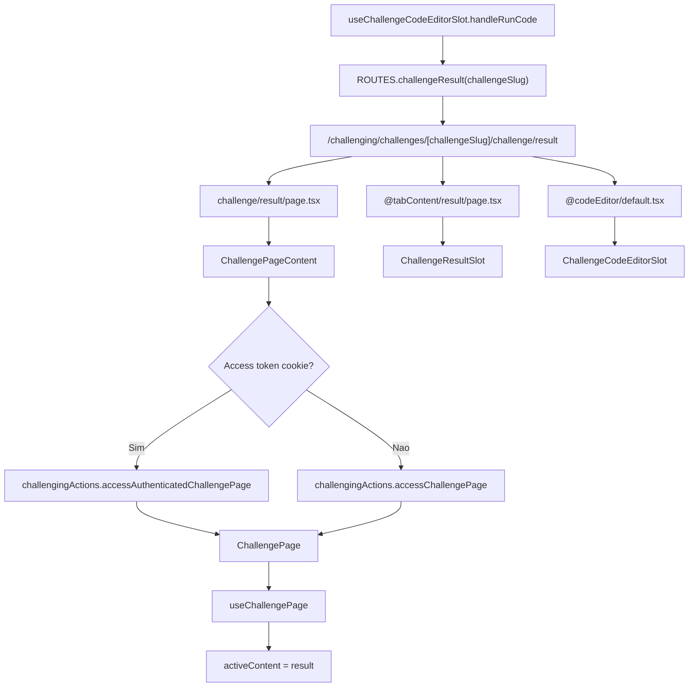

# 1. Objetivo

Corrigir a rota publica `/challenging/challenges/[challengeSlug]/challenge/result` para que o Next.js App Router consiga monta-la em navegacao direta, refresh e navegacao iniciada pelo editor de codigo, preservando o layout de challenge, o header carregado por `ChallengePage`, o slot de editor e o conteudo de resultado em `ChallengeResultSlot`.

---

# 2. Escopo

## 2.1 In-scope

- Criar a entrada explicita do slot implicito `children` para `/challenging/challenges/[challengeSlug]/challenge/result`.
- Reutilizar a mesma composicao server-side da rota base `/challenging/challenges/[challengeSlug]/challenge` para carregar `challengeSlug`, cookie de acesso, actions autenticadas/publicas e props de `ChallengePage`.
- Preservar `ROUTES.challenging.challenges.challengeResult(challengeSlug)` como URL canonica de resultado.
- Preservar `@tabContent/result/page.tsx` como responsavel pelo conteudo visual da aba de resultado.
- Manter `useChallengeResultSlot()` reconhecendo `currentRoute.endsWith('/result')` para restaurar estado quando o desafio ja estiver concluido.

## 2.2 Out-of-scope

- Alteracoes na execucao de codigo do desafio.
- Alteracoes no contrato de `ROUTES`.
- Alteracoes no contrato de `ChallengeStore`, `ChallengeResultSlot` ou `ChallengeCodeEditorSlot`.
- Alteracoes em actions RPC, services REST, server, core, banco de dados ou migrations.
- Criacao de testes automatizados nesta spec, conforme regra da skill `create-spec`.

---

# 3. Requisitos

## 3.1 Funcionais

- A URL `/challenging/challenges/[challengeSlug]/challenge/result` deve resolver como rota valida da aplicacao web.
- Ao executar codigo em `useChallengeCodeEditorSlot.handleRunCode()`, o usuario deve continuar sendo enviado para `ROUTES.challenging.challenges.challengeResult(challenge.slug.value)`.
- Ao acessar ou recarregar `/challenge/result` diretamente, a aplicacao deve montar `ChallengeLayout` com header, `tabContent` e `codeEditor`.
- O conteudo ativo de abas deve continuar sendo derivado do segmento final da URL por `useChallengePage()`, resultando em `activeContent = 'result'`.
- A aba de resultado deve continuar renderizando `ChallengeResultSlot` pelo slot paralelo `@tabContent/result`.

## 3.2 Nao funcionais

- Compatibilidade: a correcao nao deve alterar contratos publicos de rotas, widgets, store, actions ou DTOs.
- Consistencia: a rota base e a rota de resultado devem usar a mesma logica de carregamento do desafio para evitar divergencia entre usuarios autenticados e anonimos.
- Baixo acoplamento: a solucao deve permanecer na borda do App Router e nao mover responsabilidades de roteamento para `core` ou widgets.

---

# 4. O que ja existe?

## Camada Next.js App (Pages, Layouts)

- **ChallengeLayoutRoute** (`apps/web/src/app/challenging/challenges/[challengeSlug]/challenge/layout.tsx`) - Compoe `ChallengeLayout` com os slots `children`, `tabContent` e `codeEditor`, dentro de `FeedbackLayout`.
- **ChallengePageRoute** (`apps/web/src/app/challenging/challenges/[challengeSlug]/challenge/page.tsx`) - Carrega o desafio por `challengeSlug`, diferencia usuario autenticado por cookie e renderiza `ChallengePage`.
- **ChallengeChildrenDefaultRoute** (`apps/web/src/app/challenging/challenges/[challengeSlug]/challenge/default.tsx`) - Fallback atual do slot implicito `children`.
- **ChallengeResultTabContentRoute** (`apps/web/src/app/challenging/challenges/[challengeSlug]/challenge/@tabContent/result/page.tsx`) - Renderiza `ChallengeResultSlot` no slot paralelo `tabContent`.
- **ChallengeResultTabContentDefaultRoute** (`apps/web/src/app/challenging/challenges/[challengeSlug]/challenge/@tabContent/result/default.tsx`) - Fallback do slot paralelo de resultado.
- **ChallengeCodeEditorDefaultRoute** (`apps/web/src/app/challenging/challenges/[challengeSlug]/challenge/@codeEditor/default.tsx`) - Mantem o editor disponivel quando outro segmento de rota esta ativo.

## Camada RPC (Actions)

- **challengingActions** (`apps/web/src/rpc/next-safe-action/challengingActions.ts`) - Expoe `accessAuthenticatedChallengePage` e `accessChallengePage`, ambas com leitura sem cache neste worktree.

## Camada UI (Widgets)

- **ChallengePage** (`apps/web/src/ui/challenging/widgets/pages/Challenge/index.tsx`) - Entry point client-side da pagina do desafio.
- **useChallengePage** (`apps/web/src/ui/challenging/widgets/pages/Challenge/useChallengePage.ts`) - Hidrata `ChallengeStore` e sincroniza `activeContent` a partir do ultimo segmento de `currentRoute`.
- **ChallengeCodeEditorSlot** (`apps/web/src/ui/challenging/widgets/slots/ChallengeCodeEditor/useChallengeCodeEditorSlot.ts`) - Executa o codigo, salva `results` no store e navega para a rota canonica de resultado.
- **ChallengeResultSlot** (`apps/web/src/ui/challenging/widgets/slots/ChallengeResult/useChallengeResultSlot.ts`) - Consome `results`, verifica resposta e restaura estado quando a rota atual termina em `/result`.
- **ChallengeContentLink** (`apps/web/src/ui/challenging/widgets/components/ChallengeContentLink/useChallengeContentLink.ts`) - Monta links publicos no formato `/challenge/${contentType}` para abas diferentes de `description`.

## Camada UI (Stores)

- **ChallengeStore** (`apps/web/src/ui/challenging/stores/ChallengeStore/index.ts`) - Centraliza `challenge`, `activeContent`, `results`, layout dos paineis e handlers de abas.

## Constantes

- **ROUTES** (`apps/web/src/constants/routes.ts`) - Define `challengeResult(challengeSlug)` como `/challenging/challenges/${challengeSlug}/challenge/result`.

---

# 5. O que deve ser criado?

## Next.js App (Pages, Layouts)

- **Localizacao:** `apps/web/src/app/challenging/challenges/[challengeSlug]/challenge/ChallengePageContent.tsx` **(novo arquivo)**
- **Widget principal:** `ChallengePage`
- **Caminho da rota:** Nao aplicavel. Arquivo auxiliar server-side, nao cria rota publica.
- **Metodos:** `async function ChallengePageContent({ params }: NextParams<'challengeSlug'>): Promise<JSX.Element | undefined>` - concentrar a leitura de `params.challengeSlug`, cookie de acesso, escolha entre `accessAuthenticatedChallengePage` e `accessChallengePage`, e renderizacao de `ChallengePage`.

## Next.js App (Pages, Layouts)

- **Localizacao:** `apps/web/src/app/challenging/challenges/[challengeSlug]/challenge/result/page.tsx` **(novo arquivo)**
- **Widget principal:** `ChallengePageContent`
- **Caminho da rota:** `/challenging/challenges/[challengeSlug]/challenge/result`
- **Metodos:** `async function Page({ params }: NextParams<'challengeSlug'>): Promise<JSX.Element | undefined>` - renderizar o mesmo conteudo do slot implicito `children` usado pela rota base, permitindo que o App Router resolva o segmento publico `result`.

---

# 6. O que deve ser modificado?

## Camada Next.js App (Pages, Layouts)

- **Arquivo:** `apps/web/src/app/challenging/challenges/[challengeSlug]/challenge/page.tsx`
- **Mudanca:** Remover a logica inline de carregamento do desafio e delegar para `ChallengePageContent`.
- **Justificativa:** A rota base e a rota `/result` precisam compartilhar a mesma logica autenticada/publica para nao criar divergencia de comportamento.

---

# 7. O que deve ser removido?

**Nao aplicavel**.

---

# 8. Decisoes Tecnicas

## Decisao 1 - Criar rota publica no slot implicito `children`

- **Decisao:** Criar `apps/web/src/app/challenging/challenges/[challengeSlug]/challenge/result/page.tsx`.
- **Alternativas:** Alterar `ROUTES.challengeResult()` para navegar para `/challenge`; controlar aba ativa apenas em estado client-side; mover `ChallengeResultSlot` para fora de `@tabContent`.
- **Motivo:** A URL `/challenge/result` ja e contrato publico no PRD, na issue, em `ROUTES` e nos links de conteudo. Pastas `@slot` nao compoem a URL; o segmento `result` precisa existir no slot implicito para hard navigation.
- **Trade-offs:** A rota ganha um arquivo adicional, mas evita alterar contratos existentes e mantem a composicao atual de parallel routes.

## Decisao 2 - Extrair carregamento server-side comum

- **Decisao:** Criar `ChallengePageContent.tsx` e usa-lo em `challenge/page.tsx` e `challenge/result/page.tsx`.
- **Alternativas:** Duplicar o codigo de carregamento em `result/page.tsx`; importar de `page.tsx`; usar `default.tsx` como fallback principal.
- **Motivo:** Duplicacao aumenta risco de divergencia entre fluxo autenticado e anonimo. Importar de `page.tsx` acopla a nova rota a um arquivo especial do App Router. `default.tsx` nao substitui a necessidade de uma pagina para o segmento publico `result`.
- **Trade-offs:** Introduz um arquivo auxiliar dentro da pasta de rota, mas mantem uma unica fonte para acesso autenticado/publico.

## Decisao 3 - Preservar slots paralelos e widgets

- **Decisao:** Nao alterar `@tabContent/result/page.tsx`, `ChallengeCodeEditorSlot`, `ChallengeResultSlot` ou `ChallengeStore`.
- **Alternativas:** Renderizar `ChallengeResultSlot` diretamente em `result/page.tsx`; trocar a navegacao para query param; controlar resultado somente por store.
- **Motivo:** A UI ja reconhece `result` como aba ativa e o slot paralelo ja renderiza o conteudo correto. O erro acontece antes da montagem desses widgets.
- **Trade-offs:** A correcao depende da semantica de App Router parallel routes, mas fica localizada na borda de roteamento.

## Decisao 4 - Nao criar migrations nem alterar camadas server/core

- **Decisao:** Limitar a correcao ao app `web`.
- **Alternativas:** Alterar actions, services, use cases ou banco para sinalizar estado de resultado.
- **Motivo:** O bug e de resolucao de rota. Nao ha mudanca de schema, contrato de DTO, regra de dominio ou transporte.
- **Trade-offs:** Nenhum impacto nas demais apps e pacotes.

---

# 9. Diagramas e Referencias

## Fluxo de dados



## Fluxo cross-app

**Nao aplicavel**. A correcao fica restrita ao app `web`.

## Layout

```ascii
apps/web/src/app/challenging/challenges/[challengeSlug]/challenge/layout.tsx
`- ChallengeLayout
   |- header: children
   |  `- result/page.tsx
   |     `- ChallengePageContent
   |        `- ChallengePage
   |- tabContent: @tabContent/result/page.tsx
   |  `- ChallengeResultSlot
   `- codeEditor: @codeEditor/default.tsx
      `- ChallengeCodeEditorSlot
```

## Referencias

- `apps/web/src/app/challenging/challenges/[challengeSlug]/challenge/page.tsx`
- `apps/web/src/app/challenging/challenges/[challengeSlug]/challenge/default.tsx`
- `apps/web/src/app/challenging/challenges/[challengeSlug]/challenge/layout.tsx`
- `apps/web/src/app/challenging/challenges/[challengeSlug]/challenge/@tabContent/result/page.tsx`
- `apps/web/src/app/challenging/challenges/[challengeSlug]/challenge/@tabContent/result/default.tsx`
- `apps/web/src/app/challenging/challenges/[challengeSlug]/challenge/@codeEditor/default.tsx`
- `apps/web/src/constants/routes.ts`
- `apps/web/src/ui/challenging/widgets/pages/Challenge/useChallengePage.ts`
- `apps/web/src/ui/challenging/widgets/slots/ChallengeCodeEditor/useChallengeCodeEditorSlot.ts`
- `apps/web/src/ui/challenging/widgets/slots/ChallengeResult/useChallengeResultSlot.ts`
- `apps/web/src/ui/challenging/widgets/components/ChallengeContentLink/useChallengeContentLink.ts`

---

# 10. Pendencias / Duvidas

**Sem pendencias**.
