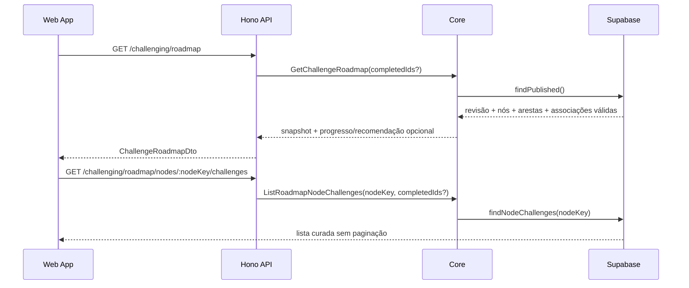

# Context and scope

## Origem, objetivo e classificação

A Issue [#593](https://github.com/JohnPetros/stardust/issues/593) e o PRD local
definem uma entrada guiada no módulo Challenging. O catálogo atual continua
disponível, mas `/challenging/roadmap` passa a ser a entrada principal: uma revisão
editorial publicada expõe um DAG de categorias, progresso derivado das conclusões
globais da conta e uma próxima ação determinística, sem bloquear exploração livre.

- Origem: Issue + PRD.
- Modo: completo; cruza Core, Validation, Database, Server e Web, adiciona migration,
  proteção de integridade, UI responsiva e contrato visual.
- Roteamento após `open`: `create-plan`, seguido de `implement-spec`, por haver
  migration, múltiplas camadas e validação browser/design.
- Studio fica fora da V1: a curadoria nasce em migration versionada, sem editor.

## Baseline factual

- A Web possui apenas `/challenging/challenges`; o link global `Desafios` aponta
  para esse catálogo e a resolução retorna sempre a ele, salvo desafios de Star.
- `users_completed_challenges` já representa conclusões globais; o middleware de
  perfil já deriva IDs concluídos quando existe sessão.
- Não existe persistência, port, use case, rota ou DTO de roadmap.
- `ChallengeCompletedEvent` já alimenta analytics no Server. A Web possui
  `ClientAnalyticsProvider.trackEvent` para eventos de interação.
- O package Web ainda não depende de `@xyflow/react`.
- Supabase Dev confirmou em 2026-09-16 as categorias e os 20 desafios públicos,
  sem Star, usados pela curadoria abaixo. `Funções` e `Algoritmos` não existem como
  categorias no banco e foram removidos do design V1.
- Os nodes Pencil `GJpSw` e `b081p` foram atualizados e inspecionados sem
  clipping/overflow. Não há frames canônicos para mobile ou estados auxiliares;
  a extensão aprovada está em `design/handoff.md`.

## In scope

- Revisão publicada única, imutável e versionada, com nós, arestas, posições,
  ordem de recomendação e desafios ordenados por nó.
- Seed V1 por slugs/keys estáveis, falhando a migration se categoria/desafio não
  existir ou violar elegibilidade.
- Snapshot público do grafo e consulta pública dos desafios de um nó, ambos com
  progresso pessoal somente quando houver conta.
- Recomendação determinística, progresso por nó/geral e modo de conclusão total.
- Mapa read-only, representação linear acessível, drawer filtrável sem paginação,
  estados seguros e navegação entre roadmap, catálogo e resolução.
- Preservação local de nó/viewport e revalidação ao retornar/focar.
- Bloqueio de exclusão, privatização e associação a Star para desafio presente na
  revisão ativa.
- Analytics de visita, abertura, início, continuar e retorno; conclusão reutiliza
  o evento Server existente.
- Comparação Pencil/runtime e validação manual real em desktop e mobile.

## Out of scope

- Editor de roadmap no Studio, múltiplas trilhas, personalização, publicação por
  endpoint ou escolha de roadmap por usuário.
- Bloquear acesso por pré-requisito, duplicar conclusão, criar estado de “iniciado”
  ou persistir viewport no servidor.
- Paginação no drawer, filtro por categoria dentro do drawer ou desafios privados/
  de Star.
- Realtime, polling contínuo, algoritmo de layout automático ou alteração da
  experiência de execução além da origem/retorno.
- Criar nós `Funções`, `Algoritmos`, `Dicionários` ou `Métodos de lista` na V1.

## Decisões aprovadas no Grilling

| Decisão | Evidência e alternativas | Resultado e trade-off |
| --- | --- | --- |
| Drawer segue o PRD | `b081p` antigo tinha status + paginação; RP-07 exige busca, dificuldade, conclusão e lista completa | Pencil atualizado; mais controles, sem `Carregar mais` |
| Estados sem frame são extensões | só `GJpSw`/`b081p` são canônicos | design system cobre mobile/loading/error/empty/visitante/conclusão/`Em breve`, com validação 1440×1024 e 390×844 |
| Curadoria por slugs em migration | repositório não tinha seleção; Supabase Dev passou a estar disponível | seed auditável e fail-fast; não há edição administrativa V1 |
| O grafo é DAG, não árvore | Condicionais e Laços possuem múltiplos pré-requisitos | preserva dependências pedagógicas; validação de aciclicidade é obrigatória |
| V1 contém oito categorias | Funções/Algoritmos não existem no banco; outras categorias sem nó não têm decisão editorial | design e seed usam somente Básico, Textos, Números, Operadores, Condicionais, Listas, Lógicos e Laços |

Não há decisão material pendente para esta revisão.

# Implementation Contract

## Requisitos funcionais

| RF | Origem | Requisito |
| --- | --- | --- |
| RF-01 | RP-01, JN-01, JN-04 | Tornar `/challenging/roadmap` a entrada do link global `Desafios` e oferecer switch bidirecional com `/challenging/challenges`. |
| RF-02 | RP-02, RP-03 | Carregar exatamente uma revisão ativa publicada, imutável, como DAG válido; revisão ausente/inválida nunca produz grafo parcial confiável. |
| RF-03 | RP-03, RP-04 | Persistir nós por categoria, posição `x/y`, `recommendationOrder`, arestas e desafios explícitos/ordenados, sem inferir conteúdo pelo catálogo em runtime. |
| RF-04 | RP-04 | Publicar a curadoria V1 exata de 8 nós e 20 desafios públicos não-Star por migration que falha diante de referência inválida. |
| RF-05 | RP-05 | Derivar progresso por nó e geral somente dos desafios válidos da revisão e de `users_completed_challenges`; visitante recebe totais editoriais, sem progresso pessoal. |
| RF-06 | RP-06 | Recomendar o primeiro desafio incompleto do nó elegível de menor `recommendationOrder`; nó exige todos os pré-requisitos concluídos, mas nunca bloqueia exploração. |
| RF-07 | RP-07, JN-02 | Selecionar nó atualiza `?node=<key>` e abre drawer com lista completa do nó, busca textual e filtros de dificuldade/conclusão combináveis, sem paginação/filtro de categoria. |
| RF-08 | RP-07, RP-12 | Isolar loading/erro/retry do drawer; erro do snapshot usa estado de página com retry. Seleção inválida é removida/ignorada sem quebrar o mapa. |
| RF-09 | RP-08, JN-05 | Permitir nó vazio somente como `Em breve`, terminal e sem dependentes; ele explica a ausência e não oferece CTA de desafio. |
| RF-10 | RP-09, JN-03 | Abrir a rota existente com origem e nó; `Voltar ao roadmap` retorna ao mesmo nó, restaura viewport local e revalida progresso no retorno/foco. |
| RF-11 | RP-10 | Impedir exclusão, privatização e associação a Star de desafio presente na revisão ativa, orientando criar/publicar nova revisão sem ele. |
| RF-12 | RP-11, RP-12 | Expor snapshot inicial em uma requisição e detalhes do drawer restritos ao nó; omitir/registrar associação legada inválida, sem fallback privado. |
| RF-13 | RP-12 | Registrar `challenge_roadmap_viewed`, `challenge_roadmap_node_opened`, `challenge_roadmap_challenge_started`, `challenge_roadmap_continue_clicked` e `challenge_roadmap_returned`; reutilizar `ChallengeCompletedEvent`. |
| RF-14 | RP-13 | Oferecer mapa desktop/mobile e representação linear equivalente, navegáveis por teclado/toque/leitor de tela, com movimento reduzido e sinais não dependentes apenas de cor. |
| RF-15 | RP-01..13 | Preservar fielmente os nodes Pencil canônicos e as extensões aprovadas em `design/handoff.md`. |

## Curadoria V1 normativa

| Nó (`key`) | Ordem | Desafios, nesta ordem |
| --- | ---: | --- |
| `basico` | 1 | `enviando-mensagem`; `pedido-de-ajuda`; `acoplagem-no-nucleo-da-nave` |
| `textos` | 2 | `mensagem-hacker-no-terminal-espacial`; `posicao-no-alfabeto-da-central-estelar` |
| `numeros` | 3 | `conversor-de-numeros-para-crons` |
| `operadores` | 4 | `perimetro-espacial`; `resistencias-em-circuitos` |
| `condicionais` | 5 | `veredito-do-painel-estelar`; `lista-de-multiplos`; `contando-batatas` |
| `listas` | 6 | `juntando-listas`; `quantos-planetas-habitaveis`; `retornando-o-primeiro-planeta-destino`; `onde-esta-o-animal` |
| `logicos` | 7 | `o-codigo-espelhado-do-comando-estelar`; `verificando-numero-cosmico` |
| `lacos` | 8 | `a-senha-e-um-repdigit`; `consertando-teclado-da-nave`; `detector-de-naves-bumerangue` |

A posição visual vem dos nodes Pencil. As arestas normativas são:
`basico→textos`, `basico→numeros`, `basico→operadores`, `textos→logicos`,
`numeros→condicionais`, `operadores→condicionais`, `operadores→listas`,
`logicos→lacos`, `condicionais→lacos` e `listas→lacos`.

## Critérios de aceitação

| CA | RF | Dado | Quando | Então | Evidência esperada |
| --- | --- | --- | --- | --- | --- |
| CA-01 | RF-01 | visitante ou conta abre o módulo | aciona `Desafios` | chega a `/challenging/roadmap`; o switch alterna roadmap/catálogo e o catálogo preserva filtros próprios | integração Web + Playwright |
| CA-02 | RF-02, RF-03 | uma revisão ativa válida | snapshot é solicitado | retorna version/key, 8 nós, 10 arestas, posições e totais em uma resposta estável | unit Core/repository + rota integrada |
| CA-03 | RF-02, RF-08 | revisão ausente, múltipla, cíclica ou estruturalmente inválida | snapshot é montado | API falha de modo observável; Web mostra erro total e retry, sem grafo parcial | unit + rota + Playwright |
| CA-04 | RF-04 | banco com catálogo esperado | migration roda | cria exatamente a curadoria normativa sem IDs gerados hardcoded e aborta se slug/categoria/elegibilidade divergir | Supabase local migration test |
| CA-05 | RF-05 | visitante | snapshot é retornado | totais editoriais existem e campos pessoais/recomendação são `null`, não zeros falsos | use case + rota + Playwright |
| CA-06 | RF-05 | conta com conclusões dentro e fora da revisão | snapshot é retornado | somente desafios válidos do roadmap compõem progresso por nó e geral, sem duplicação | unit + repository integration |
| CA-07 | RF-06 | múltiplos nós elegíveis | recomendação é calculada | vence menor `recommendationOrder` e primeiro desafio incompleto por `order` | teste unitário parametrizado do domínio |
| CA-08 | RF-06 | pré-requisitos incompletos ou roadmap 100% concluído | recomendação é calculada | nó inelegível não é recomendado; conclusão total retorna mensagem/estado sem próximo desafio | unit + widget |
| CA-09 | RF-06, RF-13 | existe recomendação | usuário aciona `Continuar próximo desafio` | rota existente abre com origem/nó e o evento de continue contém somente revision/node/challenge keys | widget + Playwright + analytics spy |
| CA-10 | RF-07 | nó válido selecionado | URL/drawer atualizam | drawer lista somente desafios curados daquele nó, na ordem editorial, sem paginação | hook/widget + rota + Playwright |
| CA-11 | RF-07 | consulta, dificuldade e conclusão variam | filtros são combinados | resultado local/observável corresponde à interseção e estado vazio é acessível | hook + Playwright |
| CA-12 | RF-07, RF-08 | drawer aberto | usuário usa botão, scrim ou Escape | drawer fecha, query é removida e foco retorna ao nó; voltar/avançar restaura seleção | widget + Playwright |
| CA-13 | RF-08, RF-12 | detalhes do nó falham | drawer já está aberto | mapa permanece utilizável e somente drawer oferece retry; retry bem-sucedido repõe a lista | widget + Playwright/network |
| CA-14 | RF-08, RF-12 | query aponta key inexistente | página hidrata | seleção é ignorada/removida, sem crash nem vazamento de dados | hook + Playwright |
| CA-15 | RF-09 | revisão contém nó vazio | publicação/montagem é validada | nó só é aceito como `comingSoon`, sem arestas de saída; drawer explica `Em breve` | domain/migration + widget |
| CA-16 | RF-10, RF-13 | desafio aberto pelo roadmap | usuário sai/conclui e volta | retorna ao mesmo nó/viewport, revalida snapshot e emite retorno; conclusão usa evento Server existente | unit hook + Playwright real autenticado |
| CA-17 | RF-11 | desafio da revisão ativa | administrador tenta excluir, privatizar ou associar a Star | operação é recusada antes da persistência com erro orientativo; desafio só em revisão inativa não bloqueia | unit use cases + rotas integradas |
| CA-18 | RF-12 | associação aponta desafio privado, Star, ausente ou fora da categoria validada | repository lê revisão | item é omitido, inconsistência é registrada e o nó/drawer degradam conforme impacto sem fallback | repository integration + telemetry spy |
| CA-19 | RF-13 | visita, abertura, início, continue e retorno | usuário percorre o fluxo | cada evento ocorre uma vez por ação, sem título, código, token ou dado pessoal; conclusão não é duplicada no client | unit hook + Playwright/analytics spy |
| CA-20 | RF-14 | 1440×1024 e 390×844 | mapa/linear/drawer são operados por mouse, teclado e toque | ações essenciais são equivalentes, foco/labels/ordem topológica/contraste/alvos/reduced-motion atendem o Contract | accessibility assertions + Playwright |
| CA-21 | RF-14 | leitor de tela usa representação linear | percorre os nós | cada item anuncia categoria, estado, progresso, pré-requisitos e recomendação e abre o mesmo drawer | widget/a11y test + Playwright |
| CA-22 | RF-15 | `GJpSw` e `b081p` | runtime desktop é comparado | estrutura, anchors, tipografia, cores, bordas, densidade, controles e drawer ficam dentro da tolerância de 4 px, sem clipping/overflow | Pencil + screenshots Web identificados por node/viewport/HEAD |
| CA-23 | RF-15 | estados sem frame | runtime desktop/mobile é exercitado | extensões seguem tokens/hierarquia do handoff e não reinterpretam os frames canônicos | Playwright + revisão visual |
| CA-24 | RF-01..15 | widget ou subtree interna com responsabilidade própria | auditoria estrutural roda | cada item da matriz possui diretório próprio, Entry Point/View, Hook somente quando há lógica e teste pareado; dependências entram pelo Entry Point, `index.tsx` não contém a árvore visual e Views pais não reproduzem widgets filhos inline | UI Layer Audit + diff + testes por path |

# Technical Contract

## Fluxo e ownership



Sessão/autorização permanecem na borda. O client nunca envia IDs concluídos nem
identidade; `ProfileMiddleware` os acrescenta quando conseguir resolver uma conta.
HTTP, Supabase e React Flow não atravessam para o Core.

## Contratos de domínio, aplicação e transporte

### DTOs e estrutura

```ts
type RoadmapNodeDto = {
  key: string
  category: ChallengeCategoryDto
  position: { x: number; y: number }
  recommendationOrder: number
  state: 'content' | 'comingSoon'
  challengeIds: string[]
  totalChallenges: number
  completedChallenges: number | null
  isCompleted: boolean | null
  isEligible: boolean | null
}

type ChallengeRoadmapDto = {
  revision: { key: string; version: number; publishedAt: string }
  nodes: RoadmapNodeDto[]
  edges: Array<{ prerequisiteNodeKey: string; dependentNodeKey: string }>
  progress: { completed: number; total: number; percentage: number } | null
  recommendation: { nodeKey: string; challengeId: string; challengeSlug: string } | null
}

type RoadmapNodeChallengesDto = {
  nodeKey: string
  challenges: Array<ChallengeDto & { order: number; isCompleted: boolean | null }>
}
```

`ChallengeRoadmap.create(dto)` valida chave/ordem únicas, referências de aresta,
ausência de self-edge/ciclo, unicidade de desafio na revisão e regra terminal de
`comingSoon`. `toDto(completedChallengeIds?: IdsList)` deriva progresso e
recomendação sem mutar a revisão.

### Ports e use cases

```ts
interface ChallengeRoadmapsRepository {
  findPublished(): Promise<ChallengeRoadmap | null>
  findNodeChallenges(nodeKey: Slug): Promise<Challenge[]>
  hasChallengeInPublishedRevision(challengeId: Id): Promise<Logical>
}

interface ChallengingService {
  fetchChallengeRoadmap(): Promise<RestResponse<ChallengeRoadmapDto>>
  fetchRoadmapNodeChallenges(nodeKey: Slug): Promise<RestResponse<RoadmapNodeChallengesDto>>
  // métodos existentes permanecem
}

class GetChallengeRoadmapUseCase {
  execute(input: { completedChallengeIds?: string[] }): Promise<ChallengeRoadmapDto>
}

class ListRoadmapNodeChallengesUseCase {
  execute(input: { nodeKey: string; completedChallengeIds?: string[] }): Promise<RoadmapNodeChallengesDto>
}
```

- Snapshot ausente/inválido lança `ChallengeRoadmapNotFoundError`/erro de
  integridade e chega como resposta segura `404`/`500` conforme a causa.
- Nó inexistente na revisão ativa retorna `404`; nenhum endpoint aceita lista de
  challenge IDs fornecida pelo client.
- `DeleteChallengeUseCase`, `EditChallengeStarUseCase` e
  `UpdateChallengeUseCase` recebem `ChallengeRoadmapsRepository`. Os dois primeiros
  consultam membership antes de mutar; update consulta somente quando o DTO alvo
  torna `isPublic=false`. Membership ativo lança
  `ChallengeBelongsToPublishedRoadmapError` (conflito `409`).
- `RemoveChallengeStarUseCase` não bloqueia: remover Star aproxima o desafio da
  elegibilidade e não viola RP-10.
- Routers são os composition roots: instanciam repositories/broker/use cases e
  injetam o use case pronto em cada controller. Controllers apenas traduzem `Http`
  para input/output do use case; não constroem nem conhecem repositories.

### HTTP

- `GET /challenging/roadmap`: público; middleware de perfil opcional; `200` com
  snapshot, `404` sem revisão, `500` em integridade estrutural.
- `GET /challenging/roadmap/nodes/:nodeKey/challenges`: público; `nodeKey` validado
  por `roadmapNodeKeySchema`; `200` sem paginação, `404` se não pertence à revisão.
- O profile middleware é best-effort para visitantes e nunca transforma ausência
  de sessão em `401`.
- Rotas de mutação mantêm autenticação/autorização existentes; apenas acrescentam
  o conflito de integridade antes da escrita.

## Database contract

Migration `20260916223842_create_challenge_roadmap.sql`:

- `challenge_roadmap_revisions`: UUID interno gerado, `key text`, `version int > 0`,
  `status draft|published`, `published_at`; unique `(key, version)` e partial unique
  que permite uma única linha `published` ativa.
- `challenge_roadmap_nodes`: revision FK `ON DELETE RESTRICT`, `key`, category FK
  `ON DELETE RESTRICT`, `position_x/y`, `recommendation_order > 0`, `state`; unique
  `(revision_id,key)`, `(revision_id,category_id)` e `(revision_id,recommendation_order)`.
- `challenge_roadmap_edges`: revision + prerequisite/dependent node FKs compostas
  `ON DELETE RESTRICT`; PK tripla e check contra self-edge.
- `challenge_roadmap_node_challenges`: revision/node/challenge FKs `ON DELETE
  RESTRICT`, `position > 0`; unique `(revision_id,challenge_id)` e
  `(node_id,position)`.
- Trigger rejeita `UPDATE`/`DELETE` em revisão publicada e filhos; a V1 não expõe
  escrita. A seed usa `key`/slug/nome, `gen_random_uuid()` para IDs internos e um
  bloco transacional que valida contagens, DAG, categoria, `is_public=true` e
  `star_id is null` antes de publicar.
- Habilitar RLS. `anon`/`authenticated` recebem somente `SELECT` em linhas da
  revisão publicada via policies; não recebem write. `service_role` preserva acesso
  operacional. Índices cobrem revisão ativa, arestas por dependent/prerequisite e
  desafios por `(node_id,position)`/`challenge_id`.
- Atualizar `schema.sql`; gerar `Database.ts` com
  `npm --workspace @stardust/server run db:types`, nunca editar manualmente.
- Repository filtra novamente `challenges.is_public` e `star_id is null` em runtime
  e registra inconsistência antes de omitir associação.
- `SupabaseChallengeRoadmapMapper` é a única fronteira que conhece rows/tipos de
  `Database.ts`; converte o conjunto relacional para `ChallengeRoadmap` e os
  challenges do drawer para entidades Core. Tipos gerados não vazam para Core,
  controllers ou UI.

## Web/UI contract

- A page server de `/challenging/roadmap` busca somente o snapshot inicial, sem
  cache compartilhado; falha vira boundary/estado recuperável do widget.
- `ChallengeRoadmap` Entry Point injeta `ChallengingService`, analytics e navegação
  no hook; View só renderiza. O hook controla query `node`, drawer, filtros,
  revalidação on focus/return, analytics e `sessionStorage` por revision/node.
- `RoadmapGraph` encapsula `@xyflow/react`: `nodeTypes` estável fora do render,
  `ReactFlowProvider`, `fitView`, `setViewport`, nodes focáveis, edges não focáveis,
  `nodesDraggable/connectable=false`, labels em português e reduced-motion. A API
  segue a documentação oficial atual: <https://reactflow.dev/learn/advanced-use/accessibility>.
- `RoadmapChallengeDrawer` busca o endpoint do nó ao abrir e concentra busca/filtros,
  retry isolado, focus lifecycle e navegação de desafio.
- `ChallengesViewSwitch` é render-only e reutilizado no roadmap e catálogo.
- `RoadmapLinearList` é render-only, recebe nós em ordem topológica e dispara a
  mesma seleção; no mobile é a representação primária acessível.
- A decomposição interna é obrigatória, não sugestiva. Toda subtree com identidade
  visual, responsabilidade ou fronteira de teste própria deve residir em diretório
  de widget próprio, nunca como componente solto dentro da View do pai. Isso inclui
  `RoadmapHeader`, `RoadmapProgressSummary`, `RoadmapCategoryNode`,
  `RoadmapLinearItem`, `RoadmapDrawerHeader`, `RoadmapDrawerFilters`,
  `RoadmapChallengeList`, `RoadmapChallengeItem` e `RoadmapStateMessage`.
- Cada widget interno possui `index.tsx` como único Entry Point público e
  `*View.tsx` render-only. Widget com estado, efeitos ou handlers próprios possui
  também Hook declarado com `function`; widget puramente presentational recebe
  props prontas e não cria Hook artificial. Nenhum `index.tsx` concentra JSX da
  subtree e nenhum pai reproduz internamente a árvore visual de um filho declarado.
- `RoadmapDrawerFilters` é o único subwidget interno adicional com Hook: ele recebe
  a coleção e critérios iniciais, mantém busca/dificuldade/conclusão e devolve
  critérios/resultado ao drawer por callbacks tipados. Fetch, retry e lifecycle do
  drawer continuam em `useRoadmapChallengeDrawer`.
- Links de desafio usam
  `/challenging/challenges/:slug/challenge?from=roadmap&node=:nodeKey`.
  `Challenge/index.tsx` resolve e injeta no `useChallengePage` todas as dependências
  externas — Auth, NavigationProvider, ChallengeStore, query params, storage e
  analytics. O hook não chama context/provider/store hooks diretamente, valida os
  params recebidos e usa o back do roadmap somente para origem válida/não-Star;
  caso contrário mantém o comportamento atual.
- Eventos client usam keys/versão/estado, nunca título/código/user ID. A visita
  ocorre uma vez por montagem; node/start/continue/return uma vez por ação.

## Mapa canônico de paths afetados

### Core e Validation

| Path | Change | Declaration | Contract | Dependencies | Tests |
| --- | --- | --- | --- | --- | --- |
| `packages/core/src/challenging/domain/structures/ChallengeRoadmap.ts` | Create | `ChallengeRoadmap` | invariantes DAG, progresso e recomendação | Id/Slug/Logical, category/challenge DTOs | estrutura unitária |
| `packages/core/src/challenging/domain/structures/dtos/ChallengeRoadmapDto.ts` | Create | DTOs do roadmap | shapes públicos acima | DTOs existentes | compile/use cases |
| `packages/core/src/challenging/domain/structures/dtos/index.ts` | Modify | exports | exporta DTOs | arquivo novo | typecheck |
| `packages/core/src/challenging/domain/structures/index.ts` | Modify | exports | exporta estrutura | arquivo novo | typecheck |
| `packages/core/src/challenging/domain/structures/fakers/ChallengeRoadmapFaker.ts` | Create | `ChallengeRoadmapFaker` | defaults válidos e overrides para grafo/recomendação | DTO/estrutura | domain/use-case tests |
| `packages/core/src/challenging/domain/structures/fakers/index.ts` | Modify | exports | exporta faker | arquivo novo | typecheck |
| `packages/core/src/challenging/domain/structures/tests/ChallengeRoadmap.test.ts` | Create | suíte | DAG/progresso/recomendação/comingSoon | `ChallengeRoadmapFaker` | unit |
| `packages/core/src/challenging/domain/errors/ChallengeRoadmapNotFoundError.ts` | Create | error | revisão/nó ausente | AppError | use case |
| `packages/core/src/challenging/domain/errors/ChallengeBelongsToPublishedRoadmapError.ts` | Create | error | conflito orientativo | AppError | mutations |
| `packages/core/src/challenging/domain/errors/index.ts` | Modify | exports | disponibiliza erros | novos erros | typecheck |
| `packages/core/src/challenging/interfaces/ChallengeRoadmapsRepository.ts` | Create | port | três métodos tipados do Contract | Core only | mocks/use cases |
| `packages/core/src/challenging/interfaces/ChallengingService.ts` | Modify | service port | dois métodos REST | DTOs/RestResponse | Web adapter |
| `packages/core/src/challenging/interfaces/index.ts` | Modify | exports | exporta port | novo port | typecheck |
| `packages/core/src/challenging/use-cases/GetChallengeRoadmapUseCase.ts` | Create | use case | snapshot público/pessoal | roadmap repository | unit |
| `packages/core/src/challenging/use-cases/ListRoadmapNodeChallengesUseCase.ts` | Create | use case | lista do nó sem paginação | roadmap repository | unit |
| `packages/core/src/challenging/use-cases/tests/GetChallengeRoadmapUseCase.test.ts` | Create | suíte | ausente/visitante/conta | mock repository + `ChallengeRoadmapFaker` | unit |
| `packages/core/src/challenging/use-cases/tests/ListRoadmapNodeChallengesUseCase.test.ts` | Create | suíte | nó/lista/completion | mock repository + `ChallengeRoadmapFaker` | unit |
| `packages/core/src/challenging/use-cases/UpdateChallengeUseCase.ts` | Modify | `execute` | bloqueia privatização ativa | challenges + roadmap repos | unit existente ampliado |
| `packages/core/src/challenging/use-cases/EditChallengeStarUseCase.ts` | Modify | `execute` | bloqueia Star ativa | challenges + roadmap repos | unit existente ampliado |
| `packages/core/src/challenging/use-cases/DeleteChallengeUseCase.ts` | Modify | `execute` | bloqueia delete ativo | challenges + roadmap repos | unit existente ampliado |
| `packages/core/src/challenging/use-cases/tests/UpdateChallengeUseCase.test.ts` | Modify | suíte | privatização ativa/inativa | mock dos dois repositories | unit |
| `packages/core/src/challenging/use-cases/tests/EditChallengeStarUseCase.test.ts` | Modify | suíte | associação Star ativa/inativa | mock dos dois repositories | unit |
| `packages/core/src/challenging/use-cases/tests/DeleteChallengeUseCase.test.ts` | Modify | suíte | exclusão ativa/inativa | mocks repository/broker | unit |
| `packages/core/src/challenging/use-cases/index.ts` | Modify | exports | exporta use cases | novos casos | typecheck |
| `packages/validation/src/modules/challenging/schemas/challengeRoadmapSchema.ts` | Create | `roadmapNodeKeySchema` | key URL segura | zod/slug rules | schema unit |
| `packages/validation/src/modules/challenging/schemas/tests/challengeRoadmapSchema.test.ts` | Create | suíte | key válida/limites/injeções | schema | unit |
| `packages/validation/src/modules/challenging/schemas/index.ts` | Modify | exports | exporta schema | arquivo novo | typecheck |

### Database e Server

| Path | Change | Declaration | Contract | Dependencies | Tests |
| --- | --- | --- | --- | --- | --- |
| `apps/server/supabase/migrations/20260916110000_seed_challenge_roadmap_catalog.sql` | Create | fixture catalog | prepara o catálogo vazio local; no-op quando os slugs já existem | Supabase local/Dev | migration |
| `apps/server/supabase/migrations/20260916223842_create_challenge_roadmap.sql` | Create | schema + seed V1 | tabelas/constraints/RLS/trigger/curadoria | catálogo existente | Supabase local/Dev |
| `apps/server/supabase/schemas/schema.sql` | Modify | schema declarativo | reflete migration | migration | diff/reset |
| `apps/server/src/database/supabase/types/Database.ts` | Generate | tipos Supabase | fonte schema local/remoto compatível; comando `db:types` | Supabase CLI | types |
| `apps/server/src/database/supabase/mappers/challenging/SupabaseChallengeRoadmapMapper.ts` | Create | mapper | rows Supabase ↔ `ChallengeRoadmap`, sem `Database.ts` fora do adapter | tipos gerados/Core | unit/integration |
| `apps/server/src/database/supabase/mappers/challenging/index.ts` | Modify | exports | exporta mapper | arquivo novo | typecheck |
| `apps/server/src/database/supabase/repositories/challenging/SupabaseChallengeRoadmapsRepository.ts` | Create | adapter | implementa port, sanitiza inválidos | Supabase/mapper | integration |
| `apps/server/src/database/supabase/repositories/challenging/index.ts` | Modify | exports | exporta adapter | arquivo novo | typecheck |
| `apps/server/src/rest/controllers/challenging/roadmap/FetchChallengeRoadmapController.ts` | Create | controller | traduz Http; recebe `GetChallengeRoadmapUseCase` pronto | use case/Http, sem repository | unit |
| `apps/server/src/rest/controllers/challenging/roadmap/ListRoadmapNodeChallengesController.ts` | Create | controller | traduz Http; recebe `ListRoadmapNodeChallengesUseCase` pronto | use case/Http, sem repository | unit |
| `apps/server/src/rest/controllers/challenging/roadmap/index.ts` | Create | exports | barrel do roadmap | controllers | barrel test |
| `apps/server/src/rest/controllers/challenging/roadmap/tests/FetchChallengeRoadmapController.test.ts` | Create | suíte | body derivado e respostas | mock use case/Http | unit |
| `apps/server/src/rest/controllers/challenging/roadmap/tests/ListRoadmapNodeChallengesController.test.ts` | Create | suíte | params/body e respostas | mock use case/Http | unit |
| `apps/server/src/rest/controllers/challenging/roadmap/tests/index.test.ts` | Create | suíte | exports públicos | barrel | unit |
| `apps/server/src/rest/controllers/challenging/challenges/UpdateChallengeController.ts` | Modify | constructor | recebe `UpdateChallengeUseCase` pronto e traduz Http | use case/Http, sem repository | controller tests |
| `apps/server/src/rest/controllers/challenging/challenges/EditChallengeStarController.ts` | Modify | constructor | recebe `EditChallengeStarUseCase` pronto e traduz Http | use case/Http, sem repository | controller tests |
| `apps/server/src/rest/controllers/challenging/challenges/DeleteChallengeController.ts` | Modify | constructor | recebe `DeleteChallengeUseCase` pronto e traduz Http | use case/Http, sem repository/broker | controller tests |
| `apps/server/src/rest/controllers/challenging/challenges/tests/UpdateChallengeController.test.ts` | Modify | suíte | tradução Http/input/output | mock use case/Http | unit |
| `apps/server/src/rest/controllers/challenging/challenges/tests/EditChallengeStarController.test.ts` | Create | suíte | tradução Http/input/output/conflito | mock use case/Http | unit |
| `apps/server/src/rest/controllers/challenging/challenges/tests/DeleteChallengeController.test.ts` | Modify | suíte | tradução Http/status | mock use case/Http | unit |
| `apps/server/src/app/hono/routers/challenging/ChallengeRoadmapRouter.ts` | Create | composition root/router | instancia repository + dois use cases + controllers e registra GETs | profile/validation/Core/controllers | route integration |
| `apps/server/src/app/hono/routers/challenging/ChallengesRouter.ts` | Modify | composition root | instancia challenges/roadmap repositories, broker, use cases e injeta controllers | repositories/Core/controllers | route regression |
| `apps/server/src/app/hono/routers/challenging/ChallengingRouter.ts` | Modify | composition | monta roadmap router | child router | route integration |
| `apps/server/src/tests/routes/challenging/roadmap/FetchChallengeRoadmapRoute.test.ts` | Create | suíte de uma rota | snapshot/visitante/conta/erros | local Supabase | integration |
| `apps/server/src/tests/routes/challenging/roadmap/ListRoadmapNodeChallengesRoute.test.ts` | Create | suíte de uma rota | drawer/visitante/conta/404 | local Supabase | integration |
| `apps/server/rest-client/challenging/roadmap.rest` | Create | requests | exemplos dos dois GET | local API | manual contract |

### Web App

| Path | Change | Declaration | Contract | Dependencies | Tests |
| --- | --- | --- | --- | --- | --- |
| `apps/web/package.json` | Modify | dependency | adiciona `@xyflow/react` | npm | install/build |
| `package-lock.json` | Modify | lockfile | resolve versão instalada | npm | clean install |
| `apps/web/src/constants/routes.ts` | Modify | `ROUTES.challenging.roadmap` | rota/query builders seguros | none | routes unit |
| `apps/web/src/constants/public-route-groups.ts` | Modify | public groups | roadmap público | middleware | integration |
| `apps/web/src/ui/profile/widgets/layouts/Home/home-links.ts` | Modify | `HOME_LINKS` | Desafios → roadmap | routes | navigation test |
| `apps/web/src/rest/services/ChallengingService.ts` | Modify | adapter | implementa dois métodos | RestClient/DTOs | unit/typecheck |
| `apps/web/src/app/challenging/roadmap/page.tsx` | Create | page server | busca snapshot sem cache | NextRestClient/service | page/integration |
| `apps/web/src/app/challenging/roadmap/tests/page.test.tsx` | Create | suíte da rota | success/failure e composição | mocks Next/service | route unit |
| `apps/web/src/ui/challenging/widgets/components/ChallengesViewSwitch/index.tsx` | Create | Entry Point | compõe View | routes | widget |
| `apps/web/src/ui/challenging/widgets/components/ChallengesViewSwitch/ChallengesViewSwitchView.tsx` | Create | View | links roadmap/catálogo | props only | view unit |
| `apps/web/src/ui/challenging/widgets/components/ChallengesViewSwitch/tests/ChallengesViewSwitchView.test.tsx` | Create | suíte da View | rotas, labels e estado ativo | View | unit |
| `apps/web/src/ui/challenging/widgets/pages/Challenges/ChallengesPageView.tsx` | Modify | View | inclui switch sem lógica | child widget | view regression |
| `apps/web/src/ui/challenging/widgets/pages/Challenges/tests/ChallengesPageView.test.tsx` | Create | suíte da View | compõe switch/lista/filtros | mocks filhos | unit |
| `apps/web/src/ui/challenging/widgets/pages/ChallengeRoadmap/index.tsx` | Create | Entry Point | injeta service/analytics/navigation | hook/View | widget |
| `apps/web/src/ui/challenging/widgets/pages/ChallengeRoadmap/ChallengeRoadmapPageView.tsx` | Create | View | estados e composição canônica | child slots | view unit |
| `apps/web/src/ui/challenging/widgets/pages/ChallengeRoadmap/useChallengeRoadmap.ts` | Create | Hook | seleção/revalidate/viewport/analytics | injected ports | hook unit |
| `apps/web/src/ui/challenging/widgets/pages/ChallengeRoadmap/tests/ChallengeRoadmapPageView.test.tsx` | Create | suíte da View | loading/error/empty/content/visitor/concluído | mocks slots | unit |
| `apps/web/src/ui/challenging/widgets/pages/ChallengeRoadmap/tests/useChallengeRoadmap.test.ts` | Create | suíte do Hook | query/revalidate/storage/analytics | dependências injetadas | unit |
| `apps/web/src/ui/challenging/widgets/pages/ChallengeRoadmap/RoadmapHeader/index.tsx` | Create | Entry Point | compõe header e switch por props | View/child widget | widget |
| `apps/web/src/ui/challenging/widgets/pages/ChallengeRoadmap/RoadmapHeader/RoadmapHeaderView.tsx` | Create | View | título, subtítulo e slot do switch | props only | view unit |
| `apps/web/src/ui/challenging/widgets/pages/ChallengeRoadmap/RoadmapHeader/tests/RoadmapHeaderView.test.tsx` | Create | suíte da View | textos, heading e composição do slot | View | unit |
| `apps/web/src/ui/challenging/widgets/pages/ChallengeRoadmap/RoadmapProgressSummary/index.tsx` | Create | Entry Point | compõe resumo/CTA por props | View | widget |
| `apps/web/src/ui/challenging/widgets/pages/ChallengeRoadmap/RoadmapProgressSummary/RoadmapProgressSummaryView.tsx` | Create | View | visitante/progresso/recomendação/concluído | props only | view unit |
| `apps/web/src/ui/challenging/widgets/pages/ChallengeRoadmap/RoadmapProgressSummary/tests/RoadmapProgressSummaryView.test.tsx` | Create | suíte da View | quatro estados e CTA | View | unit |
| `apps/web/src/ui/challenging/widgets/pages/ChallengeRoadmap/RoadmapGraph/index.tsx` | Create | Entry Point | provider/nodeTypes | hook/View | widget |
| `apps/web/src/ui/challenging/widgets/pages/ChallengeRoadmap/RoadmapGraph/RoadmapGraphView.tsx` | Create | View | React Flow read-only | `@xyflow/react` | view/a11y |
| `apps/web/src/ui/challenging/widgets/pages/ChallengeRoadmap/RoadmapGraph/useRoadmapGraph.ts` | Create | Hook | viewport/fit/select | injected callbacks/storage | hook unit |
| `apps/web/src/ui/challenging/widgets/pages/ChallengeRoadmap/RoadmapGraph/tests/RoadmapGraphView.test.tsx` | Create | suíte da View | nodes/edges/a11y/read-only | React Flow mock | unit |
| `apps/web/src/ui/challenging/widgets/pages/ChallengeRoadmap/RoadmapGraph/tests/useRoadmapGraph.test.ts` | Create | suíte do Hook | fit/restore/select | injected instance/storage | unit |
| `apps/web/src/ui/challenging/widgets/pages/ChallengeRoadmap/RoadmapGraph/RoadmapCategoryNode/index.tsx` | Create | Entry Point | adapta React Flow node data para View | View/node props | widget |
| `apps/web/src/ui/challenging/widgets/pages/ChallengeRoadmap/RoadmapGraph/RoadmapCategoryNode/RoadmapCategoryNodeView.tsx` | Create | View | cartão 190×76 e estados sem lógica | props only | view/a11y |
| `apps/web/src/ui/challenging/widgets/pages/ChallengeRoadmap/RoadmapGraph/RoadmapCategoryNode/tests/RoadmapCategoryNodeView.test.tsx` | Create | suíte da View | conteúdo/progresso/recomendado/comingSoon/foco | View | unit |
| `apps/web/src/ui/challenging/widgets/pages/ChallengeRoadmap/RoadmapChallengeDrawer/index.tsx` | Create | Entry Point | injeta service e compõe View | hook/View | widget |
| `apps/web/src/ui/challenging/widgets/pages/ChallengeRoadmap/RoadmapChallengeDrawer/RoadmapChallengeDrawerView.tsx` | Create | View | surface, slots e estados do drawer | design-system/child widgets | view/a11y |
| `apps/web/src/ui/challenging/widgets/pages/ChallengeRoadmap/RoadmapChallengeDrawer/useRoadmapChallengeDrawer.ts` | Create | Hook | fetch/retry/focus/start event | injected service/analytics | hook unit |
| `apps/web/src/ui/challenging/widgets/pages/ChallengeRoadmap/RoadmapChallengeDrawer/tests/RoadmapChallengeDrawerView.test.tsx` | Create | suíte da View | states/slots/foco/labels | View | unit |
| `apps/web/src/ui/challenging/widgets/pages/ChallengeRoadmap/RoadmapChallengeDrawer/tests/useRoadmapChallengeDrawer.test.ts` | Create | suíte do Hook | fetch/retry/focus/start event | dependências injetadas | unit |
| `apps/web/src/ui/challenging/widgets/pages/ChallengeRoadmap/RoadmapChallengeDrawer/RoadmapDrawerHeader/index.tsx` | Create | Entry Point | compõe identificação/fechar/progresso por props | View | widget |
| `apps/web/src/ui/challenging/widgets/pages/ChallengeRoadmap/RoadmapChallengeDrawer/RoadmapDrawerHeader/RoadmapDrawerHeaderView.tsx` | Create | View | título, descrição, progresso e close | props only | view unit |
| `apps/web/src/ui/challenging/widgets/pages/ChallengeRoadmap/RoadmapChallengeDrawer/RoadmapDrawerHeader/tests/RoadmapDrawerHeaderView.test.tsx` | Create | suíte da View | heading/progresso/close acessível | View | unit |
| `apps/web/src/ui/challenging/widgets/pages/ChallengeRoadmap/RoadmapChallengeDrawer/RoadmapDrawerFilters/index.tsx` | Create | Entry Point | conecta Hook + View e devolve critérios/resultado | hook/View | widget |
| `apps/web/src/ui/challenging/widgets/pages/ChallengeRoadmap/RoadmapChallengeDrawer/RoadmapDrawerFilters/RoadmapDrawerFiltersView.tsx` | Create | View | busca e dois selects | props only | view/a11y |
| `apps/web/src/ui/challenging/widgets/pages/ChallengeRoadmap/RoadmapChallengeDrawer/RoadmapDrawerFilters/useRoadmapDrawerFilters.ts` | Create | Hook | busca/dificuldade/conclusão combinadas | collection/callback injected | hook unit |
| `apps/web/src/ui/challenging/widgets/pages/ChallengeRoadmap/RoadmapChallengeDrawer/RoadmapDrawerFilters/tests/RoadmapDrawerFiltersView.test.tsx` | Create | suíte da View | labels/controles/handlers | View | unit |
| `apps/web/src/ui/challenging/widgets/pages/ChallengeRoadmap/RoadmapChallengeDrawer/RoadmapDrawerFilters/tests/useRoadmapDrawerFilters.test.ts` | Create | suíte do Hook | interseção/reset/sem resultados | collection/callback | unit |
| `apps/web/src/ui/challenging/widgets/pages/ChallengeRoadmap/RoadmapChallengeDrawer/RoadmapChallengeList/index.tsx` | Create | Entry Point | compõe coleção/estado vazio por props | View/ChallengeItem | widget |
| `apps/web/src/ui/challenging/widgets/pages/ChallengeRoadmap/RoadmapChallengeDrawer/RoadmapChallengeList/RoadmapChallengeListView.tsx` | Create | View | lista sem paginação | props only | view/a11y |
| `apps/web/src/ui/challenging/widgets/pages/ChallengeRoadmap/RoadmapChallengeDrawer/RoadmapChallengeList/tests/RoadmapChallengeListView.test.tsx` | Create | suíte da View | ordem/vazio/composição dos itens | View | unit |
| `apps/web/src/ui/challenging/widgets/pages/ChallengeRoadmap/RoadmapChallengeDrawer/RoadmapChallengeItem/index.tsx` | Create | Entry Point | adapta challenge/callback para View | View | widget |
| `apps/web/src/ui/challenging/widgets/pages/ChallengeRoadmap/RoadmapChallengeDrawer/RoadmapChallengeItem/RoadmapChallengeItemView.tsx` | Create | View | linha, status, dificuldade e ação | props only | view/a11y |
| `apps/web/src/ui/challenging/widgets/pages/ChallengeRoadmap/RoadmapChallengeDrawer/RoadmapChallengeItem/tests/RoadmapChallengeItemView.test.tsx` | Create | suíte da View | concluído/recomendado/pendente e ativação | View | unit |
| `apps/web/src/ui/challenging/widgets/pages/ChallengeRoadmap/RoadmapLinearList/index.tsx` | Create | Entry Point | compõe lista | View | widget |
| `apps/web/src/ui/challenging/widgets/pages/ChallengeRoadmap/RoadmapLinearList/RoadmapLinearListView.tsx` | Create | View | ordem topológica acessível | props only | view/a11y |
| `apps/web/src/ui/challenging/widgets/pages/ChallengeRoadmap/RoadmapLinearList/tests/RoadmapLinearListView.test.tsx` | Create | suíte da View | ordem/anúncios/seleção | View | unit |
| `apps/web/src/ui/challenging/widgets/pages/ChallengeRoadmap/RoadmapLinearList/RoadmapLinearItem/index.tsx` | Create | Entry Point | adapta node/callback para View | View | widget |
| `apps/web/src/ui/challenging/widgets/pages/ChallengeRoadmap/RoadmapLinearList/RoadmapLinearItem/RoadmapLinearItemView.tsx` | Create | View | item equivalente ao node com pré-requisitos | props only | view/a11y |
| `apps/web/src/ui/challenging/widgets/pages/ChallengeRoadmap/RoadmapLinearList/RoadmapLinearItem/tests/RoadmapLinearItemView.test.tsx` | Create | suíte da View | anúncios/estado/progresso/seleção | View | unit |
| `apps/web/src/ui/challenging/widgets/pages/ChallengeRoadmap/RoadmapStateMessage/index.tsx` | Create | Entry Point | compõe feedback sem lógica | View | widget |
| `apps/web/src/ui/challenging/widgets/pages/ChallengeRoadmap/RoadmapStateMessage/RoadmapStateMessageView.tsx` | Create | View | erro/vazio/comingSoon e ação opcional | props only | view/a11y |
| `apps/web/src/ui/challenging/widgets/pages/ChallengeRoadmap/RoadmapStateMessage/tests/RoadmapStateMessageView.test.tsx` | Create | suíte da View | variantes/live region/retry | View | unit |
| `apps/web/src/ui/challenging/widgets/pages/Challenge/index.tsx` | Modify | Entry Point | resolve/injeta Auth, NavigationProvider, ChallengeStore, query, storage e analytics | hooks/providers externos | widget regression |
| `apps/web/src/ui/challenging/widgets/pages/Challenge/useChallengePage.ts` | Modify | Hook | recebe dependências; retorno roadmap + evento | parâmetros injetados, sem context/provider/store | hook unit |
| `apps/web/src/ui/challenging/widgets/pages/Challenge/ChallengePageView.tsx` | Modify | View | label acessível de retorno contextual | props only | view unit |
| `apps/web/src/ui/challenging/widgets/pages/Challenge/tests/useChallengePage.test.ts` | Modify | suíte do Hook | retorno catálogo/Star/roadmap e evento | mocks injetados | unit |
| `apps/web/src/ui/challenging/widgets/pages/Challenge/tests/ChallengePageView.test.tsx` | Create | suíte da View | label/ação contextual e estados | View | unit |
| `apps/web/src/app/challenging/roadmap/tests/challenge-roadmap.pw.test.ts` | Create | Playwright suite | fluxos mockados desktop/mobile/a11y | ServerMock | integration |
| `apps/web/src/app/tests/challenging/challenges.test.ts` | Remove | Playwright suite relocation | substituída pela suíte co-localizada reconhecida pela integridade | nova suíte | regression |
| `apps/web/src/app/challenging/challenges/tests/challenges.pw.test.ts` | Create | Playwright suite | switch e origem catálogo | ServerMock | regression |

### Design e documentação

| Path | Change | Declaration | Contract | Dependencies | Tests |
| --- | --- | --- | --- | --- | --- |
| `design/stardust.pen` | Reference | `GJpSw`, `b081p` | DAG 8 nós + drawer PRD já disponível no baseline | Pencil | structural/screenshot |
| `documentation/features/challenging/challenge-roadmap/design/GJpSw.png` | Create | export | snapshot 1440×1024 | Pencil node | dimensions |
| `documentation/features/challenging/challenge-roadmap/design/b081p.png` | Create | export | snapshot 1854×1024 | Pencil node | dimensions |
| `documentation/features/challenging/challenge-roadmap/design/handoff.md` | Create | handoff | contrato visual offline | Pencil/PRD | review |
| `documentation/architecture.md` | Modify | Challenging data flow | registra revisão/DAG público e ownership | Spec/implementation | docs diff |
| `documentation/overview.md` | Create | feature catalog | roadmap disponível e rota padrão | Spec/implementation | docs diff |

## Matriz de referências visuais

| Node | Viewport/estado | Rota | Anchors e comparação | Evidência Pencil | Evidência Web | Divergência aprovada |
| --- | --- | --- | --- | --- | --- | --- |
| `GJpSw` | 1440×1024, conteúdo, drawer fechado | `/challenging/roadmap` | header 80..1360; nós 190×76; summary 322×176; tolerância 4 px | inspeção node + `design/GJpSw.png` | screenshot runtime + overlay/diff | conteúdo dinâmico; extensões de estados fora do frame |
| `b081p` | superfície 1440×1024 em frame 1854×1024, drawer aberto | `/challenging/roadmap?node=operadores` | drawer x=860/y=108, 500×892, inner 444, rows 444×66; tolerância 4 px | inspeção node + `design/b081p.png` | screenshot runtime + overlay/diff | drawer mobile full-width; dados reais podem mudar |
| sem node | 390×844, conteúdo/drawer/loading/error/empty/visitante/concluído/Em breve | mesmas rotas | receitas e tokens do handoff, sem novo ID | ausência registrada | screenshots/fluxo runtime | extensão explicitamente aprovada no Grilling |

## Matriz de auditoria estrutural UI

| Widget alterado | Entry Point | View | Hook | Regra aplicável |
| --- | --- | --- | --- | --- |
| `Challenges` | `pages/Challenges/index.tsx` existente | `ChallengesPageView.tsx` modificada | N/A; View recebe dados prontos | Widget Pattern; View render-only |
| `ChallengesViewSwitch` | `components/ChallengesViewSwitch/index.tsx` | `ChallengesViewSwitchView.tsx` | N/A; links puros | Widget Pattern inclusive sem hook |
| `ChallengeRoadmap` | `pages/ChallengeRoadmap/index.tsx` | `ChallengeRoadmapPageView.tsx` | `useChallengeRoadmap.ts` | dependências no Entry Point; lógica no Hook |
| `RoadmapHeader` | `ChallengeRoadmap/RoadmapHeader/index.tsx` | `RoadmapHeaderView.tsx` | N/A; composição por props | subtree visual própria; pai fornece slots/dados |
| `RoadmapProgressSummary` | `ChallengeRoadmap/RoadmapProgressSummary/index.tsx` | `RoadmapProgressSummaryView.tsx` | N/A; estados derivados chegam por props | subtree visual própria; sem lógica no Entry Point |
| `RoadmapGraph` | `ChallengeRoadmap/RoadmapGraph/index.tsx` | `RoadmapGraphView.tsx` | `useRoadmapGraph.ts` | SDK isolado no widget; View sem efeitos |
| `RoadmapCategoryNode` | `RoadmapGraph/RoadmapCategoryNode/index.tsx` | `RoadmapCategoryNodeView.tsx` | N/A; React Flow data adaptado no Entry Point | custom node não fica inline na Graph View |
| `RoadmapChallengeDrawer` | `ChallengeRoadmap/RoadmapChallengeDrawer/index.tsx` | `RoadmapChallengeDrawerView.tsx` | `useRoadmapChallengeDrawer.ts` | service/analytics injetados; foco/estado no Hook |
| `RoadmapDrawerHeader` | `RoadmapChallengeDrawer/RoadmapDrawerHeader/index.tsx` | `RoadmapDrawerHeaderView.tsx` | N/A; props prontas | header/progresso/close não ficam inline no drawer pai |
| `RoadmapDrawerFilters` | `RoadmapChallengeDrawer/RoadmapDrawerFilters/index.tsx` | `RoadmapDrawerFiltersView.tsx` | `useRoadmapDrawerFilters.ts` | estado/filtro no Hook; View só renderiza controles |
| `RoadmapChallengeList` | `RoadmapChallengeDrawer/RoadmapChallengeList/index.tsx` | `RoadmapChallengeListView.tsx` | N/A; coleção pronta | list semantics e empty state em subtree própria |
| `RoadmapChallengeItem` | `RoadmapChallengeDrawer/RoadmapChallengeItem/index.tsx` | `RoadmapChallengeItemView.tsx` | N/A; challenge/callback prontos | row reutilizável não fica inline na list View |
| `RoadmapLinearList` | `ChallengeRoadmap/RoadmapLinearList/index.tsx` | `RoadmapLinearListView.tsx` | N/A; representação por props | Widget Pattern inclusive sem hook |
| `RoadmapLinearItem` | `RoadmapLinearList/RoadmapLinearItem/index.tsx` | `RoadmapLinearItemView.tsx` | N/A; node/callback prontos | item acessível não fica inline na list View |
| `RoadmapStateMessage` | `ChallengeRoadmap/RoadmapStateMessage/index.tsx` | `RoadmapStateMessageView.tsx` | N/A; variante/ação por props | estados reutilizáveis em widget próprio, sem hook artificial |
| `Challenge` | `pages/Challenge/index.tsx` modificado; resolve Auth, NavigationProvider, ChallengeStore, query, storage e analytics | `ChallengePageView.tsx` modificada | `useChallengePage.ts` modificado; recebe todas as dependências por parâmetros | Entry Point é a única borda de integração; Hook não acessa context/provider/store |

# Validation Contract

## Evidências esperadas

| EV | CAs | Evidência |
| --- | --- | --- |
| EV-01 | CA-02..08, CA-15, CA-17 | testes unitários Core de DAG, recommendation, progresso e proteções de mutação |
| EV-02 | CA-04, CA-06, CA-15, CA-18 | reset/migration e integração do repository no Supabase local preparado por `npm run db:test -w @stardust/server` |
| EV-03 | CA-02..06, CA-10, CA-13, CA-17 | testes de controllers e rotas Server com status/body e sessão opcional |
| EV-04 | CA-01, CA-07..14, CA-19, CA-21, CA-24 | testes de hooks/Views e integração Web com ServerMock |
| EV-05 | CA-01, CA-09..16, CA-19..23 | Playwright real nos fluxos visitante e autenticado, com console/pageerror/requestfailed/responses registrados |
| EV-06 | CA-22, CA-23 | inspeção Pencil, exports e screenshots Web por node/viewport/HEAD, com divergências categorizadas |
| EV-07 | CA-24 | auditoria UI Layer com paths/linhas no `evaluation.md` criado pelo `implement-spec` |
| EV-08 | todos | sensores locais, preflight integrado e checks/build do CI verdes |

## Validações manuais

| VM | Ambiente | Procedimento | Resultado observável |
| --- | --- | --- | --- |
| VM-01 | Pencil | abrir `design/stardust.pen`, inspecionar `GJpSw` em 1440×1024 e comparar ao export | 8 nós/10 arestas, summary e header íntegros, sem clipping/overflow |
| VM-02 | Pencil | inspecionar `b081p` e o drawer `operadores` | busca + dois filtros + lista completa, sem paginação; anchors do handoff preservados |
| VM-03 | Web real, visitante | iniciar Server/Web locais, abrir roadmap em 1440×1024 e 390×844, alternar lista, abrir/filtrar/fechar drawer e desafio | dados públicos, sem progresso pessoal; requests 2xx; console/pageerror/requestfailed limpos |
| VM-04 | Web real, autenticado | carregar `.env.development` com script oficial, autenticar, abrir rota protegida e roadmap, usar continue, sair/concluir e voltar | `/auth/account`, roadmap, drawer e tela retornam 2xx; nó/viewport restaurados e progresso revalidado |
| VM-05 | Web real, falhas controladas | exercitar loading, falha/retry de snapshot e drawer, query inválida, vazio/Em breve/conclusão | estados isolados/seguros em ambos viewports, foco e scroll preservados |
| VM-06 | acessibilidade | operar teclado, Escape, Enter/Espaço, modo linear, reduced motion e auditoria automatizada | foco visível/restaurado, labels PT-BR, equivalência e ausência de violações bloqueantes |

VM-03..06 seguem obrigatoriamente as instruções do `AGENTS.md`: credenciais só
por variáveis locais, autenticação confirmada além da tela de login e captura de
status dos endpoints sem imprimir tokens/cookies.

## Sensores e gates

Durante a implementação:

- `npm run format`
- `npm run check:code`
- `npm run check:types`
- `npm run test:unit`
- `npm run check:architecture`
- `npm run test:integration`
- `npm run test:coverage`
- `npm run check:coverage` — respeitar `coverage-baseline.json`
- `npm run check:test-integrity`
- `npm --workspace @stardust/web run test:integration`
- `npm --workspace @stardust/server run test:integration`

Executar também os sensores SDD aplicáveis a Core, Server, Web, migration e UI.
Build e checks finais do CI são obrigatórios antes da conclusão. Falha de qualquer
CA ou divergência visual estrutural impede concluir a entrega.

# Documentation alignment and revision history

## Alinhamento documental

- `documentation/architecture.md`: registrar o roadmap como leitura pública
  versionada do domínio Challenging, com progresso derivado e proteção de escrita
  na aplicação; não mover regra para Web ou Database adapter.
- `documentation/overview.md`: registrar `/challenging/roadmap` como entrada padrão
  e o catálogo como visualização alternativa.
- O PRD permanece `draft`; Issue + PRD + decisões humanas desta Spec formam a
  autoridade implementável da revisão 1.
- `design/handoff.md` é autocontido para implementação offline. Os nodes Pencil
  continuam canônicos para comparação visual.
- Não criar `evaluation.md` nesta etapa; `implement-spec` o cria no kickoff.

## Revision history

| Revisão | Data | Estado | Alteração e revisão independente |
| --- | --- | --- | --- |
| 1 | 2026-09-16 | draft | Contract inicial após pesquisa de Issue/PRD/Architecture/Rules/codebase, validação Supabase Dev, Grilling aprovado e alinhamento dos nodes `GJpSw`/`b081p`. Integrity checker passou; reviewer apontou ACH-01..04. |
| 2 | 2026-09-16 | draft | Corrigidos mapper DB explícito, um teste por rota Server, paths exatos de testes pareados e ownership de todas as dependências do widget `Challenge`. Retry resolveu ACH-01..04 e apontou ACH-05..06. |
| 3 | 2026-09-16 | open | Adicionados `ChallengeRoadmapFaker`/barrel e uso nos testes; routers passam a compor repositories, broker e use cases, enquanto os cinco controllers recebem use cases prontos e seus testes mockam somente Use Case + Http. O mesmo `spec-reviewer-agent` confirmou `clear` para a revisão 3, com ACH-01..06 resolvidos. |
| 4 | 2026-09-16 | open | Amendment aprovado pelo usuário: reforçada a decomposição de subtrees em nove widgets internos completos, com Entry Point/View, Hook somente para filtros com estado, testes pareados e proibição explícita de JSX inline nos pais. Integrity checker passou e o mesmo `spec-reviewer-agent` confirmou `clear`; ACH-01..06 permanecem resolvidos. |
| 5 | 2026-09-16 | in_progress | Ajustados os paths das suítes Web para diretórios co-localizados reconhecidos pelo sensor, adicionada fixture idempotente para reset local sem duplicar o catálogo do Supabase Dev e alinhado o nome da migration estrutural ao registro remoto existente. |
