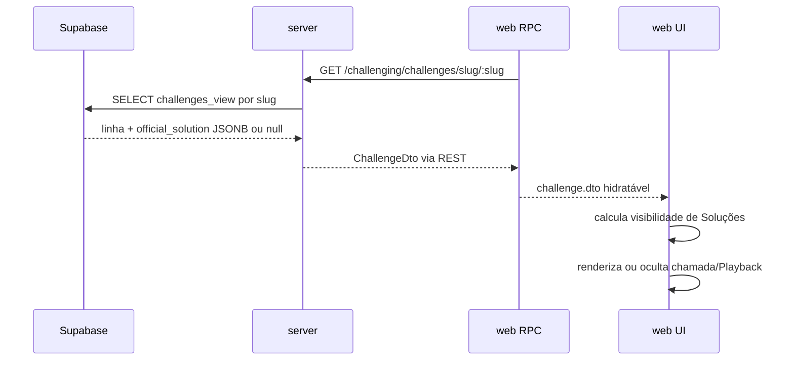

# Parte I — Contract

## 1. Objetivo

Permitir que um desafio disponibilize uma solução oficial opcional e que estudantes
com a aba `Soluções` liberada acessem essa solução por uma chamada destacada e uma
rota própria. A solução será apresentada por um novo Code Playback reutilizável,
capaz de reproduzir snapshots determinísticos da execução, sincronizando código,
linhas ativas, explicação e painéis de estado sem executar o programa no navegador.
O contrato será persistido no desafio, entregue pelo fluxo REST já existente e
preservado pelo domínio antes de ser consumido pela interface.

## 2. Escopo

### 2.1 In-scope

- Definir um contrato JSON serializável e reutilizável para Code Playback.
- Persistir uma solução oficial opcional em cada desafio.
- Entregar a solução oficial no DTO do detalhe do desafio pelo endpoint existente.
- Preservar a solução oficial no round-trip `ChallengeDto -> Challenge -> ChallengeDto`.
- Exibir uma chamada visual destacada somente quando o desafio possuir solução
  oficial e a listagem de soluções estiver visível.
- Criar uma rota estática e um slot exclusivos para a solução oficial, separados
  das soluções publicadas por usuários.
- Aplicar à rota oficial a mesma ocultação client-side já usada pela aba
  `Soluções`.
- Implementar controles de reprodução, navegação por etapas, timeline, velocidades,
  destaque de linhas e modos de layout padrão e expandido.
- Representar input, explicação e painéis ordenados de sequência, escalar, mapa,
  conjunto, grade e resultado.
- Manter navegação determinística para frente e para trás, sem executar código ou
  produzir efeitos colaterais.
- Cobrir os estados com solução, sem solução, bloqueado, reprodução, pausa, limites
  da timeline e responsividade.

### 2.2 Out-of-scope

- Autorização no server, RLS ou redação do payload conforme a liberação da aba
  `Soluções`.
- Novo endpoint exclusivo para buscar a solução oficial depois do desbloqueio.
- Tela ou API de autoria, geração, edição, publicação ou remoção de soluções oficiais.
- Seed ou backfill de soluções oficiais para desafios existentes.
- Reutilização do fluxo de soluções de usuários, incluindo autor, slug, conteúdo
  MDX, votos, visualizações e comentários.
- Geração automática de passos, trace do interpretador, debugger ou execução real
  do código exibido.
- Edição do código da solução oficial.
- Persistência de etapa, velocidade, reprodução ou modo de layout entre sessões.
- Integração do Code Playback em lessons ou outros domínios nesta entrega.
- Suporte inicial a linguagens além de Delégua.
- Alteração das regras de compra, conclusão ou autoria que liberam a aba `Soluções`.

## 3. Requisitos

### 3.1 Funcionais

- **REQ-01 — Contrato e entrega:** o detalhe de um desafio deve aceitar e devolver
  uma solução oficial opcional contendo código, input e uma sequência não vazia de
  snapshots, sem perder o conteúdo durante mapeamento, hidratação ou serialização.
- **REQ-02 — Chamada condicional:** a listagem liberada de soluções deve exibir uma
  chamada destacada para a solução oficial somente quando esse conteúdo existir.
- **REQ-03 — Rota e ocultação:** a chamada deve abrir uma rota estática própria; o
  acesso direto deve usar a mesma ocultação client-side da aba `Soluções`, e a rota
  deve oferecer retorno seguro à listagem quando não houver solução oficial.
- **REQ-04 — Controles do Playback:** o componente deve oferecer play/pause, etapa
  anterior, próxima etapa, timeline, velocidades `0.5x`, `1x` e `2x`, e alternância
  de layout, respeitando os limites da sequência e parando ao final. Pausa, avanço,
  retorno e seek devem permanecer habilitados durante autoplay; avanço, retorno e
  seek manuais não pausam a reprodução, enquanto play/pause é a ação explícita que
  muda esse estado.
- **REQ-05 — Snapshot sincronizado:** cada etapa deve trocar atomicamente linhas
  ativas, explicação e painéis de estado ordenados, preservando o input; voltar a uma
  etapa deve restaurar exatamente o mesmo snapshot. Uma etapa pode destacar
  múltiplas linhas ou intervalos de linhas, e o editor deve rolar para o primeiro
  intervalo fora da área visível sem esconder o contexto próximo.
- **REQ-06 — Visualização de estado:** o Playback deve renderizar sequências,
  escalares, mapas, conjuntos, grades e resultados, incluindo índices, ponteiros e
  destaques simples, múltiplos ou por intervalo quando declarados no payload.
  Coleções vazias devem possuir estado vazio explícito; o input textual deve
  preservar quebras de linha e espaços; inputs e valores extensos devem usar wrap ou
  scroll conforme o contrato sem quebrar o layout.
- **REQ-07 — Layouts:** o modo padrão deve empilhar controles, estado, explicação e
  código; o modo expandido deve usar estado e código lado a lado quando houver
  largura e cair para disposição vertical em viewport estreita, sem perder a etapa
  ou o estado de reprodução.

### 3.2 Não funcionais

- **REQ-08 — Acessibilidade e responsividade:** todos os controles devem ser
  operáveis por teclado, possuir nome acessível e estado perceptível sem depender
  apenas de cor; conteúdo e controles não podem se sobrepor e devem manter scroll
  previsível.
- **REQ-09 — Determinismo e segurança de execução:** navegar ou reproduzir snapshots
  não deve executar código, chamar LSP, mutar o payload recebido ou disparar requests.
- **REQ-10 — Limite arquitetural:** a solução oficial é um campo controlado pelo
  server para leitura, não integra schemas de criação/edição de desafios e não cria
  um segundo modelo de `Solution`; a proteção desta entrega é somente visual.
- **REQ-11 — Eficiência do transporte:** o JSON potencialmente volumoso deve ser
  carregado no detalhe do desafio, mas não deve ser acrescentado à projeção da
  listagem paginada de desafios.

## 4. Contract de Aceitação

### 4.1 Pré-condições e fixtures

- Supabase local migrado com um desafio sem solução oficial e outro desafio com uma
  solução oficial válida.
- A fixture válida contém pelo menos três etapas, múltiplas linhas ativas e ao menos
  um painel de cada tipo suportado.
- Usuário autenticado com acesso liberado à aba `Soluções`.
- Usuário autenticado sem acesso liberado à aba `Soluções`.
- Visitante não autenticado.
- Navegador desktop e viewport móvel usados pelos testes de integração da web.
- O desafio com solução oficial está acessível pelo fluxo de detalhe já existente.

Fixture normativa mínima do contrato; as propriedades, discriminadores e valores
permitidos são definidos integralmente na seção técnica:

```json
{
  "code": "funcao doisSoma(nums, alvo) {\n  var vistos = {}\n  para (var i = 0; i < nums.tamanho(); i++) {\n    var complemento = alvo - nums[i]\n    se (vistos[complemento] != nulo) retorna [vistos[complemento], i]\n    vistos[nums[i]] = i\n  }\n}",
  "input": {
    "content": "nums = [2, 7, 11, 15]\nalvo = 9",
    "overflow": "scroll"
  },
  "steps": [
    {
      "activeLineRanges": [
        { "startLine": 2, "endLine": 2 },
        { "startLine": 3, "endLine": 4 }
      ],
      "explanation": "Inicia o mapa e calcula o complemento do primeiro item.",
      "panels": [
        {
          "type": "sequence",
          "title": "NUMS",
          "kind": "array",
          "items": [2, 7, 11, 15],
          "showIndices": true,
          "pointers": [
            { "label": "i", "index": 0 },
            { "label": "j", "index": 1 }
          ],
          "highlights": [
            { "startIndex": 0, "endIndex": 1, "state": "active" }
          ],
          "overflow": "wrap"
        },
        {
          "type": "scalar",
          "title": "ALVO",
          "value": 9,
          "state": "active"
        },
        {
          "type": "map",
          "title": "VISTOS",
          "entries": [],
          "emptyLabel": "Vazio"
        },
        {
          "type": "set",
          "title": "VISITADOS",
          "items": [],
          "emptyLabel": "Vazio"
        },
        {
          "type": "grid",
          "title": "COMPARAÇÕES",
          "rows": [
            [
              { "value": 2, "state": "active" },
              { "value": 7, "state": "matched" }
            ],
            [
              { "value": 11 },
              { "value": 15 }
            ]
          ],
          "showIndices": true
        },
        {
          "type": "result",
          "title": "RESULTADO",
          "value": null,
          "status": "neutral"
        }
      ]
    },
    {
      "activeLineRanges": [
        { "startLine": 5, "endLine": 6 }
      ],
      "explanation": "Registra o primeiro índice e encontra o complemento.",
      "panels": [
        {
          "type": "sequence",
          "title": "NUMS",
          "kind": "array",
          "items": [2, 7, 11, 15],
          "showIndices": true,
          "pointers": [{ "label": "i", "index": 1 }],
          "highlights": [
            { "startIndex": 0, "endIndex": 0, "state": "visited" },
            { "startIndex": 1, "endIndex": 1, "state": "matched" }
          ]
        },
        {
          "type": "map",
          "title": "VISTOS",
          "entries": [{ "key": "2", "value": 0, "state": "visited" }]
        }
      ]
    },
    {
      "activeLineRanges": [
        { "startLine": 5, "endLine": 5 }
      ],
      "explanation": "Retorna os índices que formam o alvo.",
      "panels": [
        {
          "type": "result",
          "title": "RESULTADO",
          "value": [0, 1],
          "status": "success",
          "overflow": "scroll"
        }
      ]
    }
  ]
}
```

### 4.2 Interfaces observáveis

- **Entrada persistida:** coluna JSONB anulável da tabela de desafios.
- **Saída REST:** `ChallengeDto.officialSolution`, com valor válido ou `null`.
- **Entrada da UI:** DTO hidratado no `ChallengeStore`.
- **Rotas web:**
  `/challenging/challenges/:challengeSlug/challenge/solutions` e
  `/challenging/challenges/:challengeSlug/challenge/solutions/official`.
- **Ações do usuário:** abrir a chamada oficial, play/pause, anterior/próxima,
  selecionar etapa na timeline, mudar velocidade, expandir/recolher e pressionar
  `Escape` no modo expandido.
- **Limites:** primeira e última etapa, payload ausente, aba bloqueada, viewport
  estreita e conteúdo maior que a área disponível.

### 4.3 Critérios

| ID | Requisito | Dado | Quando | Então | Evidência esperada |
| --- | --- | --- | --- | --- | --- |
| AC-01 | REQ-01 | Dado um desafio persistido com solução oficial válida | Quando seu detalhe é buscado pela API | Então a resposta contém o mesmo código, input, ordem de etapas, linhas, explicações e painéis persistidos | Integração server e round-trip do domínio |
| AC-02 | REQ-01 | Dado um desafio persistido com `official_solution = null` | Quando seu detalhe é buscado pela API | Então `officialSolution` é `null` e a página continua carregando normalmente | Integração server e browser |
| AC-03 | REQ-02 | Dado um usuário com a aba `Soluções` liberada e um desafio com solução oficial | Quando a listagem de soluções é renderizada | Então uma chamada destacada e identificada como solução oficial da plataforma é exibida antes das soluções de usuários | Teste de widget e browser |
| AC-04 | REQ-02 | Dado um usuário com a aba `Soluções` liberada e um desafio sem solução oficial | Quando a listagem de soluções é renderizada | Então nenhuma chamada de solução oficial é exibida | Teste de widget |
| AC-05 | REQ-03 | Dado que a chamada oficial está visível | Quando o usuário a aciona | Então a URL termina em `/solutions/official`, a aba ativa continua sendo `Soluções` e o Code Playback é exibido | Teste de rota e browser |
| AC-06 | REQ-03 | Dado um visitante ou usuário sem acesso à aba `Soluções` | Quando acessa diretamente `/solutions/official` | Então o diálogo de conteúdo bloqueado atual é exibido e nenhum conteúdo do Playback é renderizado na interface | Teste de rota e browser |
| AC-07 | REQ-03 | Dado um desafio sem solução oficial | Quando sua rota `/solutions/official` é acessada com a aba liberada | Então a interface informa indisponibilidade e oferece retorno à listagem de soluções sem lançar erro | Teste de widget e rota |
| AC-08 | REQ-04 | Dado um Playback em autoplay numa etapa intermediária | Quando o usuário aciona anterior, próxima, uma posição da timeline ou pause | Então todos os controles respondem imediatamente; anterior, próxima e seek preservam autoplay, pause o interrompe, e os limites continuam desabilitados ou ignorados | Teste do hook e da View |
| AC-09 | REQ-04 | Dado um Playback com três ou mais etapas | Quando o usuário inicia a reprodução em `0.5x`, `1x` ou `2x` | Então a progressão usa o intervalo correspondente, não cria timers concorrentes e para pausada na última etapa | Teste do hook com relógio controlado |
| AC-10 | REQ-05 | Dado um payload com snapshots distintos | Quando o usuário avança e depois retorna | Então linhas ativas, explicação e todos os painéis voltam exatamente aos valores e à ordem da etapa anterior, enquanto o input permanece inalterado | Teste do hook e da View |
| AC-11 | REQ-06 | Dado um snapshot com todos os tipos de painel e metadados visuais | Quando a etapa é renderizada | Então sequências, escalares, mapas, conjuntos, grades e resultados aparecem na ordem declarada, com índices, ponteiros e destaques aplicáveis | Teste da View |
| AC-12 | REQ-07 | Dado um Playback em reprodução numa etapa intermediária | Quando o usuário expande e recolhe o layout | Então etapa, velocidade e estado play/pause são preservados; em desktop estado e código ficam lado a lado | Teste da View e browser |
| AC-13 | REQ-07 | Dado o modo expandido em viewport estreita | Quando o conteúdo ultrapassa a área visível | Então estado e código ficam em disposição vertical, com scroll interno e sem sobreposição de controles | Browser em viewport móvel |
| AC-14 | REQ-05 | Dado um passo com dois intervalos de linhas ativas, incluindo um fora da área visível | Quando o passo é exibido, avançado ou restaurado | Então todos os intervalos são destacados juntos, o primeiro intervalo externo é revelado e linhas próximas permanecem visíveis | Teste do CodeEditor e browser |
| AC-15 | REQ-06 | Dado input com espaços e quebras de linha e painéis com valores extensos | Quando a etapa é renderizada com overflow `wrap` ou `scroll` | Então a formatação textual é preservada e o conteúdo usa o tratamento declarado sem ampliar ou sobrepor o layout | Teste da View e browser em viewport estreita |
| AC-16 | REQ-06 | Dado sequências, mapas, sets ou grids vazios, múltiplos ponteiros e destaques simples ou por intervalo | Quando os painéis são renderizados | Então cada coleção vazia mostra `emptyLabel` ou `Vazio`, cada ponteiro aponta para o índice declarado e todos os destaques aparecem no estado visual declarado | Teste da View com a fixture normativa |
| AR-01 | REQ-08 | Dado um usuário que navega somente por teclado | Quando percorre e aciona todos os controles | Então foco visível, nomes acessíveis, valores da timeline e estados pressionado/desabilitado são anunciáveis, e `Escape` recolhe o modo expandido | Inspeção de acessibilidade e browser |
| AR-02 | REQ-09 | Dado qualquer sequência de play, pause, seek, avanço e retorno | Quando o Playback muda de etapa | Então não ocorre request, chamada LSP, execução de código nem mutação do DTO de entrada | Teste do hook com spies e congelamento da fixture |
| AR-03 | REQ-10 | Dado um payload de criação ou edição de desafio contendo `officialSolution` | Quando ele passa pelos schemas públicos existentes | Então o campo não participa do input persistido; somente a coluna administrada fora desse fluxo é lida no detalhe | Inspeção dos schemas e integração server |
| AR-04 | REQ-10 | Dado um visitante ou usuário bloqueado que abre o detalhe do desafio | Quando a resposta REST é inspecionada | Então o JSON pode conter `officialSolution`, mas a interface não o renderiza; esta exposição é aceita como limite explícito desta entrega | Integração server e browser |
| AR-05 | REQ-11 | Dado desafios com soluções oficiais volumosas | Quando a listagem paginada de desafios é consultada | Então a projeção da listagem não contém `official_solution`, enquanto a consulta por slug continua retornando o campo | Integração server |

<!-- harness:evidence {"criterion":"AC-01","command":["npm","run","test:unit","-w","@stardust/core"]} -->
<!-- harness:evidence {"criterion":"AC-01","command":["npm","run","test:integration","-w","@stardust/server"]} -->
<!-- harness:evidence {"criterion":"AC-05","command":["npm","run","test:integration","-w","@stardust/web"]} -->
<!-- harness:evidence {"criterion":"AC-09","command":["npm","run","test:unit","-w","@stardust/web"]} -->
<!-- harness:evidence {"criterion":"AR-03","command":["npm","run","test:integration","-w","@stardust/server"]} -->
<!-- harness:evidence {"criterion":"AR-05","command":["npm","run","test:integration","-w","@stardust/server"]} -->

# Parte II — Especificação Técnica

## 5. O que já existe?

### Core

- **ChallengeDto**
  (`packages/core/src/challenging/domain/entities/dtos/ChallengeDto.ts`) — contrato
  do desafio transportado pelo server e pela web; ainda não possui solução oficial.
- **Challenge**
  (`packages/core/src/challenging/domain/entities/Challenge.ts`) — entidade recriada
  nas bordas server e web; seu getter `dto` precisa preservar qualquer campo novo.
- **ChallengeFactory**
  (`packages/core/src/challenging/domain/factories/ChallengeFactory.ts`) — converte o
  DTO recebido para as props da entidade.
- **ChallengesFaker**
  (`packages/core/src/challenging/domain/entities/fakers/ChallengesFaker.ts`) — fonte
  de DTOs de desafio usada pelo domínio e por consumidores.
- **CodeSelectionDto**
  (`packages/core/src/global/domain/structures/dtos/CodeSelectionDto.ts`) — referência
  de contrato global baseado em linhas.
- **ChallengeCodeExecution**
  (`packages/core/src/challenging/domain/structures/ChallengeCodeExecution.ts`) —
  referência de structure criada de DTO e serializada de volta; representa uma
  tentativa real e não será reutilizada como Playback.
- **SolutionDto**
  (`packages/core/src/challenging/domain/entities/dtos/SolutionDto.ts`) — contrato de
  solução publicada por usuário, deliberadamente separado da solução oficial.

### Server / Database

- **Challenges table e challenges_view**
  (`apps/server/src/database/supabase/types/Database.ts`) — tipos gerados da tabela e
  da view usadas para leitura; ainda não possuem `official_solution`.
- **SupabaseChallengeMapper**
  (`apps/server/src/database/supabase/mappers/challenging/SupabaseChallengeMapper.ts`)
  — converte linhas da view para `ChallengeDto`.
- **SupabaseChallengesRepository**
  (`apps/server/src/database/supabase/repositories/challenging/SupabaseChallengesRepository.ts`)
  — busca detalhes pela view e listagens pela RPC `list_challenges`; criação e edição
  usam payloads explícitos.
- **Migration de campo do desafio**
  (`apps/server/supabase/migrations/20260716120000_add_challenge_is_evaluated_by_function.sql`)
  — referência recente para alterar a tabela, recriar a view e refletir tipos.
- **ChallengesRouter**
  (`apps/server/src/app/hono/routers/challenging/ChallengesRouter.ts`) — já expõe o
  detalhe do desafio por slug; nenhuma rota nova é necessária.
- **challengeSchema**
  (`packages/validation/src/modules/challenging/schemas/challengeSchema.ts`) — valida
  inputs de criação e edição; deve continuar sem o campo controlado pelo server.

### Web / RPC e hidratação

- **ChallengePageContent**
  (`apps/web/src/app/challenging/challenges/[challengeSlug]/challenge/ChallengePageContent.tsx`)
  — carrega o detalhe autenticado ou público e o entrega à página.
- **AccessChallengePageAction**
  (`apps/web/src/rpc/actions/challenging/AccessChallengePageAction.ts`) — recria
  `Challenge` com a resposta REST e devolve `challenge.dto`.
- **useChallengePage**
  (`apps/web/src/ui/challenging/widgets/pages/Challenge/useChallengePage.ts`) —
  hidrata o store, compara manualmente os campos do desafio e deriva a aba ativa da
  URL.
- **ChallengeStore**
  (`apps/web/src/ui/challenging/stores/ChallengeStore/index.ts`) — mantém a entidade
  `Challenge`, a visibilidade dos conteúdos e a aba ativa.

### Web / UI e rotas

- **ChallengeSolutionsSlot**
  (`apps/web/src/ui/challenging/widgets/slots/ChallengeSolutions/index.tsx`) — lista
  soluções de usuários e já é envolvido pelo bloqueio visual de `Soluções`.
- **useChallengeSolutionsSlot**
  (`apps/web/src/ui/challenging/widgets/slots/ChallengeSolutions/useChallengeSolutionsSlot.ts`)
  — lê o desafio do store e busca separadamente as soluções publicadas.
- **BlockedContentAlertDialog**
  (`apps/web/src/ui/challenging/widgets/components/BlockedContentMessage/index.tsx`)
  — aplica a verificação client-side usada em acesso direto a conteúdos bloqueados.
- **Detalhe de solução de usuário**
  (`apps/web/src/app/challenging/challenges/[challengeSlug]/challenge/@tabContent/solutions/[solutionSlug]/page.tsx`)
  — referência de rota aninhada em slot paralelo.
- **Default de solução de usuário**
  (`apps/web/src/app/challenging/challenges/[challengeSlug]/challenge/@tabContent/solutions/[solutionSlug]/default.tsx`)
  — referência necessária para acesso direto e navegação no slot paralelo.
- **ROUTES**
  (`apps/web/src/constants/routes.ts`) — concentra URLs da página de desafio e das
  soluções.
- **CodeEditor**
  (`apps/web/src/ui/global/widgets/components/CodeEditor/index.tsx`) — Monaco
  compartilhado com modo read-only, ainda sem API de linhas destacadas.
- **useCodeEditor**
  (`apps/web/src/ui/global/widgets/components/CodeEditor/useCodeEditor.ts`) — mantém a
  instância Monaco e os providers, permitindo aplicar e limpar decorations.
- **Slider**
  (`apps/web/src/ui/global/widgets/components/Slider/index.tsx`) — base Radix
  reutilizável para a timeline.
- **Speaker**
  (`apps/web/src/ui/global/widgets/components/Speaker/index.tsx`) — referência local
  de play/pause, velocidade e limpeza de reprodução.

## 6. O que deve ser criado?

### Core (Structures DTOs)

- **Localização:** `packages/core/src/global/domain/structures/dtos/CodePlaybackDto.ts` **(novo arquivo)**.
- **Responsabilidade:** definir somente dados públicos e JSON serializáveis:
  `CodePlaybackDto`, `CodePlaybackStepDto`, `CodePlaybackPanelDto`,
  `CodePlaybackValue`, estados de destaque e as variantes discriminadas
  `sequence`, `scalar`, `map`, `set`, `grid` e `result`.
- **Contrato normativo:**

```ts
type CodePlaybackPrimitive = string | number | boolean | null

type CodePlaybackValue =
  | CodePlaybackPrimitive
  | CodePlaybackValue[]
  | { [key: string]: CodePlaybackValue }

type CodePlaybackOverflow = 'wrap' | 'scroll'

type CodePlaybackVisualState =
  | 'active'
  | 'visited'
  | 'matched'
  | 'success'
  | 'error'
  | 'muted'

type CodePlaybackInputDto = {
  content: string
  overflow: CodePlaybackOverflow
}

type CodePlaybackLineRangeDto = {
  startLine: number
  endLine: number
}

type CodePlaybackPointerDto = {
  label: string
  index: number
}

type CodePlaybackHighlightRangeDto = {
  startIndex: number
  endIndex: number
  state: CodePlaybackVisualState
}

type CodePlaybackStateItemDto = {
  value: CodePlaybackValue
  state?: CodePlaybackVisualState
}

type CodePlaybackPanelBaseDto = {
  title: string
  overflow?: CodePlaybackOverflow
  emptyLabel?: string
}

type CodePlaybackSequencePanelDto = CodePlaybackPanelBaseDto & {
  type: 'sequence'
  kind: 'array' | 'string' | 'list'
  items: CodePlaybackValue[]
  showIndices: boolean
  pointers?: CodePlaybackPointerDto[]
  highlights?: CodePlaybackHighlightRangeDto[]
}

type CodePlaybackScalarPanelDto = CodePlaybackPanelBaseDto & {
  type: 'scalar'
  value: CodePlaybackValue
  state?: CodePlaybackVisualState
}

type CodePlaybackMapPanelDto = CodePlaybackPanelBaseDto & {
  type: 'map'
  entries: Array<{
    key: string | number
    value: CodePlaybackValue
    state?: CodePlaybackVisualState
  }>
}

type CodePlaybackSetPanelDto = CodePlaybackPanelBaseDto & {
  type: 'set'
  items: CodePlaybackStateItemDto[]
}

type CodePlaybackGridPanelDto = CodePlaybackPanelBaseDto & {
  type: 'grid'
  rows: CodePlaybackStateItemDto[][]
  showIndices: boolean
}

type CodePlaybackResultPanelDto = CodePlaybackPanelBaseDto & {
  type: 'result'
  value: CodePlaybackValue
  status: 'neutral' | 'success' | 'error'
}

type CodePlaybackPanelDto =
  | CodePlaybackSequencePanelDto
  | CodePlaybackScalarPanelDto
  | CodePlaybackMapPanelDto
  | CodePlaybackSetPanelDto
  | CodePlaybackGridPanelDto
  | CodePlaybackResultPanelDto

type CodePlaybackStepDto = {
  activeLineRanges: CodePlaybackLineRangeDto[]
  explanation: string
  panels: CodePlaybackPanelDto[]
}

type CodePlaybackDto = {
  code: string
  input: CodePlaybackInputDto
  steps: CodePlaybackStepDto[]
}
```

- **Semântica:**
  - números devem ser finitos; `undefined`, `NaN`, `Infinity`, funções, símbolos e
    referências cíclicas não pertencem a `CodePlaybackValue`;
  - `steps` preserva ordem, contém ao menos um item e cada item é um snapshot
    completo, sem deltas;
  - `activeLineRanges` contém ao menos um intervalo, usa linhas iniciadas em `1` e
    exige inteiros com `1 <= startLine <= endLine <= total de linhas do código`;
  - títulos, explicações e labels de ponteiro são strings não vazias após trim;
  - `pointers[].index` usa base `0`, deve existir em `items` e labels são únicas por
    sequência; múltiplos ponteiros podem compartilhar o mesmo índice;
  - um destaque simples usa `startIndex === endIndex`; múltiplos destaques usam
    múltiplos itens; intervalos usam extremidades inclusivas. Os intervalos devem
    estar dentro de `items` e não podem se sobrepor;
  - arrays preservam ordem; objetos de `CodePlaybackValue` são apenas valores
    editoriais, enquanto mapas usam `entries` ordenadas para não depender da ordem de
    chaves JSON;
  - coleções vazias são válidas. Para `sequence.items`, `map.entries`, `set.items` ou
    `grid.rows` vazios, a View mostra `emptyLabel` ou o fallback `Vazio`;
  - grids não vazios são retangulares; cada célula e cada item de set pode declarar
    seu próprio estado visual, permitindo múltiplos destaques;
  - `overflow` ausente usa `wrap`; `input.overflow` é obrigatório. Em ambos os casos
    `wrap` preserva todo o valor com quebra controlada e `scroll` mantém uma região
    rolável sem truncar conteúdo;
  - `input.content` é exibido como texto preformatado, preservando whitespace e
    quebras de linha.

### Core (Structures)

- **Localização:** `packages/core/src/global/domain/structures/CodePlayback.ts` **(novo arquivo)**.
- **Dependências:** `Text`, `List` e os DTOs do Code Playback.
- **Métodos:**
  - `static create(dto: CodePlaybackDto): CodePlayback` — valida recursivamente o
    contrato normativo, inclusive JSON finito/acíclico, passos, linhas, painéis,
    grids, ponteiros e destaques, e guarda uma cópia independente.
  - `get dto(): CodePlaybackDto` — devolve um snapshot serializável e preserva ordem,
    valores e metadados sem compartilhar referências mutáveis.
- **Responsabilidade:** ser a validação runtime na entrada do JSONB e garantir o
  round-trip do conteúdo oficial sem executar, interpretar ou enriquecer o código.

### Core (Fakers)

- **Localização:** `packages/core/src/global/domain/structures/fakers/CodePlaybacksFaker.ts` **(novo arquivo)**.
- **Métodos:**
  - `static fakeDto(overrides?: Partial<CodePlaybackDto>): CodePlaybackDto` — fornece
    um Playback pequeno, válido e determinístico para consumidores do contrato.

### Database (Migrations)

- **Localização:**
  `apps/server/supabase/migrations/20260723120000_add_challenge_official_solution.sql` **(novo arquivo)**.
- **Objetivo:** adicionar solução oficial opcional ao desafio e expô-la apenas na
  view usada pelo detalhe.
- **Escopo SQL:**
  - adicionar `official_solution jsonb null` a `public.challenges`;
  - recriar `public.challenges_view` com `official_solution` ao final da projeção;
  - preservar a projeção de `public.list_challenges` sem o campo volumoso;
  - não fazer backfill e manter desafios existentes com `null`.
- **Segurança:** não alterar policies, RLS ou grants; a coluna acompanha a
  legibilidade pública já existente do detalhe do desafio.
- **Reflexos:** regenerar os tipos Supabase e adaptar mapper/repository para a
  diferença entre a view de detalhe e a projeção de listagem.

### UI (Widgets) — Code Playback

- **Localização:** `apps/web/src/ui/global/widgets/components/CodePlayback/index.tsx` **(novo arquivo)**.
- **Props:** `playback: CodePlaybackDto`.
- **Estados:** Content; payload vazio ou inválido deve ser impedido pela structure
  antes de chegar ao widget.
- **Index:** instancia `useCodePlayback`, mantém integrações e entrega apenas props
  de renderização e callbacks à View.
- **View:** `apps/web/src/ui/global/widgets/components/CodePlayback/CodePlaybackView.tsx` **(novo arquivo)** — compõe controles, input, painéis, explicação e CodeEditor
  read-only nos layouts padrão e expandido.
- **Hook:** `apps/web/src/ui/global/widgets/components/CodePlayback/useCodePlayback.ts` **(novo arquivo)**.
- **Estado do hook:** etapa atual iniciada em `0`, `isPlaying = false`,
  `speed = '1x'` e `isExpanded = false`.
- **Métodos do hook:**
  - `play(): void` e `pause(): void` — controlam um único timer.
  - `goToPreviousStep(): void` e `goToNextStep(): void` — respeitam limites.
  - `seek(stepIndex: number): void` — seleciona diretamente uma etapa válida.
  - `changeSpeed(speed: CodePlaybackSpeed): void` — troca o intervalo sem duplicar
    timers.
  - `toggleExpanded(): void` — alterna layout preservando etapa, velocidade e
    reprodução.
  - `collapse(): void` — recolhe o modo expandido, inclusive por `Escape`.
- **Temporização:** intervalo-base de `1000 ms`; `0.5x`, `1x` e `2x` correspondem
  respectivamente a `2000 ms`, `1000 ms` e `500 ms`. Chegar à última etapa pausa e
  limpa o timer. Anterior, próxima e seek continuam funcionais durante autoplay e
  não o pausam. Desmontagem e troca de payload também limpam o timer.
- **Tipo:** `apps/web/src/ui/global/widgets/components/CodePlayback/types/CodePlaybackSpeed.ts` **(novo arquivo)** — união `'0.5x' | '1x' | '2x'`.
- **Widgets internos:**
  - `apps/web/src/ui/global/widgets/components/CodePlayback/CodePlaybackControls/index.tsx` **(novo arquivo)** — entry point dos controles;
  - `apps/web/src/ui/global/widgets/components/CodePlayback/CodePlaybackControls/CodePlaybackControlsView.tsx` **(novo arquivo)** — botões, seletor de velocidade, timeline e indicador;
  - `apps/web/src/ui/global/widgets/components/CodePlayback/CodePlaybackPanel/index.tsx` **(novo arquivo)** — seleciona a View por discriminador sem estado próprio;
  - `apps/web/src/ui/global/widgets/components/CodePlayback/CodePlaybackPanel/CodePlaybackPanelView.tsx` **(novo arquivo)** — renderiza todos os formatos de painel.
- **Acessibilidade:** botões nativos, `aria-label`, `aria-pressed`,
  `aria-valuetext`, foco visível, estados disabled e região `aria-live="polite"`
  para posição e explicação. Cor de destaque sempre acompanha borda, ícone, label
  ou peso visual.
- **Estrutura de pastas:**

```text
CodePlayback/
├── index.tsx
├── CodePlaybackView.tsx
├── useCodePlayback.ts
├── types/
│   └── CodePlaybackSpeed.ts
├── CodePlaybackControls/
│   ├── index.tsx
│   └── CodePlaybackControlsView.tsx
└── CodePlaybackPanel/
    ├── index.tsx
    └── CodePlaybackPanelView.tsx
```

### UI (Widgets) — Solução oficial

- **Card oficial — localização:**
  `apps/web/src/ui/challenging/widgets/slots/ChallengeSolutions/OfficialSolutionCard/index.tsx` **(novo arquivo)**.
- **Card oficial — props:** `challengeSlug: string`.
- **Card oficial — View:**
  `apps/web/src/ui/challenging/widgets/slots/ChallengeSolutions/OfficialSolutionCard/OfficialSolutionCardView.tsx` **(novo arquivo)** — chamada destacada, identificada como conteúdo oficial da
  plataforma e ligada à rota estática.
- **Slot oficial — localização:**
  `apps/web/src/ui/challenging/widgets/slots/ChallengeOfficialSolution/index.tsx` **(novo arquivo)**.
- **Slot oficial — estados:** Blocked, Empty e Content. O estado Loading não se
  aplica porque o conteúdo já está hidratado no store.
- **Slot oficial — Index:** resolve `useChallengeStore`, extrai
  `officialSolution?.dto` e o slug, cria a URL de retorno, envolve toda a
  renderização com `BlockedContentAlertDialog content='solution'` e passa somente
  dados serializáveis à View.
- **Slot oficial — View:**
  `apps/web/src/ui/challenging/widgets/slots/ChallengeOfficialSolution/ChallengeOfficialSolutionSlotView.tsx` **(novo arquivo)** — cabeçalho, retorno à listagem, estado indisponível e Code
  Playback.
- **Hook:** não aplicável; o slot não possui estado ou efeito de UI próprio e sua
  integração com o store permanece no Entry Point.

### Next.js App (Pages)

- **Localização:**
  `apps/web/src/app/challenging/challenges/[challengeSlug]/challenge/@tabContent/solutions/official/page.tsx` **(novo arquivo)**.
- **Widget principal:** `ChallengeOfficialSolutionSlot`.
- **Caminho:** `/challenging/challenges/:challengeSlug/challenge/solutions/official`.
- **Localização:**
  `apps/web/src/app/challenging/challenges/[challengeSlug]/challenge/@tabContent/solutions/official/default.tsx` **(novo arquivo)**.
- **Widget principal:** `ChallengeOfficialSolutionSlot`.
- **Responsabilidade:** manter o slot paralelo renderizável em navegação client-side
  e acesso direto, seguindo o detalhe de solução de usuário existente.

## 7. O que deve ser modificado?

### Core

- **Arquivo:**
  `packages/core/src/global/domain/structures/dtos/index.ts`.
- **Mudança:** exportar os contratos do Code Playback.
- **Justificativa:** disponibilizar o DTO pela exportação pública já usada pelo
  monorepo.
- **Arquivo:**
  `packages/core/src/global/domain/structures/index.ts`.
- **Mudança:** exportar `CodePlayback`.
- **Justificativa:** permitir hidratação compartilhada no domínio e nas bordas.
- **Arquivo:**
  `packages/core/src/global/domain/structures/fakers/index.ts`.
- **Mudança:** exportar `CodePlaybacksFaker`.
- **Justificativa:** manter o padrão de fakers para objetos complexos.
- **Arquivo:**
  `packages/core/src/challenging/domain/entities/dtos/ChallengeDto.ts`.
- **Mudança:** adicionar `officialSolution?: CodePlaybackDto | null`.
- **Justificativa:** transportar o conteúdo opcional sem criar um recurso de solução
  de usuário.
- **Arquivo:**
  `packages/core/src/challenging/domain/entities/Challenge.ts`.
- **Mudança:** adicionar `officialSolution: CodePlayback | null` às props, expor um
  getter read-only e serializar `officialSolution?.dto ?? null`.
- **Justificativa:** impedir que as duas recriações da entidade descartem o campo.
- **Arquivo:**
  `packages/core/src/challenging/domain/factories/ChallengeFactory.ts`.
- **Mudança:** criar a structure quando o DTO tiver solução e usar `null` quando o
  campo estiver ausente.
- **Justificativa:** centralizar a conversão DTO-entidade.
- **Arquivo:**
  `packages/core/src/challenging/domain/entities/fakers/ChallengesFaker.ts`.
- **Mudança:** aceitar override de `officialSolution`, mantendo `null` como padrão.
- **Justificativa:** cobrir desafios legados e consumidores do novo contrato.

### Server / Database

- **Arquivo:**
  `apps/server/src/database/supabase/types/Database.ts`.
- **Mudança:** refletir `official_solution: Json | null` nos tipos Row/Insert/Update
  da tabela e Row da view, conforme a regeneração do schema.
- **Justificativa:** manter o client Supabase tipado após a migration.
- **Arquivo:**
  `apps/server/src/database/supabase/mappers/challenging/SupabaseChallengeMapper.ts`.
- **Mudança:** aceitar tanto a linha completa do detalhe quanto a projeção enxuta da
  listagem e mapear `official_solution` ausente ou nulo para
  `officialSolution: null`.
- **Justificativa:** preservar um único mapper sem obrigar a RPC de listagem a
  transportar o JSON.
- **Arquivo:**
  `apps/server/src/database/supabase/repositories/challenging/SupabaseChallengesRepository.ts`.
- **Mudança:** tipar explicitamente a projeção da RPC sem `official_solution`, manter
  o campo fora dos payloads manuais de `add`/`replace` e eliminar a consulta
  duplicada existente em `findBySlug`, usando o resultado da única consulta.
- **Justificativa:** o conteúdo é controlado pelo server, a listagem deve permanecer
  leve e o detalhe não deve transferir o novo JSON duas vezes.
### Web / hidratação e navegação

- **Arquivo:**
  `apps/web/src/ui/challenging/widgets/pages/Challenge/useChallengePage.ts`.
- **Mudança:** incluir `officialSolution` no payload comparável de hidratação e
  resolver qualquer URL sob `/solutions` como `activeContent = 'solutions'`, em vez
  de converter o último segmento para `ChallengeContent`.
- **Justificativa:** evitar conteúdo oficial stale e impedir que `official` ou o slug
  de uma solução de usuário se tornem uma aba inexistente.
- **Arquivo:**
  `apps/web/src/constants/routes.ts`.
- **Mudança:** adicionar
  `challengeSolutions.official(challengeSlug: string): string`.
- **Justificativa:** centralizar a URL estática da solução oficial.

### Web / soluções

- **Arquivo:**
  `apps/web/src/ui/challenging/widgets/slots/ChallengeSolutions/index.tsx`.
- **Mudança:** resolver `useRestContext`, `useAuthContext` e `useChallengeStore` no
  Entry Point; passar `challengingService`, `user` e `challenge` como dependências
  explícitas ao hook; derivar `hasOfficialSolution` no Entry Point; delegar toda a
  marcação visual para uma nova View.
- **Justificativa:** inserir a chamada oficial respeitando o Widget Pattern.
- **Arquivo:**
  `apps/web/src/ui/challenging/widgets/slots/ChallengeSolutions/useChallengeSolutionsSlot.ts`.
- **Mudança:** receber `{ challengingService, user, challenge }` por parâmetro,
  remover chamadas diretas a `useRestContext`, `useAuthContext` e
  `useChallengeStore`, e manter somente estado, cache, efeitos e handlers da
  listagem.
- **Justificativa:** hooks de widget não resolvem contexts, services ou stores; essas
  integrações pertencem ao Entry Point.
- **Arquivo:**
  `apps/web/src/ui/challenging/widgets/slots/ChallengeSolutions/ChallengeSolutionsSlotView.tsx` **(novo arquivo)**.
- **Mudança:** receber estado e callbacks do entry point, renderizar o card oficial
  antes dos filtros e da lista quando `hasOfficialSolution` for verdadeiro.
- **Justificativa:** separar apresentação das integrações do slot monolítico atual.

### Web / CodeEditor

- **Arquivo:**
  `apps/web/src/ui/global/widgets/components/CodeEditor/index.tsx`.
- **Mudança:** aceitar
  `highlightedLineRanges?: CodePlaybackLineRangeDto[]` e repassá-los ao hook,
  mantendo o comportamento atual quando a prop não for informada.
- **Justificativa:** reutilizar o Monaco read-only sem duplicar editor no Playback.
- **Arquivo:**
  `apps/web/src/ui/global/widgets/components/CodeEditor/useCodeEditor.ts`.
- **Mudança:** aplicar decorations de linha inteira ao montar e sempre que
  `highlightedLineRanges` mudar, criar uma decoration para cada intervalo, revelar o
  início do primeiro intervalo fora da viewport com contexto, limpar decorations
  anteriores e descartá-las no unmount.
- **Justificativa:** sincronizar a etapa com o código e evitar decorations stale.
- **Arquivo:**
  `apps/web/src/ui/global/styles/global.css`.
- **Mudança:** adicionar a classe visual da linha ativa usando tokens/cores do tema e
  contraste perceptível também por borda.
- **Justificativa:** o Monaco exige classe CSS para a decoration de linha inteira.

## 8. O que deve ser removido?

**Não aplicável.** Nenhum arquivo, rota, coluna ou fluxo existente será removido.

## 9. Decisões Técnicas

### Code Playback incluído nesta Spec

- **Decisão:** ampliar a entrega para implementar o Playback, além da chamada e da
  rota da solução oficial.
- **Alternativas consideradas:** depender de um componente futuro; exibir código
  estático; criar uma Spec separada antes desta.
- **Motivo:** decisão explícita do usuário e dependência funcional da issue, que exige
  visualizar o código oficial com Playback.
- **Trade-offs:** o escopo passa a envolver contrato compartilhado, persistência,
  Monaco, UI responsiva e testes de integração, recomendando implementação em fases.

### Ocultação somente na interface

- **Decisão:** reutilizar o bloqueio client-side atual de `Soluções`, sem autorização
  no server ou payload redigido.
- **Alternativas consideradas:** endpoint autenticado dedicado; filtragem do campo na
  API conforme ownership/conclusão/desbloqueio; policy RLS específica.
- **Motivo:** decisão explícita do usuário para manter o mesmo comportamento vigente
  da aba.
- **Trade-offs:** o JSON da solução oficial pode ser observado na resposta REST por
  visitantes e usuários bloqueados. A interface não o renderiza, mas o conteúdo não
  é confidencial nem protegido no transporte nesta entrega.

### Campo embutido no detalhe do desafio

- **Decisão:** persistir um JSONB anulável em `challenges` e transportá-lo como
  `ChallengeDto.officialSolution`.
- **Alternativas consideradas:** tabela/recurso separado; reutilizar `SolutionDto`;
  arquivo estático no web.
- **Motivo:** a issue define o conteúdo oficial como parte já disponível no DTO do
  desafio, sem o fluxo social das soluções de usuários.
- **Trade-offs:** o detalhe fica maior. Para limitar o impacto, a RPC paginada não
  inclui o campo.

### Campo read-only nos fluxos públicos

- **Decisão:** não acrescentar `officialSolution` a `challengeSchema`, formulários,
  tools de AI ou payloads manuais de criação/edição.
- **Alternativas consideradas:** permitir autoria pelo Studio; aceitar o campo nas
  tools existentes.
- **Motivo:** não há requisito, tela ou autorização definida para cadastrar conteúdo
  oficial, e campos controlados pelo server não entram em schemas públicos.
- **Trade-offs:** o conteúdo inicial precisa ser cadastrado por operação de banco fora
  do produto até uma entrega futura de gestão.

### Contrato global discriminado e snapshots completos

- **Decisão:** criar um contrato global de Playback com painéis discriminados e
  snapshots completos, preservados por uma structure.
- **Alternativas consideradas:** um objeto livre por etapa; deltas entre etapas;
  contrato específico de desafio; aproveitar o resultado de execução real.
- **Motivo:** os layouts de referência exigem múltiplas formas de estado, ordem
  previsível e retorno determinístico. O componente deverá ser reutilizável fora de
  `challenging` futuramente sem acoplamento cross-domain.
- **Trade-offs:** o payload repete valores entre passos, porém fica simples de
  validar, reproduzir e voltar sem interpretar deltas.

### Reprodução por timer uniforme

- **Decisão:** usar intervalo-base de um segundo e multiplicadores fixos.
- **Alternativas consideradas:** duração individual por passo; animação contínua;
  duração definida pelo browser.
- **Motivo:** o PRD define velocidades, mas não duração por etapa. Um relógio uniforme
  torna a reprodução verificável e determinística.
- **Trade-offs:** uma etapa não pode permanecer mais tempo que outra; esse recurso
  pode ser adicionado ao contrato no futuro.

### Navegação manual durante autoplay

- **Decisão:** anterior, próxima e seek mudam a etapa imediatamente sem pausar o
  timer; somente play/pause e o fim da sequência mudam `isPlaying`.
- **Alternativas consideradas:** pausar em qualquer interação manual; desabilitar
  navegação manual durante autoplay.
- **Motivo:** o PRD exige controles manuais sempre disponíveis e separa a ação de
  pausa das ações de navegação.
- **Trade-offs:** depois de uma navegação manual, o próximo tick continua contando a
  partir do novo snapshot; a interface deve deixar o estado de reprodução evidente.

### Rota estática reservada

- **Decisão:** usar o segmento `/solutions/official`, mantendo a semântica da aba
  `Soluções`.
- **Alternativas consideradas:** `/official-solution`; slug especial no modelo
  `Solution`; modal dentro da listagem.
- **Motivo:** a rota fica próxima da chamada e separada do recurso social; o App
  Router prioriza o segmento estático sobre `[solutionSlug]`.
- **Trade-offs:** `official` passa a ser reservado e não pode identificar uma solução
  de usuário nessa URL.

### Reutilização do CodeEditor compartilhado

- **Decisão:** ampliar o CodeEditor com uma prop opcional de linhas destacadas.
- **Alternativas consideradas:** criar outro Monaco; renderizar `<pre>`; expor toda a
  instância Monaco ao Playback.
- **Motivo:** o editor atual já resolve Delégua, tema, loading e read-only; uma prop
  declarativa mantém o detalhe de Monaco encapsulado.
- **Trade-offs:** o componente global ganha lifecycle de decorations, que deve
  permanecer inerte para todos os consumidores existentes.

### Integrações no Entry Point dos widgets

- **Decisão:** stores, contexts e services são resolvidos nos `index.tsx`; hooks
  recebem entidades e dependências por parâmetros e Views recebem somente props.
- **Alternativas consideradas:** preservar as chamadas existentes a context/store em
  `useChallengeSolutionsSlot`; criar hooks de integração específicos.
- **Motivo:** `ui-layer-rules.md` reserva integrações ao Entry Point, inclusive
  durante o refactor de um widget legado.
- **Trade-offs:** o entry point de soluções passa a coordenar mais dependências, mas
  o hook fica isolável e a View permanece pura.

### Sem atualização de Rules

- **Decisão:** seguir o Widget Pattern, DTO/structure round-trip, migration canônica e
  separação de apps já documentados, sem criar uma regra arquitetural nova.
- **Alternativas consideradas:** registrar um padrão específico de Playback.
- **Motivo:** as decisões são uma composição de padrões vigentes, não uma convenção
  geral obrigatória para outras features.
- **Trade-offs:** uma futura expansão do Playback pode justificar uma rule própria
  após existir mais de um consumidor real.

## 10. Diagramas e Referências

### Fluxo de dados

```mermaid
flowchart LR
  DB["Supabase challenges.official_solution"] --> VIEW["challenges_view"]
  VIEW --> REPO["SupabaseChallengesRepository.findBySlug"]
  REPO --> MAP["SupabaseChallengeMapper"]
  MAP --> DOMAIN["Challenge / CodePlayback"]
  DOMAIN --> REST["GET detalhe do desafio"]
  REST --> ACTION["AccessChallengePageAction"]
  ACTION --> STORE["ChallengeStore"]
  STORE --> LIST["ChallengeSolutionsSlot"]
  LIST -->|"conteúdo existe"| LINK["OfficialSolutionCard"]
  LINK --> ROUTE["/solutions/official"]
  STORE --> SLOT["ChallengeOfficialSolutionSlot"]
  ROUTE --> SLOT
  SLOT --> GUARD["BlockedContentAlertDialog"]
  GUARD -->|"visível"| PLAYBACK["CodePlayback"]
  PLAYBACK --> EDITOR["CodeEditor + linhas ativas"]
  PLAYBACK --> STATE["input + painéis + explicação"]
```



### Fluxo cross-app



O `server` expõe e o `web` consome o contrato por REST JSON no endpoint de detalhe
existente. Não há nova chamada quando o campo estiver ausente.

### Layout

```text
Modo padrão
└── CodePlayback
    ├── CodePlaybackControls
    │   ├── anterior / play-pause / próxima
    │   ├── etapa atual / total + timeline
    │   ├── velocidade
    │   └── expandir
    ├── Input
    ├── Estado da etapa
    │   └── CodePlaybackPanel × N
    ├── Explicação
    └── CodeEditor read-only

Modo expandido desktop
┌──────────────────────────────────────────────────────────────┐
│ controles                                      [recolher]    │
├─────────────────────────────┬────────────────────────────────┤
│ input                       │ código read-only                │
│ painéis da etapa            │ linhas ativas destacadas       │
│ explicação                  │                                │
└─────────────────────────────┴────────────────────────────────┘

Modo expandido estreito
┌─────────────────────────────┐
│ controles                   │
├─────────────────────────────┤
│ input + painéis + explicação│
├─────────────────────────────┤
│ código read-only            │
└─────────────────────────────┘
```

### Referências

- `documentation/assets/code-playback/README.md`
- `documentation/assets/code-playback/layout-expanded.png`
- `documentation/assets/code-playback/line-highlight.png`
- `documentation/assets/code-playback/playback-case-03.png`
- `packages/core/src/challenging/domain/structures/ChallengeCodeExecution.ts`
- `packages/core/src/global/domain/structures/CodeSelection.ts`
- `apps/web/src/ui/global/widgets/components/Speaker/index.tsx`
- `apps/web/src/ui/global/widgets/components/Slider/index.tsx`
- `apps/web/src/ui/challenging/widgets/slots/ChallengeResult/TestCase/index.tsx`
- `apps/web/src/ui/challenging/widgets/slots/ChallengeSolutions/SolutionCard/index.tsx`
- `apps/web/src/ui/challenging/widgets/components/BlockedContentMessage/index.tsx`

## 11. Gates Aplicáveis

### Workspaces e escopo permitido

- Workspaces: `@stardust/core`, `@stardust/server` e `@stardust/web`.
- Paths de implementação permitidos:
  `packages/core/src/global/domain/structures/`,
  `packages/core/src/challenging/domain/`,
  `apps/server/src/database/supabase/`,
  `apps/server/supabase/migrations/`,
  `apps/web/src/`.
- O pacote de validação é somente uma fronteira negativa: seus schemas devem ser
  inspecionados, não modificados.

| Sensor | Escopo | Obrigatório | Comando ou configuração |
| --- | --- | --- | --- |
| `scope-check` | core, server, web | sim | executado pelo Harness com os paths permitidos acima |
| `architecture-check` | core, server, web | sim | `npm run harness -- gate implementation --spec=documentation/features/challenging/challenge-solutions/specs/oficial-solution-spec.md --package=@stardust/core --package=@stardust/server --package=@stardust/web` |
| `migration-check` estático | server | sim | executado pelo Harness sobre a migration canônica |
| `codecheck` | pacotes afetados | sim | executado por pacote no Implementation Gate e globalmente no Conclusion Gate |
| `typecheck` | pacotes afetados | sim | executado por pacote no Implementation Gate e globalmente no Conclusion Gate |
| `test:unit` | pacotes afetados | sim | executado por pacote no Implementation Gate e globalmente no Conclusion Gate |
| `quality-ratchet` | core | sim | `npm run quality-ratchet -- --workspace=core` |
| `quality-ratchet` | server | sim | `npm run quality-ratchet -- --workspace=server` |
| `quality-ratchet` | web | sim | `npm run quality-ratchet -- --workspace=web` |
| Integração | server | sim | `npm run test:integration -w @stardust/server` |
| Integração | web | sim | `npm run test:integration -w @stardust/web` |
| `contract-check` | Contract | sim | `npm run contract-check -- --spec=documentation/features/challenging/challenge-solutions/specs/oficial-solution-spec.md --run` |
| Runtime smoke | web | sim | coberto pelo Playwright da integração web na rota oficial |
| Dead code | core, server, web | não | não há sensor versionado dedicado; inspeção do Judge e `architecture-check` cobrem exports/entry points novos |

O Conclusion Gate deve repetir o Harness com `gate conclusion` e os mesmos
paths efetivamente alterados. O `quality-ratchet` permanece no job específico
do CI de cada workspace.

## 12. Pendências / Dúvidas

**Sem pendências.**

## 13. Execução Recomendada

Use **`create-plan` + `implement-plan`**.

A implementação cruza contrato e structure de core, migration e mapper do server,
hidratação, rota paralela, componente global com timer/Monaco e experiência
responsiva no web. A decomposição por pacote e por gate reduz risco de perda do
campo no round-trip, regressão no CodeEditor e divergência entre proteção visual,
rota e listagem.
