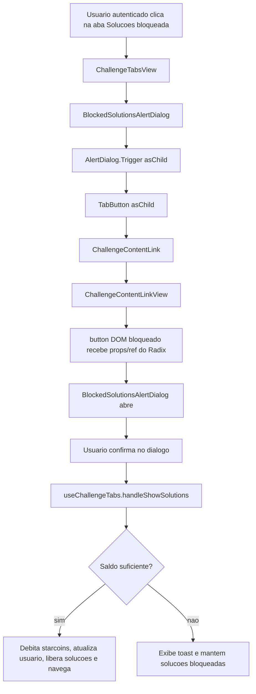

# 1. Objetivo

Corrigir a aba `Solucoes` bloqueada na pagina de desafio para que o clique no botao com cadeado abra o `BlockedSolutionsAlertDialog` para usuarios autenticados sem acesso liberado. A implementacao deve ajustar a composicao de componentes UI usados como `trigger` em `asChild`, preservando a regra atual de desbloqueio em `useChallengeTabs` e sem alterar contratos de `core`, `rest`, `rpc`, rotas ou banco de dados.

---

# 2. Escopo

## 2.1 In-scope

- Fazer o `ChallengeContentLink` aceitar e propagar props externas recebidas por composicoes `asChild`.
- Encaminhar `ref` e event handlers ate o elemento DOM final renderizado por `ChallengeContentLinkView`.
- Manter o visual atual da aba bloqueada (`Solucoes` + icone de cadeado).
- Preservar a abertura do `BlockedSolutionsAlertDialog` antes da execucao de `handleShowSolutions`.
- Preservar a regra existente de saldo, debito de starcoins, atualizacao de usuario, liberacao de visibilidade e navegacao.

## 2.2 Out-of-scope

- Alterar regras de negocio de liberacao de solucoes.
- Alterar o custo de desbloqueio de solucoes.
- Criar novos use cases, actions, services, schemas, rotas ou migrations.
- Alterar o fluxo de acesso direto por URL para listagem ou detalhe de solucoes.
- Reestruturar o componente global `AlertDialog`.
- Corrigir comportamentos nao descritos na issue `#491`, como condicoes de renderizacao da navegacao mobile fora da aba desktop.

---

# 3. Requisitos

## 3.1 Funcionais

- Quando `canShowSolutions = false` para usuario autenticado, a aba `Solucoes` deve continuar aparecendo bloqueada com icone de cadeado.
- O clique na aba bloqueada deve abrir o `BlockedSolutionsAlertDialog`.
- A confirmacao no dialogo deve continuar delegando para `handleShowSolutions`.
- Com saldo suficiente, o fluxo atual deve debitar `10` starcoins, liberar a visibilidade de solucoes e navegar para a listagem.
- Com saldo insuficiente, o fluxo atual deve exibir feedback de erro e manter as solucoes bloqueadas.

## 3.2 Nao funcionais

- Compatibilidade: a correcao nao deve alterar o contrato publico de `ChallengeTabsView`, `BlockedSolutionsAlertDialog` ou `AlertDialog`.
- Acessibilidade: atributos e event handlers injetados por Radix em composicoes `asChild` devem chegar ao elemento interativo final.
- Baixo impacto: a mudanca deve ficar restrita a componentes da camada UI do `web`.
- Sem mudanca de schema: nenhuma migration de banco de dados deve ser criada.

---

# 4. O que ja existe?

## Camada UI (Widgets)

* **`ChallengeTabs`** (`apps/web/src/ui/challenging/widgets/layouts/Challenge/ChallengeTabs/index.tsx`) - *Entry point da aba desktop do desafio; resolve autenticacao, visibilidade de crafts e `handleShowSolutions`, repassando tudo para `ChallengeTabsView`.*
* **`ChallengeTabsView`** (`apps/web/src/ui/challenging/widgets/layouts/Challenge/ChallengeTabs/ChallengeTabsView.tsx`) - *Renderiza a aba `Solucoes` bloqueada dentro de `BlockedSolutionsAlertDialog` usando `TabButton value='solutions' asChild`.*
* **`useChallengeTabs`** (`apps/web/src/ui/challenging/widgets/layouts/Challenge/ChallengeTabs/useChallengeTabs.ts`) - *Concentra o fluxo posterior a confirmacao do dialogo: valida saldo, mostra toast de saldo insuficiente, debita moedas, atualiza usuario, libera visibilidade e navega para a listagem de solucoes.*
* **`BlockedSolutionsAlertDialog`** (`apps/web/src/ui/challenging/widgets/components/BlockedSolutionsAlertDialog/index.tsx`) - *Entry point do dialogo; resolve saldo e permissao de aquisicao pelo usuario autenticado e delega a renderizacao para a view.*
* **`BlockedSolutionsAlertDialogView`** (`apps/web/src/ui/challenging/widgets/components/BlockedSolutionsAlertDialog/BlockedSolutionsAlertDialogView.tsx`) - *Envelopa o `trigger` recebido em `AlertDialog` e define a acao de confirmacao com `onShowSolutions`.*
* **`AlertDialog`** (`apps/web/src/ui/global/widgets/components/AlertDialog/index.tsx`) - *Componente global que usa `AlertDialog.Trigger asChild`; depende do filho final receber props/event handlers e `ref` para abrir o modal pelo clique.*
* **`ChallengeContentLink`** (`apps/web/src/ui/challenging/widgets/components/ChallengeContentLink/index.tsx`) - *Entry point do link de conteudo do desafio; calcula `href` via `useChallengeContentLink` e repassa apenas props proprias para a view.*
* **`ChallengeContentLinkView`** (`apps/web/src/ui/challenging/widgets/components/ChallengeContentLink/ChallengeContentLinkView.tsx`) - *Renderiza `Link` quando o conteudo esta liberado e `<button type='button'>` com cadeado quando `isBlocked` e verdadeiro.*
* **`Button`** (`apps/web/src/ui/global/widgets/components/Button/index.tsx`) - *Referencia local de componente com `forwardRef`, `...rest` e suporte a `asChild` via `Slot`, demonstrando o padrao usado para preservar props externas em composicoes Radix.*
* **`StyledButtonView`** (`apps/web/src/ui/global/widgets/components/VerificationButton/StyledButton/StyledButtonView.tsx`) - *Referencia local de view que encaminha `ref` e espalha props para um componente base.*
* **`ChallengeContentNavView`** (`apps/web/src/ui/challenging/widgets/components/ChallengeContentNav/ChallengeContentNavView.tsx`) - *Tambem consome `ChallengeContentLink`; deve continuar compativel com o contrato ajustado, embora a issue trate a aba desktop do `ChallengeTabsView`.*

---

# 5. O que deve ser criado?

**Nao aplicavel**.

---

# 6. O que deve ser modificado?

## Camada UI (Widgets)

* **Arquivo:** `apps/web/src/ui/challenging/widgets/components/ChallengeContentLink/index.tsx`
* **Mudanca:** Transformar `ChallengeContentLink` em componente com `forwardRef`, aceitar props HTML externas alem de `contentType`, `isActive`, `title` e `isBlocked`, e repassar `ref` e `...rest` para `ChallengeContentLinkView`.
* **Justificativa:** `ChallengeContentLink` e o componente intermediario usado como filho de `TabButton asChild`; se ele nao aceitar props externas, os handlers injetados por Radix sao descartados antes de chegar ao DOM final.
* **Camada:** `ui`

## Camada UI (Widgets)

* **Arquivo:** `apps/web/src/ui/challenging/widgets/components/ChallengeContentLink/ChallengeContentLinkView.tsx`
* **Mudanca:** Transformar a view em componente com `forwardRef`, receber props HTML externas e espalha-las no elemento final renderizado. Quando `isBlocked` for verdadeiro, aplicar props/ref no `<button type='button'>`; quando `isBlocked` for falso, aplicar props/ref no `Link` do Next.js sem perder `href` nem as classes atuais.
* **Justificativa:** `AlertDialog.Trigger asChild` e `TabButton asChild` dependem de propagacao ate o elemento interativo final. O botao bloqueado hoje nao recebe `onClick`, atributos ARIA nem `ref`, por isso o clique visual nao abre o dialogo.
* **Camada:** `ui`

## Camada UI (Widgets)

* **Arquivo:** `apps/web/src/ui/challenging/widgets/layouts/Challenge/ChallengeTabs/ChallengeTabsView.tsx`
* **Mudanca:** Preservar a composicao atual `BlockedSolutionsAlertDialog -> TabButton asChild -> ChallengeContentLink`, fazendo apenas ajustes pontuais se forem necessarios para compatibilizar os tipos apos `ChallengeContentLink` passar a encaminhar props/ref.
* **Justificativa:** A composicao expressa corretamente o requisito de produto: a aba bloqueada e o trigger do dialogo sao o mesmo controle visual. O bug esta na perda de props no componente intermediario, nao na regra de renderizacao da aba.
* **Camada:** `ui`

## Camada UI (Widgets)

* **Arquivo:** `apps/web/src/ui/challenging/widgets/layouts/Challenge/ChallengeTabs/useChallengeTabs.ts`
* **Mudanca:** Nao alterar a regra de `handleShowSolutions`; manter o fluxo atual de saldo, debito, atualizacao de usuario, visibilidade e navegacao.
* **Justificativa:** O bug ocorre antes da execucao de `handleShowSolutions`, na abertura do dialogo. Alterar essa funcao aumentaria o risco de regressao em uma regra que ja atende ao fluxo esperado apos confirmacao.
* **Camada:** `ui`

---

# 7. O que deve ser removido?

**Nao aplicavel**.

---

# 8. Decisoes Tecnicas

* **Decisao**
  - Corrigir o bug no contrato de composicao de `ChallengeContentLink` e `ChallengeContentLinkView`, encaminhando props/ref externas ate o elemento DOM final.
* **Alternativas consideradas**
  - Substituir `ChallengeContentLink` por um `<button>` inline apenas no caso de solucoes bloqueadas.
  - Alterar `AlertDialog` para nao usar `Trigger asChild`.
  - Disparar `handleShowSolutions` diretamente no clique da aba bloqueada.
* **Motivo da escolha**
  - A causa raiz esta no descarte de props por um componente intermediario usado com Radix `asChild`. Ajustar esse contrato preserva a composicao existente, melhora a compatibilidade do componente compartilhado e evita duplicar markup da aba.
* **Impactos / trade-offs**
  - O tipo de props do `ChallengeContentLink` fica mais amplo para suportar atributos/event handlers de elementos interativos.
  - A view passa a lidar com dois elementos finais (`button` bloqueado e `Link` liberado), exigindo cuidado no tipo de `ref`.

* **Decisao**
  - Manter `useChallengeTabs.handleShowSolutions` sem mudancas funcionais.
* **Alternativas consideradas**
  - Mover validacao de saldo para o dialogo.
  - Executar desbloqueio no clique do trigger.
* **Motivo da escolha**
  - O PRD exige que o clique abra o dialogo e que o desbloqueio ocorra apenas depois da confirmacao. A funcao atual ja implementa a regra posterior a confirmacao.
* **Impactos / trade-offs**
  - A correcao fica restrita a UI/renderizacao e nao altera o comportamento de negocio.

* **Decisao**
  - Nao criar migrations, schemas, actions, services ou use cases.
* **Alternativas consideradas**
  - Nenhuma camada fora da UI foi indicada pela issue ou pelo bug report como origem do problema.
* **Motivo da escolha**
  - A falha ocorre na propagacao de props/event handlers em componentes React; nao ha mudanca de contrato de dados ou persistencia.
* **Impactos / trade-offs**
  - O escopo permanece pequeno e diretamente implementavel.

---

# 9. Diagramas e Referencias

## Fluxo de dados



## Fluxo cross-app

**Nao aplicavel**. A correcao fica restrita ao app `web` e nao altera contratos com `server`, `studio`, `core`, `rest`, `rpc` ou banco de dados.

## Layout

```ascii
ChallengeLayoutView
`- ChallengeTabs
   `- ChallengeTabsView
      `- BlockedSolutionsAlertDialog
         `- AlertDialog
            `- AlertDialog.Trigger asChild
               `- TabButton value="solutions" asChild
                  `- ChallengeContentLink isBlocked
                     `- ChallengeContentLinkView
                        `- button[type="button"] Solucoes + lock
```

## Referencias

- `apps/web/src/ui/challenging/widgets/layouts/Challenge/ChallengeTabs/index.tsx`
- `apps/web/src/ui/challenging/widgets/layouts/Challenge/ChallengeTabs/ChallengeTabsView.tsx`
- `apps/web/src/ui/challenging/widgets/layouts/Challenge/ChallengeTabs/useChallengeTabs.ts`
- `apps/web/src/ui/challenging/widgets/components/BlockedSolutionsAlertDialog/index.tsx`
- `apps/web/src/ui/challenging/widgets/components/BlockedSolutionsAlertDialog/BlockedSolutionsAlertDialogView.tsx`
- `apps/web/src/ui/global/widgets/components/AlertDialog/index.tsx`
- `apps/web/src/ui/challenging/widgets/components/ChallengeContentLink/index.tsx`
- `apps/web/src/ui/challenging/widgets/components/ChallengeContentLink/ChallengeContentLinkView.tsx`
- `apps/web/src/ui/challenging/widgets/components/ChallengeContentLink/useChallengeContentLink.ts`
- `apps/web/src/ui/challenging/widgets/components/ChallengeContentNav/ChallengeContentNavView.tsx`
- `apps/web/src/ui/global/widgets/components/Button/index.tsx`
- `apps/web/src/ui/global/widgets/components/VerificationButton/StyledButton/StyledButtonView.tsx`

---

# 10. Pendencias / Duvidas

**Sem pendencias**.

---

# 11. Execucao Recomendada

Use **`implement-spec`**.

Justificativa: a spec e diretamente implementavel, o escopo e pequeno, a mudanca esta concentrada em componentes UI existentes e nao exige decomposicao em fases, coordenacao multi-app, migrations ou contratos novos.
