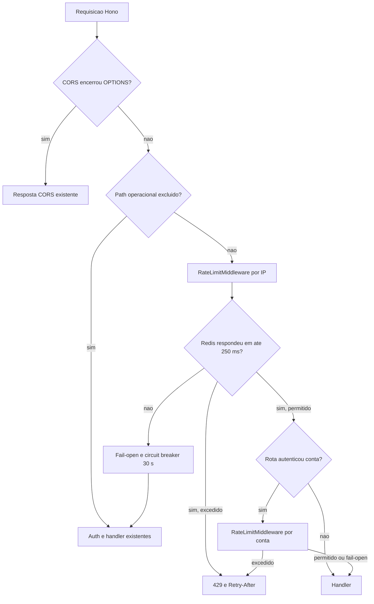

# Context and scope

## Origem e objetivo

A Issue [#591](https://github.com/JohnPetros/stardust/issues/591) solicita uma
proteção transversal contra volumes abusivos de requisições na aplicação Server,
sem alterar o comportamento das requisições aceitas. O Server expõe REST e MCP por
Hono, executa atrás do Traefik gerenciado pelo Coolify e já possui Redis via
`ioredis` e telemetria via Sentry.

A entrega cria um rate limiter distribuído no Redis como middleware Hono. A
limitação ocorre em duas etapas: toda requisição alcançada pelo Contract consome o
limite de IP antes da autenticação; depois de uma autenticação REST ou MCP
bem-sucedida, a mesma requisição consome também o limite independente da conta. Se
qualquer dimensão exceder sua política, a execução da rota é interrompida com HTTP
429.

Não há milestone ou PRD associado à Issue. A autoridade de produto desta revisão é
a própria Issue acrescida das decisões confirmadas no Grilling de 2026-09-11.

## Baseline factual

- `HonoApp.registerMiddlewares()` registra hoje somente a criação do client
  Supabase e do adaptador Inngest; não existe rate limiter no Server.
- `HonoApp.registerRoutes()` monta `/live`, `/health`, `/inngest`, os routers REST e
  `/mcp` no mesmo `Hono`.
- `AuthMiddleware.verifyAuthentication` valida o JWT no Supabase, enquanto
  `verifyApiKeyAuthentication` resolve a conta MCP pela API key; ambos executam
  antes do handler protegido.
- `IORedisCacheProvider` não oferece uma operação atômica de rate limiting e
  absorve falhas como cache miss. Ele não será reutilizado como port do limitador,
  pois o middleware precisa distinguir uma decisão de limite de uma falha do Redis.
- `SentryTelemetryProvider.trackError(error)` é o contrato observável existente e
  será reutilizado sem ampliar a interface de telemetria.
- O deploy canônico usa Traefik como único proxy HTTP diante do container Server.
  Traefik fornece `X-Forwarded-For`; a conexão Node permanece como fallback.

## In scope

- Limitar todas as requisições REST e MCP, inclusive rotas inexistentes e o
  redirect `/`, salvo as exclusões explícitas.
- Aplicar 100 requisições por janela de 60 segundos à política geral.
- Substituir a política geral por 60 requisições por janela de 60 segundos em
  `/auth` e seus descendentes e em
  `POST /challenging/challenges/:challengeId/code-executions`.
- Limitar por IP e, após autenticação bem-sucedida, também por conta verificada,
  usando contadores independentes com o mesmo limite da política selecionada.
- Retornar HTTP 429 com payload JSON estável e `Retry-After`.
- Falhar aberto quando o Redis exceder 250 ms ou retornar erro, usando circuit
  breaker de 30 segundos e telemetria Sentry sem dados sensíveis.
- Cobrir middleware, autenticação, algoritmo Redis, exclusões, políticas,
  concorrência e recuperação com testes automatizados e validação real do Server.
- Alinhar Architecture e Infrastructure ao novo fluxo transversal e à confiança no
  proxy.

## Out of scope

- Quotas de produto, planos, cobrança ou limites persistidos por usuário.
- Mudanças de UI, Web App, Studio, banco de dados, migrations, RLS ou grants.
- Limitar `/health`, `/live`, `/inngest` ou preflights `OPTIONS` encerrados pelo
  middleware CORS existente antes do limitador.
- Tratar `POST /lesson/code-explanation` como execução de código; essa rota usa a
  política geral.
- Adicionar headers de quota às respostas aceitas.
- Substituir Redis, Sentry, Traefik ou a autenticação existente.

## Premissas operacionais aprovadas

- O Traefik é o único ponto de entrada público do container Server e sanitiza a
  cadeia encaminhada. O middleware usa a entrada mais à direita de
  `X-Forwarded-For`, acrescentada pelo último proxy, e cai para
  `getConnInfo(context).remote.address` quando o header estiver ausente ou inválido.
- Se nenhum IP válido puder ser obtido, a identidade conservadora `unknown` é usada;
  a requisição não ignora o limitador.
- IPv4, IPv6 e IPv4 mapeado em IPv6 são normalizados antes da derivação da chave.
- Nenhum IP, account ID, token ou API key é salvo literalmente no Redis ou enviado
  à telemetria; a dimensão é transformada em SHA-256 antes de compor a chave.

# Implementation Contract

## Requisitos funcionais

| RF | Requisito |
| --- | --- |
| RF-01 | Aplicar a política geral de 100 requisições por janela fixa de 60 segundos a toda requisição REST ou MCP não excluída nem classificada na política especial. |
| RF-02 | Aplicar somente a política especial de 60 requisições por janela fixa de 60 segundos a `/auth`, seus descendentes e ao `POST` de execução de código de desafio. |
| RF-03 | Manter `/health`, `/live`, `/inngest` e preflights encerrados pelo CORS fora de qualquer consumo do limitador. |
| RF-04 | Consumir um contador por IP antes da autenticação e, quando REST ou MCP autenticar a conta, consumir também um contador independente por account ID verificado. |
| RF-05 | Interromper a requisição excedida com HTTP 429, payload estável e `Retry-After` correspondente ao restante da janela. |
| RF-06 | Executar incremento, criação da expiração e leitura do TTL atomicamente no Redis, mantendo uma janela iniciada no primeiro consumo. |
| RF-07 | Permitir a requisição quando o Redis falhar ou exceder 250 ms, abrir o circuit breaker por 30 segundos e evitar novas chamadas ao Redis enquanto ele estiver aberto. |
| RF-08 | Emitir um erro Sentry normalizado na primeira falha de cada episódio, sem identidade ou segredo, e rearmar a emissão somente após uma recuperação bem-sucedida. |

## Critérios de aceitação

| CA | RF | Dado | Quando | Então | Evidência esperada |
| --- | --- | --- | --- | --- | --- |
| CA-01 | RF-01 | uma identidade com política geral e Redis disponível | realiza os consumos 1 a 100 dentro da mesma janela | todos seguem para o próximo middleware e usam a mesma chave com TTL finito | teste unitário do middleware e teste do provider Redis |
| CA-02 | RF-01 | a mesma identidade do cenário geral | realiza o consumo 101 antes do fim da janela | a rota não executa e recebe HTTP 429 | teste unitário Hono e validação HTTP real |
| CA-03 | RF-02 | requisições sob `/auth/**` ou `POST /challenging/challenges/:challengeId/code-executions` | atingem 60 consumos na janela | os 60 são aceitos e o 61º é bloqueado sem consumir também a política de 100 | testes de seleção de política e rota |
| CA-04 | RF-02 | `POST /lesson/code-explanation`, métodos não `POST` em `code-executions` ou outras rotas | o middleware seleciona a política | a política geral de 100 é usada | teste parametrizado de classificação |
| CA-05 | RF-03 | `/health`, `/live`, qualquer verbo suportado de `/inngest` ou um preflight resolvido pelo CORS | recebe volume superior aos limites | nenhum contador é consumido e o comportamento preexistente permanece | testes Hono de exclusão e regressão de `HonoApp` |
| CA-06 | RF-04 | uma requisição sem conta autenticada | atravessa o middleware | somente a chave opaca de IP é consumida | teste unitário com provider spy |
| CA-07 | RF-04 | uma requisição REST autenticada ou MCP autenticada por API key | a autenticação termina com sucesso | a conta verificada consome contador próprio além do IP; excesso em qualquer dimensão bloqueia a rota | testes de `AuthMiddleware`, MCP e middleware |
| CA-08 | RF-04 | múltiplas contas no mesmo IP ou a mesma conta em IPs diferentes | realizam requisições concorrentes | os contadores independentes impedem bypass por troca de uma dimensão; um bloqueio de conta não desfaz o consumo de IP já confirmado | testes concorrentes e de composição |
| CA-09 | RF-05 | um contador acima do limite com TTL positivo | a requisição é negada | retorna `429`, `Retry-After: max(1, ceil(ttlMs / 1000))` e `{"title":"Limite de requisições excedido","message":"Muitas requisições. Tente novamente mais tarde."}` | asserção integral de status, header e JSON |
| CA-10 | RF-06 | dois ou mais consumos concorrentes para uma chave ausente | o Redis executa a operação | um único script Lua faz `INCR`, define `PEXPIRE` apenas no primeiro consumo e devolve contagem e `PTTL` sem chave sem expiração | teste do provider com concorrência e Redis real |
| CA-11 | RF-07 | timeout, resposta inválida ou erro do Redis | ocorre a primeira falha e chegam outras requisições durante 30 segundos | o adapter converte a falha externa em `AppError` sanitizado, todas seguem fail-open, somente a primeira operação toca o Redis e, ao fim do intervalo, uma única tentativa half-open testa a recuperação | teste com relógio controlado, falhas do SDK e promises concorrentes |
| CA-12 | RF-08 | um episódio contínuo de indisponibilidade | várias requisições falham ou passam pelo circuito aberto | exatamente um erro normalizado é enviado ao provider de telemetria; após uma operação Redis bem-sucedida, uma falha futura inicia novo episódio e nova emissão | teste com telemetry spy, sem dados sensíveis |

## Comportamento e precedência

1. O CORS existente continua sendo registrado antes do rate limiter; um `OPTIONS`
   respondido pelo CORS não alcança o limitador.
2. O middleware resolve exclusão e política usando verbo HTTP e pathname normalizado,
   sem query string.
3. Em rota alcançada, o middleware disponibiliza a mesma instância no contexto Hono
   e consome primeiro a dimensão `ip`.
4. Se o IP for bloqueado, autenticação e handler não executam.
5. Se o IP for aceito, a autenticação segue. Quando ela confirmar a conta,
   `AuthMiddleware` chama a etapa `account` antes do próximo middleware/handler.
6. Se a conta for bloqueada, o consumo anterior de IP permanece contabilizado.
7. Uma falha de autenticação retorna o erro existente; ela já consumiu somente IP e
   não cria contador de conta.
8. Um erro ou timeout do Redis em qualquer etapa é fail-open para aquela requisição
   e abre o circuito compartilhado pelo processo.

## Contrato HTTP 429

```http
HTTP/1.1 429 Too Many Requests
Content-Type: application/json
Retry-After: <segundos inteiros positivos>
```

```json
{
  "title": "Limite de requisições excedido",
  "message": "Muitas requisições. Tente novamente mais tarde."
}
```

Não há alteração no payload, status ou headers das requisições aceitas.

# Technical Contract

## Fluxo de runtime



## Contratos e assinaturas

### Port do Core

`RateLimiterProvider` é um port de infraestrutura global, sem imports de Hono,
Redis ou Sentry:

```ts
type RateLimitInput = {
  key: string
  limit: number
  windowInSeconds: number
}

type RateLimitDecision = {
  isAllowed: boolean
  retryAfterInSeconds: number
}

interface RateLimiterProvider {
  consume(input: RateLimitInput): Promise<RateLimitDecision>
}
```

`consume` deve rejeitar a promise em erro ou timeout de infraestrutura; somente uma
resposta Redis válida produz `RateLimitDecision`. Essa distinção é necessária para
o fail-open e a telemetria na borda.

### Provider IORedis

`IORedisRateLimiterProvider implements RateLimiterProvider` encapsula um client
`ioredis` compartilhado por processo, separado de `IORedisCacheProvider`.

- `constructor(redisUrl = ENV.redisUrl)` configura `lazyConnect`,
  `enableOfflineQueue: false`, `maxRetriesPerRequest: 0`, `connectTimeout: 250` e
  `commandTimeout: 250`, preservando TLS para `rediss:`.
- `consume(input: RateLimitInput): Promise<RateLimitDecision>` executa um único
  script Lua via `EVAL`. O script incrementa `KEYS[1]`, aplica `PEXPIRE` com
  `ARGV[2]` somente quando o valor vira `1`, lê `PTTL` e devolve contagem e TTL.
  O adapter valida o shape numérico e deriva `isAllowed` por `count <= limit` e
  `retryAfterInSeconds` por `max(1, ceil(pttl / 1000))`.
- `shutdown(): Promise<void>` é um lifecycle concreto do adapter, fecha somente a
  conexão compartilhada desse provider e pode ser chamado apenas pelo composition
  root ou pelo teardown que conhece `IORedisRateLimiterProvider`; ele não faz parte
  de `RateLimiterProvider`.
- Toda falha de conexão, comando, timeout, script ou resposta inválida do `ioredis`
  é capturada e convertida em `AppError` sanitizado antes de rejeitar `consume`. O
  erro não expõe mensagem, classe concreta, URL, host, credencial, chave ou payload
  do SDK.

Valores dinâmicos são argumentos do script; não são interpolados no código Lua. A
chave segue `rate-limit:<policy>:<dimension>:<sha256(identity)>`, em que `policy` é
`general` ou `sensitive` e `dimension` é `ip` ou `account`.

### Middleware Hono

`RateLimitMiddleware` recebe `RateLimiterProvider`, `TelemetryProvider`, relógio e
função de resolução de conexão por injeção, com defaults de produção no composition
root.

- `limitByIp(context: Context, next: Next): Promise<Response | void>` registra a
  instância no contexto, ignora exclusões, resolve/normaliza o IP, seleciona a
  política e consome a dimensão de IP antes de chamar `next`.
- `limitByAccount(context: Context, next: Next): Promise<Response | void>` exige o
  `AccountDto` já validado no contexto, seleciona a mesma política, consome a
  dimensão de conta e chama `next` somente quando permitido ou em fail-open.

O estado do circuit breaker é local ao processo e compartilhado entre as duas
dimensões: `closed`, `open` e `half-open`. A primeira falha abre por 30 segundos e
emite telemetria; requisições durante `open` seguem sem Redis. Encerrado o intervalo,
uma única promise faz o probe `half-open`, enquanto concorrentes seguem fail-open.
Sucesso fecha o circuito e encerra o episódio; nova falha reabre o circuito. O erro
telemetrado contém somente operação, estado e classe normalizada da falha, nunca
URL Redis, chave, IP, account ID, token ou API key.

### Autenticação e composition root

- `VerifyAuthenticationController.handle(http: Http): Promise<RestResponse<AccountDto>>`
  valida a conta e devolve o DTO verificado sem chamar `http.pass()`.
- `AuthMiddleware.verifyAuthentication(context, next)` grava o DTO devolvido no
  contexto e delega para `context.get('rateLimiter').limitByAccount(context, next)`.
- `AuthMiddleware.verifyApiKeyAuthentication(context, next)` mantém a resolução da
  API key e, depois de gravar o account ID verificado, delega à mesma etapa de conta.
- `HonoApp` constrói `IORedisRateLimiterProvider` e `RateLimitMiddleware`, registra
  `limitByIp` antes da criação do client Supabase e injeta doubles explícitos nos
  testes. Assim, tokens inválidos não chegam ao decode/autenticação sem consumir IP.

## Mapa canônico de paths afetados

### Core / global contracts

| Path | Change | Declaration | Contract | Dependencies | Tests |
| --- | --- | --- | --- | --- | --- |
| `packages/core/src/global/interfaces/provision/RateLimiterProvider.ts` | Create | `RateLimitInput`, `RateLimitDecision`, `RateLimiterProvider.consume` | Port agnóstico para decisão distribuída de limite | nenhuma dependência de app ou SDK | coberto pelos adapters consumidores |
| `packages/core/src/global/interfaces/provision/index.ts` | Modify | exports de rate limiter | Torna port e tipos acessíveis pelo barrel global existente | `RateLimiterProvider.ts` | typecheck do Core e Server |
| `packages/core/src/global/constants/http-headers.ts` | Modify | `HTTP_HEADERS.retryAfter` | Centraliza o nome `Retry-After` usado no 429 | nenhuma | teste do middleware |

### Server / Hono application

| Path | Change | Declaration | Contract | Dependencies | Tests |
| --- | --- | --- | --- | --- | --- |
| `apps/server/src/app/hono/middlewares/RateLimitMiddleware.ts` | Create | `RateLimitMiddleware.limitByIp`, `limitByAccount` | Seleção de política, identidade opaca, 429, fail-open, circuit breaker e telemetria | `RateLimiterProvider`, `TelemetryProvider`, Hono ConnInfo, SHA-256 | `RateLimiterRoute.test.ts` |
| `apps/server/src/app/hono/middlewares/index.ts` | Modify | export de `RateLimitMiddleware` | Disponibiliza o middleware ao composition root | `RateLimitMiddleware.ts` | typecheck do Server |
| `apps/server/src/app/hono/middlewares/AuthMiddleware.ts` | Modify | `verifyAuthentication`, `verifyApiKeyAuthentication` | Aplica o limite por conta somente após autenticação válida e antes do handler | `VerifyAuthenticationController`, rate limiter do contexto | `AuthRateLimitMiddleware.test.ts` e `McpRateLimitMiddleware.test.ts` |
| `apps/server/src/app/hono/HonoApp.ts` | Modify | construtor, `ContextVariableMap`, `registerMiddlewares` | Compõe provider/middleware, preserva CORS e registra IP antes de Supabase/Inngest | provider Redis, Sentry, `RateLimitMiddleware` | `HonoApp.test.ts` e testes de rota existentes |
| `apps/server/src/tests/fixtures/HonoFixture.ts` | Modify | construtor e setup | Injeta provider determinístico para que testes de rota não dependam do Redis nem compartilhem quota acidental | `HonoApp`, fake inline do port | toda suíte `server-integration` |
| `apps/server/src/tests/routes/global/RateLimiterRoute.test.ts` | Create | suíte HTTP transversal | Exercita middleware e provider por requests Hono, cobrindo políticas, dimensões, exclusões, IP, 429, Lua/TTL, breaker, concorrência, telemetria e Redis real | `HonoFixture`, Redis local e doubles dos ports/relógio | sensor `test:integration` do Server |
| `apps/server/src/app/hono/routers/auth/tests/AuthRateLimitMiddleware.test.ts` | Create | suíte de composição REST autenticada | Prova autenticação → conta → handler e ausência de consumo de conta em falha auth | Hono, mocks dos adapters de autenticação e rate limiter | projeto Jest `server-integration` |
| `apps/server/src/app/hono/routers/mcp/tests/McpRateLimitMiddleware.test.ts` | Create | suíte de composição MCP autenticada | Prova API key → account ID → limite de conta → tool e ausência de consumo antes de autenticação válida | Hono, mocks do auth/profile/MCP e rate limiter | projeto Jest `server-integration` |

### Server / REST authentication

| Path | Change | Declaration | Contract | Dependencies | Tests |
| --- | --- | --- | --- | --- | --- |
| `apps/server/src/rest/controllers/auth/VerifyAuthenticationController.ts` | Modify | `handle` | Devolve `AccountDto` verificado ao middleware sem avançar a cadeia prematuramente | `AuthService` | teste existente modificado |
| `apps/server/src/rest/controllers/auth/tests/VerifyAuthenticationController.test.ts` | Modify | suíte do controller | Prova retorno da conta e propagação de falha sem `http.pass` | mock `AuthService` | sensor `test:unit` do Server |

### Server / Redis provision

| Path | Change | Declaration | Contract | Dependencies | Tests |
| --- | --- | --- | --- | --- | --- |
| `apps/server/src/provision/rate-limiter/ioredis/IORedisRateLimiterProvider.ts` | Create | `IORedisRateLimiterProvider.consume`, `shutdown` | Operação Lua atômica, TTL, timeout de 250 ms, lifecycle concreto e mapeamento de toda falha do SDK para `AppError` sanitizado | `ioredis`, `ENV.redisUrl`, `AppError`, port do Core | `RateLimiterRoute.test.ts` |
| `apps/server/src/provision/rate-limiter/index.ts` | Create | export de `IORedisRateLimiterProvider` | Barrel da capability de provision | provider ioredis | typecheck do Server |

### Documentation

| Path | Change | Declaration | Contract | Dependencies | Tests |
| --- | --- | --- | --- | --- | --- |
| `documentation/architecture.md` | Modify | fluxo REST/MCP e padrão de rate limiting | Registra middleware em duas etapas, port do Core, Redis e fail-open | Spec revisão 1 | revisão de alinhamento documental |
| `documentation/infrastructure.md` | Modify | Server, Redis e confiança no proxy | Registra `REDIS_URL`, Traefik como origem confiável de `X-Forwarded-For` e comportamento durante indisponibilidade | deploy Coolify/Traefik | inspeção documental e validação runtime |

## Referências técnicas e restrições

- Redis `INCR`/expiração em Lua é a referência do algoritmo; uma sequência separada
  de `INCR` e `EXPIRE` não satisfaz atomicidade.
- O provider novo não amplia `CacheProvider` e não usa os métodos fail-silent de
  `IORedisCacheProvider`.
- Hono, Redis, Sentry e Node crypto permanecem fora do Core.
- O middleware não lê corpo, query, token, API key ou atributos de produto para
  formar políticas.
- A política especial de execução casa somente o verbo `POST` e pathname com um
  único segmento não vazio no lugar de `:challengeId`; listagens e contagens de
  execução permanecem gerais.
- A implementação não adiciona dependência npm; `hono`, `@hono/node-server`,
  `ioredis` e `@sentry/node` já existem no workspace Server.

## Decisões técnicas

| Decisão | Evidência | Alternativas | Motivo e trade-off | Impacto no Contract |
| --- | --- | --- | --- | --- |
| Janela fixa iniciada no primeiro consumo com Lua | Issue define requisições por minuto; Redis documenta `INCR` + expiração atômica | janela deslizante, token bucket, biblioteca externa | menor memória e complexidade; admite burst na fronteira da janela | RF-01, RF-02, RF-06, CA-10 |
| Política especial substitui a geral | decisão do Grilling | consumir as duas políticas | evita dupla contabilização e preserva limite inequívoco por rota | RF-02, CA-03 |
| Somente o POST de challenge executa código | inspeção de routers/controllers e decisão do Grilling | incluir code explanation ou CRUD de snippets | `code-explanation` usa IA e playground persiste texto, sem executar código | RF-02, CA-04 |
| IP e conta usam contadores independentes | decisão do Grilling e ordem real da autenticação | chave composta conta+IP, somente conta, somente IP | impede bypass por troca de dimensão; NATs compartilham o teto de IP | RF-04, CA-06 a CA-08 |
| Middleware em duas etapas | Hono global roda antes dos middlewares de autenticação; MCP só resolve account ID após API key válida | confiar em claims não verificados, duplicar limiter em routers | protege tentativas inválidas por IP e só usa identidade verificada para conta | RF-04, AuthMiddleware e HonoApp |
| Provider dedicado | `CacheProvider` absorve erros e não oferece atomicidade | ampliar cache genérico, usar package externo | mantém semântica explícita e isolamento de SDK; cria uma conexão Redis adicional por processo | RF-06, RF-07 |
| Fail-open com breaker 250 ms/30 s | Issue exige disponibilidade; valores aprovados no Grilling | fail-closed, aguardar timeout atual de 15 s, tentar Redis em toda request | preserva tráfego e limita latência/cascata; proteção fica temporariamente inativa | RF-07, CA-11 |
| Um evento Sentry por episódio | Issue exige telemetria e decisão do Grilling | emitir por request, somente console, notificar Discord | mantém observabilidade sem tempestade nem dados sensíveis | RF-08, CA-12 |

# Validation Contract

## Estratégia automatizada

- Testes do middleware com Hono real e ports fake devem cobrir até o response final,
  sem chamar Redis ou Sentry reais.
- Testes do provider devem provar o script e o parsing isoladamente e executar a
  operação concorrente contra o Redis local do `docker-compose.yml` no projeto de
  integração. O teste real deve usar prefixo exclusivo e limpar somente suas
  próprias chaves.
- Testes de autenticação devem provar que conta não verificada nunca chega a
  `limitByAccount`, que REST usa o DTO devolvido pelo Supabase e que MCP usa o
  account ID resolvido pela API key.
- Os testes de rota existentes usam o provider determinístico do `HonoFixture`; não
  devem depender da disponibilidade do Redis para testar domínios não relacionados.
- Relógio, timeout e half-open são determinísticos por fake timers; nenhum teste usa
  espera real de 30 segundos.

## Cenários manuais e de runtime

| Cenário | Ambiente e ação | Resultado observável | Evidência |
| --- | --- | --- | --- |
| Política geral | Server local e Redis do `docker-compose`, enviar 101 requests com o mesmo IP a uma rota barata não excluída | 100 respostas preservam o comportamento da rota; a 101ª retorna o 429 e `Retry-After` aprovados | log sanitizado de status/headers e comando reproduzível, sem credenciais |
| Política especial | repetir com `/auth/**` sem registrar credenciais e com o POST de execução usando ambiente de teste autorizado | 60 requests aceitas conforme o contrato preexistente e a 61ª limitada; `code-explanation` permanece geral | resultados HTTP por path e verbo |
| Exclusões | exceder 100 requests em `/live`, `/health` e métodos suportados de `/inngest` | nenhuma resposta é 429 por rate limit e nenhum contador correspondente existe | status HTTP e inspeção de chaves com prefixo seguro |
| Conta e IP | autenticar por variável local, repetir em duas contas/IPs controlados sem imprimir tokens | bloqueio independente é observado por dimensão e `/auth/account` continua válido antes do limite | sequência de status sanitizada |
| Fail-open e recuperação | interromper somente o Redis local, chamar uma rota, manter tráfego por 30 segundos controlados e restaurar Redis | primeira tentativa adiciona no máximo 250 ms, chamadas seguintes não aguardam Redis, Server continua respondendo e o limitador se recupera após o probe | duração, status, um evento de telemetria observado por double/local e recuperação |

Não há validação de browser ou Pencil: nenhuma surface frontend, interação ou design
é alterado.

## Sensores obrigatórios

```bash
npm run format -- --filter=@stardust/core --filter=@stardust/server
npm run check:code -- --filter=@stardust/core --filter=@stardust/server
npm run check:types -- --filter=@stardust/core --filter=@stardust/server
npm run test:unit -- --filter=@stardust/core --filter=@stardust/server
npm run test:coverage -- --filter=@stardust/core --filter=@stardust/server
npm run check:coverage -- @stardust/core @stardust/server
npm run test:integration -- --filter=@stardust/server
npm run check:architecture
npm run check:complexity -- --filter=@stardust/core --filter=@stardust/server
npm run check:test-integrity
npm run check:spec-definition -- documentation/features/global/rate-limiter/spec.md
npm run check:spec-implementation -- documentation/features/global/rate-limiter/spec.md --base <commit-base>
npm run build:core
npm run build:server
```

Os comandos de coverage devem respeitar `coverage-baseline.json`. Checks e builds
finais devem ser repetidos pelo CI no HEAD do PR.

## Matriz de rastreabilidade

| RF | Critérios | Camada responsável | Evidência principal |
| --- | --- | --- | --- |
| RF-01 | CA-01, CA-02 | Hono middleware + Redis provision | teste Hono e runtime HTTP |
| RF-02 | CA-03, CA-04 | Hono middleware | classificação parametrizada e rota real |
| RF-03 | CA-05 | HonoApp/CORS/middleware | regressão de exclusões |
| RF-04 | CA-06, CA-07, CA-08 | HonoApp + AuthMiddleware | testes REST/MCP e concorrência |
| RF-05 | CA-09 | Hono middleware | snapshot semântico de status/header/JSON |
| RF-06 | CA-10 | IORedis provider | Redis real e teste do script |
| RF-07 | CA-11 | Hono middleware + provider | fake timers, timeout e runtime sem Redis |
| RF-08 | CA-12 | Hono middleware + Sentry port | telemetry spy por episódio |

# Documentation alignment and revision history

## Rule Pack aplicado

- `AGENTS.md`
- `documentation/sdd.md`
- `documentation/architecture.md`
- `documentation/infrastructure.md`
- `documentation/tooling.md`
- `documentation/rules/rules.md`
- `documentation/rules/core-package-rules.md`
- `documentation/rules/server-application-rules.md`
- `documentation/rules/provision-layer-rules.md`
- `documentation/rules/server-routes-testing-rules.md`
- `documentation/rules/mcp-rules.md`

## Alinhamento documental

- `documentation/architecture.md` deve representar o rate limiter como adapter
  transversal anterior ao fluxo REST/MCP e manter o Core livre de SDKs.
- `documentation/infrastructure.md` deve registrar Redis como dependência runtime do
  Server, `REDIS_URL`, a confiança em `X-Forwarded-For` produzido pelo Traefik e o
  fail-open controlado.
- `documentation/overview.md` não muda: a entrega protege uma capacidade existente e
  não adiciona funcionalidade ou surface de produto.
- Não existe Design Contract nem documentação de banco aplicável.

## Histórico de revisões

| Revisão | Data | Estado | Alterações e gates |
| --- | --- | --- | --- |
| 1 | 2026-09-11 | completed | Contract derivado da Issue #591 e do Grilling confirmado. `check:spec-definition` passou. O Spec Reviewer apontou paths de teste incompatíveis, ausência de error mapping no provider e lifecycle implícito no middleware; a revisão moveu os testes para locations permitidas, exigiu `AppError` sanitizado e deixou o lifecycle somente com o adapter/composition root. O Builder Fix IR-01 consolidou IPv4 e todas as formas IPv4-mapped IPv6 antes do hash, com regressão HTTP; Implementation Reviewer rerun: `accepted`. |
