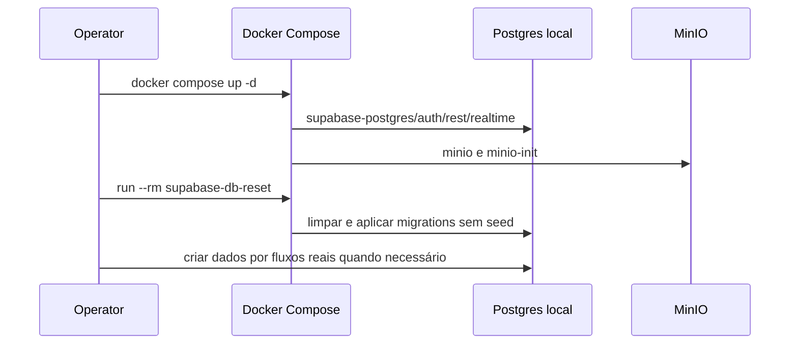

# Context and scope

## Origem e limites

A [Issue #601](https://github.com/JohnPetros/stardust/issues/601) requer Web, Studio e Server locais sem acesso ao Supabase staging. O PRD de sign-in preserva email/senha e login social por Google e GitHub. O usuário retirou qualquer seed da entrega: não há snapshot de staging, catálogo demonstrativo, usuário Auth pré-criado, arquivo de seed, seeder, gateway de seed, manifesto ou cópia de mídia. A renomeação dos comandos remotos permanece adiada para outra Spec.

Hoje `db:test` cria um stack Docker indireto pelo Supabase CLI, `[db.seed]` está desabilitado, o provider S3 fixa R2, `db:types` do Server lê staging e os antigos arquivos de desenvolvimento de Server e Web tinham URLs Supabase remotas. Os arquivos locais são padronizados nesta revisão como `.env.local`. Studio consome o Server e uma CDN configurável, sem cliente Supabase direto. Esta Spec altera somente o script `db:test` do Server para preparar o stack Compose compartilhado; `db:types` e os comandos remotos permanecem como estão. O schema de aplicação e as migrations versionadas não mudam; apenas um schema `storage` local de compatibilidade, vazio, pode ser recriado para satisfazer policies legadas. A revisão acrescenta chaves API publishable para Server e Web e remove o uso da chave service-role pelos apps; as rotas God Account preservam o acesso administrativo via PostgreSQL direto. O fluxo RLS e os repositories atuais permanecem como estão até a próxima task de adoção do Drizzle; esta Spec não cria, remove ou edita migrations.

| Fluxo                        | Produtor                               | Consumidor                   | Transporte e mudança                 |
| ---------------------------- | -------------------------------------- | ---------------------------- | ------------------------------------ |
| Auth, REST, DB e Realtime    | Docker Compose                         | Server e Web                 | loopback; Studio acessa via Server   |
| S3                           | MinIO em development, R2 em production | Server e browser             | interface Core preservada            |
| Email                        | Supabase Auth local                    | Mailpit local                | porta host padrão 54324 configurável, sem SMTP externo        |
| Dados de aplicação           | fluxos reais do desenvolvedor/teste    | banco local vazio após reset | nenhum seed ou importação de staging |

# Implementation Contract

## Requisitos

| RF    | Requisito                                                                                                                                                                                                                                                                                                                                                                                                                                                                         |
| ----- | --------------------------------------------------------------------------------------------------------------------------------------------------------------------------------------------------------------------------------------------------------------------------------------------------------------------------------------------------------------------------------------------------------------------------------------------------------------------------------- |
| RF-01 | Um único `docker compose up -d` inicia `inngest`, `redis`, `supabase-postgres`, `supabase-envoy`, `supabase-auth`, `supabase-rest`, `supabase-realtime`, `supabase-mailpit`, `supabase-templates` e `minio`; `minio-init` conclui a criação idempotente do bucket. Cada serviço pertencente ao stack Supabase usa o prefixo `supabase-`, incluindo o one-shot `supabase-db-reset`. Imagens são fixadas conforme a matriz técnica, serviços têm health checks e dependências esperam readiness. Supabase Studio, Storage, Analytics, Functions, Imgproxy, Vector, Postgres Meta e Supavisor não fazem parte do stack. |
| RF-02 | Em development, Server recusa URL Supabase, PostgreSQL ou S3 remota; Web recusa URL Supabase ou CDN remota; Studio recusa API Server ou CDN remota. Esses endpoints devem usar host loopback/localhost e seus protocolos locais esperados (`http` para Supabase/S3 e `postgres` ou `postgresql` para PostgreSQL). Portas host podem ser configuradas no `.env.local` raiz; defaults documentados continuam válidos. A recusa antes do listener continua sendo CA-02 e está adiada. |
| RF-03 | Web e Server usam Auth, PostgREST, PostgreSQL e Realtime locais; Studio usa Server e mídia locais. O PostgreSQL expõe `SUPABASE_DATABASE_URL` para acesso direto e futura adoção do Drizzle sem trocar o container. PostgREST permanece enquanto os repositories atuais usam `supabase.from(...)`. Nenhuma requisição ao Supabase staging ocorre nos fluxos validados. |
| RF-04 | Mailpit captura emails do Auth local em `127.0.0.1`, porta host padrão `54324` configurável no `.env.local` raiz, sem envio externo. O serviço privado `supabase-templates` serve por HTTP os templates versionados `ConfirmSignUpTemplate.html` e `ConfirmPasswordResetTemplate.html`, com os mesmos nomes dos templates fonte em `packages/email/templates`; GoTrue usa suas URLs em `GOTRUE_MAILER_TEMPLATES_CONFIRMATION` e `GOTRUE_MAILER_TEMPLATES_RECOVERY`. |
| RF-05 | A entrega não cria nem executa seed. `[db.seed]` permanece desabilitado; não existem `seed.sql`, JSONs de dados, seeders, manifestos, exportadores de staging, sincronizadores de mídia ou usuários sintéticos. Contas de validação são criadas pelo sign-up ou OAuth real após o reset.                                                                                                                                                                                          |
| RF-06 | `S3FileStorageProvider` usa MinIO em development com bucket local e signed URL acessível ao browser; production permanece em R2. Objetos persistem no bind mount `./docker/volumes/minio:/data`; `docker/volumes/` é ignorado pelo Git e nenhum objeto é versionado. CRUD, listagem, metadata e assinatura preservam interface e erros. |
| RF-07 | Google e GitHub funcionam com Supabase Auth local e callback `http://127.0.0.1:<SUPABASE_API_PORT>/auth/v1/callback` (default `54321`); retornam às rotas existentes. IDs e secrets ficam fora do Git. Auth e sessão permanecem locais.                                                                                                                                                                                                                                                                           |
| RF-08 | As Rules proíbem testes dedicados a providers, constants e fixtures. `check:test-integrity` rejeita arquivos novos ou modificados que violem essas fronteiras; a validação ocorre pela borda consumidora.                                                                                                                                                                                                                                                                         |
| RF-09 | Todos os testes de integração que dependem de Supabase ou PostgreSQL usam exclusivamente os containers do root Docker Compose. `npm run db:test -w @stardust/server` passa a executar o profile de teste, aguardar health checks e rodar o serviço one-shot `supabase-db-reset`, que limpa Auth e dados públicos e reaplica `apps/server/supabase/migrations` sem seed. `LocalSupabaseProxy` valida endpoints loopback com qualquer porta host configurada em `.env.testing` e readiness do stack Compose; não chama `supabase start`. `AuthFixture` confirma cada conta efêmera que cria pelo link enviado ao Mailpit local, sem alterar o autoconfirm do Auth; apaga a mensagem consumida. O teste de contrato do rate limiter usa `ENV.redisUrl`, sem porta host hardcoded, para acessar Redis no Compose. Depois, `npm run test:integration -w @stardust/server` executa a suíte. Os testes Playwright da Web preservam o `ServerMock` definido nas Rules porque não dependem de banco. |
| RF-10 | Somente dados duráveis de desenvolvimento usam `docker/volumes/`: `postgres/` monta `/var/lib/postgresql/data` para contas e dados locais, e `minio/` monta `/data` para arquivos. Redis é cache descartável e não recebe volume. Envoy, Auth, REST, Realtime, Mailpit, Inngest, Templates e serviços one-shot também não criam subdiretórios persistentes. Templates são configuração versionada read-only em `docker/supabase/templates/`. |
| RF-11 | As variáveis locais da raiz e de cada app ficam em `.env.local` ignorado. O Server lê `apps/server/.env.local`; os launchers Compose e scripts de exportação leem o `.env.local` da raiz, incluindo overrides opcionais de portas host com defaults preservados; Next e Vite carregam `.env.local` das apps, cujas URLs devem apontar às mesmas portas loopback. Arquivos `.env.testing`, `.env.staging` e `.env.production` permanecem separados e o `.env.testing` Server deve corresponder às portas da stack de teste, incluindo `MAILPIT_API_URL` local. |
| RF-12 | Os apps Server e Web usam somente uma chave API publishable (`SUPABASE_PUBLISHABLE_KEY` no Server e `NEXT_PUBLIC_SUPABASE_PUBLISHABLE_KEY` na Web) para seus clientes Supabase. `SUPABASE_ANON_KEY`, `NEXT_PUBLIC_SUPABASE_ANON_KEY` e `SUPABASE_SERVICE_ROLE` deixam de ser requisitos de runtime desses apps. O gateway local aceita a chave opaca publishable e encaminha Auth, REST e Realtime; chaves internas necessárias ao gateway nunca são injetadas no Server ou na Web. |
| RF-13 | As operações administrativas de feedback que atualmente usam `supabaseAdmin` passam a usar conexão PostgreSQL direta via `SUPABASE_DATABASE_URL`, após a autorização de God Account existente. As demais queries e o comportamento RLS versionado permanecem inalterados nesta entrega; a migração ampla para Drizzle e a retirada de RLS ficam para task posterior. Esta revisão não cria, remove nem altera migrations de aplicação. |

## Critérios de aceitação

| CA    | RF                  | Dado                                                      | Quando                                                               | Então                                                                                                                                                               | Evidência esperada                                                                 |
| ----- | ------------------- | --------------------------------------------------------- | -------------------------------------------------------------------- | ------------------------------------------------------------------------------------------------------------------------------------------------------------------- | ---------------------------------------------------------------------------------- |
| CA-01 | RF-01, RF-05        | Docker e env local                                        | executar duas vezes `docker compose up -d` e o reset Compose          | stack mínimo healthy, migrations completas, zero seed e dados de aplicação vazios após cada reset                                                                   | `docker compose ps`, logs sanitizados e SQL local                                  |
| CA-02 | RF-02               | URL remota em development                                 | Server, Web ou Studio inicia                                         | falha antes do listener; erro revela apenas o nome da variável                                                                                                      | startup real e VM-06                                                               |
| CA-03 | RF-03, RF-05        | Studio local e banco resetado                             | autenticar pelo fluxo real e navegar para uma rota protegida no Studio | Auth e endpoints retornam `2xx`, sessão persiste e não há request staging; a aceitação Web do CA-03 foi removida por decisão do usuário                                | VM-02, EV-01                                                                        |
| CA-04 | RF-04               | Auth local e `supabase-templates` healthy                 | solicitar confirmação de cadastro e recuperação de senha             | ambas as mensagens aparecem no Mailpit com conteúdo customizado e links locais válidos, sem entrega externa                                                         | VM-03, EV-02                                                                       |
| CA-05 | RF-05               | diff e execução local                                     | inspecionar artefatos e logs                                         | nenhum seed, export/sync de staging, catálogo, mídia ou conta pré-criada existe                                                                                     | diff e logs sanitizados                                                            |
| CA-06 | RF-06               | MinIO pronto e vazio                                      | testar provider e signed PUT                                         | operações funcionam localmente; R2 production inalterado                                                                                                            | integração do consumidor; evidência signed PUT/GET no browser removida por decisão do usuário |
| CA-07 | RF-07               | OAuth client config local                                 | configurar callback Google e GitHub                                  | callbacks apontam ao Auth local; secrets ficam fora do Git e Auth permanece local                                                                                   | validação de configuração; login real de provider removido por decisão do usuário  |
| CA-08 | RF-08               | arquivo de teste dedicado a provider, constant ou fixture | executar `check:test-integrity`                                      | detector falha e identifica o path proibido; sem esse arquivo, o detector passa                                                                                     | teste do detector                                                                  |
| CA-09 | RF-02, RF-05, RF-09 | Docker disponível e `.env.testing`                        | executar `db:test` seguido de `test:integration`                      | containers Compose ficam healthy, Auth e schema público são resetados sem seed, cada conta de fixture confirma seu email pela mensagem Mailpit local e toda integração usa somente URLs loopback, inclusive portas não padrão | testes de rota existentes, Compose logs e VM-06; sem teste dedicado da fixture     |
| CA-10 | RF-10               | stack iniciado e dados gravados                           | reiniciar com `docker compose down` seguido de `up -d`                | PostgreSQL e MinIO preservam estado; Redis reinicia vazio; nenhum diretório é criado para os demais serviços                                                         | filesystem ignorado, smoke de persistência e `docker inspect`                      |
| CA-11 | RF-11               | root e apps com ambientes locais                           | iniciar scripts e apps pelo tooling documentado                       | apenas `.env.local` é fonte do ambiente local; arquivos mode-specific permanecem inalterados e arquivos locais continuam ignorados pelo Git                           | `git check-ignore`, auditoria de nomes sem ler valores e smoke dos launchers       |
| CA-12 | RF-12               | Supabase local com chaves publishable configuradas         | Server e Web inicializam clientes; Server completa Auth local pelo Envoy | ambos usam a chave publishable configurada; nomes legacy anon/service-role não são exigidos pelos apps; Auth do Server funciona via gateway compatível; checks Web cobrem apenas configuração/comportamento mockado e não comprovam Auth Web local | integração Server pelo Envoy; checks de configuração/Web mockados |
| CA-13 | RF-13               | God Account autorizada e PostgreSQL local disponível       | listar, abrir e atualizar feedback administrativo                       | rotas preservam respostas existentes sem usar chave API service-role; conexão direta usa `SUPABASE_DATABASE_URL`; migrations permanecem byte-a-byte inalteradas       | testes de rota de feedback e diff de migrations                                   |

## Decisões e falhas

O desenvolvimento local não chama `supabase start`, `--linked`, `db:push`, `db:pull` ou `db:revert`. O serviço Compose `supabase-db-reset` acessa somente o PostgreSQL local, limpa o estado de Auth/aplicação e reaplica as migrations versionadas, sem mecanismo de seed. A ausência de conteúdo em Space, Lesson, Manual e Challenging após reset é o estado contratado. A futura troca dos repositories para Drizzle fica fora desta Spec; o contrato direto de PostgreSQL já fica disponível.

Para integração do Server, esta Spec altera apenas `db:test` para preparar e resetar o stack Compose; `test:integration` continua inalterado. A suíte não cria substituto em memória para persistência e não usa projeto Supabase remoto. Fixtures podem criar dados específicos do cenário após o reset e devem removê-los conforme a fronteira atual de testes; isso não constitui seed de desenvolvimento.

Contas de validação são criadas pelos endpoints reais de sign-up ou por OAuth. Emails/senhas ficam apenas no `.env.local` ignorado. Para validar Studio, o operador cria a conta local pelo fluxo real, obtém seu ID sem registrar token ou senha, adiciona-o a `GOD_ACCOUNT_IDS` local e reinicia o Server. Sem OAuth credentials, senha local continua disponível sem fallback para staging.

O fluxo não habilita RLS nem cria ou edita policies; preserva migrations existentes. Os nomes dos comandos remotos ficam para outra Spec e nenhum fluxo local padrão os chama.

# Technical Contract

## Fluxo



## Matriz de imagens locais

| Serviço | Nome Compose | Imagem fixada |
| --- | --- | --- |
| PostgreSQL | `supabase-postgres` | `public.ecr.aws/supabase/postgres:17.6.1.143` |
| Envoy | `supabase-envoy` | `envoyproxy/envoy:v1.39.1` |
| GoTrue | `supabase-auth` | `public.ecr.aws/supabase/gotrue:v2.193.0` |
| PostgREST | `supabase-rest` | `public.ecr.aws/supabase/postgrest:v14.15` |
| Realtime | `supabase-realtime` | `public.ecr.aws/supabase/realtime:v2.113.4` |
| Mailpit | `supabase-mailpit` | `public.ecr.aws/supabase/mailpit:v1.30.2` |
| Templates | `supabase-templates` | `caddy:2.10.2-alpine` |
| MinIO | `minio` | `quay.io/minio/minio@sha256:14cea493d9a34af32f524e538b8346cf79f3321eff8e708c1e2960462bd8936e` |
| MinIO Client | `minio-init` | `quay.io/minio/mc@sha256:a7fe349ef4bd8521fb8497f55c6042871b2ae640607cf99d9bede5e9bdf11727` |

Inngest e Redis preservam as versões já declaradas no Compose. A matriz é
atualizada de forma intencional; `latest` não é aceito.

### Portas host

Os serviços publicam portas somente em `127.0.0.1`. As variáveis opcionais do
`.env.local` raiz alteram apenas a porta host; as portas internas dos
containers permanecem fixas.

| Variável | Serviço | Default |
| --- | --- | ---: |
| `SUPABASE_API_PORT` | Envoy/API e callback OAuth | 54321 |
| `SUPABASE_DATABASE_PORT` | PostgreSQL | 54322 |
| `REDIS_PORT` | Redis | 6379 |
| `SUPABASE_MAILPIT_HTTP_PORT` | Mailpit HTTP | 54324 |
| `SUPABASE_MAILPIT_SMTP_PORT` | Mailpit SMTP | 54325 |
| `MINIO_API_PORT` | MinIO API | 9000 |
| `MINIO_CONSOLE_PORT` | MinIO console | 9001 |

## Mapa canônico de paths afetados

### Infraestrutura

| Path | Change | Declaration | Contract | Dependencies | Tests |
| --- | --- | --- | --- | --- | --- |
| `.gitignore` | Modify | `/docker/volumes/` | impede versionamento dos dados persistidos pelos containers locais | Git | diff |
| `docker-compose.yml` | Modify | stack local mínimo, gateway Envoy, portas host configuráveis e bind mounts persistentes | publica somente em loopback; host ports opcionais usam defaults canônicos e derivam URLs OAuth/API; somente PostgreSQL e MinIO usam subdiretórios de `./docker/volumes`; passa os mapas de chaves necessários somente ao gateway | Docker/.env.local | health/integration |
| `docker/supabase/envoy/bootstrap.yaml` | Create | bootstrap Envoy | configura listener local e admin interno sem publicar a porta de administração | Envoy | compose/smoke HTTP/WS |
| `docker/supabase/envoy/clusters.yaml` | Create | clusters Envoy | encaminha Auth, PostgREST e Realtime apenas aos serviços Compose locais | Docker DNS | compose/smoke HTTP/WS |
| `docker/supabase/envoy/listener.template.yaml` | Create | rotas, filtros Lua e CORS | valida `apikey`, traduz somente a publishable key para a credencial interna `anon`, preserva JWTs de usuário e nunca registra valores de chaves | Envoy | smoke Auth/REST/WS |
| `docker/supabase/envoy/entrypoint.sh` | Create | renderização de configuração | substitui placeholders do template por env do gateway sem imprimir valores; inicia Envoy com config renderizada | shell/Envoy | compose/startup |
| `docker/supabase/init/roles.sql` | Create | roles Supabase | cria somente roles/grants necessários para Auth, REST, Realtime e migrations | PostgreSQL | reset/integration |
| `docker/supabase/init/storage-compatibility.sql` | Create | schema mínimo `storage` | cria `storage.objects` compatível apenas para as policies das migrations legadas; não inicia Storage API | PostgreSQL | reset/integration |
| `docker/supabase/reset.sh` | Create | reset idempotente | limpa Auth, `public` e `storage`; reaplica bootstrap e migrations ordenadas sem seed | psql/migrations | integration |
| `docker/supabase/templates/ConfirmSignUpTemplate.html` | Create | template GoTrue | versão HTML do `ConfirmSignUpTemplate.tsx`, preservando placeholders GoTrue | `supabase-templates` | Mailpit/VM-03 |
| `docker/supabase/templates/ConfirmPasswordResetTemplate.html` | Create | template GoTrue | versão HTML do `ConfirmPasswordResetTemplate.tsx`, preservando placeholders GoTrue | `supabase-templates` | Mailpit/VM-03 |

### Server: banco, env e provision

| Path | Change | Declaration | Contract | Dependencies | Tests |
| --- | --- | --- | --- | --- | --- |
| `apps/server/package.json`                                            | Modify | `dev`, `db:test`, dependência `postgres`                               | dev lê `apps/server/.env.local`; prepara profile Compose com root `.env.local` e executa `supabase-db-reset`; inclui driver direto de PostgreSQL | Node/Compose/PostgreSQL | startup/integration |
| `apps/server/.env.example`                                            | Modify | variáveis locais                                                       | `SUPABASE_PUBLISHABLE_KEY` e `SUPABASE_DATABASE_URL`; sem chave service-role nem senha em variável separada | Compose/MinIO/OAuth/PostgreSQL | startup |
| `apps/server/src/constants/env.ts`                                    | Modify | `ENV`, `validateLocalEndpoints(input): void`                           | lê `SUPABASE_PUBLISHABLE_KEY`, não requer `SUPABASE_SERVICE_ROLE`; valida endpoints loopback existentes; sem teste dedicado de constants | Zod | server integration/VM-02/06 |
| `apps/server/src/database/supabase/supabase.ts`                       | Modify | clientes Supabase Server                                                | cliente autenticado usa publishable key; remove `supabaseAdmin` e chave service-role | Supabase JS/ENV | integration |
| `apps/server/src/database/postgres/PostgresClient.ts`                 | Create | `PostgresClient.query<T>(strings, ...values): Promise<T[]>`; `end(): Promise<void>` | pool usando `SUPABASE_DATABASE_URL`; parâmetros sempre bindados; singleton runtime fecha no shutdown | postgres/ENV | integration |
| `apps/server/src/database/postgres/PostgresFeedbackReportsRepository.ts` | Create | `FeedbackReportsRepository`                                            | operações administrativas de feedback executadas no PostgreSQL após middleware God Account; mantém filtros, paginação, estado de leitura e conflitos atuais | PostgresClient/Core | route integration |
| `apps/server/src/database/postgres/PostgresFeedbackMessagesRepository.ts` | Create | `FeedbackMessagesRepository`                                           | cria/lista mensagens e anexos administrativos mantendo ordem e forma DTO atual | PostgresClient/Core | route integration |
| `apps/server/src/database/postgres/index.ts`                           | Create | exports PostgreSQL                                                     | exporta somente cliente e repositories diretos requeridos pelas rotas de feedback | database layer | types/integration |
| `apps/server/src/app/hono/routers/reporting/FeedbackRouter.ts`        | Modify | rotas administrativas de feedback                                       | aplica autorização God Account antes de instanciar repositories PostgreSQL; rotas de usuário mantêm Supabase request-scoped | Hono/Core/Postgres | integration |
| `apps/server/src/tests/routes/reporting/FeedbackConversationsPersistence.test.ts` | Modify | rotas administrativas de feedback                                     | verifica caminho feliz God Account e efeitos no PostgreSQL local sem service-role API key | Compose | integration |
| `apps/server/src/tests/routes/global/RateLimiterRoute.test.ts` | Modify | contrato HTTP do rate limiter e adapter Redis | acessa o Redis de teste pela URL configurada em `ENV.redisUrl`; sem porta host fixa, compatível com overrides Compose | Redis Compose/.env.testing | integration |
| `apps/server/src/tests/fixtures/LocalSupabaseProxy.ts`                | Modify | `ensureRunning(): Promise<void>`                                       | exige URLs loopback/protocolo local e permite portas definidas no .env.testing; readiness Compose sem Supabase CLI              | Docker Compose/.env.testing      | integration          |
| `apps/server/src/tests/fixtures/AuthFixture.ts`                      | Modify | `AuthFixture.createAccount(input?): Promise<void>`                      | encontra a mensagem para o email aleatório no Mailpit local, valida origem/callback local, confirma pelo OTP Supabase e apaga somente essa mensagem antes do sign-in; nunca registra token/conteúdo | Supabase Auth/Mailpit API | integration |
| `apps/server/src/provision/storage/S3FileStorageProvider.ts`          | Remove | `S3FileStorageProvider`                                                | movido para subpasta S3                                                                        | —                                | —                    |
| `apps/server/src/provision/storage/S3FileObject.ts`                   | Remove | `S3FileObject`                                                         | movido com o provider                                                                          | —                                | —                    |
| `apps/server/src/provision/storage/s3/S3FileStorageProvider.ts`       | Create | métodos de `FileStorageProvider`                                       | endpoint/bucket/forcePathStyle por modo                                                        | S3 SDK/ENV                       | integration consumer |
| `apps/server/src/provision/storage/s3/S3FileObject.ts`                | Create | `S3FileObject`                                                         | normaliza arquivos no adapter                                                                  | S3 provider                      | integration consumer |
| `apps/server/src/provision/storage/DropboxStorageProvider.ts`         | Remove | `DropboxStorageProvider`                                               | movido para subpasta Dropbox                                                                   | —                                | —                    |
| `apps/server/src/provision/storage/dropbox/DropboxStorageProvider.ts` | Create | `DropboxStorageProvider`                                               | adapter Dropbox isolado                                                                        | Dropbox SDK                      | regressao pela borda consumidora existente |
| `apps/server/src/provision/storage/index.ts`                          | Modify | exports                                                                | reexporta providers                                                                            | adapters                         | types                |
| `apps/server/src/app/hono/middlewares/StorageMiddleware.ts`           | Modify | storage composition                                                    | importa adapter S3 pela nova fronteira                                                         | provider                         | unit/integration     |

### Web e Studio

| Path | Change | Declaration | Contract | Dependencies | Tests |
| --- | --- | --- | --- | --- | --- |
| `apps/web/.env.example`                  | Modify | URLs locais                                 | `NEXT_PUBLIC_SUPABASE_PUBLISHABLE_KEY` e demais endpoints locais; sem chave service-role/secret | CLI          | startup       |
| `apps/web/next.config.js`                | Modify | guard de endpoints locais no carregamento da configuração | em development, recusa Supabase/CDN não-loopback; porta host configurável; CA-02 antes do listener adiado | Node.js URL  | VM-06/startup |
| `apps/web/src/constants/client-env.ts`   | Modify | `validateLocalClientEndpoints(input): void` | lê `NEXT_PUBLIC_SUPABASE_PUBLISHABLE_KEY`; endpoints loopback/protocolo local com portas host configuráveis; sem teste dedicado de constants | Zod | config/consumer checks; Web Auth local não comprovado |
| `apps/studio/src/constants/envSchema.ts` | Modify | `validateLocalStudioEndpoints(input): void` | Server/CDN loopback/protocolo local com portas host configuráveis; validado pela borda real, sem teste dedicado de constants | Zod          | startup/VM-02 |
| `apps/studio/src/vite-config.test.ts`    | Create | startup de ambiente via consumidor Vite | valida `.env.local` e cobre parse/guard de `envSchema` pela borda consumidora; não importa a constant isoladamente | Jest/Vite | unit/coverage |
| `apps/studio/package.json`              | Modify | `vite-plugin-node-polyfills` | atualiza para versão compatível com Vite 8/Rolldown | npm | build/startup |
| `package-lock.json`                     | Modify | lockfile npm | lock da versão Vite 8 compatível do polyfills plugin; gerado pelo npm | npm | install/build |
| `apps/studio/vite.config.ts`            | Modify | composição Vite | usa versão compatível do node polyfills sem falha do hook esbuild durante dependency optimization | Vite/Rolldown | build/startup/VM-02 |

### Documentação

| Path | Change | Declaration | Contract | Dependencies | Tests |
| --- | --- | --- | --- | --- | --- |
| `documentation/tooling.md`      | Modify | guia local                                  | stack Compose único, reset sem seed, OAuth, MinIO, Mailpit, chave publishable e sequência `db:test` → `test:integration`; sem valores de keys nos logs | contrato | review |
| `documentation/architecture.md` | Modify | fronteira local e feedback administrativo | Envoy suporta chaves publishable; feedback God Account usa PostgreSQL direto; repositories comuns e RLS permanecem até task Drizzle | contrato | review |
| `documentation/infrastructure.md` | Modify | variáveis de build/runtime | documenta nomes publishable Server/Web e remove anon/service-role do runtime dos apps | contrato | review |
| `documentation/features/global/supabase-local-development/spec.md` | Modify | Spec revisions 34–36 | registra publishable key Server/Web, PostgreSQL direto para feedback administrativo, Redis configurável no teste e o mapa canônico vigente; Drizzle/RLS ficam para task posterior | SDD | definition/review |

### Regras e detector de integridade

| Path | Change | Declaration | Contract | Dependencies | Tests |
| --- | --- | --- | --- | --- | --- |
| `documentation/rules/code-conventions-rules.md`      | Modify | regra de constants                | constants nao recebem testes dedicados                                             | convencoes        | review   |
| `documentation/rules/provision-layer-rules.md`       | Modify | estrategia de testes              | providers sao validados pela borda consumidora                                     | arquitetura       | review   |
| `documentation/rules/server-routes-testing-rules.md` | Modify | setup Compose e regra de fixtures | substitui `supabase start`/reset CLI por `db:test` sobre Compose; fixtures suportam testes de rota e nao recebem testes próprios | integracao Server | review |
| `documentation/rules/server-application-rules.md`   | Modify | ambiente local e chaves Supabase   | Server usa `apps/server/.env.local`, chave publishable e PostgreSQL direto autorizado para feedback God Account | tooling/database | review |
| `documentation/rules/web-application-rules.md`      | Modify | ambiente local e chave Supabase    | Web usa `apps/web/.env.local` e somente chave publishable no cliente | Next.js | review |
| `documentation/rules/studio-appllication-rules.md` | Modify | ambiente local                     | Studio usa `apps/studio/.env.local`                                                 | Vite              | review |
| `documentation/rules/rules.md`                       | Modify | indice                            | aponta quando consultar as tres proibicoes                                         | Rules             | review   |
| `scripts/check-test-integrity.mjs`                   | Modify | `FORBIDDEN_TEST_SUBJECT_PATTERNS` | rejeita testes dedicados novos ou modificados para providers, constants e fixtures | Git diff          | detector |
| `scripts/tests/check-test-integrity.test.mjs`        | Modify | caso de regressao do detector     | prova a rejeicao das tres categorias                                               | Node test runner  | unit     |

### Ambiente e exportadores

| Path | Change | Declaration | Contract | Dependencies | Tests |
| --- | --- | --- | --- | --- | --- |
| `AGENTS.md` | Modify | ambiente local e validação manual | `.env.local` é a fonte local; smoke manual cobre caminho feliz, endpoints essenciais e diagnóstico sob falha; segredos não são exibidos | Node, Next, Vite, Compose | review |
| `documentation/sdd.md` | Modify | resumo do gate de validação frontend | smoke manual happy-path conciso; telemetria detalhada sob falha e screenshot quando UI mudar | AGENTS.md | review |
| `scripts/export-studio-app-e2e-env.mjs` | Modify | origem das credenciais de E2E | lê root `.env.local`, imprime somente atribuições selecionadas | filesystem/parser | test:scripts |
| `scripts/export-web-app-e2e-env.mjs` | Modify | origem das credenciais de E2E | lê root `.env.local`, imprime somente atribuições selecionadas | filesystem/parser | test:scripts |

## Árvore de arquivos esperada

```text
stardust/
├── .gitignore
├── docker-compose.yml
├── docker/
│   ├── volumes/                            # runtime, ignorado pelo Git
│   │   ├── postgres/                       # banco local
│   │   └── minio/                          # objetos locais do MinIO
│   └── supabase/
│       ├── envoy/
│       │   ├── bootstrap.yaml
│       │   ├── clusters.yaml
│       │   ├── listener.template.yaml
│       │   └── entrypoint.sh
│       ├── reset.sh
│       ├── init/
│       │   ├── roles.sql
│       │   └── storage-compatibility.sql
│       └── templates/
│           ├── ConfirmSignUpTemplate.html
│           └── ConfirmPasswordResetTemplate.html
├── apps/
│   ├── server/
│   │   ├── .env.example
│   │   ├── package.json
│   │   ├── supabase/migrations/
│   │   │   └── <migrations-versionadas>.sql
│   │   └── src/
│   │       ├── constants/
│   │       │   └── env.ts
│   │       ├── tests/
│   │       │   ├── fixtures/LocalSupabaseProxy.ts
│   │       │   └── routes/reporting/FeedbackConversationsPersistence.test.ts
│   │       ├── app/hono/
│   │       │   ├── middlewares/StorageMiddleware.ts
│   │       │   └── routers/reporting/FeedbackRouter.ts
│   │       ├── database/
│   │       │   ├── postgres/
│   │       │   │   ├── PostgresClient.ts
│   │       │   │   ├── PostgresFeedbackReportsRepository.ts
│   │       │   │   ├── PostgresFeedbackMessagesRepository.ts
│   │       │   │   └── index.ts
│   │       │   └── supabase/supabase.ts
│   │       └── provision/storage/
│   │           ├── index.ts
│   │           ├── s3/
│   │           │   ├── S3FileStorageProvider.ts
│   │           │   └── S3FileObject.ts
│   │           └── dropbox/
│   │               └── DropboxStorageProvider.ts
│   ├── web/
│   │   ├── .env.example
│   │   └── src/constants/client-env.ts
│   └── studio/
│       └── src/constants/envSchema.ts
├── scripts/
│   ├── check-test-integrity.mjs
│   └── tests/check-test-integrity.test.mjs
└── documentation/
    ├── architecture.md
    ├── sdd.md
    ├── tooling.md
    ├── features/global/supabase-local-development/spec.md
    └── rules/
        ├── rules.md
        ├── code-conventions-rules.md
        ├── provision-layer-rules.md
        └── server-routes-testing-rules.md
```

Os antigos arquivos planos `storage/S3FileStorageProvider.ts`,
`storage/S3FileObject.ts` e `storage/DropboxStorageProvider.ts` deixam de
existir depois da movimentacao para as subpastas acima. A árvore não contém
seed, seeder, manifesto de dados, teste dedicado de provider, constant ou
fixture, nem wrapper de desenvolvimento local. O `package.json` do Server
adiciona o driver `postgres` e atualiza o fluxo `db:test` para preparar o
stack Compose compartilhado.

Somente PostgreSQL e MinIO gravam em `docker/volumes/`, usando respectivamente
`postgres/` e `minio/`. A pasta inteira é ignorada pelo Git.
`docker compose down` preserva esses dados; a remoção deliberada apaga os
diretórios locais. `docker compose down -v` não remove bind mounts. Redis,
Mailpit, Inngest e `supabase-templates` são descartáveis neste fluxo e não
recebem persistência. Os HTMLs servidos por `supabase-templates` são arquivos
de configuração versionados e montados read-only; não pertencem a
`docker/volumes/`.

O operador inicia toda a infraestrutura com o root Docker Compose e executa o serviço one-shot `supabase-db-reset` quando precisa de estado limpo. O fluxo não lê catálogo, chama staging, cria usuário ou cria objeto. O bucket MinIO nasce vazio. `S3FileStorageProvider` preserva o port Core e produz URLs assinadas alcançáveis pelo browser; a evidência manual signed PUT/GET foi removida por decisão do usuário. O stack Supabase mínimo contém PostgreSQL, Envoy, GoTrue, PostgREST e Realtime; Mailpit recebe SMTP do GoTrue. Envoy traduz a chave publishable opaca para a credencial interna `anon` exigida pelos serviços self-hosted, sem entregar a credencial interna aos apps. Supabase Storage API é excluído porque a mídia da aplicação usa MinIO. O bootstrap mantém somente `storage.objects`, sem dados, para satisfazer as três policies legadas de `20260511182355_remote_schema.sql`; o reset recria esse schema antes de reaplicar as migrations.

Conforme as Rules, não são criados testes dedicados para providers, constants ou fixtures. Providers são verificados pelas bordas consumidoras; constants pelo startup real e VM-06; fixtures apenas preparam/limpam estado para os testes de rota existentes, que exercitam Hono, Auth e Supabase local. A evidência manual Web, MinIO browser e OAuth real foi removida por decisão do usuário. A suíte não importa ou instancia uma fixture apenas para testar sua implementação interna.

# Validation Contract

| ID    | Procedimento                                                                                                                         | Evidência esperada                                                                                                                                   |
| ----- | ------------------------------------------------------------------------------------------------------------------------------------ | ---------------------------------------------------------------------------------------------------------------------------------------------------- |
| VM-02 | Criar conta local real, configurar ID em `GOD_ACCOUNT_IDS`, reiniciar Server; Playwright Studio `/dashboard` e `/profile/users` | login e listagem `2xx`; heading `Usuários`; sessão persiste |
| VM-03 | Solicitar confirmação de cadastro e recuperação de senha; validar os dois links locais pelo caminho feliz | ambos os templates locais aparecem no Mailpit e cada link abre seu fluxo correto |
| VM-06 | Iniciar Server/Web/Studio com endpoints loopback válidos e porta customizada | serviços ficam prontos nos endpoints locais; pré-listener remoto segue deferred em CA-02 |
| EV-01 | Resumo conciso de app/rota, resultado e status dos endpoints essenciais | caminho feliz aprovado sem request staging; diagnóstico detalhado apenas se falhar |
| EV-02 | captura Mailpit                                                                                                                      | email local                                                                                                                                          |
| EV-05 | execução Server integration                                                                                                          | containers Compose locais, endpoints loopback, migrations sem seed e nenhuma conexão remota                                                           |

VM-02/03/06 exercitam apenas os caminhos felizes contratados. A evidência real de Web no navegador, signed PUT/GET MinIO no browser e login Google/GitHub foi removida por decisão do usuário; não é gate desta conclusão. Para validações restantes, use somente variáveis locais; registre app/rota, resultado e status dos endpoints essenciais. Screenshots só quando a mudança afetar UI. Após correção, repita somente o caminho feliz afetado. Não há mudança visual de UI, node Pencil ou widget.

Sensores: `npm run format`, `npm run check:code`, `npm run check:types`, `npm run test:unit`, `npm run test:coverage`, `npm run check:coverage`, `npm run check:architecture`, `npm run db:test -w @stardust/server`, `npm run test:integration -w @stardust/server`, `npm --workspace @stardust/web run test:integration`, `npm run check:spec-definition -- documentation/features/global/supabase-local-development/spec.md` e `npm run check:spec-implementation -- documentation/features/global/supabase-local-development/spec.md --base <commit-base>`. CI executa checks e builds de Server, Web e Studio.

# Documentation alignment and revision history

`documentation/tooling.md` documenta um único stack Docker Compose, o reset one-shot sem seed e a sequência `db:test` → `test:integration`. `documentation/architecture.md` registra PostgreSQL direto como fronteira estável para a futura adoção do Drizzle, mantém temporariamente PostgREST para os repositories atuais e corrige o fluxo de upload do Studio para `StorageMiddleware` → `S3FileStorageProvider`, com MinIO em development e R2 em production. O PRD preserva Google/GitHub e a UX não muda.

| Revision | Date       | Status | Change                                                                                                                                                                                                                                                                                                                                                          |
| -------- | ---------- | ------ | --------------------------------------------------------------------------------------------------------------------------------------------------------------------------------------------------------------------------------------------------------------------------------------------------------------------------------------------------------------- |
| 1        | 2026-09-26 | draft  | Issue e Grilling inicial.                                                                                                                                                                                                                                                                                                                                       |
| 2        | 2026-09-26 | open   | Rastreabilidade do PRD; Reviewer clear.                                                                                                                                                                                                                                                                                                                         |
| 3        | 2026-09-26 | draft  | Fotografia de staging adicionada.                                                                                                                                                                                                                                                                                                                               |
| 4        | 2026-09-26 | draft  | Fronteiras de providers/tipos corrigidas.                                                                                                                                                                                                                                                                                                                       |
| 5        | 2026-09-26 | draft  | Destinos de mídia explicitados.                                                                                                                                                                                                                                                                                                                                 |
| 6        | 2026-09-26 | open   | Proveniência Old corrigida; Reviewer clear.                                                                                                                                                                                                                                                                                                                     |
| 7        | 2026-09-26 | draft  | RLS excluído.                                                                                                                                                                                                                                                                                                                                                   |
| 8        | 2026-09-26 | draft  | Usuários Auth adicionados ao seed.                                                                                                                                                                                                                                                                                                                              |
| 9        | 2026-09-26 | open   | Perfil/Auth sincronizados; Reviewer clear.                                                                                                                                                                                                                                                                                                                      |
| 10       | 2026-09-26 | open   | Seed modular; Reviewer clear.                                                                                                                                                                                                                                                                                                                                   |
| 11       | 2026-09-26 | open   | Seed provider-neutral; Reviewer clear.                                                                                                                                                                                                                                                                                                                          |
| 12       | 2026-09-26 | open   | Qualquer seed foi removido: sem snapshots, usuários, catálogo, mídia, seeders, gateways, manifesto ou export/sync de staging. Contas passam a ser criadas pelos fluxos reais. Spec definition passou e Reviewer da revisão 12: clear.                                                                                                                           |
| 13       | 2026-09-26 | open   | Alterações em package scripts removidas do escopo. Setup local é chamado diretamente por `node scripts/local-development.mjs`; scripts existentes ficam intactos. Integração Server exige `db:test` seguido de `test:integration`, ambos existentes, com proxy restrito aos containers Supabase locais. Spec definition passou e Reviewer da revisão 13: clear. |
| 14       | 2026-09-26 | open   | Wrapper removido; setup nativo; testes de providers/constants removidos; fluxo Studio S3 corrigido. Reviewer clear.                                                                                                                                                                                                                                             |
| 15       | 2026-09-26 | open   | Teste dedicado de `LocalSupabaseProxy` removido. A Spec explicita que fixtures, providers e constants não recebem testes próprios; validação ocorre por testes de rota, startup e procedimentos manuais nas bordas. Reviewer clear.                                                                                                                             |
| 16       | 2026-09-26 | open   | Rules reforçadas e `check:test-integrity` ampliado para rejeitar testes dedicados novos ou modificados de providers, constants e fixtures. Spec definition passou e Reviewer: clear.                                                                                                                                                                            |
| 17       | 2026-09-26 | open   | Árvore esperada de arquivos adicionada como seção obrigatória da Spec, incluindo movimentos e ausências contratuais. Spec definition passou e Reviewer: clear.                                                                                                                                                                                               |
| 18       | 2026-09-26 | open   | Toda infraestrutura e os testes dependentes de Supabase/PostgreSQL passam a usar o root Docker Compose. Stack Supabase reduzido a PostgreSQL, Kong, GoTrue, PostgREST e Realtime, com Mailpit; Storage API e serviços não consumidos são excluídos. Um schema `storage` local vazio satisfaz policies legadas. `db:test` prepara/reseta Compose e o PostgreSQL direto fica pronto para futura adoção do Drizzle. Spec definition passou e Reviewer: clear. |
| 19       | 2026-09-26 | open   | Serviços Compose pertencentes ao Supabase recebem nomes explícitos com prefixo `supabase-`, incluindo `supabase-db-reset`. Objetos MinIO persistem no volume nomeado `stardust-minio-data`, montado em `/data`, sem arquivos no repositório. Spec definition passou e Reviewer: clear. |
| 20       | 2026-09-26 | open   | Volume Docker do MinIO renomeado para `stardust-minio`; mount interno permanece `/data`. Spec definition passou e Reviewer: clear. |
| 21       | 2026-09-26 | open   | Persistência do MinIO movida do volume nomeado para o bind mount ignorado `./docker-volumes/minio:/data`. Spec definition passou e Reviewer: clear. |
| 22       | 2026-09-26 | open   | `docker-volumes/` passa a conter somente estado necessário de PostgreSQL, Redis e MinIO; serviços stateless e descartáveis não recebem diretório. Spec definition passou e Reviewer: clear. |
| 23       | 2026-09-26 | open   | Persistência de Redis removida: cache é descartável; somente PostgreSQL e MinIO usam `docker-volumes/`. Spec definition passou e Reviewer: clear. |
| 24       | 2026-09-26 | open   | Templates locais de confirmação e recuperação do GoTrue adicionados como arquivos versionados, servidos internamente pelo serviço stateless `supabase-templates`. Spec definition passou e Reviewer: clear. |
| 25       | 2026-09-26 | open   | Diretório runtime renomeado de `docker-volumes/` para `docker/volumes/`; configuração versionada permanece em `docker/supabase/`. Spec definition passou e Reviewer: clear. |
| 26       | 2026-09-26 | open   | HTMLs do GoTrue renomeados para `ConfirmSignUpTemplate.html` e `ConfirmPasswordResetTemplate.html`, alinhados aos templates do package de email. Spec definition passou e Reviewer: clear. |
| 27       | 2026-09-26 | in_progress | Adicionado `apps/web/next.config.js` ao mapa canônico para guard adicional; Reviewer comprovou que Next abre listener antes da config. Usuário adiou CA-02 para trabalho posterior. |
| 28       | 2026-09-26 | in_progress | Arquivos locais root/apps passam a `.env.local`; cobertura automatizada pela borda consumidora Vite para CI-07. Definition e Spec Reviewer passaram; CA-02 adiado conforme usuário. |
| 29       | 2026-09-27 | in_progress | Decisão de grilling aprovada: permitir overrides de portas host loopback em `.env.local`, manter defaults, alinhar URLs de apps e teste; CA-02 antes do listener permanece adiado. |
| 30       | 2026-09-27 | in_progress | RF-02 esclarece os esquemas por endpoint (HTTP para Supabase/S3; PostgreSQL para DB), sem estender o guard ao Redis, conforme observação não bloqueante do Spec Reviewer. |
| 31       | 2026-09-27 | in_progress | AuthFixture confirma contas efêmeras pelo Mailpit local sem autoconfirm; Vite polyfills Studio atualizados para Vite 8/Rolldown após CI-10 e VM-02 evidenciarem incompatibilidades. Definition passou; Spec Reviewer: clear, sem blockers arquiteturais/Rules. |
| 32       | 2026-09-29 | in_progress | Decisão do usuário: validações manuais exercitam apenas caminhos felizes e registram evidência concisa; telemetria detalhada só diagnostica falhas, screenshot só quando UI muda. AGENTS.md e documentation/sdd.md alinhados; critérios de comportamento da feature e testes automatizados preservados. Spec Reviewer: clear, sem findings bloqueantes. |
| 33       | 2026-09-29 | in_progress | Clarificado que validações manuais não exercitam estados de erro, loading ou recovery; ficam limitadas aos caminhos felizes. Spec Reviewer: clear, sem findings bloqueantes. |
| 34       | 2026-09-29 | in_progress | Server e Web passam a usar publishable keys, gateway local Envoy traduz a credencial opaca, e somente rotas administrativas de feedback usam PostgreSQL direto após God Account. Não cria, remove ou altera migrations; adoção de Drizzle e retirada de RLS ficam para task posterior. Paths de imagem, porta, stack e adapters alinhados após findings ACH-01/02. |
| 35       | 2026-09-29 | in_progress | RF-09 e o mapa canônico registram o teste HTTP de rate limiter usando `ENV.redisUrl`, para respeitar as portas host configuráveis do Compose e evitar falhas de integração em stacks com Redis fora da porta padrão. |
| 36       | 2026-09-29 | in_progress | Mapa canônico limpo de uma remoção antiga de Kong que já não existe no baseline atual; validação de implementação usa `HEAD` como base para o delta local. |
| 37       | 2026-09-29 | in_progress | Por decisão do usuário, a evidência manual Web, signed PUT/GET do MinIO no browser e login OAuth real foi removida dos gates de conclusão; os requisitos funcionais permanecem, com evidências automatizadas/configuração onde aplicável. |
| 38       | 2026-09-29 | in_progress | Spec Reviewer rev37 solicitou remover referências obsoletas a VM-01 e esclarecer que checks Web mockados/configuração não comprovam Auth local; CA-12 agora limita sua evidência ao Auth Server real pelo Envoy. |
| 39       | 2026-09-29 | in_progress | Após observação não bloqueante do Spec Reviewer rev38, CA-12 descreve explicitamente Auth local comprovado pelo Server e mantém Web Auth funcional em RF-12 sem insinuar validação real do fluxo Web. |
| 40       | 2026-09-29 | in_progress | Por decisão do usuário, CA-03 passa a cobrir somente sign-in/rota protegida no Studio; o cenário Web de onboarding/perfil não é gate desta entrega. RF-03 e RF-12 permanecem sem alteração. |
