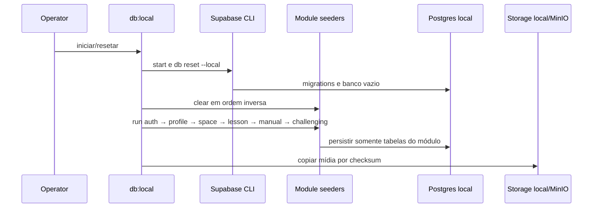

# Context and scope

## Origem e limites

A [Issue #601](https://github.com/JohnPetros/stardust/issues/601) requer Web, Studio e Server locais sem acesso ao Supabase staging. O PRD de sign-in preserva email/senha e login social por Google e GitHub. O usuário escolheu um seed a partir dos dados de staging de Space, Learning e Challenging, incluindo challenges, com a mídia associada copiada para MinIO quando consumida pelo provider S3. A renomeação dos comandos remotos foi adiada para outra Spec.

Hoje `db:test` exclui Mailpit, `[db.seed]` está desabilitado, o provider S3 fixa R2, `db:types` do Server lê staging e o da Web lê produção. Os `.env.development` locais de Server e Web têm URLs Supabase remotas. Studio consome o Server e uma CDN configurável, sem cliente Supabase direto. Não se alteram schema, regras de negócio, contratos HTTP, permissões ou widgets.

A inspeção read-only usou o conector **Supabase StarDust Old**, no projeto `stardust dev`, e encontrou a fotografia abaixo. A tabela `public.questions` está vazia; conteúdo de aprendizado existe também em `stars.texts` e `stars.questions`. Não existe `public.docs` nessa revisão do schema. Entre 36 challenges, 27 são públicos e 9 privados; todos os públicos referenciam `user_id` de usuário real, que o snapshot deve substituir por uma conta autora local determinística. O snapshot exclui identidades e credenciais reais, sessões, comentários, soluções de usuários, votos, challenges privados e demais dados pessoais. O seed inclui duas identidades sintéticas em `auth.users`, uma para Web e outra para Studio, sem copiar contas de staging.

| Fluxo | Produtor | Consumidor | Transporte e mudança |
| --- | --- | --- | --- |
| Auth, DB, Storage e Realtime | Supabase CLI local | Server e Web | HTTP/Postgres em loopback; Studio acessa via Server |
| Catálogo | staging read-only | seeders modulares locais | snapshot versionado, sanitizado e determinístico; orquestrador coordena sem escrever tabelas de domínio |
| Mídia de catálogo | buckets Supabase `images` e `stardust-bucket` | bucket `images` do Supabase local e bucket `stardust-bucket-stg` do MinIO | destino decidido pelo bucket de origem; key mantida e URL reescrita |
| S3 | MinIO em development, R2 em production | Server e browser por signed URL | interface Core preservada |
| Email | Supabase Auth local | Mailpit local | porta 54324, sem SMTP externo |

| Fonte no Supabase StarDust Old (`stardust dev`) | Contagem observada em 2026-09-26 | Tratamento no snapshot |
| --- | ---: | --- |
| `planets` | 8 | incluir todas |
| `stars` | 39 (31 comuns, 8 de challenge; 31 com `texts`, 31 com JSON `questions`, 4 com `story`) | incluir todas e conteúdo embedded |
| `guides` | 10 (9 `lsp`, 1 `mdx`) | incluir todas |
| `questions` | 0 | tabela vazia; preservar dados JSON nas stars |
| `challenges` | 36 (27 públicos, 9 privados) | incluir os 27 públicos; substituir `user_id` real por autor local determinístico |
| `challenge_sources` | 5 (2 públicas, 3 privadas) | incluir somente fontes dos challenges públicos |
| `categories` | 10 | incluir categorias referenciadas |
| Storage bucket `images` | 220 objetos | copiar só os keys referenciados para `images` local e reescrever para o endpoint Storage local |
| Storage bucket `stardust-bucket` | 212 objetos | copiar só os keys referenciados pelo provider S3 para `stardust-bucket-stg` no MinIO |

# Implementation Contract

## Requisitos

| RF | Requisito |
| --- | --- |
| RF-01 | `db:local` inicia Supabase local, aplica migrations, reseta banco e carrega seed e duas identidades sintéticas em `auth.users`; IDs e relações entre identidades, perfis e catálogo são determinísticos em execuções repetidas. `db:test` mantém integração Server local. |
| RF-02 | Em development, Server recusa URL Supabase, PostgreSQL ou S3 remota; Web recusa URL Supabase ou CDN remota; Studio recusa API Server ou CDN remota. Só loopback/localhost e portas locais esperadas são aceitos, antes de servir requests. |
| RF-03 | Web e Server usam Auth, banco, Storage e Realtime locais; Studio usa Server e mídia locais. Nenhuma requisição ao Supabase staging ocorre nos fluxos locais validados. |
| RF-04 | Mailpit da Supabase CLI captura emails Auth em `127.0.0.1:54324`, sem envio externo. |
| RF-05 | Seed reproduz a fotografia observada: 8 `planets`, 39 `stars` (31 com `texts`, 31 com JSON `questions`, 4 com `story`), 10 `guides` (9 `lsp`, 1 `mdx`), zero rows na tabela `questions`, 27 challenges públicos, 2 sources públicas e 10 categorias referenciadas. Não inclui `docs` (tabela ausente), 9 challenges privados ou 3 sources privadas. IDs/FKs permanecem válidos; `challenges.user_id` aponta para autor local determinístico. |
| RF-06 | A mídia catalogada tem roteamento determinístico: objetos do bucket source `images` são copiados com o mesmo key para bucket Supabase local `images`, e suas URLs tornam-se `http://127.0.0.1:54321/storage/v1/object/public/images/<key>`; objetos do source bucket `stardust-bucket` usados pelo `FileStorageProvider` são copiados com o mesmo key para bucket MinIO `stardust-bucket-stg`, e URLs usam a raiz local `http://127.0.0.1:9000/stardust-bucket-stg`. Nenhum campo consumido em development aponta para staging/R2. |
| RF-07 | `S3FileStorageProvider` usa MinIO em development com bucket local e signed URL acessível ao browser; production permanece em R2. Upload, download, listagem, metadata, remoção e assinatura preservam interface e erros. |
| RF-08 | Seed provisiona duas identidades sintéticas em `auth.users`, com IDs fixos `00000000-0000-4000-8000-000000000101` (Web) e `00000000-0000-4000-8000-000000000102` (Studio), além dos perfis públicos correspondentes. Após cada reset, provisionador Auth local atualiza email e senha desses IDs usando `WEB_APP_E2E_EMAIL/PASSWORD` e `STUDIO_APP_E2E_EMAIL/PASSWORD` do `.env.development` ignorado, marca os emails confirmados e sincroniza `public.users.email` para cada ID; nenhum email externo é enviado. A conta Studio está em `GOD_ACCOUNT_IDS` local e pode acessar `/profile/users`. Os challenges públicos usam o ID sintético Web como autor. Não importar usuários/credenciais reais do staging; nenhuma senha/token entra em artefato versionado ou log. |
| RF-09 | Google e GitHub funcionam com Supabase Auth local e callback `http://127.0.0.1:54321/auth/v1/callback`; retornam às rotas existentes de Web/Studio. IDs e secrets OAuth são locais, fora do Git. Tráfego aos provedores OAuth é permitido, mas Auth e sessão usam Supabase local. |
| RF-10 | `db:types` do Server gera tipos com `--local`; comandos remotos existentes permanecem legados, fora do fluxo `db:local`. Esta Spec não altera a geração de tipos da Web, que está fora da fronteira de Database definida pelas Rules. |
| RF-11 | Cada módulo participante possui um seeder próprio seguindo o padrão do `identity-seeder.ts` do Scoops: payload tipado, dependências recebidas no construtor e métodos `clear(): Promise<void>` e `run(seed): Promise<void>`. `AuthSeeder`, `ProfileSeeder`, `SpaceSeeder`, `LessonSeeder`, `ManualSeeder` e `ChallengingSeeder` são os únicos responsáveis por gravar os dados de seus módulos. O orquestrador apenas carrega os snapshots, instancia dependências e chama `clear` na ordem inversa das FKs e `run` na ordem `auth -> profile -> space -> lesson -> manual -> challenging`. |

## Critérios de aceitação

| CA | RF | Dado | Quando | Então | Evidência esperada |
| --- | --- | --- | --- | --- | --- |
| CA-01 | RF-01 | Docker e env local | `db:local` roda duas vezes | migrations/seed completos, mesmas contagens/IDs, sem duplicatas | teste de script e SQL local |
| CA-02 | RF-02 | URL remota em development | Server, Web ou Studio inicia | processo falha antes do listener; erro revela apenas nome da variável | testes de env e startup |
| CA-03 | RF-03 | apps locais e contas seeded | navegar autenticado | `/auth/account` e endpoints das telas retornam `2xx`, sessão persiste e não há request Supabase staging | VM-01/02, EV-01 |
| CA-04 | RF-04 | Auth local | solicitar email | mensagem aparece em Mailpit 54324, sem entrega externa | VM-03, EV-02 |
| CA-05 | RF-05 | snapshot read-only de `stardust dev` | reset local | contagens são 8 planets, 39 stars, 10 guides, 27 challenges públicos, 2 sources públicas e 10 categorias; 31 stars mantêm texts/questions JSON e 4 story; nenhum private challenge/source, conta ou autor real é importado; FKs válidas | SQL e VM-01, EV-03 |
| CA-06 | RF-06 | catálogo com mídia | abrir telas e arquivos | source `images` responde por Supabase Storage local e source `stardust-bucket` por MinIO; todas as respostas `2xx`, sem URLs remotos | VM-01, EV-04 |
| CA-07 | RF-07 | MinIO pronto | testar métodos S3 e signed PUT browser | operações funcionam no bucket local; R2 production inalterado | integração e VM-04, EV-05 |
| CA-08 | RF-01, RF-08 | reset local | consultar Auth/perfis e autenticar com env E2E local | exatamente as duas identidades sintéticas existem nos IDs fixos em `auth.users`; cada `public.users.id` corresponde ao Auth ID e cada perfil tem email igual ao `auth.users.email` configurado; autoria refere IDs válidos; Web abre `/space`, Studio abre `/dashboard` e `/profile/users`; sem segredo versionado | SQL/script test, VM-01/02, diff |
| CA-09 | RF-09 | OAuth clients locais | login Google e GitHub em Web/Studio | callback local, `/auth/account` 200 e rota protegida | VM-05, EV-06 |
| CA-10 | RF-10 | DB local pronto | executar `db:types` e `db:local` | tipos locais; nenhum comando remoto invocado | teste de scripts e logs sanitizados |
| CA-11 | RF-01, RF-05, RF-08, RF-11 | snapshots modulares e banco resetado | executar o orquestrador duas vezes | cada seeder recebe somente seu payload, limpa e grava somente suas tabelas, respeita a ordem de FKs e produz IDs, relações, contagens e conteúdo idênticos sem duplicatas; perfis usam `tier_id`, `rocket_id` e `avatar_id` nulos sem violar FKs | testes unitários dos seeders e integração local do orquestrador |

## Decisões e falhas

`db:local` valida o alvo antes de qualquer reset e usa somente `supabase db reset --local --yes`; nunca `--linked`, `db:push`, `db:pull` ou `db:revert`. Os snapshots versionados são separados por módulo e o manifesto registra origem, data, tabelas, contagens, checksums e inventário de mídia; exportação read-only não roda no boot nem no CI. Depois do reset, o orquestrador chama seeders modulares; não existe `seed.sql` de catálogo concorrendo com eles. `AuthSeeder.run()` cria ou repara os placeholders de IDs fixos por acesso administrativo exclusivamente local e usa Supabase Auth Admin local para atribuir emails/senhas das variáveis E2E locais e marcar emails confirmados; `ProfileSeeder` cria os perfis correspondentes e mantém cada email alinhado ao Auth ID. Assim o Auth emite sessões reais para o teste sem credenciais no snapshot versionado; `GOD_ACCOUNT_IDS` local contém o ID fixo do Studio. Cópia de mídia é idempotente por key/checksum e falha se referência obrigatória faltar. Sem OAuth credentials, login por senha local continua disponível e a indisponibilidade social é explícita, sem fallback para staging. O adiamento dos nomes dos comandos remotos diverge desse item da Issue; a documentação os identifica como legados, e nenhuma execução local padrão os chama.

# Technical Contract

## Fluxo

## Mapa canônico de paths afetados

### Infraestrutura e scripts

| Path | Change | Declaration | Contract | Dependencies | Tests |
| --- | --- | --- | --- | --- | --- |
| `docker-compose.yml` | Modify | `minio`, `minio-init` | volume, health, bucket e acesso browser local | Docker | smoke S3 |
| `package.json` | Modify | `db:local` | entrada única na raiz | server workspace | script test |
| `scripts/local-development.mjs` | Create | `prepareLocalDevelopment(): Promise<void>` | valida localidade, sobe CLI, reseta e invoca o runner modular; não escreve tabelas de domínio | CLI/seed runner/env/MinIO | script test |
| `scripts/tests/local-development.test.mjs` | Create | scenarios | alvo remoto rejeitado, repetição estável | script | test:scripts |
| `scripts/export-staging-catalog.mjs` | Create | `exportStagingCatalog(options): Promise<Manifest>` | export read-only sanitizado em snapshots por módulo, FKs ordenadas, manifesto | staging | revisão e seed local |
| `scripts/sync-local-media.mjs` | Create | `syncLocalMedia(manifest): Promise<void>` | copia objetos inventariados e verifica checksum | Storage/R2/MinIO | integração |

### Server: banco, env e provision

| Path | Change | Declaration | Contract | Dependencies | Tests |
| --- | --- | --- | --- | --- | --- |
| `apps/server/package.json` | Modify | `db:local`, `db:test`, `db:types` | Mailpit incluso e tipos `--local`; remotos legados | Supabase CLI | script test |
| `apps/server/supabase/config.toml` | Modify | `[inbucket]`, `[storage.buckets.images]`, `[auth.external.google]`, `[auth.external.github]` | Mailpit habilitado, bucket local `images` público, OAuth via env; seed executado pelo runner modular após reset | CLI/OAuth/Storage | reset/browser |
| `apps/server/supabase/seed-manifest.json` | Create | `SeedManifest` | fonte `stardust dev`, data, contagens observadas/aplicadas, checksums e objetos; explicita filtro público, rewrite de author e mapa de buckets `images -> Supabase local images`, `stardust-bucket -> MinIO stardust-bucket-stg` | export | manifesto |
| `apps/server/supabase/seeds/profile.json` | Create | `ProfileSeed` | dois perfis sintéticos sem credenciais; IDs fixos de RF-08 e referências `tierId`, `rocketId`, `avatarId` explicitamente nulas | export sanitizado/env | ProfileSeeder test |
| `apps/server/supabase/seeds/space.json` | Create | `SpaceSeed` | 8 planets e estrutura das 39 stars, IDs/FKs estáveis | Supabase StarDust Old | SpaceSeeder test |
| `apps/server/supabase/seeds/lesson.json` | Create | `LessonSeed` | texts, questions e story associados às 39 stars por ID | SpaceSeed | LessonSeeder test |
| `apps/server/supabase/seeds/manual.json` | Create | `ManualSeed` | 10 guides preservando categoria, formato, posição e conteúdo | Supabase StarDust Old | ManualSeeder test |
| `apps/server/supabase/seeds/challenging.json` | Create | `ChallengingSeed` | 27 challenges públicos, 2 sources públicas, 10 categorias e associações; autor reescrito | ProfileSeed/SpaceSeed | ChallengingSeeder test |
| `apps/server/src/database/supabase/seeders/ModuleSeeder.ts` | Create | `ModuleSeeder<TSeed>` | contrato `clear(): Promise<void>` e `run(seed: TSeed): Promise<void>` | — | compile/unit |
| `apps/server/src/database/supabase/seeders/AuthSeeder.ts` | Create | `AuthSeed`, `AuthSeeder` | `clear()` remove apenas identidades locais conhecidas; `run(seed)` recria/repara IDs fixos por cliente DB administrativo local e aplica env/confirmação via Auth Admin sem logar segredo | DB admin/Auth Admin locais | unit/integration |
| `apps/server/src/database/supabase/seeders/ProfileSeeder.ts` | Create | `ProfileSeed`, `ProfileSeeder` | perfis Web/Studio; email sincronizado por ID; grava `tier_id`, `rocket_id`, `avatar_id` como `NULL` para não aplicar defaults com FKs sem catálogo; não gerencia identidade Auth | Supabase local | unit/integration |
| `apps/server/src/database/supabase/seeders/SpaceSeeder.ts` | Create | `SpaceSeed`, `SpaceSeeder` | planets e estrutura de stars; cliente DB local injetado no construtor | Supabase DB local | unit/integration |
| `apps/server/src/database/supabase/seeders/LessonSeeder.ts` | Create | `LessonSeed`, `LessonSeeder` | aplica questions/texts/story às stars existentes; não cria planet/star | Supabase DB local/SpaceSeed | unit/integration |
| `apps/server/src/database/supabase/seeders/ManualSeeder.ts` | Create | `ManualSeed`, `ManualSeeder` | grava guides do módulo manual | Supabase DB local | unit/integration |
| `apps/server/src/database/supabase/seeders/ChallengingSeeder.ts` | Create | `ChallengingSeed`, `ChallengingSeeder` | categories, challenges, relações e sources; somente públicos, autor sintético Web | Supabase DB local/ProfileSeed/SpaceSeed | unit/integration |
| `apps/server/src/database/supabase/seeders/index.ts` | Create | exports | barrel dos seeders modulares | seeders | check:types |
| `apps/server/src/database/supabase/seeders/run-local-seed.ts` | Create | `runLocalSeed(): Promise<void>` | lê/valida snapshots, compõe dependências e executa clear/run na ordem de RF-11 | seeders/env/Supabase local | integration |
| `apps/server/src/database/supabase/seeders/tests/module-seeders.test.ts` | Create | seeder scenarios | ownership de payload/tabelas, ordem, idempotência, falha sem dependência e segredo ausente de logs | seeders | test:unit/integration |
| `apps/server/.env.example` | Modify | variáveis locais | URLs/nomes, sem valores secretos | CLI/MinIO/OAuth | startup |
| `apps/server/src/constants/env.ts` | Modify | `ENV`, `validateLocalEndpoints(input): void` | Supabase/DB/S3 loopback em development | Zod | unitário |
| `apps/server/src/constants/tests/env.test.ts` | Create | env cases | remoto falha; local e production válidos | env | test:unit |
| `apps/server/src/provision/storage/S3FileStorageProvider.ts` | Remove | `S3FileStorageProvider` | movido para subpasta S3 conforme Provision Rules | — | — |
| `apps/server/src/provision/storage/S3FileObject.ts` | Remove | `S3FileObject` | helper movido junto ao provider S3 | — | — |
| `apps/server/src/provision/storage/s3/S3FileStorageProvider.ts` | Create | `constructor()`, métodos de `FileStorageProvider` | endpoint/bucket/forcePathStyle por modo; signatures existentes | S3 SDK/ENV | integração MinIO |
| `apps/server/src/provision/storage/s3/S3FileObject.ts` | Create | `S3FileObject` | normaliza arquivos dentro do adapter S3 | provider S3 | provider tests |
| `apps/server/src/provision/storage/DropboxStorageProvider.ts` | Remove | `DropboxStorageProvider` | movido para subpasta Dropbox conforme Provision Rules | — | — |
| `apps/server/src/provision/storage/dropbox/DropboxStorageProvider.ts` | Create | `DropboxStorageProvider` | implementação Dropbox isolada em sua subpasta | Dropbox SDK | regressão |
| `apps/server/src/provision/storage/index.ts` | Modify | exports | reexporta providers nas novas subpastas | adapters | check:types |
| `apps/server/src/app/hono/middlewares/StorageMiddleware.ts` | Modify | composição do storage | importa adapter S3 pela subpasta ou barrel | provider S3 | unit/integration |
| `apps/server/src/provision/storage/s3/tests/S3FileStorageProvider.test.ts` | Create | provider cases | CRUD, metadata, listagem, signed PUT e erros | MinIO | test:integration |

### Web e Studio: configuração

| Path | Change | Declaration | Contract | Dependencies | Tests |
| --- | --- | --- | --- | --- | --- |
| `apps/web/.env.example` | Modify | URLs locais | Supabase/CDN local | CLI | startup |
| `apps/web/src/constants/client-env.ts` | Modify | `CLIENT_ENV`, `validateLocalClientEndpoints(input): void` | Supabase/CDN loopback em development | Zod | unitário |
| `apps/web/src/constants/tests/client-env.test.ts` | Create | env cases | remoto falha; local passa | client-env | test:unit |
| `apps/studio/src/constants/envSchema.ts` | Modify | `parseEnv`, `validateLocalStudioEndpoints(input): void` | Server/CDN loopback em development | Zod | unitário |
| `apps/studio/src/constants/tests/envSchema.test.ts` | Create | env cases | remoto falha; local passa | envSchema | test:unit |

### Documentação

| Path | Change | Declaration | Contract | Dependencies | Tests |
| --- | --- | --- | --- | --- | --- |
| `documentation/tooling.md` | Modify | guia local | setup/reset/portas/OAuth/seed/MinIO/Mailpit; remotos legados | contrato | revisão |
| `documentation/architecture.md` | Modify | fronteira local | local Supabase/MinIO e R2 production | contrato | revisão |

Cada seeder implementa `ModuleSeeder<TSeed>`, recebe clientes ou gateways locais no construtor e encapsula a ordem interna de remoção/inserção do módulo, como no padrão do Scoops. `clear()` nunca faz reset global e remove apenas linhas pertencentes ao snapshot local, em ordem segura para FKs; `run(seed)` recebe dados já validados e não lê staging. Os tipos gerados e o client Supabase permanecem dentro de `apps/server/src/database/**`. `runLocalSeed()` é a composition root: lê os JSONs versionados, valida IDs/referências, cria clientes locais, executa os seeders e verifica as contagens finais. Falha interrompe o fluxo com nome do módulo e operação, sem payload sensível; uma nova execução converge para o mesmo estado.

`ProfileSeeder.run()` não aceita os defaults de `public.users.tier_id`, `rocket_id` e `avatar_id`, pois eles referenciam catálogos fora do escopo desta Spec e não existem após migrations limpas. Ele envia `NULL` explicitamente para os três campos nullable. Nenhum seeder de Profile cria tiers, rockets ou avatars implicitamente; incluir esses catálogos exige amendment próprio.

`prepareLocalDevelopment()` valida todas as URLs, executa `supabase start` sem excluir Mailpit e `supabase db reset --local --yes`, aguarda health, chama `runLocalSeed()` e reporta falha sem valores sensíveis. `exportStagingCatalog(options)` recebe conexão read-only e destino e retorna snapshots por módulo, contagens e checksums; rejeita tabelas/colunas sensíveis. `syncLocalMedia(manifest)` decide destino exclusivamente por `sourceBucket`: `images` usa o upload Storage local e URL pública local; `stardust-bucket` usa S3 API MinIO e URL pública local; qualquer bucket desconhecido falha. Copia só chaves inventariadas e falha em objeto/checksum divergente. `S3FileStorageProvider` conserva entradas e retornos dos métodos atuais de `FileStorageProvider`; URLs assinadas usam host alcançável pelo browser, não hostname interno Docker. Nenhum SDK atravessa o Core. O fluxo não habilita RLS nem cria/edita policies; preserva exatamente o estado de RLS definido pelas migrations existentes. O seed usa acesso administrativo somente no Supabase local.

# Validation Contract

| ID | Procedimento | Evidência esperada |
| --- | --- | --- |
| VM-01 | Playwright real: login Web seeded, `/space`, planeta/estrela, Learning e challenge, mídia | Auth/telas `2xx`, sessão persistida, screenshots de conteúdo/navegação, sem staging |
| VM-02 | Playwright real: login Studio seeded, `/dashboard`, `/profile/users` e listagem | `2xx`, título `Usuários`, sessão persistida |
| VM-03 | solicitar email Auth e inspecionar Mailpit | mensagem em 54324 |
| VM-04 | signed PUT e GET pelo browser para MinIO | `2xx`, host/bucket locais |
| VM-05 | Google e GitHub em Web/Studio com OAuth clients locais | callback 54321, `/auth/account` 200, rota protegida |
| EV-01 | console, pageerror, requestfailed e response sanitizados | nenhuma falha/requisição staging |
| EV-02 | captura Mailpit | email local |
| EV-03 | manifesto e SQL | contagem, FK e ausência de PII |
| EV-04 | inventário de mídia | chaves/checksums e URLs locais |
| EV-05 | integração S3 | interface preservada |
| EV-06 | status/callback OAuth | provedores locais configurados |

VM-01/02/04/05 usam serviços locais em terminais separados, credenciais carregadas de `.env.development` pelos scripts de exportação, e registro de `console`, `pageerror`, `requestfailed` e `response`. Após correção, repetir fluxo autenticado completo. A integração Web com mocks também roda; ela não substitui o navegador real. Não há alteração visual de UI, node Pencil ou widget.

Sensores: `npm run format`, `npm run check:code`, `npm run check:types`, `npm run test:unit`, `npm run test:coverage`, `npm run check:coverage` (respeitando `coverage-baseline.json`), `npm run check:architecture`, `npm run test:integration`, `npm --workspace @stardust/web run test:integration`, `npm run check:spec-definition -- documentation/features/global/supabase-local-development/spec.md` e `npm run check:spec-implementation -- documentation/features/global/supabase-local-development/spec.md --base <commit-base>`. CI executa checks e builds finais de Server, Web e Studio.

# Documentation alignment and revision history

`documentation/tooling.md` define `db:local` como fluxo padrão e identifica os comandos remotos como legados; `documentation/architecture.md` distingue MinIO development e R2 production. O PRD de sign-in mantém Google/GitHub; a UX não muda.

| Revision | Date | Status | Change |
| --- | --- | --- | --- |
| 1 | 2026-09-26 | draft | Issue #601 e Grilling confirmado; revisão arquitetural clear, sem findings bloqueantes. |
| 2 | 2026-09-26 | open | Corrigida rastreabilidade do PRD: RP-01 cobre senha, RP-02 cobre Google/GitHub e JN-01 cobre as jornadas. Reviewer da revisão 2: clear, sem findings bloqueantes. |
| 3 | 2026-09-26 | draft | Atualizada a fonte para Supabase StarDust Old e fotografia factual do catálogo; excluídos challenges privados e reescrito autor real por fixture local. Reviewer identificou três ajustes arquiteturais. |
| 4 | 2026-09-26 | draft | Providers movidos para subpastas próprias; geração de tipos Web removida; validação CDN restrita aos consumidores configurados. Reviewer pediu explicitar o destino da mídia. |
| 5 | 2026-09-26 | draft | Mapa explícito de mídia: bucket Supabase `images` para Storage local; bucket `stardust-bucket` para MinIO. Reviewer solicitou o nome explícito do conector Old. |
| 6 | 2026-09-26 | open | Proveniência corrigida para Supabase StarDust Old (projeto `stardust dev`). Reviewer da revisão 6: clear, sem findings bloqueantes. |
| 7 | 2026-09-26 | draft | Decisão explicitada: não habilitar RLS nem criar/editar policies; manter o estado definido pelas migrations. SQL de remediação não faz parte da entrega. |
| 8 | 2026-09-26 | draft | Seed inclui usuários sintéticos de Supabase Auth para Web e Studio com IDs fixos; Auth Admin local aplica credenciais do env ignorado após reset. Challenges usam o autor sintético Web. |
| 9 | 2026-09-26 | open | Provisionamento sincroniza o email de cada perfil `public.users` com Auth. Spec definition passou e Reviewer da revisão 9: clear, sem findings. |
| 10 | 2026-09-26 | open | Seed dividido por módulos conforme padrão de seeder do Scoops: contrato `clear/run`, payloads tipados, dependências no construtor e runner apenas como composition root. Incluídos seeders Auth, Profile, Space, Lesson, Manual e Challenging. Defaults de Profile corrigidos para referências explicitamente nulas; Spec definition passou e Reviewer da revisão 10: clear. |
