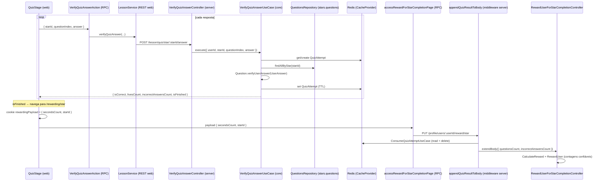

# 1. Objetivo

Fechar a ISSUE-01 do security report: hoje a recompensa de conclusão de estrela (moedas/XP/nível/streak) é calculada no servidor a partir de `questionsCount` e `incorrectAnswersCount` que chegam de um cookie **controlado pelo cliente**, permitindo que um aluno forje o payload e infle a recompensa. Esta spec torna o resultado do quiz **autoritativo no servidor**: cada resposta é submetida e verificada no servidor (reusando o domínio `Question.verifyUserAnswer`), com o estado da tentativa persistido em **Redis** (via `CacheProvider`/`IORedisCacheProvider` já existentes, sem nova tabela ou migration). No fim, a rota de reward consome esse estado — a contagem de perguntas e de erros passa a vir do servidor, não do cliente, e os campos correspondentes são removidos do fluxo cliente ponta a ponta.

---

# 2. Escopo

## 2.1 In-scope

- Verificação de cada resposta do quiz no servidor, com estado da tentativa (`questionsCount`, `currentQuestionIndex`, `incorrectAnswersCount`, `livesCount`) persistido em Redis por `{userId, starId}` com TTL.
- Cálculo autoritativo de `questionsCount` e `incorrectAnswersCount` a partir das questões reais da estrela (`stars.questions`) e das respostas verificadas.
- Reaproveitamento da rota `PUT /profile/users/:userId/reward/star` injetando as contagens confiáveis na borda (padrão `appendXToBody` já usado nessa rota), consumindo e invalidando a tentativa (idempotência).
- Remoção de `questionsCount` e `incorrectAnswersCount` do fluxo cliente: cookie `rewardingPayload`, tipo `StarRewardingPayload`, schema RPC e `useLessonPage`.
- Rework do `useQuizStage` para dirigir a UI (correto/incorreto, vidas, avanço, fim) pela resposta do servidor.

## 2.2 Out-of-scope

- Reward de **star-challenge** e de **challenge** (mesmo padrão de payload, mas fora da ISSUE-01 — tratar em spec própria).
- Persistência da tentativa em Postgres (decidido: usar Redis).
- `secondsCount`: permanece autodeclarado pelo cliente por ser cosmético (apenas exibido na tela de rewarding, não afeta moedas/XP). Ver seção 8.
- Redesenho visual da Lesson Page, animações dos chunks e gating `Story → Quiz`.
- Alteração do contrato de rewarding além dos campos citados.

---

# 3. Requisitos

## 3.1 Funcionais

- Ao verificar uma resposta, o cliente envia `{ starId, questionIndex, answer }` ao servidor; o servidor retorna se está correta, o total de vidas restantes e se o quiz terminou.
- O servidor cria a tentativa na primeira resposta (lazy init), derivando `questionsCount` das questões reais da estrela.
- O servidor rejeita respostas fora de ordem (`questionIndex` ≠ índice atual da tentativa).
- Ao concluir a estrela, a recompensa usa `questionsCount` e `incorrectAnswersCount` da tentativa persistida — nunca valores do cliente.
- Consumir a tentativa no reward a invalida; um segundo reward para a mesma estrela sem nova tentativa retorna 404 (mantém o padrão atual `call.notFound()`).
- O cliente deixa de enviar `questionsCount`/`incorrectAnswersCount` no cookie e no payload de rewarding.

## 3.2 Não funcionais

- **Segurança:** nenhum valor que determina a recompensa (contagem de perguntas/erros) pode originar-se do cliente; a verificação de resposta reusa exclusivamente a lógica de domínio existente.
- **Idempotência:** consumir a tentativa é atômico do ponto de vista do fluxo (leitura seguida de `delete`), evitando reward duplicado por replay.
- **Resiliência:** expiração da tentativa (TTL) libera memória; tentativa ausente/expirada no reward resulta em 404 controlado, sem conceder recompensa.

---

# 4. O que já existe?

## Core (lesson)

- **`Quiz`** (`packages/core/src/lesson/domain/structures/Quiz.ts`) — estrutura de quiz client-side (vidas, índice, `incorrectAnswersCount`, `verifyUserAnswer`). Permanece para a UX do cliente, mas deixa de ser fonte de verdade da recompensa.
- **`Question` (abstract)** (`packages/core/src/lesson/domain/abstracts/Question.ts`) — expõe `verifyUserAnswer(userAnswer: UserAnswer): Logical`; reutilizável no servidor.
- **`UserAnswer`** (`packages/core/src/global/domain/structures/UserAnswer.ts`) — `create(value: unknown)`; encapsula o valor da resposta.
- **`QuestionDto`** (`packages/core/src/lesson/domain/entities/dtos/QuestionDto.ts`) — inclui o campo `answer` (resposta correta) por tipo de questão.
- **`QuestionsRepository`** (`packages/core/src/lesson/interfaces/QuestionsRepository.ts`) — `findAllByStar(starId: Id): Promise<Question[]>`.

## Core (profile)

- **`CalculateRewardForStarCompletionUseCase`** (`packages/core/src/profile/use-cases/CalculateRewardForStarCompletionUseCase.ts`) — calcula moedas/XP/accuracy a partir de `questionsCount`/`incorrectAnswersCount`.
- **`StarRewardingPayload`** (`packages/core/src/profile/domain/types/StarRewardingPayload.ts`) — `{ questionsCount, incorrectAnswersCount, secondsCount, starId }`.

## Core (global — provision)

- **`CacheProvider`** (`packages/core/src/global/interfaces/provision/CacheProvider.ts`) — `get`, `set(key, value, { expiresAt })`, `popListItem`, `delete`.

## Provision (server)

- **`IORedisCacheProvider`** (`apps/server/src/provision/cache/ioredis/IORedisCacheProvider.ts`) — implementação de `CacheProvider` com `ioredis`; instanciada sem argumentos (`new IORedisCacheProvider()`), como em `ChatsRouter` e `ChallengingToolkit`.

## REST (server)

- **`RewardUserForStarCompletionController`** (`apps/server/src/rest/controllers/profile/users/RewardUserForStarCompletionController.ts`) — lê `starId`/`nextStarId`/`questionsCount`/`incorrectAnswersCount` de `http.getBody()` e orquestra os use cases de reward.
- **`AppendNextStarToBodyController`** (`apps/server/src/rest/controllers/space/stars/AppendNextStarToBodyController.ts`) e **`AppendUserInfoToBodyController`** (`apps/server/src/rest/controllers/profile/users/AppendUserInfoToBodyController.ts`) — referência do padrão de middleware que anexa dado confiável ao body via `http.extendBody(...)`.
- **`FetchQuestionsController`** (`apps/server/src/rest/controllers/lesson/FetchQuestionsController.ts`) — referência de controller lesson que usa `QuestionsRepository`.
- **`UsersRouter`** (`apps/server/src/app/hono/routers/profile/UsersRouter.ts`) — registra `PUT /:userId/reward/star` com `verifyAuthentication` + `appendUserInfoToBody` + `appendNextStarToBody` + validações.
- **`LessonRouter`** (`apps/server/src/app/hono/routers/lesson/LessonRouter.ts`) e **`QuestionsRouter`** (`apps/server/src/app/hono/routers/lesson/QuestionsRouter.ts`) — composição de rotas do domínio lesson.
- **`SupabaseQuestionsRepository`** (`apps/server/src/database/supabase/repositories/lesson/SupabaseQuestionsRepository.ts`) — `findAllByStar` lê `stars.questions` (jsonb).
- **Middlewares** (`apps/server/src/app/hono/middlewares/index.ts`) — `AuthMiddleware`, `SpaceMiddleware`, `ProfileMiddleware`, `ValidationMiddleware`, etc.
- **`HonoHttp`** (`apps/server/src/app/hono/HonoHttp.ts`) — `getBody()` mescla `req.valid('json')` com `extra-body` (este último tem precedência); `getAccountId()`, `extendBody()`, `pass()`.

## Validation

- **Schemas lesson** (`packages/validation/src/modules/lesson/schemas/`) e **schemas global** (`idSchema`, `integerSchema`) — referência para novos schemas.

## RPC / REST (web)

- **`rewardingActions.accessRewardForStarCompletionPage`** (`apps/web/src/rpc/next-safe-action/rewardingActions.ts`) — composition root com schema `{ questionsCount, incorrectAnswersCount, secondsCount, starId }`.
- **`AccessStarRewardingPageAction`** (`apps/web/src/rpc/actions/rewarding/AccessStarRewardingPageAction.ts`) — lê o cookie, faz `JSON.parse` e chama `service.rewardUserForStarCompletion`.
- **`lessonActions`** (`apps/web/src/rpc/next-safe-action/lessonActions.ts`) — composition root das actions de lesson (`authActionClient`).
- **`LessonService`** (`apps/web/src/rest/services/LessonService.ts`) — `fetchQuestions`, `fetchTextsBlocks`, etc.
- **`ProfileService.rewardUserForStarCompletion`** (`apps/web/src/rest/services/ProfileService.ts`) — `PUT /profile/users/:userId/reward/star`.
- **`cookieActions.setCookie`** (`apps/web/src/rpc/next-safe-action/cookieActions.ts`) — grava cookie via `actionClient` (não autenticado).

## UI (web)

- **`useQuizStage`** (`apps/web/src/ui/lesson/widgets/pages/Lesson/QuizStage/useQuizStage.ts`) — verifica resposta client-side (`quiz.verifyUserAnswer`) e transiciona para `rewarding` quando não há próxima questão.
- **`useLessonPage`** (`apps/web/src/ui/lesson/widgets/pages/Lesson/useLessonPage.ts`) — monta o `rewardingPayload` e grava no cookie ao entrar em `rewarding`.
- **`LessonStore`** (`apps/web/src/ui/lesson/stores/LessonStore/`) — slices de quiz/stage/story.

---

# 5. O que deve ser criado?

## Core (Use Cases)

### VerifyQuizAnswerUseCase **(novo arquivo)**

- **Localização:** `packages/core/src/lesson/use-cases/VerifyQuizAnswerUseCase.ts`
- **Dependências:** `QuestionsRepository`, `CacheProvider`
- **Request:** `{ userId: string; starId: string; questionIndex: number; answer: unknown }`
- **Response:** `{ isCorrect: boolean; livesCount: number; incorrectAnswersCount: number; isFinished: boolean }`
- **Métodos:**
  - `execute(request: Request): Promise<Response>` — carrega (ou cria via lazy init) o `QuizAttempt` do cache por `{userId, starId}`; valida ordem (`questionIndex === attempt.currentQuestionIndex`); busca a questão real por índice via `findAllByStar`; verifica com `Question.verifyUserAnswer(UserAnswer.create(answer))`; atualiza o attempt (erros/vidas/índice) e persiste com TTL; retorna o resultado.

### ConsumeQuizAttemptUseCase **(novo arquivo)**

- **Localização:** `packages/core/src/lesson/use-cases/ConsumeQuizAttemptUseCase.ts`
- **Dependências:** `CacheProvider`
- **Request:** `{ userId: string; starId: string }`
- **Response:** `{ questionsCount: number; incorrectAnswersCount: number } | null`
- **Métodos:**
  - `execute(request: Request): Promise<Response>` — lê o `QuizAttempt` do cache; se ausente/expirado retorna `null`; caso contrário retorna as contagens autoritativas e faz `delete` da chave (consumo idempotente).

## Core (Structures)

### QuizAttempt **(novo arquivo)**

- **Localização:** `packages/core/src/lesson/domain/structures/QuizAttempt.ts`
- **Dependências:** nenhuma (Value Object serializável)
- **Props:** `questionsCount`, `currentQuestionIndex`, `incorrectAnswersCount`, `livesCount`
- **Métodos:**
  - `static create(questionsCount: number): QuizAttempt` — inicia tentativa (índice 0, 0 erros, 5 vidas — alinhado ao `Quiz.create`).
  - `static fromJson(json: string): QuizAttempt` — reidrata do cache.
  - `toJson(): string` — serializa para o cache.
  - `registerAnswer(isCorrect: boolean): QuizAttempt` — avança índice; se incorreta, decrementa vida e incrementa `incorrectAnswersCount` (espelha as regras de `Quiz`).
  - `get isFinished(): boolean` / `get hasLives(): boolean` / getters de contagem.
  - `static cacheKey(userId: string, starId: string): string` — chave canônica (ex.: `quiz-attempt:{userId}:{starId}`).

## Validation (Schemas)

### verifyQuizAnswerSchema **(novo arquivo)**

- **Localização:** `packages/validation/src/modules/lesson/schemas/verifyQuizAnswerSchema.ts`
- **Atributos:** `questionIndex: integerSchema (>= 0)`, `answer: z.unknown()` (o formato varia por tipo de questão; a verificação real ocorre no domínio). `starId` fica como route param, fora deste schema.

## REST (Controllers)

### VerifyQuizAnswerController **(novo arquivo)**

- **Localização:** `apps/server/src/rest/controllers/lesson/VerifyQuizAnswerController.ts`
- **Dependências:** `QuestionsRepository`, `CacheProvider`
- **Request/Response:** entrada `routeParams.starId` + `body { questionIndex, answer }` + `getAccountId()`; saída `{ isCorrect, livesCount, incorrectAnswersCount, isFinished }`
- **Métodos:**
  - `handle(http): Promise<RestResponse>` — monta `userId` de `getAccountId()`, instancia `VerifyQuizAnswerUseCase` e retorna o resultado.

### AppendQuizResultToBodyController **(novo arquivo)**

- **Localização:** `apps/server/src/rest/controllers/lesson/AppendQuizResultToBodyController.ts`
- **Dependências:** `CacheProvider`
- **Request/Response:** lê `starId` de `getBody()` + `getAccountId()`; anexa ao body `{ questionsCount, incorrectAnswersCount }`
- **Métodos:**
  - `handle(http): Promise<RestResponse>` — executa `ConsumeQuizAttemptUseCase`; se `null`, `http.notFound()`; senão `http.extendBody({ questionsCount, incorrectAnswersCount })` e `http.pass()`. Segue o padrão de `AppendNextStarToBodyController`.

## Hono App (Routes) — `apps: server`

### QuizRouter **(novo arquivo)**

- **Localização:** `apps/server/src/app/hono/routers/lesson/QuizRouter.ts` (registrado por `LessonRouter`)
- **Middlewares:** `authMiddleware.verifyAuthentication`, `validationMiddleware.validate('param', { starId: idSchema })`, `validationMiddleware.validate('json', verifyQuizAnswerSchema)`
- **Caminho da rota:** `POST /lesson/quiz/star/:starId/answer`
- **Dados de schema:** `verifyQuizAnswerSchema` (json) + `{ starId }` (param)

### LessonMiddleware **(novo arquivo)**

- **Localização:** `apps/server/src/app/hono/middlewares/LessonMiddleware.ts` (exportado em `middlewares/index.ts`)
- **Métodos:**
  - `appendQuizResultToBody(context, next): Promise<void>` — instancia `IORedisCacheProvider` e `AppendQuizResultToBodyController`, delega o handle. Espelha `ProfileMiddleware.appendUserInfoToBody`.

## RPC (Actions) — `apps: web`

### VerifyQuizAnswerAction **(novo arquivo)**

- **Localização:** `apps/web/src/rpc/actions/lesson/VerifyQuizAnswerAction.ts`
- **Dependências:** `LessonService`
- **Request/Response:** `{ starId, questionIndex, answer }` → `{ isCorrect, livesCount, incorrectAnswersCount, isFinished }`
- **Métodos:**
  - `handle(call): Promise<Response>` — chama `service.verifyQuizAnswer(...)` e propaga a resposta (segue o padrão de `FetchLessonStoryAndQuestionsAction`).
- **Composition root:** novo export em `apps/web/src/rpc/next-safe-action/lessonActions.ts` com `authActionClient.schema(verifyQuizAnswerSchema + starId)`.

## REST (Services) — `apps: web`

### LessonService.verifyQuizAnswer **(novo método)**

- **Localização:** `apps/web/src/rest/services/LessonService.ts`
- **Métodos:**
  - `verifyQuizAnswer(params: { starId: Id; questionIndex: Integer; answer: unknown }): Promise<RestResponse<{ isCorrect: boolean; livesCount: number; incorrectAnswersCount: number; isFinished: boolean }>>` — `POST /lesson/quiz/star/${starId}/answer`.

---

# 6. O que deve ser modificado?

- **Arquivo:** `apps/server/src/app/hono/routers/profile/UsersRouter.ts`
  - **Mudança:** na rota `PUT /:userId/reward/star`, adicionar `lessonMiddleware.appendQuizResultToBody` antes do handler e **remover** `questionsCount`/`incorrectAnswersCount` do schema `json` (permanece só `starId`, mais os campos anexados por middlewares).
  - **Justificativa:** contagens passam a ser server-authoritative; campos controlados pelo servidor não entram em schema de entrada (Princípios 5 e 6).

- **Arquivo:** `apps/server/src/rest/controllers/profile/users/RewardUserForStarCompletionController.ts`
  - **Mudança:** manter a leitura de `questionsCount`/`incorrectAnswersCount` de `getBody()` (agora injetados pelo middleware). Adicionar guarda defensiva `incorrectAnswersCount ∈ [0, questionsCount]` antes de calcular.
  - **Justificativa:** os valores vêm da borda confiável; a guarda protege contra estados inconsistentes.

- **Arquivo:** `apps/server/src/app/hono/middlewares/index.ts`
  - **Mudança:** exportar `LessonMiddleware`.
  - **Justificativa:** disponibilizar o novo middleware.

- **Arquivo:** `apps/server/src/app/hono/routers/lesson/LessonRouter.ts`
  - **Mudança:** registrar o `QuizRouter`.
  - **Justificativa:** expor a rota de verificação de resposta.

- **Arquivo:** `apps/server/src/rest/controllers/lesson/index.ts`
  - **Mudança:** exportar `VerifyQuizAnswerController` e `AppendQuizResultToBodyController`.
  - **Justificativa:** barrel do domínio.

- **Arquivo:** `packages/core/src/profile/domain/types/StarRewardingPayload.ts`
  - **Mudança:** remover `questionsCount` e `incorrectAnswersCount`; manter `{ secondsCount, starId }`.
  - **Justificativa:** o cliente não é mais fonte dessas contagens.

- **Arquivo:** `apps/web/src/ui/lesson/widgets/pages/Lesson/useLessonPage.ts`
  - **Mudança:** montar `rewardingPayload` apenas com `{ secondsCount, starId }` (remover `questionsCount`/`incorrectAnswersCount`).
  - **Justificativa:** alinhamento com o novo `StarRewardingPayload`.

- **Arquivo:** `apps/web/src/rpc/next-safe-action/rewardingActions.ts`
  - **Mudança:** no schema de `accessRewardForStarCompletionPage`, remover `questionsCount`/`incorrectAnswersCount` (manter `secondsCount`, `starId`).
  - **Justificativa:** o payload do cliente deixa de carregar contagens.

- **Arquivo:** `apps/web/src/rpc/actions/rewarding/AccessStarRewardingPageAction.ts`
  - **Mudança:** repassar o payload reduzido a `service.rewardUserForStarCompletion` (o corpo enviado ao servidor não inclui contagens; o servidor as injeta).
  - **Justificativa:** consistência com o novo contrato.

- **Arquivo:** `apps/web/src/ui/lesson/widgets/pages/Lesson/QuizStage/useQuizStage.ts`
  - **Mudança:** no clique de verificação, executar `VerifyQuizAnswerAction` com a resposta atual; dirigir a UI (correto/incorreto, vidas, avanço) e a transição para `rewarding` pela resposta do servidor (`isFinished`).
  - **Justificativa:** a verificação passa a ser autoritativa no servidor.

---

# 7. O que deve ser removido?

- **Item:** campos `questionsCount` e `incorrectAnswersCount` do cookie `rewardingPayload` e do payload RPC de reward de estrela.
  - **Motivo:** substituídos pela fonte de verdade server-side (Redis).
  - **Impacto:** `useLessonPage`, `StarRewardingPayload`, schema de `accessRewardForStarCompletionPage`, `AccessStarRewardingPageAction` e o schema `json` da rota REST de reward. Sem remoção de arquivos.

---

# 8. Decisões Técnicas

- **Estado da tentativa em Redis (não Postgres).** Decisão do usuário. Reusa `CacheProvider`/`IORedisCacheProvider` já no stack (dependência `ioredis`, `REDIS_URL`, serviço no `docker-compose`), evitando migration/RLS. Trade-off: estado efêmero (TTL) — uma tentativa expirada antes da conclusão resulta em 404 no reward (sem recompensa), comportamento aceitável e seguro.
- **Verificação server-side por resposta, reusando o domínio.** `VerifyQuizAnswerUseCase` chama `Question.verifyUserAnswer`, a mesma lógica hoje usada no cliente — sem duplicar regra de correção. Alternativa (verificar só na conclusão enviando todas as respostas) foi descartada em favor da persistência incremental escolhida.
- **Contagens injetadas na borda (`appendQuizResultToBody`).** Mantém o `core` de `profile` isolado do conceito de quiz (Princípio 4): o bridging lesson→profile ocorre no middleware/controller, seguindo o padrão `appendXToBody` já presente na própria rota de reward (Princípio 5).
- **Lazy init da tentativa.** A tentativa é criada na primeira resposta, dispensando um endpoint de "start" e reduzindo superfície.
- **Idempotência via consumo.** `ConsumeQuizAttemptUseCase` lê e apaga a chave; replays de reward sem nova tentativa caem em 404 (padrão `call.notFound()` já existente).
- **`secondsCount` permanece client-side.** É apenas exibido na tela de rewarding e não afeta moedas/XP; mantê-lo autodeclarado não reintroduz risco de recompensa. Documentado como resíduo consciente.

---

# 9. Diagramas e Referências

### Fluxo de dados

### Fluxo cross-app

- **web** expõe interação e consome REST; **server** é a autoridade. Verificação: `web → server` via `POST /lesson/quiz/star/:starId/answer`. Reward: `web → server` via `PUT /profile/users/:userId/reward/star`, com as contagens injetadas server-side a partir do Redis.

### Referências

- Padrão de middleware `appendXToBody`: `apps/server/src/rest/controllers/space/stars/AppendNextStarToBodyController.ts`, `apps/server/src/rest/controllers/profile/users/AppendUserInfoToBodyController.ts`.
- Uso de `IORedisCacheProvider`: `apps/server/src/app/hono/routers/conversation/ChatsRouter.ts`.
- Controller lesson com `QuestionsRepository`: `apps/server/src/rest/controllers/lesson/FetchQuestionsController.ts`.
- Action lesson (composition root): `apps/web/src/rpc/actions/lesson/FetchLessonStoryAndQuestionsAction.ts`, `apps/web/src/rpc/next-safe-action/lessonActions.ts`.

---

# 10. Pendências / Dúvidas

- **TTL da tentativa.** Sugerido default de 2h (cobre a sessão de lição com folga). Impacto: tentativas mais curtas podem expirar em sessões longas; mais longas ocupam memória. Ação sugerida: confirmar o valor com o time antes de implementar.
- **Enforcement de vidas no servidor.** Hoje o fim do quiz por falta de vidas é tratado na UI (`alertDialogRef`). Definir se o servidor deve invalidar a tentativa quando `livesCount` chega a 0 (bloqueando reward) ou se mantém o gating no cliente. Impacto: robustez contra manipulação de vidas. Ação sugerida: decidir na fase de plano; se sim, `AppendQuizResultToBodyController` também recusa tentativa sem vidas.

---

# 11. Execução Recomendada

Usar **`implement-plan`**. A mudança é multi-app (core, validation, server REST/middleware/rota, web RPC/service/UI), com dependências entre camadas (core+validation antes de server; server antes de web) e alto risco de regressão no fluxo de quiz. Vale decompor em fases: (1) core `QuizAttempt` + use cases + schema; (2) server controllers + `QuizRouter` + `LessonMiddleware` + ajuste da rota de reward; (3) web service + RPC action + rework de `useQuizStage`/`useLessonPage` + limpeza do payload.
