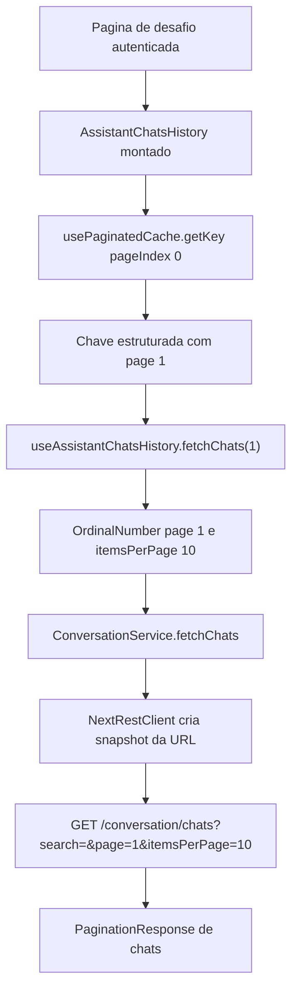
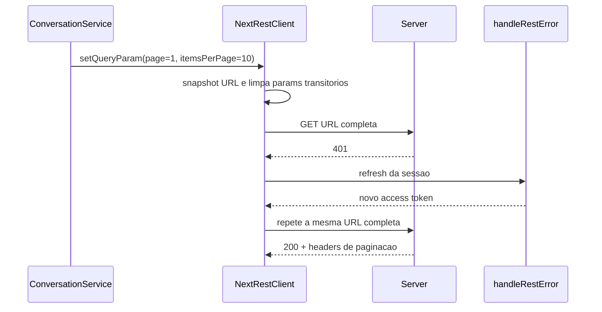

# Spec: Integridade da paginacao do historico do assistente

## Parte I — Contract

### 1. Contexto

O historico de conversas e montado junto com o assistente na pagina de desafio e,
para uma conta autenticada, consulta `GET /conversation/chats` antes mesmo de o
dialog de historico ser aberto. O fluxo observado pode enviar `page` e
`itemsPerPage` ausentes ou invalidos, receber a rejeicao do schema da rota e
exibir o erro pelo toast global do SWR.

A inspecao estatica confirma que a chave inicial atual
`/assistant-chats?&itemsPerPage=10&page=1` e convertida em `page = 1`; portanto,
o `split('&page=')` nao reproduz sozinho o defeito descrito no report. Ele e uma
fragilidade confirmada do contrato interno, nao uma causa isoladamente
comprovada do incidente.

Ha um segundo mecanismo confirmado e compativel com o sintoma:
`NextRestClient` mantem query params mutaveis na instancia compartilhada,
recompõe um retry por meio de `this.get(route)` depois de um refresh de sessao e
retorna respostas paginadas sem limpar esses params. Se outra requisicao
consumir ou substituir esse estado durante a espera pelo refresh, o retry de
`/conversation/chats` pode perder `page` e `itemsPerPage`; o server então faz
coercao dos campos ausentes para `NaN` e produz exatamente a classe de erro
relatada. A ocorrencia original ainda nao possui reproducao automatizada, por
isso a solucao cobre e testa separadamente os dois contratos frageis sem afirmar
qual deles ocorreu em producao.

### 2. Objetivo

Garantir que o carregamento inicial autenticado e as paginas subsequentes do
historico chamem a API com pagina e quantidade por pagina inteiras e positivas,
preservando os mesmos query params em eventual retry, sem exibir toast de
validacao durante a inicializacao normal da pagina de desafio.

### 3. Fora de escopo

- Alterar a montagem antecipada do historico ou adiar o fetch ate a abertura do
  dialog.
- Ocultar erros reais do historico, remover o toast global ou mudar a politica
  atual para `AuthError`.
- Relaxar ou adicionar defaults aos schemas `pageSchema` e
  `itemsPerPageSchema` da rota do server.
- Alterar `ConversationService`, seus objetos de dominio, DTOs, endpoint ou
  contrato de resposta paginada.
- Alterar repositorios, banco de dados, migrations ou dados persistidos.
- Refatorar todos os metodos e consumidores do `RestClient` que nao participem
  do transporte de GET paginado.
- Corrigir outros comportamentos de query params do `NextRestClient`, como
  `getFile`, verbos de escrita ou serializacao de arrays.

### 4. Requisitos funcionais

- **RF-01 — Carregamento inicial valido:** ao montar o assistente em uma pagina
  de desafio para uma conta autenticada, o historico deve consultar a primeira
  pagina com `page=1` e `itemsPerPage=10`, sem produzir toast de validacao.
- **RF-02 — Paginacao subsequente valida:** ao solicitar mais resultados, cada
  chamada do fetcher deve receber a pagina correspondente como inteiro positivo,
  mantendo a semantica de lista infinita existente.
- **RF-03 — Transporte estavel:** depois que uma chamada GET paginada consumir
  os query params configurados e montar sua URL, ela deve preservar esse
  snapshot em eventual retry apos refresh de sessao; uma chamada GET posterior
  sem params nao deve herdar os params ja consumidos.
- **RF-04 — Comportamentos existentes preservados:** conta nao autenticada deve
  continuar sem carregar o historico, fim da lista deve continuar interrompendo
  novas paginas e falhas nao relacionadas a autenticacao devem continuar
  chegando ao toast global.

### 5. Matriz de criterios

| ID | Requisito | Dado | Quando | Entao | Evidencia esperada |
| --- | --- | --- | --- | --- | --- |
| `CA-01` | `RF-01` | pagina de desafio com cookie de acesso, conta autenticada e rota fake do historico vazio registradas | a inicializacao client-side conclui | ocorre `GET /conversation/chats` com `search=`, `page=1` e `itemsPerPage=10`, a resposta e bem-sucedida e nenhum toast contem erro de validacao desses campos | Playwright em `apps/web/src/app/tests/challenging/assistant-history.test.ts` inspecionando request, response e UI |
| `CA-02` | `RF-01` | `useAssistantChatsHistory` habilitado para conta autenticada | o SWR executa o fetch inicial | `ConversationService.fetchChats` recebe `OrdinalNumber` com valores `page=1` e `itemsPerPage=10` | teste de hook em `AssistantChatsHistory/tests/useAssistantChatsHistory.test.ts` |
| `CA-03` | `RF-02` | cache paginado habilitado e primeira pagina com itens suficientes | o SWR solicita o indice seguinte | o fetcher de dominio recebe `2`, e paginas posteriores seguem `pageIndex + 1` sem parsing textual | teste unitario em `apps/web/src/ui/global/hooks/tests/usePaginatedCache.test.ts` |
| `CA-04` | `RF-03` | GET paginado recebe `401`, o refresh e bem-sucedido e outra chamada altera o estado de query params durante a espera | o cliente repete a requisicao original | tentativa inicial e retry usam a mesma URL completa, com os mesmos valores de `page` e `itemsPerPage` | teste unitario deterministico de `NextRestClient` em `apps/web/src/rest/next/NextRestClient.test.ts` |
| `CA-05` | `RF-03` | GET paginado ja consumiu seus query params ao montar a URL | uma chamada GET sem params e iniciada na mesma instancia antes da response da primeira | a primeira URL contem os params paginados e a segunda nao herda nenhum deles, independentemente da ordem de conclusao das responses | teste unitario de `NextRestClient` com `fetch` controlado |
| `CA-06` | `RF-04` | conta nao autenticada | o historico e montado | nenhum fetch de chats e executado | teste existente de `useAssistantChatsHistory` |
| `CA-07` | `RF-04` | ultima pagina carregada possui menos itens que `itemsPerPage` | o cache calcula o estado da lista | `isReachedEnd` fica verdadeiro | teste unitario de `usePaginatedCache` |
| `CA-08` | `RF-04` | falha nao relacionada a autenticacao no fetch paginado | o callback `onError` do SWR e executado | a mensagem normalizada continua sendo exibida pelo toast e nao ha retry automatico do SWR | teste existente de `usePaginatedCache` |
| `CA-09` | `RF-04` | cache habilitado e pagina anterior vazia | o SWR avalia a chave da pagina seguinte | `getKey` retorna `null` e nenhum novo fetch e executado | teste unitario de `usePaginatedCache` |
| `RN-01` | `RF-02` | qualquer chave interna produzida por `usePaginatedCache` | o fetcher interno resolve a pagina | a pagina e transportada como numero explicito em chave estruturada, e somente inteiro maior que zero chega ao fetcher de dominio | teste unitario do contrato `getKey` → `infiniteFetcher` e `check:types` |
| `RN-02` | `RF-03` | query params configurados no `NextRestClient` | um GET consome os params | a URL da requisicao torna-se um snapshot imutavel para eventual retry, sem depender do estado mutavel posterior do client | teste unitario e inspecao do diff |
| `RN-03` | `RF-01` | rota `GET /conversation/chats` | a correcao e revisada | `pageSchema`, `itemsPerPageSchema`, autenticacao, service e resposta paginada permanecem inalterados | inspecao do diff e dos contratos em `ChatsRouter.ts` e `ConversationService.ts` |
| `RN-04` | `RF-04` | mudanca no hook global de paginacao e no adapter REST web | a suite integrada e executada | consumidores existentes continuam tipados e nao surgem imports fora das fronteiras UI → REST/Core | `check:code`, `check:types`, `test:unit`, `check:architecture` e `test:integration` |
| `RN-05` | `RF-02` | cache paginado com `key`, `dependencies` e `itemsPerPage` definidos | o hook renderiza novamente | valores equivalentes preservam a identidade da chave; mudanca em qualquer dependencia ou em `itemsPerPage` produz nova identidade de cache | teste unitario de `usePaginatedCache` capturando `getKey` |

## Parte II — Solucao tecnica

### 6. Estado atual confirmado

#### Camada UI — cache global

- `apps/web/src/ui/global/hooks/usePaginatedCache.ts` recebe um fetcher tipado
  como `(page: number)`, mas `getKey` concatena identificador, dependencias,
  `itemsPerPage` e pagina em uma unica string.
- O `infiniteFetcher` recupera a pagina com
  `Number(key.split('&page=').at(-1))`. Nao ha teste atual exercitando em conjunto
  os callbacks `getKey` e `infiniteFetcher`; os testes existentes cobrem apenas
  o tratamento de erros.
- O mesmo hook e compartilhado por listas de challenging, profile, shop, forum
  e playground. A mudanca deve preservar `dependencies`, `isEnabled`,
  `isInfinity`, `initialData`, `setPage`, `nextPage` e a interrupcao apos pagina
  vazia.

#### Camada UI — historico do assistente

- `apps/web/src/ui/challenging/widgets/layouts/Challenge/AssistantChatbot/AssistantChatsHistory/useAssistantChatsHistory.ts`
  habilita o cache quando `isAccountAuthenticated` e transforma a pagina
  recebida em `OrdinalNumber` antes de chamar `ConversationService.fetchChats`.
- `CHATS_PER_PAGE` ja e `OrdinalNumber.create(10)`. `OrdinalNumber.create`
  rejeita `NaN` e valores menores que um, logo o hook nao deve receber um valor
  reconstruido de texto sem garantia explicita.
- Os testes do hook usam SWR real com cache isolado e ja cobrem montagem
  autenticada, ausencia de fetch sem autenticacao, pagina seguinte, refetch e
  erros de edicao/exclusao.

#### Camada REST — service e client

- `apps/web/src/rest/services/ConversationService.ts` serializa
  `page.value` e `itemsPerPage.value` por `setQueryParam` antes de chamar
  `GET /conversation/chats`. O service esta correto quando recebe os objetos de
  dominio validos e nao precisa mudar.
- `apps/web/src/rest/next/NextRestClient.ts` mantem `queryParams` no escopo da
  instancia. O callback de retry passado a `handleRestError` chama novamente
  `this.get(route)`, reconstruindo a URL depois de uma espera assincrona.
- O caminho de sucesso com header `X-Pagination-Response` retorna antes de
  `clearQueryParams()`. Assim, params de uma leitura paginada permanecem no
  client compartilhado e podem interferir em chamadas posteriores.
- `apps/web/src/ui/global/contexts/RestContext/useRestContextProvider.ts`
  compartilha uma instancia de `NextRestClient` entre services client-side, o
  que torna necessario consumir os params ao montar cada GET e desacoplar seu
  retry do estado mutavel posterior.

#### Camada server — validacao preservada

- `apps/server/src/app/hono/routers/conversation/ChatsRouter.ts` exige
  `pageSchema` e `itemsPerPageSchema` em `GET /conversation/chats` depois da
  autenticacao.
- `packages/validation/src/modules/global/schemas/pageSchema.ts` e
  `itemsPerPageSchema.ts` fazem coercao numerica e rejeitam valores menores que
  um; ausencia ou texto invalido resulta no erro com `NaN` observado.
- `apps/server/src/rest/controllers/conversation/FetchChatsController.ts`
  apenas encaminha os query params validados ao `ListChatsUseCase`.

### 7. Decisoes tecnicas

#### DT-01 — Usar chave estruturada no cache paginado

`usePaginatedCache` deve representar a chave de cada pagina como uma tupla
estruturada com a identidade do cache e a pagina numerica. A identidade deve
incluir `key`, os valores de `dependencies` e `itemsPerPage`: valores
equivalentes devem produzir a mesma identidade, enquanto mudanca em qualquer
um deles deve invalidar a identidade anterior. A pagina deve ser derivada
diretamente de `pageIndex + 1`. O `infiniteFetcher` deve desestruturar o numero
da tupla, sem `split`, `at`, `Number` ou outro parsing textual.

Antes de chamar o fetcher de dominio, o hook deve garantir que a pagina e um
inteiro maior que zero. Uma violacao desse contrato e erro interno e deve
interromper a chamada; nao deve ser corrigida silenciosamente para a pagina 1,
pois isso esconderia defeitos de cache e poderia duplicar dados.

Esta decisao cobre `RF-01`, `RF-02`, `CA-01`, `CA-02`, `CA-03`, `RN-01` e
`RN-05`.

#### DT-02 — Consumir query params ao criar a URL do GET

`NextRestClient.get` deve criar um snapshot da URL completa antes do primeiro
`fetch` e consumir/limpar o estado transitorio de query params nesse momento.
Uma funcao interna deve executar o GET a partir dessa URL pronta. Se
`handleRestError` autorizar retry apos refresh, o callback deve repetir essa
mesma URL, e nao chamar `get(route)` para consultar novamente o estado mutavel
do client.

O snapshot deve ser local a cada chamada a `get`. A garantia com a API publica
atual comeca quando `get(route)` e invocado: a Spec nao promete atomicidade para
sequencias arbitrarias de `setQueryParam` executadas por chamadores concorrentes
antes dessa invocacao. O retorno paginado e o retorno comum devem deixar o mesmo
estado de query params: vazio assim que a URL da request for montada. A
implementacao nao deve mudar a API publica `RestClient.setQueryParam` nem o
contrato de refresh de sessao.

Esta decisao cobre `RF-03`, `CA-04`, `CA-05` e `RN-02`.

#### DT-03 — Preservar contratos de dominio e validacao da rota

`useAssistantChatsHistory` deve continuar criando `OrdinalNumber` para pagina e
quantidade por pagina, e `ConversationService` deve continuar sendo o unico
adapter que serializa esses objetos para query params. Nenhum default deve ser
adicionado no service ou no server para mascarar input ausente. A autenticacao e
os schemas do `ChatsRouter` permanecem como barreiras de seguranca e integridade.

Esta decisao cobre `RF-01`, `RF-04`, `CA-02`, `CA-06`, `CA-08` e `RN-03`.

#### DT-04 — Cobrir unidade, integracao do hook e fluxo real de browser

A regressao deve ser comprovada em tres niveis:

1. teste unitario de `usePaginatedCache`, capturando `getKey` e
   `infiniteFetcher` fornecidos ao mock de `useSWRInfinite` e executando o
   contrato entre eles para paginas 1 e 2, desabilitacao e fim da lista;
2. teste unitario de `NextRestClient` com `fetch` e `handleRestError`
   controlados, mantendo o refresh pendente enquanto outra operacao consome ou
   limpa query params e comprovando que o retry repete a URL completa capturada;
3. teste Playwright de uma pagina de desafio autenticada, usando o
   `ServerMock(page)` canonico, esperando a request inicial de chats e
   verificando seus query params e a ausencia do toast de validacao.

O teste existente de `useAssistantChatsHistory` deve manter a assercao sobre
`OrdinalNumber` com pagina 1 e quantidade 10. O browser test deve aguardar a
resposta da request antes de afirmar ausencia de erro, sem `waitForTimeout`.

Esta decisao cobre todos os `CA-*` e `RN-04`.

### 8. Componentes e paths afetados

#### Arquivos modificados

- `apps/web/src/ui/global/hooks/usePaginatedCache.ts` — substituir chave textual
  com parsing por chave estruturada e validacao da pagina numerica.
- `apps/web/src/ui/global/hooks/tests/usePaginatedCache.test.ts` — cobrir o
  contrato completo entre gerador de chave e fetcher interno, identidade por
  `dependencies`/`itemsPerPage`, habilitacao e fim de lista.
- `apps/web/src/rest/next/NextRestClient.ts` — criar snapshot request-scoped da
  URL de GET, consumir query params antes do fetch e reutilizar a URL no retry.
- `apps/web/src/ui/challenging/widgets/layouts/Challenge/AssistantChatbot/AssistantChatsHistory/tests/useAssistantChatsHistory.test.ts`
  — explicitar a evidencia da pagina inicial e da quantidade por pagina como
  objetos de dominio validos, se a assercao atual nao cobrir ambos.

#### Arquivos criados

- `apps/web/src/rest/next/NextRestClient.test.ts` (**novo arquivo**) — testes de
  consumo dos query params na entrada de `get`, resposta paginada e retry com
  URL preservada.
- `apps/web/src/app/tests/challenging/assistant-history.test.ts` (**novo arquivo**)
  — regressao Playwright do carregamento inicial autenticado na rota de desafio.

#### Arquivos inspecionados, sem mudanca prevista

- `apps/web/src/rest/services/ConversationService.ts`.
- `apps/web/src/ui/challenging/widgets/layouts/Challenge/AssistantChatbot/AssistantChatsHistory/useAssistantChatsHistory.ts`.
- `apps/server/src/app/hono/routers/conversation/ChatsRouter.ts`.
- `apps/server/src/rest/controllers/conversation/FetchChatsController.ts`.
- `packages/validation/src/modules/global/schemas/pageSchema.ts`.
- `packages/validation/src/modules/global/schemas/itemsPerPageSchema.ts`.

### 9. Contratos de dados e API

O contrato HTTP permanece:

```text
GET /conversation/chats?search=<texto>&page=<inteiro-positivo>&itemsPerPage=<inteiro-positivo>
Authorization: Bearer <access-token>
```

- Request: `search` continua texto e `page`/`itemsPerPage` continuam obrigatorios
  e maiores ou iguais a 1.
- Client: `ConversationService.fetchChats(FilteringParams)` continua recebendo
  `Text | undefined`, `OrdinalNumber` e `OrdinalNumber`.
- Response: `RestResponse<PaginationResponse<ChatDto>>` e headers de paginacao
  permanecem inalterados.
- Cache interno: a chave deixa de ser string opaca e passa a ser estruturada;
  ela nao e API publica nem dado persistido.

### 10. Persistencia e migration

**Nao aplicavel.** O historico continua sendo lido do endpoint existente. Nao ha
mudanca de schema, tabela, repository, DTO persistido ou migration.

### 11. Fluxos

#### Carregamento inicial



#### Retry depois de refresh de sessao



### 12. Tratamento de erros

- Pagina interna que nao seja inteira positiva deve falhar antes do fetcher de
  dominio e antes de qualquer request HTTP.
- `AuthError` do cache continua sem toast e sem retry pelo SWR.
- Falhas nao autenticadas continuam normalizadas por
  `toast.showError(error.message)`.
- Refresh de sessao bem-sucedido repete exatamente a request GET original.
- Refresh malsucedido preserva o comportamento atual de `handleRestError` e nao
  deve criar loop de retry.
- O server continua rejeitando query params ausentes ou invalidos; a correcao e
  no produtor/transporte, nao no validador.

### 13. Seguranca

- A rota continua protegida por `verifyAuthentication`; nenhum historico pode
  ser carregado sem conta autenticada.
- O retry preserva apenas URL e query params da propria request. Headers usam o
  access token atualizado pelo callback existente e nao devem ser registrados
  em logs ou mensagens de erro.
- A chave do SWR nao deve conter token, chat content ou outro dado sensivel.
- Nao ha mudanca de autorizacao, ownership de chats ou exposicao de dados entre
  usuarios.

### 14. Observabilidade

- O comportamento observavel principal continua sendo a request HTTP e o toast
  global para falhas reais.
- A correcao nao adiciona logging permanente nem telemetria com query params ou
  tokens.
- O Playwright deve registrar como evidencia a URL recebida pela bridge test-only
  e a ausencia do erro de validacao na UI.

### 15. Estrategia de testes

#### Testes unitarios — web

- `usePaginatedCache`: pagina inicial, pagina seguinte, chave `null` quando
  desabilitado ou depois de pagina vazia, identidade estavel para os mesmos
  valores e nova identidade ao mudar `dependencies` ou `itemsPerPage`, chamada
  do fetcher apenas com inteiro positivo e preservacao do `onError` atual.
- `useAssistantChatsHistory`: conta autenticada chama o service com pagina 1 e
  10 itens; conta nao autenticada nao chama; `nextPage` mantem pagina crescente.
- `NextRestClient`: URL contem somente params consumidos pela request; retorno
  paginado nao deixa params residuais; em um cenario que falha no baseline, a
  primeira tentativa recebe `401`, o refresh permanece pendente enquanto outra
  operacao altera ou limpa os params, e o retry usa a URL original capturada.

#### Teste de integracao — browser

- Criar cenario autenticado minimo para a rota real de challenge usando
  `ServerMock(page)`, cookie `@stardust:access-token`, fakers ja usados pelos
  testes de challenging e os headers de `PaginationResponse`.
- Registrar explicitamente as rotas necessarias de conta, challenge,
  navegacao, perfil/voto quando disparadas pela composicao e
  `/conversation/chats`, sem duplicar a factory compartilhada `ServerMock`.
- Esperar `GET /api/tests/server/conversation/chats`, afirmar `search=''`,
  `page='1'` e `itemsPerPage='10'` por `URL.searchParams`, aguardar response 200
  com headers paginados e somente depois verificar a UI.
- Confirmar que o texto de erro de `page/itemsPerPage` nao aparece como toast.
- Nao depender de backend, Supabase ou realtime reais.

#### Sensores SDD esperados

- Ciclo curto: `npm run check:code -w @stardust/web`,
  `npm run check:types -w @stardust/web` e
  `npm run test:unit -w @stardust/web`.
- Conclusao integrada: `npm run check:code`, `npm run check:types` e
  `npm run test:unit`.
- `npm run check:architecture`
- `npm run test:integration -w @stardust/web`

`build` permanece validacao final do CI e nao e sensor SDD.

### 16. Riscos e mitigacoes

- **Risco — regressao em consumidores do hook global:** a chave do SWR muda de
  formato para todas as listas. **Mitigacao:** preservar os mesmos componentes
  de identidade e cobrir habilitacao, dependencias, pagina seguinte e fim da
  lista no teste unitario, alem de `check:types` integrado.
- **Risco — retry usar credencial antiga:** congelar a `RequestInit` junto com a
  URL impediria aplicar o token renovado. **Mitigacao:** preservar a URL, mas
  montar os headers a partir do estado atualizado no momento de cada tentativa.
- **Risco — params vazarem para outra request:** limpar somente no fim da
  resposta mantem janela de concorrencia. **Mitigacao:** consumir os params ao
  criar o snapshot da URL, antes do primeiro `await`.
- **Risco — API mutavel antes do snapshot:** `setQueryParam` e `get` continuam
  chamadas separadas no contrato publico. **Mitigacao:** limitar a garantia
  desta entrega ao estado consumido sincronicamente na entrada de `get` e nao
  declarar atomicidade antes desse ponto.
- **Risco — mascarar defeito com fallback:** substituir pagina invalida por 1
  esconderia regressao e duplicaria dados. **Mitigacao:** rejeitar o contrato
  invalido antes do service.

### 17. Rastreabilidade Contract → solucao

| Requisito | Criterios | Decisoes | Paths principais |
| --- | --- | --- | --- |
| `RF-01` | `CA-01`, `CA-02`, `RN-03` | `DT-01`, `DT-03`, `DT-04` | `usePaginatedCache.ts`, `useAssistantChatsHistory.test.ts`, `assistant-history.test.ts` |
| `RF-02` | `CA-03`, `RN-01`, `RN-05` | `DT-01`, `DT-04` | `usePaginatedCache.ts`, `usePaginatedCache.test.ts` |
| `RF-03` | `CA-04`, `CA-05`, `RN-02` | `DT-02`, `DT-04` | `NextRestClient.ts`, `NextRestClient.test.ts` |
| `RF-04` | `CA-06`, `CA-07`, `CA-08`, `CA-09`, `RN-04` | `DT-03`, `DT-04` | testes do hook, cache global e sensores integrados |

### 18. Revisao do Builder

- **Report × Contract:** o sintoma, o carregamento autenticado, a paginacao
  obrigatoria e a ausencia do toast durante o fluxo normal estao cobertos por
  `RF-01` a `RF-04` e `CA-01` a `CA-09`.
- **Contract × solucao:** todos os criterios apontam para `DT-01` a `DT-04`,
  paths e evidencias objetivas; nao ha criterio dependente apenas de inspecao
  subjetiva.
- **Paths e contratos:** todos os paths existentes foram confirmados na
  codebase; `NextRestClient.test.ts` e `assistant-history.test.ts` estao
  explicitamente marcados como novos arquivos. O contrato real do SWR, de
  `ConversationService`, `OrdinalNumber`, `NextRestClient` e da rota Hono foi
  preservado onde aplicavel.
- **Arquitetura e seguranca:** a mudanca permanece em UI/REST do app web, nao
  relaxa autenticacao ou validacao, nao move regra para o core e nao introduz
  persistencia, segredo em cache ou logging sensivel.
- **Findings do Builder:** o Contract foi estreitado para nao prometer
  atomicidade antes da chamada a `get`; o retry ganhou cenario deterministico
  que falha no baseline; e a identidade de cache por `dependencies` e
  `itemsPerPage` ganhou criterio explicito. A ausencia de reproducao da
  ocorrencia original permanece declarada e nao e apresentada como causa
  comprovada.

### 19. Parecer do Judge

- **Decisao final:** `APPROVE`.
- Os findings sobre limite da garantia concorrente, reproducao deterministica do
  baseline e identidade do cache por `key`/`dependencies`/`itemsPerPage` foram
  resolvidos.
- Nao restam findings bloqueantes de Contract, solucao, evidencias, paths,
  arquitetura ou seguranca.
- A observacao editorial sobre `CA-08` foi incorporada antes da promocao da
  Spec para `open` pelo Orchestrator.

### 20. Pendencias e recomendacao de execucao

Nao ha ambiguidade bloqueante identificada pelo Builder. A causa exata da
request original observada nao foi reproduzida automaticamente, mas os dois
contratos frageis confirmados — pagina reconstruida de string e retry
reconstruido de query params mutaveis — sao removidos e cobertos por evidencias
independentes e por regressao de browser.

A Spec foi aprovada pelo Judge. A entrega e pequena, coesa, restrita ao app web
e sem migration; foi executada com `implement-spec`, sem Plan separado.

### 21. Evidencias da implementacao

- **Judge Direct:** `accepted`; RF-01..RF-04, CA-01..CA-09, RN-01..RN-05 e
  DT-01..DT-04 passaram, sem findings bloqueantes.
- **Judge Conclusion:** `accepted`; integracao, contratos, arquitetura,
  documentacao e seguranca proporcionais ao risco passaram.
- **Revisao de seguranca dedicada:** `accepted`; nenhum finding bloqueante no
  snapshot de URL, retry apos refresh, headers, tokens ou isolamento entre
  requests.
- **Formatacao:** `npm run format` passou.
- **Lint:** `npm run check:code` passou com warnings preexistentes fora do
  escopo, sem erro de processo.
- **Tipos:** `npm run check:types` passou.
- **Testes unitarios:** `npm run test:unit` passou com 103 suites/435 testes na
  web e 161 suites/300 testes no server; os testes especificos da entrega
  passaram.
- **Integracao web:** `npm run test:integration -w @stardust/web` executou 40
  testes: 34 passaram e 6 falharam exclusivamente em
  `src/app/tests/auth/reset-password.test.ts`, por alteracoes preexistentes de
  autenticacao fora do escopo. O novo
  `src/app/tests/challenging/assistant-history.test.ts` passou na suite e
  isoladamente (1 teste).
- **Arquitetura:** `npm run check:architecture` passou sem violacoes.

A Spec foi concluida pelo Orchestrator em 2026-07-28. O worktree permanece
dirty por alteracoes preexistentes do usuario fora do escopo desta entrega.
