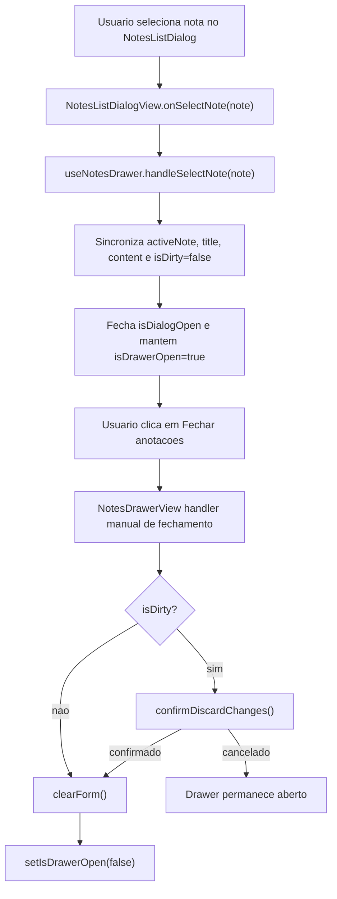

# 1. Objetivo (Obrigatorio)

Corrigir o fluxo local do `NotesDrawer` para que, apos selecionar uma nota existente no dialog de listagem, o clique manual em `Fechar anotacoes` feche o drawer imediatamente no primeiro clique, preservando a confirmacao de descarte quando houver alteracoes nao salvas e mantendo a protecao contra fechamentos transitorios causados pela composicao `Dialog` + `Drawer`.

---

# 2. Escopo (Obrigatorio)

## 2.1 In-scope

- Ajustar o controle de abertura e fechamento do drawer em `useNotesDrawer`.
- Diferenciar fechamento manual solicitado pela UI de fechamento transitorio emitido enquanto o dialog de listagem esta aberto.
- Preservar a selecao de nota existente sem fechar o drawer principal.
- Preservar `confirmDiscardChanges()` em fechamentos manuais, criacao de nova nota e selecao de outra nota.
- Manter o contrato atual de `NotesDrawerView` e `NotesListDialog` sempre que possivel, restringindo a mudanca ao menor numero de arquivos.

## 2.2 Out-of-scope

- Alterar endpoints REST, services, schemas de validation, use cases, repositories ou migrations de notas.
- Alterar o visual do drawer, dialog ou botoes.
- Criar autosave, historico de rascunho ou qualquer novo comportamento de persistencia.
- Reestruturar o widget `NotesDrawer` fora do padrao atual View/Hook/Entry Point.

---

# 3. Requisitos (Obrigatorio)

## 3.1 Funcionais

- Ao selecionar uma nota em `NotesListDialog`, o dialog deve fechar e o drawer deve permanecer aberto com a nota selecionada carregada no editor.
- Apos a selecao de uma nota, o primeiro clique manual em `Fechar anotacoes` deve fechar o drawer quando nao houver alteracoes nao salvas.
- Quando houver alteracoes nao salvas, o clique manual em `Fechar anotacoes` deve continuar chamando `confirmDiscardChanges()`.
- Se o usuario rejeitar a confirmacao de descarte, o drawer deve permanecer aberto e o formulario nao deve ser limpo.
- Enquanto o dialog de listagem estiver aberto, eventos de fechamento do drawer disparados pela composicao de overlays devem continuar sendo ignorados.

## 3.2 Nao funcionais

- Compatibilidade: a correcao nao deve alterar contratos externos de REST, cache remoto, DTOs ou rotas.
- Manutenibilidade: a flag imperativa de ignorar fechamento nao pode permanecer armada alem do evento interno que ela pretende proteger.
- Regressao visual: a view deve continuar renderizando os mesmos controles e estados.

---

# 4. O que ja existe? (Obrigatorio)

## Camada UI

- **`NotesDrawer`** (`apps/web/src/ui/global/widgets/components/NotesDrawer/index.tsx`) - Entry point do widget; resolve `ProfileService`, contexto de auth/toast e conecta `useNotesDrawer` a `NotesDrawerView`.
- **`useNotesDrawer`** (`apps/web/src/ui/global/widgets/components/NotesDrawer/useNotesDrawer.ts`) - Hook que controla abertura do drawer, abertura do dialog, nota ativa, formulario, dirty state, cache local e handlers de CRUD.
- **`NotesDrawerView`** (`apps/web/src/ui/global/widgets/components/NotesDrawer/NotesDrawerView.tsx`) - View controlada que renderiza `Drawer.Root`, formulario da nota e botao `Fechar anotacoes`, hoje chamando `onDrawerOpenChange(false)` no clique manual.
- **`NotesListDialog`** (`apps/web/src/ui/global/widgets/components/NotesDrawer/NotesListDialog/index.tsx`) - Entry point simples do dialog de listagem.
- **`NotesListDialogView`** (`apps/web/src/ui/global/widgets/components/NotesDrawer/NotesListDialog/NotesListDialogView.tsx`) - View do dialog; chama `onSelectNote(note)` ao selecionar uma nota.
- **`useNotesDrawer.test`** (`apps/web/src/ui/global/widgets/components/NotesDrawer/tests/useNotesDrawer.test.ts`) - Testes do hook com mocks de `ProfileService`, `useCache` e `window.confirm`; ja cobre selecao de nota, dirty state, cache e mutacoes.
- **`NotesDrawerView.test`** (`apps/web/src/ui/global/widgets/components/NotesDrawer/tests/NotesDrawerView.test.tsx`) - Testes da view; ja verifica que o botao de fechamento chama o handler recebido com `false`.
- **`LessonHeader`** (`apps/web/src/ui/lesson/widgets/pages/Lesson/LessonHeader/index.tsx`) - Monta `NotesDrawer` no fluxo de lesson sem logica propria de fechamento.
- **`ChallengePage`** (`apps/web/src/ui/challenging/widgets/pages/Challenge/index.tsx`) - Injeta `NotesDrawer` no slot de notas do fluxo de challenge sem logica propria de fechamento.

---

# 5. O que deve ser criado? (Depende da tarefa)

Nao aplicavel.

---

# 6. O que deve ser modificado? (Depende da tarefa)

- **Arquivo:** `apps/web/src/ui/global/widgets/components/NotesDrawer/useNotesDrawer.ts`
  - **Mudanca:** substituir o uso residual de `shouldIgnoreNextDrawerCloseRef` por uma regra que ignore fechamento apenas quando `isDialogOpen` ainda estiver ativo ou quando houver um evento interno explicitamente delimitado.
  - **Justificativa:** `handleSelectNote(note)` arma `shouldIgnoreNextDrawerCloseRef.current = true`, mas essa flag pode nao ser consumida durante a troca entre dialog e editor. Quando permanece ativa, o proximo `handleDrawerOpenChange(false)` disparado pelo botao manual e descartado.

- **Arquivo:** `apps/web/src/ui/global/widgets/components/NotesDrawer/useNotesDrawer.ts`
  - **Mudanca:** em `handleSelectNote(note)`, carregar `activeNote`, `title`, `content`, `isDirty=false`, `fieldError=null`, fechar o dialog e manter `isDrawerOpen=true` sem deixar flag de ignorar fechamento pendente para o proximo evento do drawer.
  - **Justificativa:** a selecao de nota e um fluxo interno que deve manter o drawer aberto, mas nao deve bloquear a proxima intencao explicita do usuario de fecha-lo.

- **Arquivo:** `apps/web/src/ui/global/widgets/components/NotesDrawer/useNotesDrawer.ts`
  - **Mudanca:** adicionar um handler dedicado para fechamento manual do drawer, por exemplo `handleManualDrawerClose(): void`, reaproveitando a mesma validacao de descarte e limpeza usada no fechamento controlado.
  - **Justificativa:** o fechamento manual tem semantica diferente dos eventos transitorios do `Drawer.Root.onOpenChange`; separar os handlers evita que protecoes internas de overlay bloqueiem o clique no botao `Fechar anotacoes`.

- **Arquivo:** `apps/web/src/ui/global/widgets/components/NotesDrawer/NotesDrawerView.tsx`
  - **Mudanca:** se o hook expuser um handler manual dedicado, trocar o clique do botao `Fechar anotacoes` para esse handler, mantendo `Drawer.Root` ligado ao handler de `onOpenChange`.
  - **Justificativa:** a view deve continuar apenas encaminhando a intencao da UI, mas o clique explicito no botao precisa chegar ao hook como uma intencao manual, nao como um evento generico de open change.

- **Arquivo:** `apps/web/src/ui/global/widgets/components/NotesDrawer/index.tsx`
  - **Mudanca:** se houver novo handler dedicado, repassa-lo de `useNotesDrawer` para `NotesDrawerView` com nome explicito, por exemplo `onCloseClick` ou `onManualDrawerClose`.
  - **Justificativa:** o entry point e a borda correta para conectar Hook e View no Widget Pattern.

---

# 7. O que deve ser removido? (Depende da tarefa)

- **Arquivo:** `apps/web/src/ui/global/widgets/components/NotesDrawer/useNotesDrawer.ts`
  - **Motivo:** remover `shouldIgnoreNextDrawerCloseRef` se a correcao conseguir preservar o fechamento transitorio apenas com `isDialogOpen`.
  - **Impacto:** reduz estado imperativo residual no hook e elimina a causa direta do bug.

---

# 8. Decisoes Tecnicas (Obrigatorio)

- **Decisao:** tratar fechamento manual do drawer como acao explicita separada do `Drawer.Root.onOpenChange`.
  - **Alternativas:** manter o mesmo handler para todos os fechamentos; tentar limpar a flag em `handleSelectNote`; introduzir timeout para expirar `shouldIgnoreNextDrawerCloseRef`.
  - **Motivo:** o bug existe porque eventos internos e acao manual compartilham o mesmo caminho e a mesma flag. Um handler manual dedicado deixa a intencao explicita e preserva a protecao contra eventos transitorios.
  - **Trade-offs:** adiciona uma prop de handler na view, mas reduz ambiguidade no hook.

- **Decisao:** nao alterar contratos de dados, cache remoto, services, use cases, controllers ou banco.
  - **Alternativas:** revisar o fluxo completo de notas ponta a ponta.
  - **Motivo:** o report e a codebase apontam o problema para estado local do widget, sem evidencia de falha em persistencia ou transporte.
  - **Trade-offs:** a correcao fica estreita e nao aproveita para refatorar outros pontos do drawer.

- **Decisao:** preservar `confirmDiscardChanges()` como guard central para fechamento manual e troca de nota.
  - **Alternativas:** fechar sempre sem confirmacao quando o clique vier do botao `Fechar anotacoes`.
  - **Motivo:** o comportamento esperado descrito no report exige fechamento imediato apenas quando permitido, ainda passando pela confirmacao se houver alteracoes nao salvas.
  - **Trade-offs:** mantem a dependencia de `window.confirm`, coerente com o hook atual.

- **Decisao:** nao criar migration.
  - **Alternativas:** nenhuma aplicavel.
  - **Motivo:** nao ha mudanca de schema; o bug esta na camada UI do `apps/web`.
  - **Trade-offs:** nao aplicavel.

---

# 9. Diagramas e Referencias (Obrigatorio)

## Fluxo de dados



## Layout

```text
NotesDrawer
|-- Drawer.Root
|   |-- Drawer.Trigger
|   |-- Drawer.Content
|       |-- Header
|       |   |-- Adicionar nota
|       |   |-- Ver notas
|       |   |-- Fechar anotacoes -> fechamento manual
|       |-- Campo Titulo
|       |-- WYSIWYGEditor
|       |-- Salvar nota / Excluir
|-- NotesListDialog
    |-- Search
    |-- Lista de notas -> selecionar nota
    |-- Paginacao
```

## Referencias

- `documentation/features/profile/user-notes/reports/notes-drawer-closure-bug-report.md`
- `documentation/features/profile/user-notes/specs/notes-drawer-spec.md`
- `apps/web/src/ui/global/widgets/components/NotesDrawer/useNotesDrawer.ts`
- `apps/web/src/ui/global/widgets/components/NotesDrawer/NotesDrawerView.tsx`
- `apps/web/src/ui/global/widgets/components/NotesDrawer/NotesListDialog/NotesListDialogView.tsx`
- `apps/web/src/ui/global/widgets/components/NotesDrawer/tests/useNotesDrawer.test.ts`
- `apps/web/src/ui/global/widgets/components/NotesDrawer/tests/NotesDrawerView.test.tsx`
- `documentation/rules/ui-layer-rules.md`
- `documentation/rules/web-application-rules.md`

---

# 10. Pendencias / Duvidas (Quando aplicavel)

Sem pendencias.
