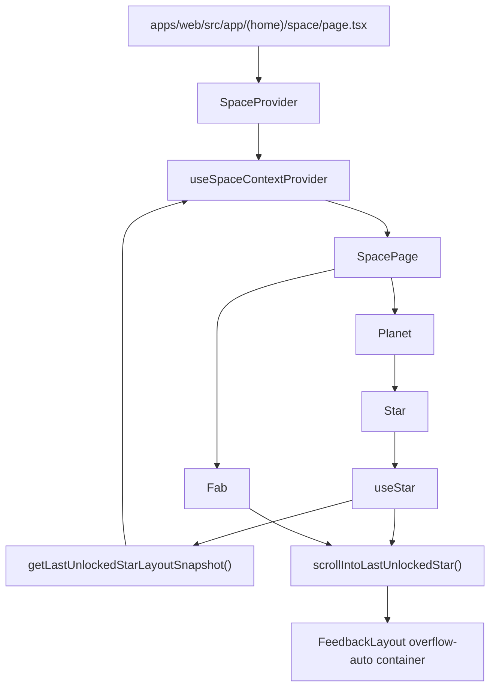

# Spec: Centralizacao confiavel da ultima estrela desbloqueada

## 1. Objetivo

Corrigir a navegacao assistida da Space Page para que o auto-scroll inicial e o FAB "Ir ate a ultima estrela desbloqueada" centralizem a estrela correta usando medicoes atuais do mesmo container rolavel real da pagina. A entrega deve fortalecer a estabilizacao de layout antes do primeiro scroll e manter a recentralizacao manual baseada em uma medicao fresca, sem alterar contratos REST, dados de dominio, banco de dados ou rota Next.js.

## 2. Escopo

### 2.1 In-scope

- Ajustar a estabilizacao de layout usada antes do auto-scroll inicial da ultima estrela desbloqueada.
- Garantir que o snapshot de estabilidade considere o container rolavel resolvido pela Space Page, nao apenas `document.documentElement.scrollHeight`.
- Garantir que `scrollIntoLastUnlockedStar()` sempre calcule a centralizacao a partir do container rolavel atual e da posicao atual da estrela.
- Preservar o comportamento do FAB, mantendo a acao manual como chamada ao mesmo fluxo de scroll confiavel.

### 2.2 Out-of-scope

- Alterar a regra que identifica `lastUnlockedStarId`.
- Alterar a estrutura visual da Space Page, planetas, estrelas, animacoes ou FAB.
- Alterar `SpaceService.fetchPlanets()`, contratos REST, entidades do core ou DTOs.
- Criar migrations, repositories, mappers ou schemas de validacao.
- Incluir testes automatizados nesta spec.

## 3. Requisitos

### 3.1 Funcionais

- Ao carregar `/space`, a pagina deve rolar ate a ultima estrela desbloqueada somente depois que a posicao da estrela e as dimensoes do container rolavel estiverem estaveis.
- O FAB deve recentralizar a ultima estrela desbloqueada usando uma medicao feita no momento do clique.
- O estado `lastUnlockedStarPosition` deve continuar refletindo se a estrela esta acima, visivel ou abaixo do viewport do container rolavel.
- Se nenhum container rolavel interno for encontrado, o fallback de scroll pela janela deve continuar funcionando.

### 3.2 Nao funcionais

- A espera de estabilizacao deve continuar finita para evitar loop permanente em telas com animacoes continuas.
- A correcao deve evitar listeners globais extras alem dos ja usados para `window` e container rolavel.
- A solucao deve manter a separacao do Widget Pattern: entry points resolvem dependencias, hooks orquestram UI, views renderizam.

## 4. O que ja existe?

### UI (Contexts)

**useSpaceContextProvider** (`apps/web/src/ui/space/contexts/SpaceContext/useSpaceContextProvider.ts`) — calcula `lastUnlockedStarId`, mantem `lastUnlockedStarRef`, resolve o container rolavel, atualiza `lastUnlockedStarPosition` e executa `scrollIntoLastUnlockedStar()`.

**SpaceContextValue** (`apps/web/src/ui/space/contexts/SpaceContext/types/SpaceContextValue.ts`) — contrato consumido pelos widgets da Space Page, incluindo `lastUnlockedStarId`, `lastUnlockedStarRef`, `lastUnlockedStarPosition`, `scrollIntoLastUnlockedStar` e `setLastUnlockedStarPosition`.

**useSpaceContext** (`apps/web/src/ui/space/hooks/useSpaceContext.ts`) — hook de consumo do contexto da Space Page.

### UI (Widgets)

**SpacePage** (`apps/web/src/ui/space/widgets/pages/Space/index.tsx`) — renderiza planetas, estrelas e o FAB; consome `lastUnlockedStarPosition` para exibir ou esconder o FAB.

**useSpacePage** (`apps/web/src/ui/space/widgets/pages/Space/useSpacePage.ts`) — encaminha o clique do FAB para `scrollIntoLastUnlockedStar()`.

**Star** (`apps/web/src/ui/space/widgets/pages/Space/Planet/Star/index.tsx`) — identifica se a estrela renderizada e a ultima desbloqueada e conecta `useStar` com o contexto.

**useStar** (`apps/web/src/ui/space/widgets/pages/Space/Planet/Star/useStar.ts`) — dispara o auto-scroll inicial uma vez e hoje aguarda estabilidade com base em `starRect.top`, `starRect.height` e `document.documentElement.scrollHeight`.

**StarView** (`apps/web/src/ui/space/widgets/pages/Space/Planet/Star/StarView.tsx`) — anexa `lastUnlockedStarRef` ao wrapper externo da ultima estrela desbloqueada.

### Next.js App (Pages, Layouts)

**Space Route** (`apps/web/src/app/(home)/space/page.tsx`) — carrega planetas via `SpaceService.fetchPlanets()` e renderiza `SpaceProvider` com `SpacePage`.

**FeedbackLayoutView** (`apps/web/src/ui/reporting/widgets/layouts/FeedbackLayout/FeedbackLayoutView.tsx`) — envolve rotas autenticadas em um container interno `div.flex-1.overflow-auto`, que e o container rolavel real para `/space`.

## 5. O que deve ser criado?

Nao aplicavel.

## 6. O que deve ser modificado?

- **Arquivo:** `apps/web/src/ui/space/contexts/SpaceContext/useSpaceContextProvider.ts`
- **Mudanca:** concentrar a medicao de layout da ultima estrela no contexto, reaproveitando `resolveScrollContainer()` para produzir um snapshot que inclua `starRect.top`, `starRect.bottom`, `starRect.height`, dimensoes do container (`scrollTop`, `scrollHeight`, `clientHeight`) e `containerRect` quando houver container interno; no fallback, usar dados da janela/documento.
- **Justificativa:** o contexto ja e a fonte do container rolavel e do scroll; manter a medicao ali elimina a divergencia atual entre espera de estabilidade baseada no documento e centralizacao baseada no container interno.

- **Arquivo:** `apps/web/src/ui/space/contexts/SpaceContext/useSpaceContextProvider.ts`
- **Mudanca:** garantir que `scrollIntoLastUnlockedStar()` sempre resolva novamente o container e leia `getBoundingClientRect()` imediatamente antes de calcular o destino, sem depender de snapshots anteriores nem do estado visual do FAB.
- **Justificativa:** a recentralizacao manual pelo FAB precisa refletir o layout no momento do clique.

- **Arquivo:** `apps/web/src/ui/space/contexts/SpaceContext/types/SpaceContextValue.ts`
- **Mudanca:** adicionar ao contrato do contexto uma funcao de leitura de snapshot de layout, por exemplo `getLastUnlockedStarLayoutSnapshot(): string | null`.
- **Justificativa:** `useStar` precisa aguardar estabilidade sem duplicar a logica de descoberta do container rolavel.

- **Arquivo:** `apps/web/src/ui/space/widgets/pages/Space/Planet/Star/useStar.ts`
- **Mudanca:** substituir `getLayoutSnapshot()` local pela funcao recebida do contexto e manter o disparo unico do auto-scroll quando o snapshot ficar estavel por iteracoes consecutivas ou quando o limite de tentativas for atingido.
- **Justificativa:** o hook da estrela continua responsavel pelo timing do primeiro scroll, mas deixa a medicao para o contexto que conhece o container real.

- **Arquivo:** `apps/web/src/ui/space/widgets/pages/Space/Planet/Star/index.tsx`
- **Mudanca:** consumir `getLastUnlockedStarLayoutSnapshot` de `useSpaceContext()` e repassar para `useStar`.
- **Justificativa:** o entry point do widget e a borda correta para conectar contexto e hook, conforme o Widget Pattern.

## 7. O que deve ser removido?

- **Arquivo:** `apps/web/src/ui/space/widgets/pages/Space/Planet/Star/useStar.ts`
- **Motivo:** remover a funcao local `getLayoutSnapshot()` baseada em `document.documentElement.scrollHeight`.
- **Impacto:** a espera do auto-scroll inicial passa a usar o snapshot do contexto; nao ha alteracao esperada em navegacao de estrela, audio ou animacao.

## 8. Decisoes Tecnicas

- **Decisao:** centralizar a medicao de layout em `useSpaceContextProvider`.
- **Alternativas:** manter a medicao em `useStar`; criar um hook global de scroll; criar um utilitario isolado.
- **Motivo:** `useSpaceContextProvider` ja possui `lastUnlockedStarRef`, `resolveScrollContainer()` e `scrollIntoLastUnlockedStar()`, portanto e o ponto com mais evidencia na codebase para evitar duplicacao.
- **Trade-offs:** aumenta levemente o contrato do contexto, mas remove a divergencia entre estabilizacao e scroll.

- **Decisao:** manter a espera finita por tentativas consecutivas estaveis.
- **Alternativas:** aguardar eventos de imagens/animacoes; usar `ResizeObserver`; rolar imediatamente.
- **Motivo:** o codigo atual ja usa uma espera finita e o bug report pede fortalecer o criterio, nao trocar o mecanismo inteiro.
- **Trade-offs:** uma tela com mudancas tardias ainda pode atingir o limite, mas o snapshot mais completo reduz a chance de encerrar cedo.

- **Decisao:** nao alterar a rota `/space` nem `FeedbackLayoutView`.
- **Alternativas:** expor uma ref explicita do container rolavel pelo layout; alterar a estrutura do container da pagina.
- **Motivo:** o contexto ja descobre o ancestral com `overflowY` rolavel, e o report nao indica falha estrutural na rota ou no layout.
- **Trade-offs:** a solucao continua dependente da descoberta por ancestral rolavel, mas preserva o acoplamento atual.

- **Decisao:** nao criar migration.
- **Alternativas:** nenhuma aplicavel.
- **Motivo:** o problema esta restrito a medicao e scroll de UI.
- **Trade-offs:** nao aplicavel.

## 9. Diagramas e Referencias

### Fluxo de dados



### Layout

```text
FeedbackLayoutView
└─ div.flex-1.overflow-auto
   └─ SpaceProvider
      └─ SpacePage
         ├─ Particles
         ├─ ul
         │  └─ Planet
         │     └─ Star
         │        └─ StarView wrapper ref=lastUnlockedStarRef
         └─ Fab
```

### Referencias

- `apps/web/src/ui/space/contexts/SpaceContext/useSpaceContextProvider.ts`
- `apps/web/src/ui/space/contexts/SpaceContext/types/SpaceContextValue.ts`
- `apps/web/src/ui/space/widgets/pages/Space/Planet/Star/useStar.ts`
- `apps/web/src/ui/space/widgets/pages/Space/Planet/Star/index.tsx`
- `apps/web/src/ui/space/widgets/pages/Space/Planet/Star/StarView.tsx`
- `apps/web/src/ui/space/widgets/pages/Space/index.tsx`
- `apps/web/src/ui/reporting/widgets/layouts/FeedbackLayout/FeedbackLayoutView.tsx`
- `apps/web/src/app/(home)/space/page.tsx`

## 10. Pendencias / Duvidas

Sem pendencias.
