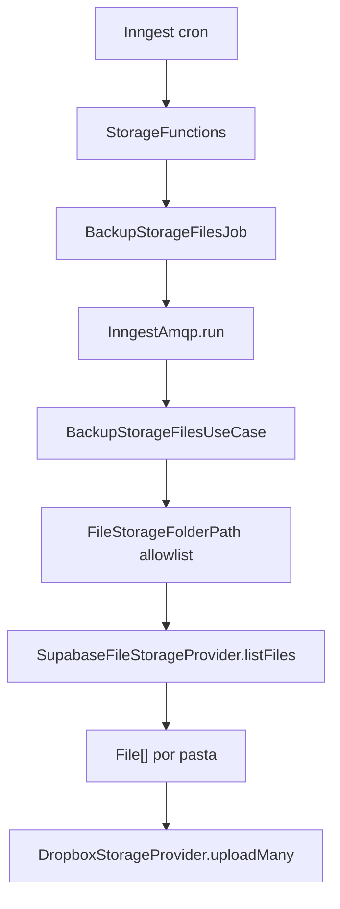

# 1. Objetivo

Implementar uma rotina recorrente no `server` para copiar os arquivos existentes no Supabase Storage para um destino redundante no Dropbox, sem alterar os arquivos de origem nem os fluxos atuais de upload. Tecnicamente, a entrega cria um use case no modulo `storage` do `core`, amplia o contrato `FileStorageProvider` com upload em lote, ajusta os providers concretos de storage, adiciona um job agnostico em `apps/server/src/queue/jobs/storage` e registra a funcao cron em `StorageFunctions`.

# 2. Escopo

## 2.1 In-scope

* Criar o use case `BackupStorageFilesUseCase` para listar, baixar e enviar arquivos das pastas elegiveis.
* Usar como origem o `SupabaseFileStorageProvider`.
* Usar como destino `DropboxStorageProvider`.
* Adicionar `uploadMany(folder: FileStorageFolderPath, files: File[]): Promise<File[]>` ao contrato `FileStorageProvider`.
* Implementar `uploadMany(...)` nos providers de storage existentes.
* Garantir paginacao na listagem de arquivos de origem.
* Criar o job `BackupStorageFilesJob` com `KEY` estavel e cron recorrente.
* Registrar a funcao Inngest correspondente em `StorageFunctions`.
* Isolar falhas por pasta e destino quando for possivel continuar o processamento dos demais itens.

## 2.2 Out-of-scope

* Alterar comportamento de upload, listagem, remocao ou signed upload consumido por `web` e `studio`.
* Criar endpoints REST, actions RPC, paginas ou widgets.
* Criar buckets, tabelas, indices, RLS policies, grants ou migrations.
* Remover ou substituir o job atual de backup de database.
* Implementar testes automatizados nesta spec.

# 3. Requisitos

## 3.1 Funcionais

* O backup deve percorrer explicitamente as pastas `images/story`, `audios/story`, `images/planets`, `images/rockets`, `images/avatars`, `images/achievements`, `images/rankings`, `images/insignias` e `images/feedback-reports`.
* Para cada pasta, o backup deve listar os arquivos do Supabase Storage usando `listFiles(...)` com paginacao ate esgotar os itens.
* Cada arquivo listado deve ser enviado para o Dropbox via `uploadMany(...)`, preservando nome, tipo e pasta logica.
* Arquivos do backup de storage devem ser salvos no Dropbox em `<ambiente>/file-storage-backups/<data>/<pasta-logica>/<nome-do-arquivo>`.
* A pasta `database-backups` pertence apenas ao backup de banco e deve ficar como sibling de `file-storage-backups`, em `<ambiente>/database-backups/<nome-do-arquivo>`.
* Falha de um destino em uma pasta nao deve impedir tentativa nos demais destinos configurados para a mesma pasta.
* Falha em uma pasta nao deve impedir tentativa nas demais pastas quando o erro for capturado pelo use case.
* O job recorrente deve aparecer na lista retornada por `StorageFunctions.getFunctions(...)`.

## 3.2 Nao funcionais

* Resiliencia: falhas de provider devem ser convertidas para erros de aplicacao ou agregadas sem expor credenciais.
* Observabilidade: etapas de IO do job devem executar dentro de `amqp.run(...)` para manter rastreabilidade e retries por etapa no Inngest.
* Segurança: tokens do Dropbox devem permanecer na camada `provision`/`ENV`, sem vazar para `core`.
* Performance operacional: a listagem deve usar paginas de tamanho fixo para nao depender de uma unica resposta do Supabase Storage.

# 4. O que ja existe?

## Core

* **`FileStorageProvider`** (`packages/core/src/storage/interfaces/FileStorageProvider.ts`) - Contrato comum dos providers de storage; ja expoe `upload`, `createSignedUploadUrl`, `findFile`, `listFiles` e `removeFile`, mas ainda nao expoe `uploadMany`.
* **`FilesListingParams`** (`packages/core/src/storage/types/FilesListingParams.ts`) - Tipo de entrada de `listFiles`, combinando `folder`, `search`, `page` e `itemsPerPage`.
* **`FileStorageFolderPathValue`** (`packages/core/src/storage/types/FileStorageFolderPathValue.ts`) - Union type com todas as pastas canonicas suportadas pelo storage.
* **`FileStorageFolderPath`** (`packages/core/src/storage/domain/structures/FileStorageFolderPath.ts`) - Structure que valida e normaliza pastas canonicas e aliases legados.
* **`BackupDatabaseUseCase`** (`packages/core/src/storage/use-cases/BackupDatabaseUseCase.ts`) - Use case existente que gera backup de banco e envia o arquivo para `database-backups` via `FileStorageProvider.upload(...)`.
* **`storage use-cases barrel`** (`packages/core/src/storage/use-cases/index.ts`) - Exporta os use cases publicos do modulo `storage`.

## Server - Queue

* **`BackupDatabaseJob`** (`apps/server/src/queue/jobs/storage/BackupDatabaseJob.ts`) - Job cron existente para backup de database; referencia de `KEY`, `CRON_EXPRESSION` e composition via `StorageFunctions`.
* **`GenerateTextBlockAudioJob`** (`apps/server/src/queue/jobs/storage/GenerateTextBlockAudioJob.ts`) - Referencia de job que executa IO com `amqp.run(...)`.
* **`RemoveTextBlockAudioFileJob`** (`apps/server/src/queue/jobs/storage/RemoveTextBlockAudioFileJob.ts`) - Referencia de job que usa `FileStorageProvider.findFile(...)` e `removeFile(...)` dentro de `amqp.run(...)`.
* **`storage jobs barrel`** (`apps/server/src/queue/jobs/storage/index.ts`) - Exporta os jobs de storage.
* **`StorageFunctions`** (`apps/server/src/queue/inngest/functions/StorageFunctions.ts`) - Composition root dos jobs de storage; hoje registra backup de database, geracao de audio e remocao de arquivo de audio.
* **`InngestAmqp`** (`apps/server/src/queue/inngest/InngestAmqp.ts`) - Adapter do contrato `Amqp`, usando `context.step.run(...)`.

## Server - Provision

* **`SupabaseFileStorageProvider`** (`apps/server/src/provision/storage/SupabaseFileStorageProvider.ts`) - Provider de origem no bucket `stardust-bucket`; implementa upload, signed upload, listagem paginada, busca, download por public URL e remocao.
* **`DropboxStorageProvider`** (`apps/server/src/provision/storage/DropboxStorageProvider.ts`) - Provider parcial usado pelo backup de database; implementa `upload(...)` e obtem access token por refresh token via `RestClient`.
* **`storage providers barrel`** (`apps/server/src/provision/storage/index.ts`) - Exporta os providers de storage.
* **`ENV`** (`apps/server/src/constants/env.ts`) - Centraliza variaveis de ambiente do server, incluindo as credenciais do Dropbox.
* **`.env.example`** (`apps/server/.env.example`) - Documenta as variaveis exigidas pelo server.

# 5. O que deve ser criado?

## Core (Use Cases)

* **Localizacao:** `packages/core/src/storage/use-cases/BackupStorageFilesUseCase.ts` (**novo arquivo**)
* **Dependencias:** `sourceStorageProvider: FileStorageProvider`, `destinationStorageProviders: FileStorageProvider[]`.
* **Request/Response:** `execute(): Promise<void>` sem payload externo e sem retorno.
* **Metodos:** `execute(): Promise<void>` - percorre as pastas elegiveis, lista arquivos da origem com paginacao e envia cada lote aos destinos por `uploadMany(...)`.
* **Metodos:** `private listAllFiles(folder: FileStorageFolderPath): Promise<File[]>` - busca todas as paginas da pasta usando `FilesListingParams`.
* **Metodos:** `private backupFolder(folder: FileStorageFolderPath): Promise<void>` - lista os arquivos da pasta e orquestra envio aos destinos.
* **Metodos:** `private uploadFilesToDestinations(folder: FileStorageFolderPath, files: File[]): Promise<void>` - chama `uploadMany(...)` em cada destino e isola falhas recuperaveis.

## Server - Queue (Jobs)

* **Localizacao:** `apps/server/src/queue/jobs/storage/BackupStorageFilesJob.ts` (**novo arquivo**)
* **Dependencias:** `sourceStorageProvider: FileStorageProvider`, `destinationStorageProviders: FileStorageProvider[]`.
* **Request/Response:** `handle(amqp: Amqp): Promise<void>` sem payload externo e sem retorno.
* **Metodos:** `handle(amqp: Amqp): Promise<void>` - executa o use case dentro de `amqp.run(...)` com nome de etapa estavel.
* **Constantes:** `static readonly KEY = 'storage/backup.files'`.
* **Constantes:** `static readonly CRON_EXPRESSION = 'TZ=America/Sao_Paulo 0 0 * * 0'`.

# 6. O que deve ser modificado?

## Core

* **Arquivo:** `packages/core/src/storage/interfaces/FileStorageProvider.ts`
* **Mudanca:** Adicionar `uploadMany(folder: FileStorageFolderPath, files: File[]): Promise<File[]>`.
* **Justificativa:** A issue exige um contrato de lote para impedir que job/use case dupliquem politica de upload por provider.

* **Arquivo:** `packages/core/src/storage/use-cases/index.ts`
* **Mudanca:** Exportar `BackupStorageFilesUseCase`.
* **Justificativa:** O job do server deve consumir o use case pelo barrel publico do modulo `storage`.

## Server - Provision

* **Arquivo:** `apps/server/src/provision/storage/SupabaseFileStorageProvider.ts`
* **Mudanca:** Implementar `uploadMany(folder, files)` chamando `upload(folder, file)` para cada item e retornando os arquivos enviados.
* **Justificativa:** O provider de origem tambem implementa o contrato completo de `FileStorageProvider`; manter a semantica de `upload(...)` evita API parcial.

* **Arquivo:** `apps/server/src/provision/storage/DropboxStorageProvider.ts`
* **Mudanca:** Implementar `uploadMany(folder, files)` enviando cada arquivo para `<ambiente>/file-storage-backups/<data>/<folder.value>/<file.name>`.
* **Justificativa:** Dropbox passa a ser destino de lote para as pastas de storage, com separacao entre backups de arquivos e backups de banco.

* **Arquivo:** `apps/server/src/provision/storage/DropboxStorageProvider.ts`
* **Mudanca:** Manter `upload(...)` com o caminho direto usado pelo backup de database e isolar o prefixo `file-storage-backups` no fluxo de `uploadMany(...)`.
* **Justificativa:** `database-backups` nao deve ser armazenado dentro de `file-storage-backups`, enquanto o backup de arquivos precisa de agrupamento por ambiente, data e pasta logica.

## Server - Queue

* **Arquivo:** `apps/server/src/queue/jobs/storage/index.ts`
* **Mudanca:** Exportar `BackupStorageFilesJob`.
* **Justificativa:** `StorageFunctions` importa jobs de storage via barrel.

* **Arquivo:** `apps/server/src/queue/inngest/functions/StorageFunctions.ts`
* **Mudanca:** Importar `BackupStorageFilesJob`; criar `createBackupStorageFilesJob(supabase)` que instancia `SupabaseFileStorageProvider`, `DropboxStorageProvider`, `InngestAmqp` e registra cron pelo `BackupStorageFilesJob.CRON_EXPRESSION`.
* **Justificativa:** `StorageFunctions` e a composition root existente para jobs de storage e deve concentrar providers concretos.

* **Arquivo:** `apps/server/src/queue/inngest/functions/StorageFunctions.ts`
* **Mudanca:** Incluir `this.createBackupStorageFilesJob(supabase)` no array retornado por `getFunctions(...)`.
* **Justificativa:** A funcao recorrente precisa ser exposta ao Inngest junto aos demais jobs de storage.

# 7. O que deve ser removido?

Nao aplicavel.

# 8. Decisoes Tecnicas

* **Fonte documental:** a issue `#451` sera usada como fonte de escopo porque nao ha milestone/PRD vinculada (`prd: null`). Alternativas: bloquear a spec ate existir milestone, ou inventar milestone. Motivo: a issue contem requisitos tecnicos detalhados e specs recentes do repositório tambem aceitam issue tecnica sem `prd`. Trade-off: a rastreabilidade de produto fica inferior a uma spec com milestone.
* **Contrato de lote no core:** `uploadMany(...)` entra em `FileStorageProvider`, nao em uma interface separada. Alternativas: criar `BackupStorageProvider` ou implementar lote apenas nos providers concretos. Motivo: a issue lista `FileStorageProvider.uploadMany(...)` como contrato esperado e os destinos ja implementam `FileStorageProvider`. Trade-off: providers que nao usam lote fora do backup ainda precisam implementar o metodo.
* **Use case no core e job no server:** a orquestracao de pastas/listagem/destinos fica em `BackupStorageFilesUseCase`, enquanto `BackupStorageFilesJob` apenas adapta `Amqp`. Alternativas: colocar toda a orquestracao no job. Motivo: preserva o padrao de `BackupDatabaseUseCase` e mantem o job agnostico de regra. Trade-off: como `amqp.run(...)` pertence ao server, o use case nao nomeia cada subetapa individualmente.
* **IO dentro de `amqp.run(...)`:** o job executa o use case dentro de um `amqp.run(...)` unico. Alternativas: passar `Amqp` para o use case ou mover loops de IO para o job. Motivo: `Amqp` e contrato de fila, nao regra de storage; passar `Amqp` para o core acoplaria o use case a rastreabilidade de runtime. Trade-off: a granularidade de retry do Inngest fica no backup completo, enquanto o isolamento por pasta/destino acontece dentro do use case.
* **Isolamento de falhas:** o use case deve capturar erro por destino/pasta, acumular falhas e continuar quando houver outros destinos/pastas a processar; ao final, deve falhar se houver qualquer erro acumulado. Alternativas: falhar imediatamente no primeiro erro, ou nunca falhar quando houver sucesso parcial. Motivo: atende continuidade operacional sem esconder backup parcial. Trade-off: o erro final precisa resumir falhas sem expor credenciais.
* **Paginacao:** `BackupStorageFilesUseCase` deve usar `OrdinalNumber.create(1)` para pagina inicial e um tamanho fixo interno, como `OrdinalNumber.create(100)`, incrementando ate `items.length === 0` ou ate `page * itemsPerPage >= count`. Alternativas: depender de uma pagina unica do provider. Motivo: a issue exige nao depender de uma pagina fixa unica. Trade-off: mais chamadas ao Supabase Storage em pastas grandes.
* **Sem migration:** nao ha alteracao de schema, tabela, indice, view, constraint, grant ou RLS. Alternativas: criar tabela de auditoria de backup. Motivo: a issue pede copia recorrente de arquivos, nao persistencia de historico no banco. Trade-off: auditoria detalhada fica limitada a logs/observabilidade do job.

# 9. Diagramas e Referencias

## Fluxo de dados

## Fluxo cross-app

Nao aplicavel. A entrega toca `core` e `server`, mas nao cria contrato consumido por `web` ou `studio`.

## Referencias

* `packages/core/src/storage/interfaces/FileStorageProvider.ts`
* `packages/core/src/storage/types/FileStorageFolderPathValue.ts`
* `packages/core/src/storage/domain/structures/FileStorageFolderPath.ts`
* `packages/core/src/storage/use-cases/BackupDatabaseUseCase.ts`
* `apps/server/src/queue/jobs/storage/BackupDatabaseJob.ts`
* `apps/server/src/queue/jobs/storage/GenerateTextBlockAudioJob.ts`
* `apps/server/src/queue/jobs/storage/RemoveTextBlockAudioFileJob.ts`
* `apps/server/src/queue/inngest/functions/StorageFunctions.ts`
* `apps/server/src/queue/inngest/InngestAmqp.ts`
* `apps/server/src/provision/storage/SupabaseFileStorageProvider.ts`
* `apps/server/src/provision/storage/DropboxStorageProvider.ts`

# 10. Pendencias / Duvidas

* **PRD/milestone ausente:** a issue `#451` nao esta vinculada a uma milestone de produto. Impacto: menor rastreabilidade entre produto e implementacao. Acao sugerida: vincular a issue a uma milestone/PRD se a entrega precisar seguir o fluxo formal de produto antes da implementacao.

# 11. Execucao Recomendada

Use **`implement-plan`**. A mudanca e implementavel a partir desta spec, mas toca contrato do `core`, tres providers de infraestrutura, env validation, job de fila e composition root do Inngest; quebrar em fases reduz risco de regressao nos fluxos existentes de storage e backup.
