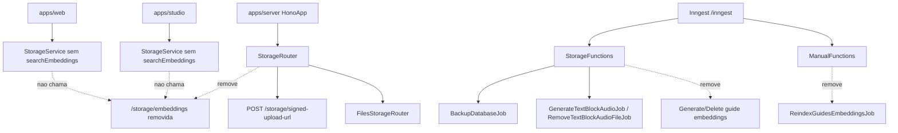

## 1. Objetivo

Remover da plataforma a infraestrutura de embeddings que hoje passa pela `apps/server`, incluindo rota REST de busca vetorial, jobs Inngest de geracao/remocao/reindexacao, providers de embedding/vector store e contratos de `core` usados apenas por esse fluxo. A remocao deve preservar os demais fluxos de storage, como signed upload URL, listagem/remocao de arquivos e jobs de audio/backup.

## 2. Escopo

### 2.1 In-scope

* Remover `GET /storage/embeddings` da app server.
* Remover o roteador, controller e arquivo `.rest` exclusivos da busca de embeddings.
* Remover o registro dos jobs `GenerateGuideEmbeddingsJob`, `DeleteGuideEmbeddingsJob` e `ReindexGuidesEmbeddingsJob` do Inngest.
* Remover jobs, providers, use cases, estruturas e interfaces de embeddings que ficarem sem consumidor.
* Remover os consumidores web/studio do metodo `StorageService.searchEmbeddings`.
* Remover a ferramenta web `SearchGuidesTool` e o item correspondente do `manualToolset`, pois ela chama a rota removida.
* Remover dependencias da `apps/server` usadas exclusivamente por embeddings.

### 2.2 Out-of-scope

* Alterar a edicao, exclusao ou publicacao de guias fora dos efeitos colaterais de embeddings.
* Remover `GuideContentEditedEvent` e `GuideDeletedEvent`, porque ainda sao publicados por use cases de manual e podem servir a outros fluxos.
* Criar busca textual substituta para o assistente manual.
* Alterar schema de banco, RLS, grants ou tipos Supabase.
* Definir testes automatizados nesta spec.

## 3. Requisitos

### 3.1 Funcionais

* `StorageRouter.registerRoutes()` deve registrar apenas `/storage/signed-upload-url` e o roteador de arquivos.
* `StorageFunctions.getFunctions(...)` nao deve retornar jobs de embeddings e deve continuar retornando jobs de backup, geracao de audio de bloco de texto e remocao de arquivo de audio.
* `ManualFunctions.getFunctions(...)` nao deve retornar job de reindexacao de embeddings.
* `apps/web` e `apps/studio` nao devem expor metodo REST para `/storage/embeddings`.
* O assistente manual da web nao deve registrar ou exportar ferramenta que dependa de `/storage/embeddings`.
* O pacote `core` nao deve exportar use cases, interfaces ou estruturas exclusivas de embeddings se nao houver outro consumidor.

### 3.2 Nao funcionais

* A remocao nao deve introduzir chamada para endpoint inexistente em `web` ou `studio`.
* O build do server nao deve carregar `@upstash/vector`, `@mastra/rag` ou `@ai-sdk/google` se essas bibliotecas deixarem de ter uso em `apps/server`.
* Nao ha migration: a mudanca nao altera schema de banco, indices, views, RLS ou grants.

## 4. O que ja existe?

### Server - Hono/REST

* **StorageRouter** (`apps/server/src/app/hono/routers/storage/StorageRouter.ts`) - registra `/storage/signed-upload-url`, `EmbeddingsStorageRouter` e `FilesStorageRouter`.
* **EmbeddingsStorageRouter** (`apps/server/src/app/hono/routers/storage/EmbeddingsStorageRouter.ts`) - expõe `GET /storage/embeddings` autenticado, valida `query`, `namespace` e `topK`, instancia providers e executa `SearchEmbeddingsUseCase`.
* **FilesStorageRouter** (`apps/server/src/app/hono/routers/storage/FilesStorageRouter.ts`) - preserva rotas de arquivos sob `/storage/files`.
* **SearchEmbeddingsController** (`apps/server/src/rest/controllers/storage/SearchEmbeddingsController.ts`) - adapta query params HTTP para `SearchEmbeddingsUseCase`.
* **Storage controllers barrel** (`apps/server/src/rest/controllers/storage/index.ts`) - exporta controllers de arquivos, signed upload URL e `SearchEmbeddingsController`.
* **Embeddings REST client file** (`apps/server/rest-client/storage/embeddings.rest`) - chamada manual para `/storage/embeddings`.

### Server - Queue

* **StorageFunctions** (`apps/server/src/queue/inngest/functions/StorageFunctions.ts`) - registra jobs de embeddings disparados por `GuideContentEditedEvent` e `GuideDeletedEvent`, alem de backup e jobs de audio.
* **ManualFunctions** (`apps/server/src/queue/inngest/functions/ManualFunctions.ts`) - registra apenas `ReindexGuidesEmbeddingsJob` via `GuidesEmbeddingsReindexRequestedEvent`.
* **HonoApp.registerInngestRoute** (`apps/server/src/app/hono/HonoApp.ts`) - instancia `StorageFunctions` e `ManualFunctions` e espalha seus retornos em `serveInngest`.
* **GenerateGuideEmbeddingsJob** (`apps/server/src/queue/jobs/storage/GenerateGuideEmbeddingsJob.ts`) - gera embeddings de guia a partir de `GuideContentEditedEvent`.
* **DeleteGuideEmbeddingsJob** (`apps/server/src/queue/jobs/storage/DeleteGuideEmbeddingsJob.ts`) - remove embeddings de guia a partir de `GuideDeletedEvent`.
* **ReindexGuidesEmbeddingsJob** (`apps/server/src/queue/jobs/manual/ReindexGuidesEmbeddingsJob.ts`) - limpa o namespace `guides`, lista todos os guias e regenera embeddings.
* **Storage jobs barrel** (`apps/server/src/queue/jobs/storage/index.ts`) - exporta jobs de storage, incluindo os dois jobs de embeddings.
* **Manual jobs barrel** (`apps/server/src/queue/jobs/manual/index.ts`) - exporta `ReindexGuidesEmbeddingsJob`.

### Server - Provision/Build

* **VercelEmbeddingsGeneratorProvider** (`apps/server/src/provision/storage/VercelEmbeddingGeneratorProvider.ts`) - usa `@ai-sdk/google` e `ai/embedMany` para gerar embedding unico de query.
* **MastraMarkdownEmbeddingsGeneratorProvider** (`apps/server/src/provision/storage/MastraMarkdownEmbeddingsGeneratorProvider.ts`) - usa `@mastra/rag`, `@ai-sdk/google` e `ai/embedMany` para chunking markdown e geracao de embeddings.
* **UpstashEmbeddingsStorageProvider** (`apps/server/src/provision/storage/UpstashEmbeddingsStorageProvider.ts`) - usa `@upstash/vector` para store/search/delete/clear de vetores.
* **Storage providers barrel** (`apps/server/src/provision/storage/index.ts`) - exporta providers de arquivos e os providers de embeddings.
* **Server package manifest** (`apps/server/package.json`) - declara `@upstash/vector`, `@mastra/rag`, `@ai-sdk/google` e `ai`.
* **Server tsup config** (`apps/server/tsup.config.ts`) - marca `@ai-sdk/google` como `noExternal`.

### Core - Storage

* **GenerateEmbeddingsUseCase** (`packages/core/src/storage/use-cases/GenerateEmbeddingsUseCase.ts`) - orquestra geracao e armazenamento de embeddings.
* **SearchEmbeddingsUseCase** (`packages/core/src/storage/use-cases/SearchEmbeddingsUseCase.ts`) - gera embedding da query e busca textos similares.
* **Storage use cases barrel** (`packages/core/src/storage/use-cases/index.ts`) - exporta os use cases de embeddings.
* **EmbeddingsGeneratorProvider** (`packages/core/src/storage/interfaces/EmbeddingsGeneratorProvider.ts`) - contrato de geracao de embeddings.
* **EmbeddingsStorageProvider** (`packages/core/src/storage/interfaces/EmbeddingStorageProvider.ts`) - contrato de storage vetorial.
* **Storage interfaces barrel** (`packages/core/src/storage/interfaces/index.ts`) - exporta contratos de storage, incluindo embeddings.
* **StorageService** (`packages/core/src/storage/interfaces/StorageService.ts`) - contrato REST consumido por web/studio, incluindo `searchEmbeddings`.
* **Embedding** (`packages/core/src/storage/domain/structures/Embedding.ts`) - estrutura de embedding com `id`, `text` e `vector`.
* **EmbeddingNamespace** (`packages/core/src/storage/domain/structures/EmbeddingNamespace.ts`) - estrutura restrita aos namespaces `guides` e `challenges`.
* **EmbeddingDto** (`packages/core/src/storage/domain/structures/dtos/EmbeddingDto.ts`) - DTO da estrutura `Embedding`.
* **Storage structures barrels** (`packages/core/src/storage/domain/structures/index.ts`, `packages/core/src/storage/domain/structures/dtos/index.ts`) - exportam estruturas/DTOs de storage.

### Core - Manual events

* **GuideContentEditedEvent** (`packages/core/src/manual/domain/events/GuideContentEditedEvent.ts`) - publicado por `EditGuideContentUseCase`.
* **GuideDeletedEvent** (`packages/core/src/manual/domain/events/GuideDeletedEvent.ts`) - publicado por `DeleteGuideUseCase`.
* **GuidesEmbeddingsReindexRequestedEvent** (`packages/core/src/manual/domain/events/GuidesEmbeddingsReindexRequestedEvent.ts`) - usado apenas por `ManualFunctions` para reindexacao de embeddings.
* **Manual events barrel** (`packages/core/src/manual/domain/events/index.ts`) - exporta os tres eventos.

### Web

* **StorageService web** (`apps/web/src/rest/services/StorageService.ts`) - implementa `StorageService`, incluindo chamada para `/storage/embeddings`.
* **SearchGuidesTool** (`apps/web/src/ai/tools/manual/SearchGuidesTool.ts`) - usa `StorageService.searchEmbeddings` com `EmbeddingNamespace.createAsGuides()`.
* **Manual tools barrel** (`apps/web/src/ai/tools/manual/index.ts`) - exporta `SearchGuidesTool`.
* **manualToolset** (`apps/web/src/ai/vercel/toolsets/manualToolset.ts`) - declara `searchGuidesTool`, embora `assistantAgent` nao o registre atualmente.
* **manual instructions** (`apps/web/src/ai/constants/manual-instructions.ts`) - ainda possui descricao de `searchGuides`.
* **assistantAgent** (`apps/web/src/ai/vercel/agents/manualAgents.ts`) - registra `getLspGuides` e `getChallengeDescription`, nao registra `searchGuides`.

### Studio

* **StorageService studio** (`apps/studio/src/rest/services/StorageService.ts`) - implementa `StorageService`, incluindo chamada para `/storage/embeddings`.

## 5. O que deve ser criado?

Nao aplicavel.

## 6. O que deve ser modificado?

* **Arquivo:** `apps/server/src/app/hono/routers/storage/StorageRouter.ts`
  **Mudanca:** Remover import, instancia e `route` de `EmbeddingsStorageRouter`.
  **Justificativa:** `GET /storage/embeddings` deixa de existir; o roteador deve manter apenas signed upload URL e arquivos.

* **Arquivo:** `apps/server/src/rest/controllers/storage/index.ts`
  **Mudanca:** Remover export de `SearchEmbeddingsController`.
  **Justificativa:** O controller sera removido e nao deve permanecer no barrel.

* **Arquivo:** `apps/server/src/queue/inngest/functions/StorageFunctions.ts`
  **Mudanca:** Remover imports, tipos de payload e metodos privados relacionados a `GenerateGuideEmbeddingsJob` e `DeleteGuideEmbeddingsJob`; remover esses dois itens do array de `getFunctions`.
  **Justificativa:** Eventos de edicao/exclusao de guia nao devem mais acionar side effects de embeddings.

* **Arquivo:** `apps/server/src/queue/inngest/functions/ManualFunctions.ts`
  **Mudanca:** Remover imports e metodo privado de reindexacao; manter `getFunctions(supabase: SupabaseClient)` retornando `[]` ou ajustar sua assinatura se o lint apontar parametro nao usado.
  **Justificativa:** O composition root de manual nao deve retornar job de reindexacao, mas `HonoApp` ainda espalha o retorno de `ManualFunctions.getFunctions(...)`.

* **Arquivo:** `apps/server/src/queue/jobs/storage/index.ts`
  **Mudanca:** Remover exports de `GenerateGuideEmbeddingsJob` e `DeleteGuideEmbeddingsJob`.
  **Justificativa:** Os jobs serao removidos e nao devem permanecer alcancaveis por barrel.

* **Arquivo:** `apps/server/src/queue/jobs/manual/index.ts`
  **Mudanca:** Remover export de `ReindexGuidesEmbeddingsJob`.
  **Justificativa:** O job sera removido e nao deve permanecer alcancavel por barrel.

* **Arquivo:** `apps/server/src/provision/storage/index.ts`
  **Mudanca:** Remover exports dos providers `VercelEmbeddingsGeneratorProvider`, `MastraMarkdownEmbeddingsGeneratorProvider` e `UpstashEmbeddingsStorageProvider`.
  **Justificativa:** Providers exclusivos de embeddings serao removidos.

* **Arquivo:** `apps/server/package.json`
  **Mudanca:** Remover `@upstash/vector`, `@mastra/rag` e `@ai-sdk/google`; manter `ai` se ele ainda for requerido por outros providers server-side.
  **Justificativa:** Dependencias exclusivas de embeddings nao devem permanecer no pacote server.

* **Arquivo:** `apps/server/tsup.config.ts`
  **Mudanca:** Remover `@ai-sdk/google` de `noExternal`.
  **Justificativa:** Evitar configuracao de build para pacote que nao sera mais carregado.

* **Arquivo:** `packages/core/src/storage/use-cases/index.ts`
  **Mudanca:** Remover exports de `GenerateEmbeddingsUseCase` e `SearchEmbeddingsUseCase`.
  **Justificativa:** Use cases exclusivos de embeddings serao removidos.

* **Arquivo:** `packages/core/src/storage/interfaces/index.ts`
  **Mudanca:** Remover exports de `EmbeddingsStorageProvider` e `EmbeddingsGeneratorProvider`.
  **Justificativa:** Contratos exclusivos de embeddings serao removidos.

* **Arquivo:** `packages/core/src/storage/interfaces/StorageService.ts`
  **Mudanca:** Remover metodo `searchEmbeddings(...)` e imports de `Integer`/`EmbeddingNamespace` que ficarem sem uso.
  **Justificativa:** Web/studio nao devem mais ter contrato REST para `/storage/embeddings`.

* **Arquivo:** `packages/core/src/storage/domain/structures/index.ts`
  **Mudanca:** Remover exports de `Embedding` e `EmbeddingNamespace`.
  **Justificativa:** Estruturas exclusivas de embeddings serao removidas.

* **Arquivo:** `packages/core/src/storage/domain/structures/dtos/index.ts`
  **Mudanca:** Remover export de `EmbeddingDto`, se existir.
  **Justificativa:** DTO exclusivo da estrutura removida nao deve permanecer exportado.

* **Arquivo:** `packages/core/src/manual/domain/events/index.ts`
  **Mudanca:** Remover export de `GuidesEmbeddingsReindexRequestedEvent`.
  **Justificativa:** O evento existe apenas para o fluxo de reindexacao removido.

* **Arquivo:** `apps/web/src/rest/services/StorageService.ts`
  **Mudanca:** Remover implementacao de `searchEmbeddings`.
  **Justificativa:** A rota server sera removida e o contrato do `core` nao tera mais esse metodo.

* **Arquivo:** `apps/web/src/ai/vercel/toolsets/manualToolset.ts`
  **Mudanca:** Remover import de `SearchGuidesTool`, import de `StorageService` se ficar sem uso, e a definicao `searchGuidesTool`.
  **Justificativa:** O toolset nao deve expor ferramenta que chama endpoint removido. O `assistantAgent` ja nao registra essa ferramenta.

* **Arquivo:** `apps/web/src/ai/tools/manual/index.ts`
  **Mudanca:** Remover export de `SearchGuidesTool`.
  **Justificativa:** A ferramenta sera removida.

* **Arquivo:** `apps/web/src/ai/constants/manual-instructions.ts`
  **Mudanca:** Remover `tools.searchGuides`.
  **Justificativa:** A descricao ficaria sem ferramenta correspondente.

* **Arquivo:** `apps/studio/src/rest/services/StorageService.ts`
  **Mudanca:** Remover implementacao de `searchEmbeddings`.
  **Justificativa:** A rota server sera removida e o contrato do `core` nao tera mais esse metodo.

## 7. O que deve ser removido?

* **Arquivo:** `apps/server/src/app/hono/routers/storage/EmbeddingsStorageRouter.ts`
  **Motivo:** Roteador exclusivo de `GET /storage/embeddings`.
  **Impacto:** `StorageRouter` nao deve importar ou registrar esse roteador.

* **Arquivo:** `apps/server/src/rest/controllers/storage/SearchEmbeddingsController.ts`
  **Motivo:** Controller exclusivo da rota removida.
  **Impacto:** Barrel de controllers de storage deve remover o export.

* **Arquivo:** `apps/server/rest-client/storage/embeddings.rest`
  **Motivo:** Cliente manual de endpoint removido.
  **Impacto:** Nenhum fluxo de runtime; remove referencia operacional quebrada.

* **Arquivo:** `apps/server/src/queue/jobs/storage/GenerateGuideEmbeddingsJob.ts`
  **Motivo:** Job exclusivo da geracao de embeddings de guias.
  **Impacto:** `StorageFunctions` e barrel de jobs de storage devem remover referencias.

* **Arquivo:** `apps/server/src/queue/jobs/storage/DeleteGuideEmbeddingsJob.ts`
  **Motivo:** Job exclusivo da remocao de embeddings de guias.
  **Impacto:** `StorageFunctions` e barrel de jobs de storage devem remover referencias.

* **Arquivo:** `apps/server/src/queue/jobs/manual/ReindexGuidesEmbeddingsJob.ts`
  **Motivo:** Job exclusivo da reindexacao de embeddings de guias.
  **Impacto:** `ManualFunctions` e barrel de jobs manuais devem remover referencias.

* **Arquivo:** `apps/server/src/provision/storage/VercelEmbeddingGeneratorProvider.ts`
  **Motivo:** Provider exclusivo da busca de embeddings.
  **Impacto:** Roteador de embeddings e barrel de providers devem remover referencias.

* **Arquivo:** `apps/server/src/provision/storage/MastraMarkdownEmbeddingsGeneratorProvider.ts`
  **Motivo:** Provider exclusivo da geracao/reindexacao de embeddings.
  **Impacto:** `StorageFunctions`, `ManualFunctions` e barrel de providers devem remover referencias.

* **Arquivo:** `apps/server/src/provision/storage/UpstashEmbeddingsStorageProvider.ts`
  **Motivo:** Provider exclusivo do storage vetorial de embeddings.
  **Impacto:** Rotas/jobs de embeddings e barrel de providers devem remover referencias.

* **Arquivo:** `packages/core/src/storage/use-cases/GenerateEmbeddingsUseCase.ts`
  **Motivo:** Use case exclusivo de embeddings sem consumidores apos a remocao de jobs.
  **Impacto:** Barrel de use cases deve remover o export.

* **Arquivo:** `packages/core/src/storage/use-cases/SearchEmbeddingsUseCase.ts`
  **Motivo:** Use case exclusivo da rota removida.
  **Impacto:** Barrel de use cases deve remover o export.

* **Arquivo:** `packages/core/src/storage/interfaces/EmbeddingsGeneratorProvider.ts`
  **Motivo:** Contrato exclusivo dos providers removidos.
  **Impacto:** Barrel de interfaces deve remover o export.

* **Arquivo:** `packages/core/src/storage/interfaces/EmbeddingStorageProvider.ts`
  **Motivo:** Contrato exclusivo do provider Upstash removido.
  **Impacto:** Barrel de interfaces deve remover o export.

* **Arquivo:** `packages/core/src/storage/domain/structures/Embedding.ts`
  **Motivo:** Estrutura usada apenas pelos contratos/use cases/providers removidos.
  **Impacto:** Barrel de estruturas deve remover o export.

* **Arquivo:** `packages/core/src/storage/domain/structures/EmbeddingNamespace.ts`
  **Motivo:** Estrutura usada apenas por embeddings e consumidores removidos.
  **Impacto:** Barrel de estruturas e `StorageService` devem remover referencias.

* **Arquivo:** `packages/core/src/storage/domain/structures/dtos/EmbeddingDto.ts`
  **Motivo:** DTO exclusivo da estrutura `Embedding`.
  **Impacto:** Barrel de DTOs deve remover o export se existir.

* **Arquivo:** `packages/core/src/manual/domain/events/GuidesEmbeddingsReindexRequestedEvent.ts`
  **Motivo:** Evento usado apenas pelo job de reindexacao removido.
  **Impacto:** Barrel de eventos de manual deve remover o export.

* **Arquivo:** `apps/web/src/ai/tools/manual/SearchGuidesTool.ts`
  **Motivo:** Ferramenta exclusiva da busca via `/storage/embeddings`.
  **Impacto:** `manualToolset` e barrel de tools manuais devem remover referencias.

## 8. Decisoes Tecnicas

* **Decisao:** Remover a rota `/storage/embeddings` inteira em vez de manter endpoint deprecated.
  **Alternativas:** Manter rota retornando erro 410; manter rota sem consumidores.
  **Motivo:** A issue pede que a app server nao exponha mais busca de embeddings.
  **Trade-offs:** Clientes externos que ainda chamem a rota receberao 404; nao ha camada de compatibilidade.

* **Decisao:** Preservar `GuideContentEditedEvent` e `GuideDeletedEvent`.
  **Alternativas:** Remover eventos dos use cases de manual; manter eventos sem consumidores.
  **Motivo:** A issue instrui verificar necessidade antes de remocao fora de embeddings. Esses eventos sao publicados por `EditGuideContentUseCase` e `DeleteGuideUseCase`; remover a publicacao alteraria comportamento do dominio manual fora do escopo.
  **Trade-offs:** Eventos podem ficar temporariamente sem consumidor, mas preservam contrato de dominio existente.

* **Decisao:** Remover `GuidesEmbeddingsReindexRequestedEvent`.
  **Alternativas:** Manter evento sem consumidor; mover evento para storage.
  **Motivo:** A busca de referencias encontrou uso apenas em `ManualFunctions` para `ReindexGuidesEmbeddingsJob`.
  **Trade-offs:** Qualquer disparo externo desse evento deixara de compilar se estiver no monorepo; disparos externos ao repositorio nao serao atendidos.

* **Decisao:** Manter `ManualFunctions.getFunctions(...)` como composition root retornando array vazio.
  **Alternativas:** Remover `ManualFunctions` e ajustar `HonoApp`; manter job comentado/desabilitado.
  **Motivo:** A issue cita explicitamente o contrato `ManualFunctions.getFunctions(...)` e o `HonoApp` ja espalha seu retorno. Um array vazio remove o job sem churn adicional no roteamento Inngest.
  **Trade-offs:** Permanece uma classe sem funcoes ate surgir novo job manual; o lint pode exigir remover parametro nao usado ou prefixa-lo conforme padrao do projeto.

* **Decisao:** Remover `SearchGuidesTool` e `manualToolset.searchGuidesTool`, sem criar alternativa textual.
  **Alternativas:** Trocar por `GetLspGuidesTool`; manter ferramenta apontando para outro endpoint; abrir issue separada.
  **Motivo:** `assistantAgent` ja registra `getLspGuides` e nao registra `searchGuidesTool`; a ferramenta atual depende exclusivamente da rota removida.
  **Trade-offs:** Se algum fluxo futuro importava `manualToolset.searchGuidesTool` sem estar coberto pela busca atual, o typecheck apontara a dependencia.

* **Decisao:** Remover os contratos de embeddings do `core`.
  **Alternativas:** Manter contratos sem implementacao; mover contratos para outro modulo.
  **Motivo:** A busca de referencias mostrou uso apenas em rotas, jobs, providers e consumers que esta spec remove.
  **Trade-offs:** Reintroduzir embeddings exigira recriar contratos ou recuperar do historico Git.

* **Decisao:** Nao criar migration.
  **Alternativas:** Criar migration de limpeza de dados vetoriais; criar tabela de auditoria de remocao.
  **Motivo:** O storage vetorial esta em Upstash via SDK e nao ha schema PostgreSQL envolvido na remocao.
  **Trade-offs:** Dados remotos no Upstash nao sao limpos por migration; limpeza operacional, se necessaria, deve ser tratada fora desta spec.

## 9. Diagramas e Referencias

### Fluxo de dados

### Fluxo cross-app

* `apps/web` e `apps/studio` consomem a `apps/server` via REST; o contrato `/storage/embeddings` sera removido dos services, entao nao havera chamada cross-app para busca vetorial.
* `apps/server` continua expondo `/storage/signed-upload-url` e `/storage/files` para os consumers existentes.
* `packages/core` continua fornecendo `StorageService`, `FileStorageProvider` e estruturas de arquivos; deixa de fornecer contratos/estruturas de embeddings.

### Layout

Nao aplicavel.

### Referencias

* `apps/server/src/app/hono/routers/storage/StorageRouter.ts`
* `apps/server/src/app/hono/routers/storage/FilesStorageRouter.ts`
* `apps/server/src/queue/inngest/functions/StorageFunctions.ts`
* `apps/server/src/queue/inngest/functions/ManualFunctions.ts`
* `apps/server/src/provision/storage/SupabaseFileStorageProvider.ts`
* `apps/web/src/ai/vercel/agents/manualAgents.ts`
* `apps/web/src/ai/tools/manual/GetLspGuidesTool.ts`
* `packages/core/src/storage/interfaces/StorageService.ts`

## 10. Pendencias / Duvidas

Sem pendencias.
